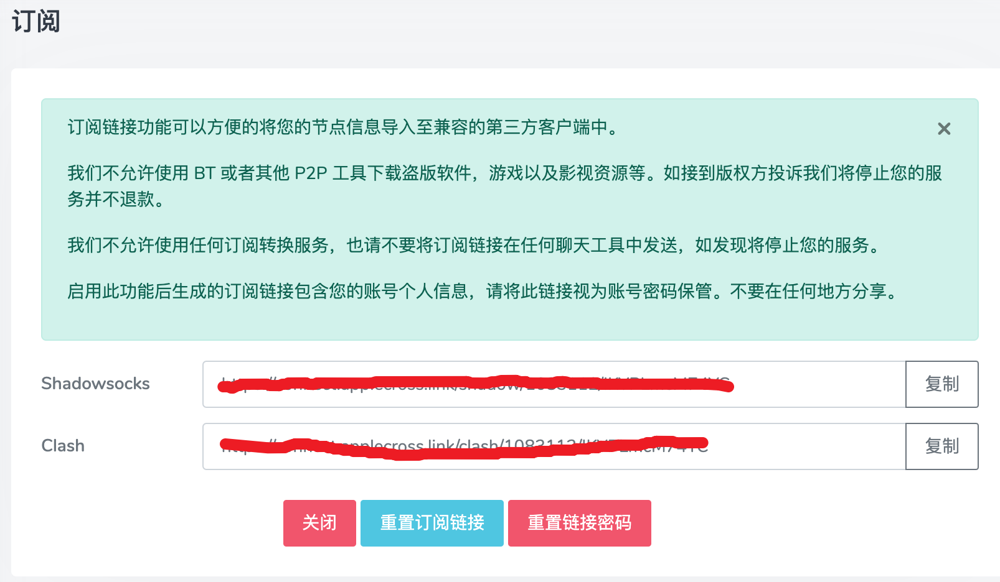

# ubuntu24.04 安装k8s1.30（基于cri-docker）

本文主要介绍ubuntu24.04从零安装k8s 1.30版本，使用cri-docker + calico搭建

为了简单考虑，采用一主一从架构搭建，如果需要添加从机，参照worker操作即可

| 配置 | 主机名 | ip地址 | 角色 | 
| :---   |    :----:   | :---: | --- |
| 2核2G  | ubuntu200   | 192.168.147.200  | master|
| 2核2G  | ubuntu201   | 192.168.147.201  | worker|

## 初始化环境

这部分介绍安装docker+k8s的前置操作，包括初始化IP，网络环境，分区交换等。

### 设置固定IP地址

参照下面重写/etc/netplan的50-cloud-init.yaml(文件名可能不一样)，ens160参照主机原文件，IP地址根据自己的IP来配置

```
ubuntu@ubuntu1801:~$ sudo cat /etc/netplan/50-cloud-init.yaml 
# This file is generated from information provided by the datasource.  Changes
# to it will not persist across an instance reboot.  To disable cloud-init's
# network configuration capabilities, write a file
# /etc/cloud/cloud.cfg.d/99-disable-network-config.cfg with the following:
# network: {config: disabled}
network:
    ethernets:
        ens160:
            dhcp4: false
            addresses: 
              - 192.168.147.200/24
            nameservers:
              addresses: [119.29.29.29, 114.114.114.114, 8.8.8.8]
            routes:
              - to: default
                via: 192.168.147.2     
    version: 2
```

然后执行sudo netplan apply，这时可以看到IP地址已经变化：

```
ubuntu@ubuntu1801:~$ sudo netplan apply
ubuntu@ubuntu1801:~$ ifconfig
ens160: flags=4163<UP,BROADCAST,RUNNING,MULTICAST>  mtu 1500
        inet 192.168.147.200  netmask 255.255.255.0  broadcast 192.168.147.255
        inet6 fe80::20c:29ff:fea7:b7f9  prefixlen 64  scopeid 0x20<link>
        ether 00:0c:29:a7:b7:f9  txqueuelen 1000  (Ethernet)
        RX packets 753767  bytes 1079056302 (1.0 GB)
        RX errors 0  dropped 0  overruns 0  frame 0
        TX packets 93485  bytes 25211257 (25.2 MB)
        TX errors 0  dropped 0 overruns 0  carrier 0  collisions 0
        device interrupt 44  memory 0x3fe00000-3fe20000  
```

### 设置主机名与DNS映射

主机名在后面初始化k8s的时候会用到

```
ubuntu@ubuntu:~/k8s$ hostnamectl set-hostname ubuntu200
ubuntu@ubuntu:~/k8s$ bash
ubuntu@ubuntu200:~/k8s$
```

打开/etc/hosts，将主机跟从机的映射加进去：

```
ubuntu@ubuntu200:~/k8s$ cat /etc/hosts
127.0.0.1 localhost
127.0.1.1 ubuntu200 #当前主机
192.168.147.200 ubuntu200 #master
192.168.147.201 ubuntu201 #worker

# The following lines are desirable for IPv6 capable hosts
::1     ip6-localhost ip6-loopback
fe00::0 ip6-localnet
ff00::0 ip6-mcastprefix
ff02::1 ip6-allnodes
ff02::2 ip6-allrouters
```

### 同步时间

如果系统时间不是东八区时间，将其改成东八区的时间

```
ubuntu@ubuntu200:~$ date
Thu Jul  4 09:04:03 PM CST 2024
ubuntu@ubuntu200:~$ timedatectl set-timezone Asia/Shanghai
ubuntu@ubuntu200:~$ date
Thu Jul  4 09:04:06 PM CST 2024
```

同步阿里云的时间：

```
ubuntu@ubuntu200:~$ sudo apt install ntpdate
ubuntu@ubuntu200:~$ ntpdate time1.aliyun.com
2024-07-04 21:33:28.625014 (+0800) +0.058696 +/- 0.026423 time1.aliyun.com 203.107.6.88 s2 no-leap
CLOCK: adj_systime: Operation not permitted
```

### 配置内核转发和网桥过滤

创建内核模块文件

```
ubuntu@ubuntu200:~$ modprobe overlay
ubuntu@ubuntu200:~$ modprobe br_netfilter
```

添加网桥过滤及内核转发配置文件

```
ubuntu@ubuntu200:~$ cat << EOF | tee /etc/sysctl.d/k8s.conf
net.bridge.bridge-nf-call-ip6tables = 1
net.bridge.bridge-nf-call-iptables = 1
net.ipv4.ip_forward = 1
```

加载配置

```
ubuntu@ubuntu200:~$ sudo sysctl -p /etc/sysctl.d/k8s.conf
```

加载内核参数

```
ubuntu@ubuntu200:~$ sudo sysctl --system
```

安装ipset及ipvsadm

```
ubuntu@ubuntu200:~$: sudo apt install ipset ipvsadm
```

配置 ipvsadm 模块加载, 添加需要加载的模块

```
ubuntu@ubuntu200:~$ cat << EOF | tee /etc/modules-load.d/ipvs.conf
ip_vs
ip_vs_rr
ip_vs_wrr
ip_vs_sh
nf_conntrack
EOF
```

创建加载模块脚本文件

```
ubuntu@ubuntu200:~$  cat << EOF | tee /root/ipvs.sh
#!/bin/sh
modprobe -- ip_vs
modprobe -- ip_vs_rr
modprobe -- ip_vs_wrr
modprobe -- ip_vs_sh
modprobe -- nf_conntrack
EOF
```

执行脚本文件

```
ubuntu@ubuntu200:~$ sudo bash ipvs.sh
```

### 关闭SWAP分区

```
ubuntu@ubuntu200:~$ free -m
               total        used        free      shared  buff/cache   available
Mem:            1956        1234         114           4         703         722
Swap:              0           0           0
ubuntu@ubuntu200:~$ sudo swapoff -a
```

如果Swap分区打开了，关闭swap分区

### 安装clash代理（选填）

由于国内现在对docker容器仓库限制很大，很难通过正常途径获取k8s需要的镜像，网上现在通用的阿里仓库用起来也是有问题的，一直安装不上calico镜像，所以本人通过在ubuntu上安装clash代理访问外网来解决这个问题。当然，如果有其他方式，可以忽略这部分内容。

- 科学上网工具

首先，我们需要用到科学上网工具，这里我用的是[monocloud](https://mymonocloud.com/), 在里面购买一个套餐，然后点击套餐控制面板里面的订阅链接。


里面有clash链接，后面配置代理会用到。



如果会用shadowsocks也可以配置。由于本人用的是M1 MacOS（ARM架构），只能使用ubuntu server命令行，折腾了一整天，搞不定，各种各样的问题，放弃shadowsocks了。

- 桌面端系统安装clash代理

如果系统是桌面端的就简单了，直接下载Clash for Windows安装就可以了。具体下载链接如下：

https://github.com/lantongxue/clash_for_windows_pkg/releases

选中自己系统的安装


本人用的是M1系统，下载dmg版本。打开软件，在上面输入框输入刚才monocloud的clash链接，就会生成一个yaml文件，使用该配置即可。


- 纯命令安装clash

由于本人的ubuntu是纯命令行的，所以只能用命令行的方式解决。在主目录下创建一个clash目录，用来存放clash的相关文件.

```
ubuntu@ubuntu200:~$ mkdir clash
ubuntu@ubuntu200:~$ cd clash
ubuntu@ubuntu200:~/clash$ ls
```

然后执行以下指令，获得一个clash的执行文件

```
ubuntu@ubuntu200:~$ wget https://github.com/Kuingsmile/clash-core/releases/download/1.18/clash-linux-arm64-v1.18.0.gz \
    && gzip -d clash-linux-arm64-v1.18.0.gz \
    && chmod a+x clash-linux-arm64-v1.18.0 \
    && mv clash-linux-arm64-v1.18.0 clash
```

clash的链接如下：https://github.com/Kuingsmile/clash-core/releases， 选中自己的系统跟架构对应的包下载即可

然后将刚才clash-for-window生成的配置文件的内容（即红框部分），写入到clash目录的config.yaml里面，clash的目录如下所示：

```
ubuntu@ubuntu200:~/clash$ ls
clash  config.yaml
ubuntu@ubuntu200:~/clash$ ./clash -d .
```

然后执行./clash -d .即可，最终目录如下所示：

```
ubuntu@ubuntu200:~/clash$ ls
cache.db  clash  config.yaml  Country.mmdb
```

由于这样在用代理访问链接的时候，控制台会有选代理站点的输出信息，所以推荐使用下面这种方式运行：

```
screen -S clash /home/xxx/clash/clash -d /home/xxx/clash/
# 运行后按 ctrl + a + d退出后台
```

- 使用代理

可以用以下指令开启http跟https使用代理：

```
ubuntu@ubuntu200:~/clash$ export https_proxy=127.0.0.1:7890 && export http_proxy=127.0.0.1:7890
ubuntu@ubuntu200:~/clash$  curl -I www.google.com
HTTP/1.1 200 OK
Transfer-Encoding: chunked
Cache-Control: private
Connection: keep-alive
Content-Security-Policy-Report-Only: object-src 'none';base-uri 'self';script-src 'nonce-PG7ebLDBzGSsHcQ8UoRdsw' 'strict-dynamic' 'report-sample' 'unsafe-eval' 'unsafe-inline' https: http:;report-uri https://csp.withgoogle.com/csp/gws/other-hp
Content-Type: text/html; charset=ISO-8859-1
Date: Thu, 04 Jul 2024 14:10:33 GMT
Expires: Thu, 04 Jul 2024 14:10:33 GMT
Keep-Alive: timeout=4
P3p: CP="This is not a P3P policy! See g.co/p3phelp for more info."
Proxy-Connection: keep-alive
Server: gws
Set-Cookie: AEC=AVYB7coXJtAzDZDBANS3_PT3O0lyxVq5BpljcFokdlTFjrvVXdNfrc6d_pg; expires=Tue, 31-Dec-2024 14:10:33 GMT; path=/; domain=.google.com; Secure; HttpOnly; SameSite=lax
Set-Cookie: NID=515=JnZ5NseNl-xEAydptsgHPibhXhhYKTL5YYt-8bGyzD2WCsTCmtNSMDuAUW9TwCgbCP5SQK-aXZIssFCWcmNATFGUF_C0tpqE1nGYNQyq-10TQoZma0BoG-u8Qz1byUen-RUiLaZnOWwJDT3mKekC0Gqxor0t-ihqcZdMT5sORUw; expires=Fri, 03-Jan-2025 14:10:33 GMT; path=/; domain=.google.com; HttpOnly
X-Frame-Options: SAMEORIGIN
X-Xss-Protection: 0
```

可见配置成功。

可以用以下指令关闭http跟https使用代码：

```
ubuntu@ubuntu200:~/clash$: unset http_proxy https_proxy
```

## 安装docker跟cri-docker

接下来到安装docker跟cri-docker了

### 安装docker

安装docker可以通过以下指令：

```
ubuntu@ubuntu200:~$ sudo apt install docker.io 
```

配置docker镜像源和代理：

```
ubuntu@ubuntu200:~$ sudo vim /etc/docker/daemon.json
ubuntu@ubuntu200:~/clash$ cat /etc/docker/daemon.json 
{
  "registry-mirrors": ["https://uvx4zmco.mirror.aliyuncs.com"],
  "exec-opts": ["native.cgroupdriver=systemd"],
  "proxies": {
    "http-proxy": "127.0.0.1:7890",
    "https-proxy": "127.0.0.1:7890"
  }
}
```

其中proxies部分是配置代理，如果无需代理可以去掉，但是最好能保证镜像可以下载。

执行以下指令重启docker：

```
ubuntu@ubuntu200:~$ systemctl restart docker
```

如果用docker可以拉取下面这个镜像，后面就可以继续了。

```
ubuntu@ubuntu200:~$ docker pull calico/pod2daemon-flexvol:v3.28.0
v3.28.0: Pulling from calico/pod2daemon-flexvol
Digest: sha256:2054fc9485e11bdde7ec8e22bca88bbf3a0f777f6c17509045a427294aa0a54b
Status: Image is up to date for calico/pod2daemon-flexvol:v3.28.0
docker.io/calico/pod2daemon-flexvol:v3.28.0
```

注意，默认执行docker需要管理管理员权限，执行以下指令解决这个问题

```
sudo gpasswd -a ${USER} docker 
sudo chmod a+rw /var/run/docker.sock
sudo systemctl restart docker 
```

### 安装cri-docker

k8s 1.24版本之后使用docker就要额外安装cri-docker了。上github查找cri-docker，下载对应的镜像，具体链接为：https://github.com/Mirantis/cri-dockerd/releases


本机是ARM架构，选arm64的包，右键复制链接，在ubuntu里面执行：

```
ubuntu@ubuntu200:~$ wget https://github.com/Mirantis/cri-dockerd/releases/download/v0.3.14/cri-dockerd-0.3.14.arm64.tgz
ubuntu@ubuntu200:~$ tar xf cri-dockerd-0.3.14.arm64.tgz
ubuntu@ubuntu200:~$ chmod a+x cri-dockerd/cri-dockerd
ubuntu@ubuntu200:~$ sudo mv cri-dockerd/cri-dockerd /usr/bin
```

添加/usr/lib/systemd/system/cri-docker.service，/usr/lib/systemd/system/cri-docker.socket，这两个文件的模版可以从cri-docker的github上找到。


复制即可。然后修改/usr/lib/system/system/cri-docker.service，找到ExecStart那行，将其改成

```
ExecStart=/usr/bin/cri-dockerd --network-plugin=cni --pod-infra-container-image=registry.aliyuncs.com/google_containers/pause:3.9
```

然后启动cri-dockerd，

```
systemctl enable --now cri-docker
```

查看状态, 如果状态是running，则表示成功

```
ubuntu@ubuntu200:~$ systemctl status cri-docker
● cri-docker.service - CRI Interface for Docker Application Container Engine
     Loaded: loaded (/usr/lib/systemd/system/cri-docker.service; enabled; preset: enabled)
     Active: active (running) since Thu 2024-07-04 18:35:41 CST; 3h 57min ago
TriggeredBy: ● cri-docker.socket
       Docs: https://docs.mirantis.com
   Main PID: 13976 (cri-dockerd)
      Tasks: 11
     Memory: 65.2M (peak: 136.6M)
        CPU: 3min 8.332s
     CGroup: /system.slice/cri-docker.service
             └─13976 /usr/bin/cri-dockerd --network-plugin=cni --pod-infra-container-image=registry.aliyuncs.com/google_containers/pause:3.9
```

## 安装k8s

到了安装k8s的环节了，使用kubeadm来安装，这部分内容可以参考官网：https://kubernetes.io/zh-cn/docs/setup/production-environment/tools/kubeadm/install-kubeadm/， 找到安装 kubeadm、kubelet 和 kubectl部分步骤。以下是操作步骤：

```
sudo apt-get update
sudo apt-get install -y apt-transport-https ca-certificates curl gpg

# 如果 `/etc/apt/keyrings` 目录不存在，则应在 curl 命令之前创建它，请阅读下面的注释。
# sudo mkdir -p -m 755 /etc/apt/keyrings
curl -fsSL https://pkgs.k8s.io/core:/stable:/v1.30/deb/Release.key | sudo gpg --dearmor -o /etc/apt/keyrings/kubernetes-apt-keyring.gpg

echo 'deb [signed-by=/etc/apt/keyrings/kubernetes-apt-keyring.gpg] https://pkgs.k8s.io/core:/stable:/v1.30/deb/ /' | sudo tee /etc/apt/sources.list.d/kubernetes.list

sudo apt-get update
sudo apt-get install -y kubelet kubeadm kubectl
sudo apt-mark hold kubelet kubeadm kubectl
```

- 配置kubelet

```
# 没有sysconfig目录要先创建
ubuntu@ubuntu200:~$ vim /etc/sysconfig/kubelet
KUBELET_EXTRA_ARGS="--cgroup-driver=systemd"

ubuntu@ubuntu200:~$ systemctl enable kubelet #可以不执行，后面初始化kubeadm会启动
```

## Master安装配置

- 生成kubeadm配置文件

```
ubuntu@ubuntu200:~/k8s$ kubeadm config print init-defaults > kubeadm-config.yaml
```

- 修改配置文件


修改kubeadm.config.yaml文件，主要修改红款部分，以下给个示例

```
apiVersion: kubeadm.k8s.io/v1beta3
bootstrapTokens:
- groups:
  - system:bootstrappers:kubeadm:default-node-token
  token: abcdef.0123456789abcdef
  ttl: 24h0m0s
  usages:
  - signing
  - authentication
kind: InitConfiguration
localAPIEndpoint:
  advertiseAddress: 192.168.147.200
  bindPort: 6443
nodeRegistration:
  criSocket: unix:///var/run/cri-dockerd.sock  #cri-docker的socket文件
  imagePullPolicy: IfNotPresent
  name: ubuntu200 # 主机名字
  taints: null
---
apiServer:
  timeoutForControlPlane: 4m0s
apiVersion: kubeadm.k8s.io/v1beta3
certificatesDir: /etc/kubernetes/pki
clusterName: kubernetes
controllerManager: {}
dns: {}
etcd:
  local:
    dataDir: /var/lib/etcd
imageRepository: registry.aliyuncs.com/google_containers # 镜像仓库
kind: ClusterConfiguration
kubernetesVersion: 1.30.0
networking:
  dnsDomain: cluster.local
  serviceSubnet: 10.96.0.0/12
  podSubnet: 10.244.0.0/16 // Pod子网
scheduler: {}
---
kind: KubeletConfiguration
apiVersion: kubelet.config.k8s.io/v1beta1
cgroupDriver: systemd
```
 
初始化kubeadm, 看到下面日志则说明初始化成功

```
ubuntu@ubuntu200:~/k8s$ sudo kubeadm init --config kubeadm-config.yaml
.....

Your Kubernetes control-plane has initialized successfully!

To start using your cluster, you need to run the following as a regular user:

  mkdir -p $HOME/.kube
  sudo cp -i /etc/kubernetes/admin.conf $HOME/.kube/config
  sudo chown $(id -u):$(id -g) $HOME/.kube/config

Alternatively, if you are the root user, you can run:

  export KUBECONFIG=/etc/kubernetes/admin.conf

You should now deploy a pod network to the cluster.
Run "kubectl apply -f [podnetwork].yaml" with one of the options listed at:
  https://kubernetes.io/docs/concepts/cluster-administration/addons/

Then you can join any number of worker nodes by running the following on each as root:

kubeadm join 192.168.147.200:6443 --token abcdef.0123456789abcdef \
	--discovery-token-ca-cert-hash sha256:ab2d3b2a6d864383d9ce59762ce8d3d1f89baf258d63f154967f609efd8a1cc6 
```

初始化集群，即上面命令行部分：

```
ubuntu@ubuntu200:~/k8s$  mkdir -p $HOME/.kube
ubuntu@ubuntu200:~/k8s$  sudo cp -i /etc/kubernetes/admin.conf $HOME/.kube/config
ubuntu@ubuntu200:~/k8s$  sudo chown $(id -u):$(id -g) $HOME/.kube/config
```

查看节点

```
ubuntu@ubuntu200:~/k8s$ kubectl get nodes
NAME        STATUS     ROLES           AGE     VERSION
ubuntu200   NotReady   control-plane   2m15s   v1.30.2
```

PS：如果上面的token丢了，或者过期了，可以通过下面指令重新生成

```
sudo kubeadm token create --print-join-command
```

## Worker安装配置

由于是用虚拟机搭建的ubuntu，所以直接基于《master安装配置》后的时间节点重新克隆出来一个虚拟机。本来想基于《安装k8s》结束的时间点做克隆的，但是在kubeadm join后kubelet的状态一直有问题，查不出原因，所以给于master安装完成的时间点来做。

- 修改域名

```
ubuntu@ubuntu1801:~$ sudo cat /etc/netplan/50-cloud-init.yaml 
# This file is generated from information provided by the datasource.  Changes
# to it will not persist across an instance reboot.  To disable cloud-init's
# network configuration capabilities, write a file
# /etc/cloud/cloud.cfg.d/99-disable-network-config.cfg with the following:
# network: {config: disabled}
network:
    ethernets:
        ens160:
            dhcp4: false
            addresses: 
              - 192.168.147.201/24
            nameservers:
              addresses: [119.29.29.29, 114.114.114.114, 8.8.8.8]
            routes:
              - to: default
                via: 192.168.147.2     
    version: 2
ubuntu@ubuntu1801:~$ sudo netplan apply
```

- 修改主机名

```
ubuntu@ubuntu200:~$ hostnamectl set-hostname ubuntu201
==== AUTHENTICATING FOR org.freedesktop.hostname1.set-static-hostname ====
Authentication is required to set the statically configured local hostname, as well as the pretty hostname.
Authenticating as: ubuntu
Password: 
```

- 修改hosts文件

```
ubuntu@ubuntu201:~$ cat /etc/hosts
127.0.0.1 localhost
127.0.1.1 ubuntu201
192.168.147.200 ubuntu200
192.168.147.201 ubuntu201


# The following lines are desirable for IPv6 capable hosts
::1     ip6-localhost ip6-loopback
fe00::0 ip6-localnet
ff00::0 ip6-mcastprefix
ff02::1 ip6-allnodes
ff02::2 ip6-allrouters
```

- 关掉之前matser的kubeadm

确保docker，cri-docker， clash（如使用clash）已经运行。没有的话，参照前面的重新开启。

```
ubuntu@ubuntu201:~/k8s$ curl -I ww.google.com
HTTP/1.1 302 Found
Content-Length: 220
Cache-Control: private
Connection: keep-alive
Content-Type: text/html; charset=UTF-8
Cross-Origin-Resource-Policy: cross-origin
Date: Fri, 05 Jul 2024 08:08:56 GMT
Keep-Alive: timeout=4
Location: https://www.google.com/
Proxy-Connection: keep-alive
Server: sffe
X-Content-Type-Options: nosniff
X-Xss-Protection: 0
ubuntu@ubuntu201:~/k8s$ systemctl is-active docker cri-docker
active
active
```

- 重置kubeadm

```
ubuntu@ubuntu201:~/k8s$ sudo kubeadm reset --cri-socket unix:///var/run/cri-dockerd.sock
```

- 加入集群

复制上面master初始化时候后面生成的kubeadm join命令

```
ubuntu@ubuntu201:~/k8s$ sudo kubeadm join 192.168.147.200:6443 --token abcdef.0123456789abcdef  --discovery-token-ca-cert-hash sha256:ab2d3b2a6d864383d9ce59762ce8d3d1f89baf258d63f154967f609efd8a1cc6 --cri-socket unix:///var/run/cri-dockerd.sock
[preflight] Running pre-flight checks
[preflight] Reading configuration from the cluster...
[preflight] FYI: You can look at this config file with 'kubectl -n kube-system get cm kubeadm-config -o yaml'
[kubelet-start] Writing kubelet configuration to file "/var/lib/kubelet/config.yaml"
[kubelet-start] Writing kubelet environment file with flags to file "/var/lib/kubelet/kubeadm-flags.env"
[kubelet-start] Starting the kubelet
[kubelet-check] Waiting for a healthy kubelet. This can take up to 4m0s
[kubelet-check] The kubelet is healthy after 512.348954ms
[kubelet-start] Waiting for the kubelet to perform the TLS Bootstrap

This node has joined the cluster:
* Certificate signing request was sent to apiserver and a response was received.
* The Kubelet was informed of the new secure connection details.

Run 'kubectl get nodes' on the control-plane to see this node join the cluster.
```

回到master，查看节点

```
ubuntu@ubuntu200:~/k8s$ kubectl get nodes
NAME        STATUS        ROLES         AGE   VERSION
ubuntu200   NotReady    control-plane   19h   v1.30.2
ubuntu201   NotReady    <none>          16m   v1.30.2
```

### 安装Calico网络插件（master）

可以看到上面ubuntu200的STATUS为NotReady，这时需要安装CNI网络插件，可以使用Calico，也可以使用flannel，这里采用CaliCo。

进入Calico的官网：https://docs.tigera.io/calico/latest/getting-started/kubernetes/quickstart


```
kubectl create -f https://raw.githubusercontent.com/projectcalico/calico/v3.28.0/manifests/tigera-operator.yaml
```

等待安装完成。

```
ubuntu@ubuntu200:~/k8s$ kubectl get ns
NAME              STATUS   AGE
default           Active   14m
kube-node-lease   Active   14m
kube-public       Active   14m
kube-system       Active   14m
tigera-operator   Active   24s
ubuntu@ubuntu200:~/k8s$ kubectl get pods -n tigera-operator
NAME                               READY   STATUS    RESTARTS   AGE
tigera-operator-6678f5cb9d-br2g5   1/1     Running   0          61s
```

由于前面kubeadm配置的pod为10.244.0.0/16，所以需要先将calico的配置文件下载下来：

```
ubuntu@ubuntu200:~/k8s$ wget https://raw.githubusercontent.com/projectcalico/calico/v3.28.0/manifests/custom-resources.yaml
```

修改custom-resources.yaml如下所示：

```
ubuntu@ubuntu200:~/k8s$ cat custom-resources.yaml 
# This section includes base Calico installation configuration.
# For more information, see: https://docs.tigera.io/calico/latest/reference/installation/api#operator.tigera.io/v1.Installation
apiVersion: operator.tigera.io/v1
kind: Installation
metadata:
  name: default
spec:
  # Configures Calico networking.
  calicoNetwork:
    ipPools:
    - name: default-ipv4-ippool
      blockSize: 26
      cidr: 10.244.0.0/16 # 只改这个
      encapsulation: VXLANCrossSubnet
      natOutgoing: Enabled
      nodeSelector: all()

---

# This section configures the Calico API server.
# For more information, see: https://docs.tigera.io/calico/latest/reference/installation/api#operator.tigera.io/v1.APIServer
apiVersion: operator.tigera.io/v1
kind: APIServer
metadata:
  name: default
spec: {}
```

然后安装calico

```
ubuntu@ubuntu200:~/k8s$ kubectl create -f custom-resources.yaml 
installation.operator.tigera.io/default created
apiserver.operator.tigera.io/default created
```

等待相关镜像安装完毕即可，此处目前没翻墙的话，找不到好的解决方法。有人说可以在别处下载好镜像，然后安装回来就好了，但是由于本机是ARM架构，镜像貌似用不了，所以建议一劳永逸还是安装科学上网工具为好

```
ubuntu@ubuntu200:~/k8s$ kubectl get pods -n calico-system
NAME                                       READY   STATUS    RESTARTS   AGE
calico-kube-controllers-555b6c48db-bxdsq   1/1     Running   0          177m
calico-node-lqg9z                          1/1     Running   0          177m
calico-typha-bb5fbd67f-qsfh5               1/1     Running   0          177m
csi-node-driver-wwjg2                      2/2     Running   0          177m
```

查看kube-system状态

```

ubuntu@ubuntu200:~/k8s$ kubectl get pods -n kube-system
NAME                                READY   STATUS    RESTARTS   AGE
coredns-7b5944fdcf-kbjlg            1/1     Running   0          10m
coredns-7b5944fdcf-qv29m            1/1     Running   0          10m
etcd-ubuntu200                      1/1     Running   0          10m
kube-apiserver-ubuntu200            1/1     Running   0          10m
kube-controller-manager-ubuntu200   1/1     Running   0          10m
kube-proxy-bb4qc                    1/1     Running   0          10m
kube-scheduler-ubuntu200            1/1     Running   0          10m

ubuntu@ubuntu200:~/k8s$ kubectl get nodes
NAME        STATUS   ROLES           AGE   VERSION
ubuntu200   Ready    control-plane   19h   v1.30.2
ubuntu201   Ready    <none>          16m   v1.30.2
```

至此，节点初始化完成。

## 部署nginx

下面部署一个nginx来验证集群的功能

在k8s目录里面创建一个nginx.yaml，在文件里面写入下面内容。

```
ubuntu@ubuntu200:~/k8s$ cat nginx.yaml 
---
apiVersion: apps/v1
kind: Deployment
metadata:
  name: nginxweb
spec:
  selector:
    matchLabels:
      app: nginxweb1
  replicas: 2
  template:
    metadata:
      labels:
        app: nginxweb1
    spec:
      containers:
        - name: nginxwebc
          image: nginx:latest
          imagePullPolicy: IfNotPresent
          ports:
            - containerPort: 80

---
apiVersion: v1
kind: Service
metadata:
  name: nginxweb-service
spec:
  externalTrafficPolicy: Cluster
  selector:
    app: nginxweb1
  ports:
    - protocol: TCP
      port: 80
      targetPort: 80
      nodePort: 30080
  type: NodePort
```

运行

```
ubuntu@ubuntu200:~/k8s$ kubectl apply -f nginx.yaml
deployment.apps/nginxweb created
service/nginxweb-service created
ubuntu@ubuntu200:~/k8s$ kubectl get pods
NAME                        READY   STATUS              RESTARTS   AGE
nginxweb-55dcdbb446-ptkrw   0/1     ContainerCreating   0          8s
nginxweb-55dcdbb446-qddpv   0/1     ContainerCreating   0          8s
```

等待nginx安装完成

```
ubuntu@ubuntu200:~/k8s$ kubectl get pods
NAME                        READY   STATUS    RESTARTS   AGE
nginxweb-55dcdbb446-ptkrw   1/1     Running   0          65s
nginxweb-55dcdbb446-qddpv   1/1     Running   0          65s
ubuntu@ubuntu200:~/k8s$ kubectl get deployment
NAME       READY   UP-TO-DATE   AVAILABLE   AGE
nginxweb   2/2     2            2           77s
ubuntu@ubuntu200:~/k8s$ kubectl get svc
NAME               TYPE        CLUSTER-IP      EXTERNAL-IP   PORT(S)        AGE
kubernetes         ClusterIP   10.96.0.1       <none>        443/TCP        20h
nginxweb-service   NodePort    10.96.161.163   <none>        80:30080/TCP   83s
```

可见，nginx的80端口映射到master的30080端口，访问http://192.168.147.200:30080/


至此，k8s集群初始化完成

## 补充

如果是用containerd来部署k8s, 参照这篇博客即可：

https://www.augensten.online/655061ae/index.html

containerd使用代理，参照这篇博客：

https://juejin.cn/post/7166794699586404388

如果想启用kubectl的自动补全功能，参考这篇博客即可：

https://kubernetes.io/docs/tasks/tools/install-kubectl-linux/#enable-shell-autocompletion