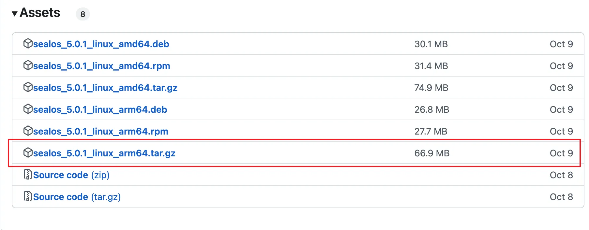
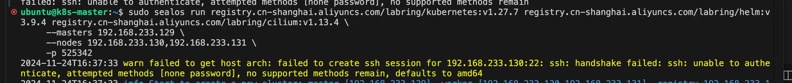

# sealos安装k8s 1.27

本文档展示使用sealos来安装k8s集群，具体的安装步骤可以查看以下链接：

https://sealos.run/docs/5.0.0/developer-guide/lifecycle-management/quick-start/deploy-kubernetes

由于本人用的虚拟机是ARM ubuntu，根据官网的操作步骤有一些坑，所以这里展示安装步骤

| 主机名	| 配置	| ip地址 |
| - | - | - |
| k8s-master	| 2C4G	| 192.168.233.129 |
| k8s-slave01	| 2C4G	| 192.168.233.130 |
| k8s-slave02	| 2C4G	| 192.168.233.131 |

## hostname配置

调整每台机子的主机名

```
sudo hostnamectl set-hostname k8s-slave02
sudo hostnamectl set-hostname k8s-slave01
sudo hostnamectl set-hostname k8s-master
```

## host配置

每台主机都配置其他主机的host，修改/etc/hosts文件，在后面加上以下信息

```
192.168.233.129 k8s-master
192.168.233.130 k8s-slave01
192.168.233.131 k8s-slave02
```

## 下载sealos

试了sealos教程的二进制自动下载跟包管理工具安装，都没有用，所以最终选择了用sealos的二进制手动下载，先到sealos官网查看sealos的最新版本，https://github.com/labring/sealos/releases。注意以下操作都在主机上执行。



如上图，最新的版本为5.0.1，右键复制链接，先下载文件包

```
wget https://mirror.ghproxy.com/https://github.com/labring/sealos/releases/download/v5.0.1/sealos_5.0.1_linux_arm64.tar.gz
```

解压缩，然后将sealos复制到bin目录

```
tar zxvf sealos_5.0.1_linux_arm64.tar.gz && sudo chmod +x sealos && sudo mv sealos /usr/bin
```

## 安装sealos

```
sealos run registry.cn-shanghai.aliyuncs.com/labring/kubernetes:v1.27.7 registry.cn-shanghai.aliyuncs.com/labring/helm:v3.9.4 registry.cn-shanghai.aliyuncs.com/labring/cilium:v1.13.4 \
     --masters 192.168.64.2,192.168.64.22,192.168.64.20 \
     --nodes 192.168.64.21,192.168.64.19 -p [your-ssh-passwd]
```

官网上的这条指令有问题，不支持-p参数了，会报错



要换成以下指令，先配置一主一从的

```
sudo sealos run registry.cn-shanghai.aliyuncs.com/labring/kubernetes:v1.27.7 registry.cn-shanghai.aliyuncs.com/labring/helm:v3.9.4 registry.cn-shanghai.aliyuncs.com/labring/cilium:v1.13.4 \
     --masters 192.168.233.129 \
     --nodes 192.168.233.130 --passwd 525342 --user='ubuntu'
```

要是--user指定从机1的用户名，--passwd指定从机1的密码。

期间会遇到缺少两个插件的问题，安装对应的插件重试即可

```
sudo apt install fuse-overlayfs
sudo apt install uidmap
```

重新执行安装语句，等到安装完成，出现以下语句表示主机成功了。

```
To start using your cluster, you need to run the following as a regular user:

  mkdir -p $HOME/.kube
  sudo cp -i /etc/kubernetes/admin.conf $HOME/.kube/config
  sudo chown $(id -u):$(id -g) $HOME/.kube/config

Alternatively, if you are the root user, you can run:

  export KUBECONFIG=/etc/kubernetes/admin.conf

You should now deploy a pod network to the cluster.
Run "kubectl apply -f [podnetwork].yaml" with one of the options listed at:
  https://kubernetes.io/docs/concepts/cluster-administration/addons/

You can now join any number of control-plane nodes by copying certificate authorities
and service account keys on each node and then running the following as root:

  kubeadm join apiserver.cluster.local:6443 --token <value withheld> \
        --discovery-token-ca-cert-hash sha256:73ba5798f05398ea28e8fe30f065ab367b60154ef89e61ee7e6fb2ad9804b2a3 \
        --control-plane --certificate-key <value withheld>
```

出现以下语句表示从机安装成功了

```
2024-11-24T16:46:16 info succeeded in creating a new cluster, enjoy it!
2024-11-24T16:46:16 info 
      ___           ___           ___           ___       ___           ___
     /\  \         /\  \         /\  \         /\__\     /\  \         /\  \
    /::\  \       /::\  \       /::\  \       /:/  /    /::\  \       /::\  \
   /:/\ \  \     /:/\:\  \     /:/\:\  \     /:/  /    /:/\:\  \     /:/\ \  \
  _\:\~\ \  \   /::\~\:\  \   /::\~\:\  \   /:/  /    /:/  \:\  \   _\:\~\ \  \
 /\ \:\ \ \__\ /:/\:\ \:\__\ /:/\:\ \:\__\ /:/__/    /:/__/ \:\__\ /\ \:\ \ \__\
 \:\ \:\ \/__/ \:\~\:\ \/__/ \/__\:\/:/  / \:\  \    \:\  \ /:/  / \:\ \:\ \/__/
  \:\ \:\__\    \:\ \:\__\        \::/  /   \:\  \    \:\  /:/  /   \:\ \:\__\
   \:\/:/  /     \:\ \/__/        /:/  /     \:\  \    \:\/:/  /     \:\/:/  /
    \::/  /       \:\__\         /:/  /       \:\__\    \::/  /       \::/  /
     \/__/         \/__/         \/__/         \/__/     \/__/         \/__/

                  Website: https://www.sealos.io/
                  Address: github.com/labring/sealos
                  Version: 5.0.1-2b74a1281
```

设置k8s的kube文件路径，在上面主机部分输出可以找到。

```
  mkdir -p $HOME/.kube
  sudo cp -i /etc/kubernetes/admin.conf $HOME/.kube/config
  sudo chown $(id -u):$(id -g) $HOME/.kube/config
```

然后执行kubectl get nodes查看节点状态

```
ubuntu@k8s-master:~$ kubectl get nodes
NAME          STATUS     ROLES           AGE    VERSION
k8s-master    Ready      control-plane   109s   v1.27.7
k8s-slave01   NotReady   <none>          85s    v1.27.7
```

等到一段时间过后重新查看

```
ubuntu@k8s-master:~$ kubectl get nodes
NAME          STATUS   ROLES           AGE     VERSION
k8s-master    Ready    control-plane   5m57s   v1.27.7
k8s-slave01   Ready    <none>          5m33s   v1.27.7
```

一主一从安装完毕

## 增加k8s节点

增加node节点

```
sudo sealos add --nodes 192.168.233.131 --passwd 525342 --user='ubuntu'
```

至此，三节点集群搭建完成

```
ubuntu@k8s-master:~$ kubectl get nodes
NAME          STATUS   ROLES           AGE   VERSION
k8s-master    Ready    control-plane   41m   v1.27.7
k8s-slave01   Ready    <none>          40m   v1.27.7
k8s-slave02   Ready    <none>          79s   v1.27.7
```

增加master节点

```
sudo sealos add --masters 192.168.233.131 --passwd 525342 --user='ubuntu'
```