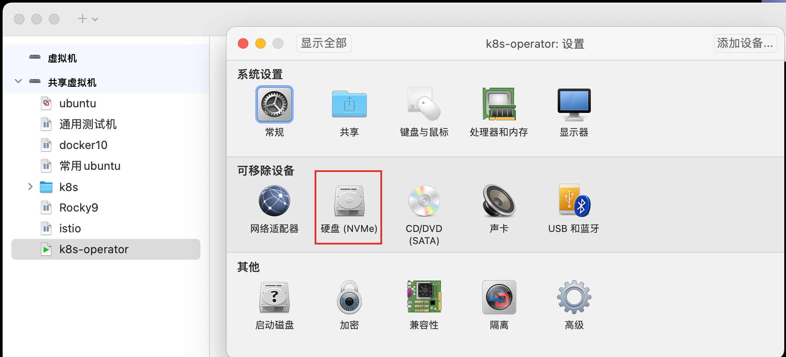
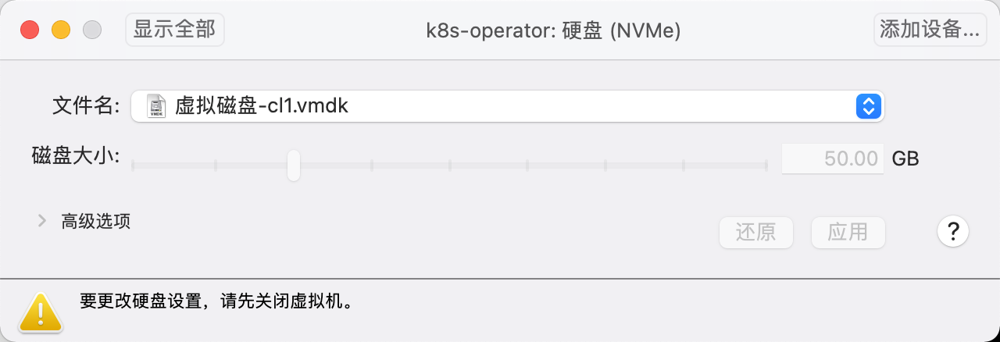

# vmware-funsion ubuntu扩容磁盘

在使用ubuntu安装minikube的时候，发现磁盘空间不够用，查看磁盘空间大小：

```
ubuntu@ubuntu:~$ lsblk
NAME                      MAJ:MIN RM  SIZE RO TYPE MOUNTPOINTS
sr0                        11:0    1 1024M  0 rom  
nvme0n1                   259:0    0   20G  0 disk 
├─nvme0n1p1               259:1    0  953M  0 part /boot/efi
├─nvme0n1p2               259:2    0  1.8G  0 part /boot
└─nvme0n1p3               259:3    0 17.3G  0 part 
  └─ubuntu--vg-ubuntu--lv 252:0    0   10G  0 lvm  /
```

发现ubuntu--vg-ubuntu--lv只有10G，于是准备扩容磁盘。将ubuntu--vg-ubuntu--lv扩容到50G

## 调整虚拟机磁盘空间大小

打开虚拟机设置



调整磁盘空间大小到50G，注意需要虚拟机关机



## 调整ubuntu文件系统大小

先将nvme0n1扩容到50G

```
ubuntu@ubuntu:~/clash$ sudo parted /dev/nvme0n1
GNU Parted 3.6
Using /dev/nvme0n1
Welcome to GNU Parted! Type 'help' to view a list of commands.
(parted) print                                                            
Model: VMware Virtual NVMe Disk (nvme)
Disk /dev/nvme0n1: 53.7GB
Sector size (logical/physical): 512B/512B
Partition Table: gpt
Disk Flags: 

Number  Start   End     Size    File system  Name  Flags
 1      1049kB  1000MB  999MB   fat32              boot, esp
 2      1000MB  2879MB  1879MB  ext4
 3      2879MB  21.5GB  18.6GB
                                                        
(parted) resizepart 3                                                     
End?  [21.5GB]? 100%                                                      
(parted)                                                                  
(parted) quit                                                             
Information: You may need to update /etc/fstab.
```

扩展物理卷： 确保物理卷已经正确使用整个 nvme0n1p3 分区。

```
ubuntu@ubuntu:~/clash$ sudo pvresize /dev/nvme0n1p3
  Physical volume "/dev/nvme0n1p3" changed
  1 physical volume(s) resized or updated / 0 physical volume(s) not resized
ubuntu@ubuntu:~/clash$ sudo pvs
  PV             VG        Fmt  Attr PSize   PFree 
  /dev/nvme0n1p3 ubuntu-vg lvm2 a--  <47.32g 30.00g
```
扩展ubuntu--vg-ubuntu--lv

```
ubuntu@ubuntu:~/clash$ sudo lvextend -l +100%FREE /dev/ubuntu-vg/ubuntu-lv
  Size of logical volume ubuntu-vg/ubuntu-lv changed from <17.32 GiB (4433 extents) to <47.32 GiB (12113 extents).
  Logical volume ubuntu-vg/ubuntu-lv successfully resized.
ubuntu@ubuntu:~/clash$ sudo resize2fs /dev/ubuntu-vg/ubuntu-lv
resize2fs 1.47.0 (5-Feb-2023)
Filesystem at /dev/ubuntu-vg/ubuntu-lv is mounted on /; on-line resizing required
old_desc_blocks = 3, new_desc_blocks = 6
The filesystem on /dev/ubuntu-vg/ubuntu-lv is now 12403712 (4k) blocks long.

ubuntu@ubuntu:~/clash$ lsblk
NAME                      MAJ:MIN RM  SIZE RO TYPE MOUNTPOINTS
sr0                        11:0    1 1024M  0 rom  
nvme0n1                   259:0    0   50G  0 disk 
├─nvme0n1p1               259:1    0  953M  0 part /boot/efi
├─nvme0n1p2               259:2    0  1.8G  0 part /boot
└─nvme0n1p3               259:3    0 47.3G  0 part 
  └─ubuntu--vg-ubuntu--lv 252:0    0 47.3G  0 lvm  /
```
