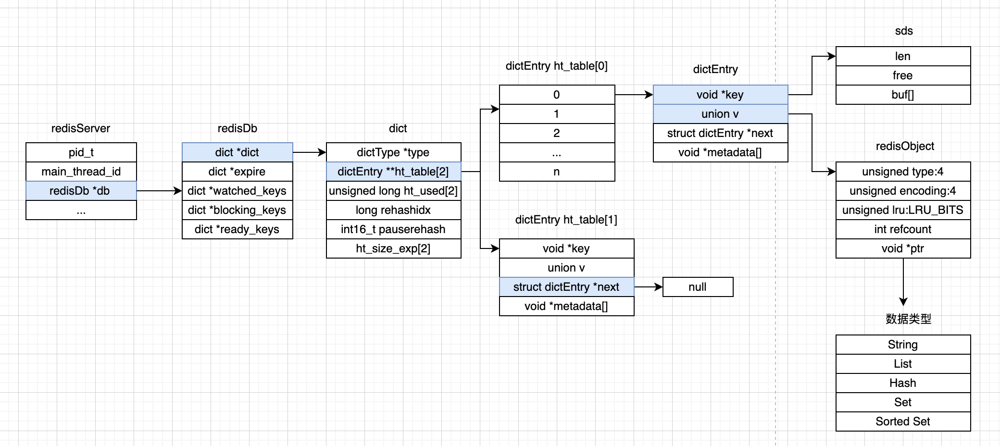
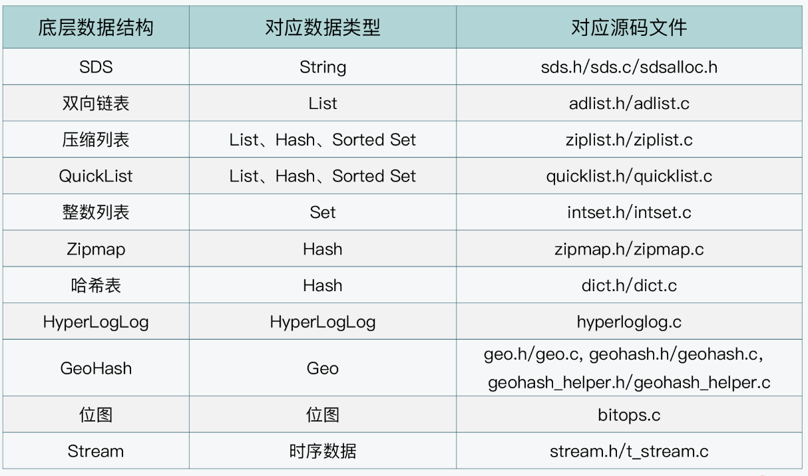

# 架构设计

上篇介绍了源码调试环境的搭建，这篇简单介绍一下redis的整体架构，整体的数据结构设计跟整体的请求处理流程吧，给大家一个印象，方便后面的学习。

## 整体架构


- 应用层：Client是官方提供的C语言开发的客户端，可以发送命令，进行性能分析和测试等
- 网络层：事件驱动模型，基于I/O多路服用封装了一个短小精悍的高性能ae库（a simple event-driven programming library）
  - ae库中，封装了epoll，select，kqueue(unix), evport 4种I/O多路复用的实现进行适配，让上层调用房感知不到操作系统的差异
  - 事件有两种，一类是网络读写事件，另一类是时间时间，例如定时执行rehash，RDB快照生成，过期fiel-value pairs清理操作
- 命令执行层：负责执行客户端的各种命令，例如SET，DEL，GET等
- 内存层：为数据分配并回收内存，提供不同的数据结构保存数据
- 持久化层：提供了RDB快照文件和AOF两种持久化策略，实现数据可靠性
- 高可用模块：提供了副本，哨兵，集群实现高可用
- 统计和监控：提供了一些监控工具和性能分析工具，例如监控内存使用，基准测试，内存碎片，BigKey统计，慢指令查询等

## Redis的多线程实现机制


- 客户端的请求进来之后会经过事件收发器，然后主线程将可读事件的client放入到读发送队列中
- 主线程在aeMain循环中将读发送队列的请求分发到所有I/O线程的队列当中，由主线程和所有的I/O线程负责读取和解析I/O请求，然后重新放回接收队列
- 主线程负责从接收队列中获取所有的执行命令，然后将执行结果写到写发送队列当中
- 最后主线程将写发送队列中的请求分发到所有的I/O线程队列当中，由主线程和所有的I/O线程负责把数据响应给客户端

## 数据存储原理

**redisServer**

Redis的核心数据结构是redisServer，这个结构体保存了所有的redis信息，包括配置信息，数据库信息，网络连接信息，线程池信息等等。redisServer结构体的定义如下，只列出本章节需要的信息：

``` redis.h
struct redisServer {
  pid_t pid;                  /* 主进程id */
  pthread_t main_thread_id;   /* 主线程id */
  redisDb *db;                /* 指向所有数据库的指针 */
}
```
**redisDb**

redisDb *db指针非常重要，它指向了一个长度为dbnum（默认为16，众所周知，redis有16个数据库）的redisDb数组，它是整个存储的核心，redisDb结构体的定义如下:
 
``` redis.h
typedef struct redisDb {
  dict *dict;                 /* 保存当前数据库的所有键值对 */
  dict *expires;              /* 保存每个key的过期时间 */
  dict *blocking_keys;        /* 用来储存客户端等待阻塞队列的Key, Value是被阻塞的客户端，如果阻塞队列有元素加入，那么会遍历这个字典，响应被阻塞的客户端*/
  dict *ready_keys;           /* 阻塞队列有元素加入的时候，上面blocking_keys中有阻塞的Key，会先放入ready_keys，redis下次事件处理时取出来响应客户端 */
  dict *watched_keys;         /* 实现watch命令，存储watch命令的key */
  int id;                     /* 数据库Id */
  long long avg_ttl;          /* 统计平均响应时间 */
  unsigned long expires_cursor; /* 统计过期事件循环执行的次数 */
  list *defrag_later;         /* 保存进行碎片整理的key列表 */
  clusterSlotToKeyMapping *slots_to_keys; /* 集群模式下，存储key与哈希桶映射关系的数组 */
} redisDb;
```

::: warning
过期事件为什么要用expires来存储呢？因为不是每个key都会配置过期时间的，分开后可以节省开销。还有另外一个好处，在扫描过期key的时候，只要扫描expires就可以了，不需要去扫描所有的键值对
:::

**dict**

可以看到dict数据结构是redisDb里面的核心，Redis使用dict结构来存储所有的key-value键值对数据，这是一个散列表。

``` dict.h
struct dict {
  dictType *type;   /* 指向一个dictType的指针，表示字典的类型 */

  dictEntry **ht_table[2]; /* 大小为2的散列表数组，记录实际的所有key-value。通常ht_table[0]用来存储数据，当进行rehash的时候使用ht_table[1]配合完成 /*
  unsigned long ht_used[2];  /* 两个散列表的使用情况，表示当前散列表已经使用的槽位数量 */

  long rehashidx; /* 正在rehash操作的索引位置，如果是-1，表明没有进行rehash操作 */

  /* Keep small vars at end for optimal (minimal) struct padding */
  int16_t pauserehash; /* If >0 rehashing is paused (<0 indicates coding error) */
  signed char ht_size_exp[2]; /* 两个散列表的大小，以2的指数形式存储 */
};
```

重点关注ht_table数组，数组中的元素叫做哈希桶，保存了所有的键值对，哈希桶的类型是dictEntry

**dictEntry**

redis支持那么多的数据类型，哈希桶是怎么存储数据的呢，我们dictEntry结构体的定义。

``` dict.h
typedef struct dictEntry {
  void *key;     /* 指向key值的指针，表示字典中的键 */
  union {
    // 指向实际val的指针
    void *val;
    uint64_t u64;
    int64_t s64;
    double d;
  } v;
  struct dictEntry *next;     /* 指向下一个元素的指针 */
  void *metadata[];           /* 储存元数据 */
} dictEntry;
```

可以看到实际的val值是通过一个union联合体来进行存储的，会根据不同的类型指向不同的值。

**redisObject**

dictEntry的*val指针指向的值实际上是一个redisObject结构体，这个一个非常重要的结构体，由于redis的key是字符串，所以可以用SDS结构体来存储。

``` server
typedef struct redisObject {
  unsigned type:4;       /* 对象的类型，比如String，Sets，Hashes，Lists，Sorted Set等 */
  unsigned encoding:4;   /* 编码方式 */
  unsigned lru:LRU_BITS; /* LRU策略下对象最后一次被访问的时间；LFU策略低8位表示访问频率，高16位表示访问时间 */
  int refcount;          /* 引用计数，如果为0，表示没有对象引用这个对象，可以回收 */
  void *ptr;             /* 指向实际的数据 */
} robj;
```

下面给出一个上面各个结构体对象的关系总图




## 数据库数据类型与操作

Redis数据库提供了丰富的键值对类型，其中包括了String, List, Hash, Set和Sorted Set这五种基本键值类型；此外，redis还支持位图，HyperLogLog，Geo等扩展类型。

为了支持这些数据类型，Redis使用了多种数据结构来作为这些类型的底层结构，这些数据结构与他们对应的键值对类型，以及相应的代码文件参考下表（该表摘自极客时间《Rediss源码剖析与实战》）。



