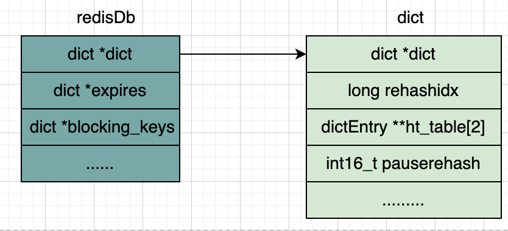

# 全局散列表

这篇文章给大家介绍Redis储存所有键值对的底层数据结构-散列表。

首先我们回顾一下Redis的数据结构存储原理，这里从redisDb开始画起。



由于redis默认有16个数据库，所以会有16个redisDb结构，

## 散列表

现在我们画一下Redis对应的ht_table指向的数据结构。。


可以看到Redis是使用散列表来存储所有的键值对的。一个简单的散列表就是一个数组，数组中的每个元素就是一个哈希桶，当插入一个键值对的时候，会根据hash算法，然后找到一个桶来存放键值对，如果对应的哈希桶中已经有元素了，那么将会使用拉链法来增加元素，新增加的元素则作为表头。

下面我们结合源码查看一下，往redisDb插入一个键值对的实现在db.c, 代码如下：

``` db.c
void dbAdd(redisDb *db, robj *key, robj *val) {
  // 将key->ptr封装成一个sds
  sds copy = sdsdup(key->ptr);
  // 根据key获取到一个dictEntry，用来存放val，这里已经插入元素了
  dictEntry *de = dictAddRaw(db->dict, copy, NULL);
  // 讲val设置到dictEntry的val中
  dictSetVal(db->dict, de, val);
  ...
}
```

可以看到核心代码是dictAddRaw方法，我们继续跟进这个方法。

```dict.c
dictEntry *dictAddRaw(dict *d, void *key, dictEntry **existing) {
  // dictHashKey对key做hash运算，查看是否需要扩容，返回key要插入的ht_table下标
  if ((index = _dictKeyIndex(d, key, dictHashKey(d,key), existing)) == -1)
      return NULL;
  // 分配dictEntry内存
  entry = zmalloc(sizeof(*entry) + metasize);
  if (metasize > 0) {
      memset(dictMetadata(entry), 0, metasize);
  }
  // 把dictEntry的next指针指向ht_table[htidx][index]
  entry->next = d->ht_table[htidx][index];
  // 把dictEntry放到d->ht_table[htidx][index]中
  d->ht_table[htidx][index] = entry;
  d->ht_used[htidx]++;

  /* 设置dictEntry的key */
  dictSetKey(d, entry, key);
  return entry;
}
```

## 扩容和缩容

上面的哈希表数据结构有个很大的缺陷，因为是使用拉链法来处理哈希冲突的，所以如果插入的键值对，如果大量元素同时插入一个哈希桶，那么整个哈希表会慢慢退化成一个链表，这样在遍历元素的时候时间复杂度会变成O(n)。

### rehash机制

为了解决这个性能过低的问题，可以使用rehash操作来扩大hash表空间，为了讲解redis的rehash操作，我们回看dict的结构体定义。

``` dict.h
struct dict {
  /* 指向一个dictType的指针，表示字典的类型 */
  dictType *type;   
  /* 大小为2的散列表数组，记录实际的所有key-value。通常ht_table[0]用来存储数据，当进行rehash的时候使用ht_table[1]配合完成 /*
  dictEntry **ht_table[2];
  /* 两个散列表的使用情况，表示当前散列表已经使用的槽位数量 */
  unsigned long ht_used[2];  
  /* 正在rehash操作的索引位置，如果是-1，表明没有进行rehash操作 */
  long rehashidx;
  /* 大于0时表示停止rehash*/
  int16_t pauserehash;
  /* 两个散列表的大小，以2的指数形式存储 */
  signed char ht_size_exp[2];
};
```

可以看到dict定义了2个ht_table，接下来我们就看看redis的rehash操作流程。

- 在正常服务请求阶段，所有的键值对写入ht_table[0]
- 当进行rehash的时候，所有的键值对从ht_table[0]迁移到ht_table[1]中，而新增的元素也被放入ht_table[1]，这个时候对元素的查询，将先从ht_table[0]读取，如果ht_table[0]找不到，再从ht_table[1]读取
- 迁移完成后，释放ht_table[0]的空间，然后将ht_table[1]的值赋值给ht_table[0]，后面就可以只从ht_table[0]进行读取和写入了。


### 扩容条件

了解这个rehash扩容机制后，我们结合源代码查看一下redis是怎么做的,回到刚才的dictAddRaw函数。

```
dictEntry *dictAddRaw(dict *d, void *key, dictEntry **existing)
{
  /*扩容*/
  if ((index = _dictKeyIndex(d, key, dictHashKey(d,key), existing)) == -1)
      return NULL;

  // 判断是否是rehashing阶段，如果是则往ht_table[1]写，否则往ht_table[0]写
  htidx = dictIsRehashing(d) ? 1 : 0;
  ...
  entry->next = d->ht_table[htidx][index];
  d->ht_table[htidx][index] = entry;
  d->ht_used[htidx]++;

  /* Set the hash entry fields. */
  dictSetKey(d, entry, key);
  return entry;
}
```

我们跟进_dictKeyIndex这个函数查看代码

``` dict.c
static long _dictKeyIndex(dict *d, const void *key, uint64_t hash, dictEntry **existing)
{
  unsigned long idx, table;
  dictEntry *he;
  if (existing) *existing = NULL;

  /* Expand the hash table if needed */
  if (_dictExpandIfNeeded(d) == DICT_ERR)
      return -1;
  // 可以看到是遍历ht_table来查看一个key是否存在的
  for (table = 0; table <= 1; table++) {
    idx = hash & DICTHT_SIZE_MASK(d->ht_size_exp[table]);
    /* Search if this slot does not already contain the given key */
    he = d->ht_table[table][idx];
    while(he) {
      if (key==he->key || dictCompareKeys(d, key, he->key)) {
          if (existing) *existing = he;
          return -1;
      }
      he = he->next;
    }
    // 如果不是rehashing阶段，不用看ht_table[1]了
    if (!dictIsRehashing(d)) break;
  }
  return idx;
}
```

_dictExpandIfNeeded这个函数就是查看是否需要扩容的，我们看一下具体的逻辑是怎么样的

```  dict.c
/* Expand the hash table if needed */
static int _dictExpandIfNeeded(dict *d)
{
  // 如果处于Rehashing阶段，那么就直接返回
  if (dictIsRehashing(d)) return DICT_OK;

  // 如果现在哈希桶的个数为0，说明还没有初始化，那么就rehash
  if (DICTHT_SIZE(d->ht_size_exp[0]) == 0) return dictExpand(d, DICT_HT_INITIAL_SIZE);

  /* 判断是否需要扩容 */
  if ((dict_can_resize == DICT_RESIZE_ENABLE &&
      d->ht_used[0] >= DICTHT_SIZE(d->ht_size_exp[0])) ||
    (dict_can_resize != DICT_RESIZE_FORBID &&
      d->ht_used[0] / DICTHT_SIZE(d->ht_size_exp[0]) > dict_force_resize_ratio))
  {
    if (!dictTypeExpandAllowed(d))
        return DICT_OK;
    return dictExpand(d, d->ht_used[0] + 1);
  }
  return DICT_OK;
}
```

可以看到有三种条件可以触发rehash，如下：

- ht_table[0]的大小为0
- dict_can_resize == DICT_RESIZE_ENABLE，并且ht_table[0]承载的元素个数已经超过了ht_table[0]的大小，并且允许扩容
- dict_can_resize != DICT_RESIZE_FORBID, 并且并且ht_table[0]承载的元素个数已经超过了ht_table[0]大小的dict_force_resize_ratio倍，其中dict_force_resize_ratio的默认值是5

我们可以看一下dict_can_resize的赋值，全局搜索一下，可以看到是在dictSetResizeEnabled赋值的

``` dict.c
void dictSetResizeEnabled(dictResizeEnable enable) {
  dict_can_resize = enable;
}
```

再看看调用dictSetResizeEnabled的地方，

``` server.c
void updateDictResizePolicy(void) {
  if (server.in_fork_child != CHILD_TYPE_NONE)
    dictSetResizeEnabled(DICT_RESIZE_FORBID);
  else if (hasActiveChildProcess())
    dictSetResizeEnabled(DICT_RESIZE_AVOID);
  else
    dictSetResizeEnabled(DICT_RESIZE_ENABLE);
}
```

可以看到如果是处于子线程创建的过程中，则禁止rehash，如果子线程在工作的过程中，则避免rehash，其他情况可以rehash

大概看一下hasActiveChildProcess的注释吧, 表明没有RDB保存或者AOF重写等子线程工作的时候。

```
/* Return true if there are active children processes doing RDB saving,
 * AOF rewriting, or some side process spawned by a loaded module. */
int hasActiveChildProcess() {
    return server.child_pid != -1;
}
```

### 扩容大小

具体每次扩容扩容多大呢，我们直接回看_dictExpandIfNeeded函数。

```  dict.c
/* Expand the hash table if needed */
static int _dictExpandIfNeeded(dict *d)
{
  // 如果处于Rehashing阶段，那么就直接返回
  if (dictIsRehashing(d)) return DICT_OK;

  // 如果现在哈希桶的个数为0，说明还没有初始化，那么就rehash
  if (DICTHT_SIZE(d->ht_size_exp[0]) == 0) return dictExpand(d, DICT_HT_INITIAL_SIZE);

  /* 判断是否需要扩容 */
  if ((dict_can_resize == DICT_RESIZE_ENABLE &&
      d->ht_used[0] >= DICTHT_SIZE(d->ht_size_exp[0])) ||
    (dict_can_resize != DICT_RESIZE_FORBID &&
      d->ht_used[0] / DICTHT_SIZE(d->ht_size_exp[0]) > dict_force_resize_ratio))
  {
    if (!dictTypeExpandAllowed(d))
        return DICT_OK;
    return dictExpand(d, d->ht_used[0] + 1);
  }
  return DICT_OK;
}
```

可以看到是调用dictExpand这个方法来扩容的，那么我们就看这个方法

``` dict.c
int dictExpand(dict *d, unsigned long size) {
  return _dictExpand(d, size, NULL);
}

int _dictExpand(dict *d, unsigned long size, int* malloc_failed) {
  // 可以看到新的size就是1 << _dictNextExp(size)
  signed char new_ht_size_exp = _dictNextExp(size);
  size_t newsize = 1ul<<new_ht_size_exp;
  new_ht_table = zcalloc(newsize*sizeof(dictEntry*));
}

static signed char _dictNextExp(unsigned long size)
{
  // DICT_HT_INITIAL_SIZE: 2
  // DICT_HT_INITIAL_EXP为4
  if (size <= DICT_HT_INITIAL_SIZE) return DICT_HT_INITIAL_EXP;
  if (size >= LONG_MAX) return (8*sizeof(long)-1);

  return 8*sizeof(long) - __builtin_clzl(size-1);
}
```

可以看到新的哈希桶的大小可以认为就是dictExpand传入的size值，这里给出说明：

- 如果哈希桶没有元素，那么就初始化一个1的4次方，则是16个元素大小的哈希桶
- 如果哈希桶有元素，那么新的哈希桶的元素就是之前哈希桶的2倍

:::info
如果是缩容，则每次分配的空间都是之前空间大小的一半
:::

### 渐进式rehash

由于rehash操作是在主线程上进行，如果一次迁移所有的键值对，会影响redis的整体性能，所以redis采用了渐进式rehash的做法。

渐进式hash指的是每次rehash的时候会分批迁移ht_hable中哈希桶的元素，我们来看一下迁移函数的实现

``` dict.c
int dictRehash(dict *d, int n) {
  int empty_visits = n*10; /* Max number of empty buckets to visit. */
  unsigned long s0 = DICTHT_SIZE(d->ht_size_exp[0]);
  unsigned long s1 = DICTHT_SIZE(d->ht_size_exp[1]);
  if (dict_can_resize == DICT_RESIZE_FORBID || !dictIsRehashing(d)) return 0;
  if (dict_can_resize == DICT_RESIZE_AVOID && 
      ((s1 > s0 && s1 / s0 < dict_force_resize_ratio) ||
        (s1 < s0 && s0 / s1 < dict_force_resize_ratio)))
  {
      return 0;
  }

  while(n-- && d->ht_used[0] != 0) {
      dictEntry *de, *nextde;

      /* Note that rehashidx can't overflow as we are sure there are more
        * elements because ht[0].used != 0 */
      assert(DICTHT_SIZE(d->ht_size_exp[0]) > (unsigned long)d->rehashidx);
      // 如果这些哈希桶都是空，那么在遍历完empty_visits大小数量的桶之后就会退出
      while(d->ht_table[0][d->rehashidx] == NULL) {
          d->rehashidx++;
          if (--empty_visits == 0) return 1;
      }
      de = d->ht_table[0][d->rehashidx];
      /* Move all the keys in this bucket from the old to the new hash HT */
      // 把整个桶的元素迁移过去
      while(de) {
          uint64_t h;

          nextde = de->next;
          /* Get the index in the new hash table */
          h = dictHashKey(d, de->key) & DICTHT_SIZE_MASK(d->ht_size_exp[1]);
          de->next = d->ht_table[1][h];
          d->ht_table[1][h] = de;
          d->ht_used[0]--;
          d->ht_used[1]++;
          de = nextde;
      }
      d->ht_table[0][d->rehashidx] = NULL;
      d->rehashidx++;
  }

  /* Check if we already rehashed the whole table... */
  if (d->ht_used[0] == 0) {
      zfree(d->ht_table[0]);
      /* Copy the new ht onto the old one */
      d->ht_table[0] = d->ht_table[1];
      d->ht_used[0] = d->ht_used[1];
      d->ht_size_exp[0] = d->ht_size_exp[1];
      _dictReset(d, 1);
      d->rehashidx = -1;
      return 0;
  }

  /* More to rehash... */
  return 1;
}
```

我们看一下有哪些地方调用了dictRehash函数。可以看到有两个地方调用了

- 在键值对的增删查改的时候，会调用dictRehash(d,1), 每次处理1个哈希桶
- databasesCron -> incrementallyRehash -> dictRehashMilliseconds中，每次调用dictRehash(d,100)处理100个哈希桶