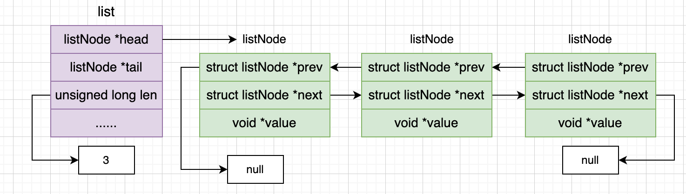
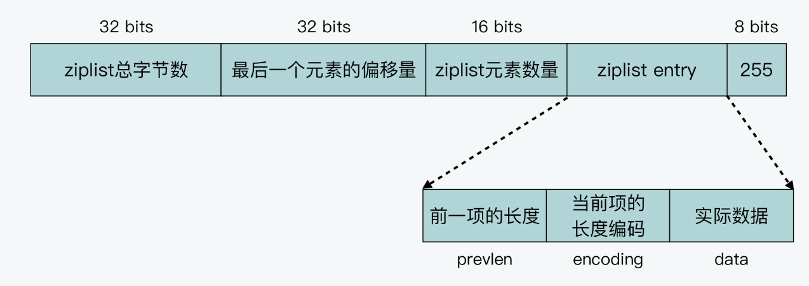
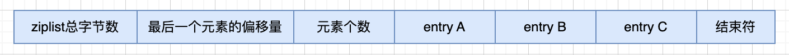
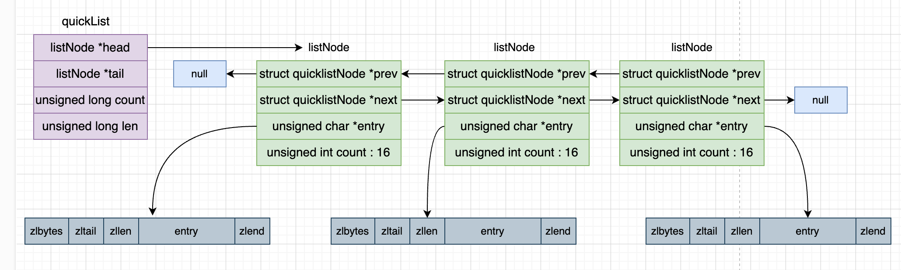
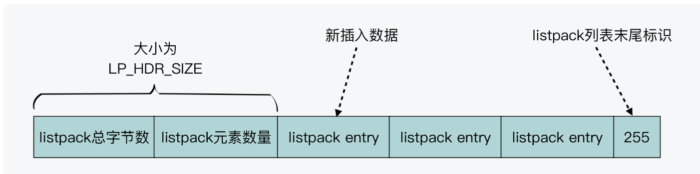
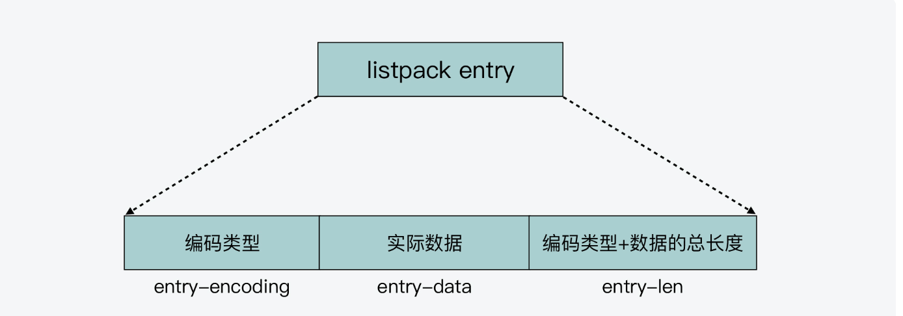

# List实现原理与实战

Redis的List是一种线性的有序结构，按照元素被推入列表中的顺序存储元素，满足先进先出的需求。可以拿来作为消息队列跟栈使用。

让我们一起来看看Redis的List底层存储结构的演进路线，最后再看一下redis7.0之后List的存储结构。

## LinkedList + ZipList

在Redis3.2之前，Lists的底层数据结构由linkedList或者ziplist实现，我们先看看这两种数据结构。

### LinkedList

LinkedList是一种内存实现的链表，具体实现代码如下:

``` adlist.h
typedef struct list {
  // 指向链表的头节点
  listNode *head;
  // 指向链表的尾节点
  listNode *tail;
  void *(*dup)(void *ptr);
  void (*free)(void *ptr);
  int (*match)(void *ptr, void *key);
  // 链表中节点的长度
  unsigned long len;
} list;
```

其中每个listNode节点的结构如下所示：

``` adlist.h
typedef struct listNode {
  // 前驱节点
  struct listNode *prev;
  // 后驱节点
  struct listNode *next;
  // 指向节点的值
  void *value;
} listNode;
```

下面给出一幅图介绍一下这个结构。



这种数据结构有以下好处:

- 双端：每个节点都有前驱节点和后驱节点，所以可以获取前后节点
- 无环：可以遍历整个链表
- 有头节点和尾节点：可以直接获取头节点和尾结点
- 使用Len来记录节点的数量：可以直接获取节点数量

但是这种数据结构有很大的缺点:

- 每个节点都有前驱节点和后驱节点，所以很耗空间
- listNode在内存中是不连续的，遍历效率低下

### ZipList

为了解决上面的问题，Redis引入了ZipList的数据结构, 当数据量很小的时候使用ZipList来存储。



这是一个内存紧凑的数据结构，占用一块连续的内存空间，能够提升内存效率。我们大致看一下数据结构的组成就好了。

- ziplist总字节数：ziplist占用的总字节数
- 最后一个元素的偏移量：可以直接查找最后的元素
- ziplist元素数量
- 所有ziplist的节点：注意就是存储了前一项的长度，跟当前项的长度，所以也是可以从头部和尾部开始查找的
- 结束符

补充一下encoding编码，ziplist为了省空间，会根据数据类型是int还是字符串来分配不同的储存类型。

zipList虽然内存紧凑，但是也有以下的缺点：

- 不能保存过多的节点数据，否则查询性能会大大降低
- 插入元素有连锁更新的问题，每次插入一个元素，都要遍历后面所有的元素修改前一项的长度。

**连锁更新**



这里需要讲解一下，每个ziplist的节点都存储了前一个元素的长度

- 如果前一个元素的长度小于254，那么就用一个字节存储
- 如果前一个元素的长度大于等于254，需要用一个标识（1个字节）标识，后面4字节记录长度

当插入entryA的时候，entryB的前一个元素可能会变化，那么记录前一个元素长度的标记会变化，就是entryB的长度会变化，那么会更新entryC，以此类推。

### 总结

Redis3.2之前，当Lists对象满足以下两个条件的时候，将使用ziplist存储，否则用linklist

- 链表中每个元素的占用的字节数小于64
- 链表的元素数据小于512个

## QuickList + ZipList

连锁更新会导致多次重新分配Ziplist的内存空间，直接影响zipList的查询性能，所以在redis3.2中，引入了quicklist这个数据结构。

让我门看一下quicklist这个数据结构的代码

``` quicklist.h
typedef struct quicklist {
  // 指向头节点的指针
  quicklistNode *head;
  // 指向尾节点的直接
  quicklistNode *tail;
  // entry个数
  unsigned long count;
  // zipList的个数
  unsigned long len;
  signed int fill : QL_FILL_BITS;       /* fill factor for individual nodes */
  unsigned int compress : QL_COMP_BITS; /* depth of end nodes not to compress;0=off */
  unsigned int bookmark_count: QL_BM_BITS;
  // 给元素加标签，实现随机访问的效果
  quicklistBookmark bookmarks[];
} quicklist;
```

下面看看quicklistNode的定义:

``` quicklist.h
typedef struct quicklistNode {
  // 前驱节点
  struct quicklistNode *prev;
  // 后驱节点
  struct quicklistNode *next;
  // 执行ziplist的指针
  unsigned char *entry;
  size_t sz;             /* entry size in bytes */
  unsigned int count : 16;     /* count of items in listpack */
  unsigned int encoding : 2;   /* RAW==1 or LZF==2 */
  unsigned int container : 2;  /* PLAIN==1 or PACKED==2 */
  unsigned int recompress : 1; /* was this node previous compressed? */
  unsigned int attempted_compress : 1; /* node can't compress; too small */
  unsigned int dont_compress : 1; /* prevent compression of entry that will be used later */
  unsigned int extra : 9; /* more bits to steal for future usage */
} quicklistNode;
```

下面这幅图给出quickList的结构。



quicklist是ziplist的升级版，优化的关键点在于控制每个ziplist的大小或者元素

- 每个quicklistNode的ziplist过小，会退化成linklist
- 每个quicklistNode的ziplist过大，连锁更新的问题没有解决

redis提供了list-max-ziplist-size -2，当list-max-ziplist-size为负数时会限制每个quicklistNode的ziplist内存大小，超过这个大小就会使用linklist储存，这只是替换每个quicklistNode里面的ziplist。

- -5: 每个quicklistNode的ziplist大小限制为64kb
- -4: 每个quicklistNode的ziplist大小限制为32kb
- -3: 每个quicklistNode的ziplist大小限制为16kb (可能不推荐)
- -2: 每个quicklistNode的ziplist大小限制为8kb （不错）
- -1:  每个quicklistNode的ziplist大小限制为4kb （不错）

但是这个结构也有问题，由于用户上报了一个问题，但是作者没有找到原因，怀疑是ziplist的连锁更新导致的。于是设置出了新的数据类型。

## Quicklist + ListPack

redis7.0之后采用Quicklist + ListPack的方式进行储存List的数据。其实listpack的数据结构跟ziplist很像，可以大致看一下。



可以看到没有指向头尾指针节点，但是listpack也是支持从前往后，或者从后往前遍历的。

接下来就是listpack跟ziplist的最大不同了，listpack不是记录前一个元素的长度，而是记录当前元素的长度。这样在插入元素的时候，不用更新后面的数据的长度了。



## 源码分析

接下来，我们就看一下List数据结构的实现，通过Quicklist + ListPack的方式实现。以LPUSH执行为例，查表可以知道使用的是lpushCommand方法处理。

``` t_list.c
void lpushCommand(client *c) {
  pushGenericCommand(c,LIST_HEAD,0);
}

void pushGenericCommand(client *c, int where, int xx) {
  int j;

  // 查找需要写的key是否存在
  robj *lobj = lookupKeyWrite(c->db, c->argv[1]);
  // 如果key存在，判断类型是否正常
  if (checkType(c,lobj,OBJ_LIST)) return;
  // 如果不存在
  if (!lobj) {
    if (xx) {
        addReply(c, shared.czero);
        return;
    }
    // 新建一个quicklist对象  
    lobj = createQuicklistObject();
    // 可以看到这里跟list-max-ziplist-size很像，就是查看是否要新建listpackNode的
    quicklistSetOptions(lobj->ptr, server.list_max_listpack_size,
                        server.list_compress_depth);
    // 添加到数据库中
    dbAdd(c->db,c->argv[1],lobj);
  }
  // 插入元素
  for (j = 2; j < c->argc; j++) {
      listTypePush(lobj,c->argv[j],where);
      server.dirty++;
  }
  // 响应请求
  addReplyLongLong(c, listTypeLength(lobj));

  char *event = (where == LIST_HEAD) ? "lpush" : "rpush";
  signalModifiedKey(c,c->db,c->argv[1]);
  notifyKeyspaceEvent(NOTIFY_LIST,event,c->argv[1],c->db->id);
}
```

可以先看一下createQuicklistObject是怎么创建quicklist的

``` object.c
robj *createQuicklistObject(void) {
  quicklist *l = quicklistCreate();
  robj *o = createObject(OBJ_LIST,l);
  o->encoding = OBJ_ENCODING_QUICKLIST;
  return o;
}

quicklist *quicklistCreate(void) {
  struct quicklist *quicklist;

  quicklist = zmalloc(sizeof(*quicklist));
  quicklist->head = quicklist->tail = NULL;
  quicklist->len = 0;
  quicklist->count = 0;
  quicklist->compress = 0;
  quicklist->fill = -2;
  quicklist->bookmark_count = 0;
  return quicklist;
}
```

可以看到只是初始化了一个quicklist结构体，前面提到所有的val都是用redisObject存储的，所以基于quicklist创建了一个redisObject。

再看元素插入的代码。

``` t_list.c
void listTypePush(robj *subject, robj *value, int where) {
  if (subject->encoding == OBJ_ENCODING_QUICKLIST) {
    // 插入为止是队头还是队尾
    int pos = (where == LIST_HEAD) ? QUICKLIST_HEAD : QUICKLIST_TAIL;
    if (value->encoding == OBJ_ENCODING_INT) {
        char buf[32];
        ll2string(buf, 32, (long)value->ptr);
        quicklistPush(subject->ptr, buf, strlen(buf), pos);
    } else {
        quicklistPush(subject->ptr, value->ptr, sdslen(value->ptr), pos);
    }
  } else {
      serverPanic("Unknown list encoding");
  }
}
```

跟进quicklistPush的实现

``` quicklist.c
void quicklistPush(quicklist *quicklist, void *value, const size_t sz,
                   int where) {
  if (where == QUICKLIST_HEAD) {
      quicklistPushHead(quicklist, value, sz);
  } else if (where == QUICKLIST_TAIL) {
      quicklistPushTail(quicklist, value, sz);
  }
}

int quicklistPushHead(quicklist *quicklist, void *value, size_t sz) {
    quicklistNode *orig_head = quicklist->head;

  if (unlikely(isLargeElement(sz))) {
      __quicklistInsertPlainNode(quicklist, quicklist->head, value, sz, 0);
      return 1;
  }

  //  根据list_max_listpack_size决定是否要新建元素
  if (likely(
          _quicklistNodeAllowInsert(quicklist->head, quicklist->fill, sz))) {
      // 插入元素
      quicklist->head->entry = lpPrepend(quicklist->head->entry, value, sz);
      quicklistNodeUpdateSz(quicklist->head);
  } else {
      quicklistNode *node = quicklistCreateNode();
      // 插入元素
      node->entry = lpPrepend(lpNew(0), value, sz);

      quicklistNodeUpdateSz(node);
      _quicklistInsertNodeBefore(quicklist, quicklist->head, node);
  }
  quicklist->count++;
  quicklist->head->count++;
  return (orig_head != quicklist->head);
}
```

跟进插入元素实现。

``` listpack.c
/* Append the specified element 's' of length 'slen' at the head of the listpack. */
unsigned char *lpPrepend(unsigned char *lp, unsigned char *s, uint32_t slen) {
  unsigned char *p = lpFirst(lp);
  if (!p) return lpAppend(lp, s, slen);
  return lpInsert(lp, s, NULL, slen, p, LP_BEFORE, NULL);
}

unsigned char *lpAppend(unsigned char *lp, unsigned char *ele, uint32_t size) {
  uint64_t listpack_bytes = lpGetTotalBytes(lp);
  unsigned char *eofptr = lp + listpack_bytes - 1;
  return lpInsert(lp,ele,NULL,size,eofptr,LP_BEFORE,NULL);
}
```

可以看到lpAppend底层也是调用了lpInsert实现，接下来看这个函数的实现

``` listpack.c
unsigned char *lpInsert(unsigned char *lp, unsigned char *elestr, unsigned char *eleint,
                        uint32_t size, unsigned char *p, int where, unsigned char **newp)
{
  ...
  if (!delete) {
    // 如果是LP_ENCODING_INT编码，直接考本
    if (enctype == LP_ENCODING_INT) {
        memcpy(dst,eleint,enclen);
    } else {
        lpEncodeString(dst,elestr,size);
    }
    dst += enclen;
    memcpy(dst,backlen,backlen_size);
    dst += backlen_size;
  }
}
```

可以看到直接是写到listpack的内存里面，注意就是针对listpack的entry结构体，redis是没有定义结构体的，我们看lpEncodeString的实现：

``` listpack.c
static inline void lpEncodeString(unsigned char *buf, unsigned char *s, uint32_t len) {
  if (len < 64) {
    buf[0] = len | LP_ENCODING_6BIT_STR;
    // 拷贝内容
    memcpy(buf+1,s,len);
  } else if (len < 4096) {
    buf[0] = (len >> 8) | LP_ENCODING_12BIT_STR;
    buf[1] = len & 0xff;
    memcpy(buf+2,s,len);
  } else {
    buf[0] = LP_ENCODING_32BIT_STR;
    buf[1] = len & 0xff;
    buf[2] = (len >> 8) & 0xff;
    buf[3] = (len >> 16) & 0xff;
    buf[4] = (len >> 24) & 0xff;
    memcpy(buf+5,s,len);
  }
}
```

可以看到对于不同长度的val，有不同的编码实现，这里就不细讲了。

:::warning
虽然redis7.0已经不用LinkedList来存储Lists数据了，但是LinkedList还用在其他地方，比如事件循环，发布订阅机制等
:::

