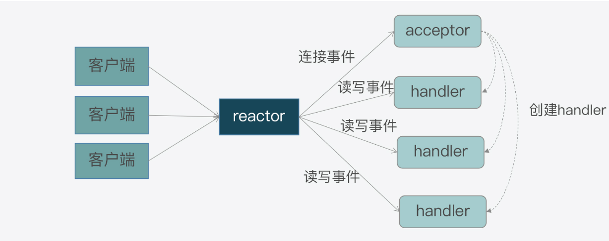
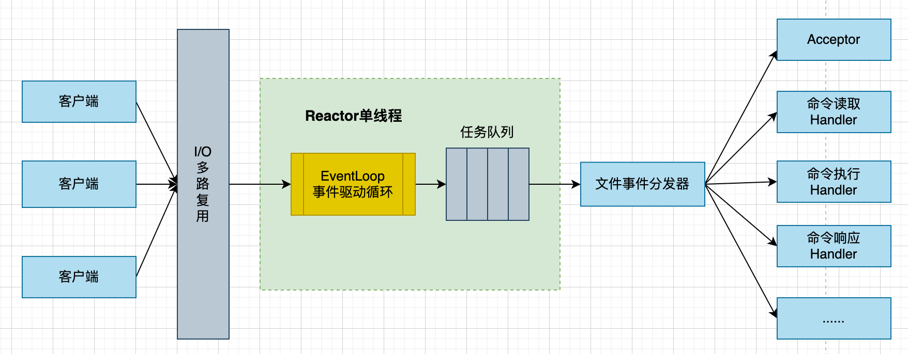
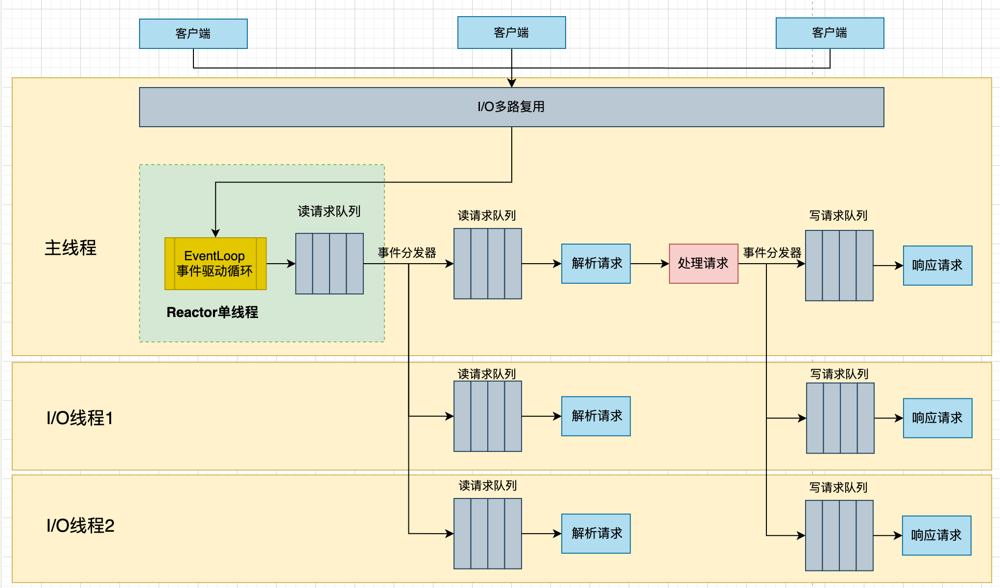

# I/O多线程网络驱动模型

本系列文章从Redis的多线程驱动模型讲起，顺便讲解一下Redis是怎么处理客户端发过来的请求的，这样在后续讲解Redis的其他部份的源码实现会容易理解一些。

## Redis网络I/O模型

常用的SELECT/POLL/EPOLL模型的介绍，网上的资料已经讲烂了，这里就不过多介绍了，有需要的朋友可以点击[这个](https://www.cnblogs.com/jtea/p/16969386.html)查看。由于我们是开发程序员，所以这里总结一下这几种IO模型的区别。

| | select | poll | epoll |
| - | - | - | - | 
| 性能 | 高并发连接数时性能很差 | 高并发连接数时性能很差 | 性能基本没有变化 |
| 连接数 | 一般1024 | 无限制 | 无限制 | 
| 数据结构 | bitmap | 数组 | 红黑树 |
| 内在处理机制 | 线性轮询 | 线性轮询 | 直接遍历事件| 
| 时间复杂度 | O(n) | O(n) | O(1) |

Redis支持网络I/O模型有以下几种

- evport: 用于 Solaris 操作系统上的事件驱动I/O模型, 与select这些I/O多路复用的模型很想，能够高效地监控多个文件描述符的事件
- kqueue: 用于 macOS/FreeBSD 操作系统上的事件驱动I/O模型
- epoll: 用于 Linux 操作系统上的事件驱动I/O模型
- select: 如果上面几种都不支持，会用select事件驱动I/O模型

具体的代码如下所示：

``` ae.c
#ifdef HAVE_EVPORT
#include "ae_evport.c"
#else
    #ifdef HAVE_EPOLL
    #include "ae_epoll.c"
    #else
        #ifdef HAVE_KQUEUE
        #include "ae_kqueue.c"
#include "server.h"
#else
        #include "ae_select.c"
        #endif
    #endif
#endif
```

由于常用的还是epoll模型，所以这里简单地介绍一下epoll的几个API，具体Epoll的使用可以查看[这个](https://blog.csdn.net/fantasyYXQ/article/details/132315574).

```
// 等待监听的所有fd相应事件的产生
int epoll_wait(int epfd, struct epoll_event * events, int maxevents, int timeout); 
// 注册特定文件描述符，将其添加到 epoll 实例的interest list中
int epoll_ctl(int epfd, int op, int fd, struct epoll_event *_Nullable event);
// 创建一个新的 epoll 实例，自 Linux 2.6.8 起，size 参数将被忽略，但必须大于 0
int epoll_create(int size);
```

## Reactor模型

Reactor模型是网络服务器用来处理高并发网络I/O请求的一种编程模型。




首先我们来看一下客户端和服务端的交互过程中，不同类请求在服务器端引发的待处理事件：

- 当一个客户端要和服务器端进行交互时，客户端会想服务器端发送连接请求，用来建立连接，这就对应了服务器端的一个**连接事件**
- 一旦连接建立后，客户端会给服务器端发送读请求，以便读取数据。服务器端在处理读请求时，需要向客户端写回数据，这对应了服务器端的**写事件**
- 无论客户端给服务器端发送读或写请求，服务器端都需要从客户端读取请求内容，这些读写请求的读取对应了服务器端的**读事件**

在Reactor模型中，主要由reactor/acceptor/handler三个关键角色来处理上面三种事件。

- 连接事件由acceptor来处理，负责接收连接；acceptor接收完请求后，会创建handler，用于网络上对后续读写事件的处理
- 读写事件由handler处理
- 最后，在高并发场景下，连接事件，读写事件会同时发生，需要有一个角色专门监听和分配事件，这就是reactor要做的事。当有连接请求的时候，reactor将产生的连接事件交由acceptor处理；当有读写请求时，reactor将读写事件交由handler处理。

## Reactor模型实现

Redis的网络框架实现Reactor模型，并且自行开发实现了一个事件驱动框架，对应的代码实现是ae.c，对应的头文件是ae.h。

Redis为了实现事件驱动框架，响应的定义了事件的数据结构，框架主循环函数，事件捕获分发函数，事件和handler注册函数。

### aeFileEvent

Redis事件驱动框架有两类事件: IO事件和时间事件，分别对应了客户端发送的网络请求和Redis自身的周期性操作。由于本篇介绍的是IO驱动模型，所以我们直接看IO事件的定义

``` ae.h
/* File event structure */
typedef struct aeFileEvent {
  // 事件类型源码，用来区分是什么事件
  int mask; /* one of AE_(READABLE|WRITABLE|BARRIER) */
  // AE_READABLE事件处理函数, 读事件处理函数
  aeFileProc *rfileProc;
  // AE_WRITABLE事件处理函数, 写事件处理函数
  aeFileProc *wfileProc;
  // 指向客户端私有数据的指针
  void *clientData;
} aeFileEvent;
```

Redis在ae.h文件中，还定义了支撑款架运行的主要函数，包括框架主循环的aeMain函数，负责事件捕获与分发的aeProcessEvents函数，以及负责事件的handler注册的aeCreateFileEvent函数。

```ae.h
int aeCreateFileEvent(aeEventLoop *eventLoop, int fd, int mask, aeFileProc *proc, void *clientData);
void aeMain(aeEventLoop *eventLoop);
int aeProcessEvents(aeEventLoop *eventLoop, int flags);
```

### 事件注册：aeCreateFileEvent函数

Redis启动后，服务器程序server.c的main函数调用initServer来初始化事件的监听，以及响应的事件处理函数。

```server.c
void initServer(void) {
  server.el = aeCreateEventLoop(server.maxclients+CONFIG_FDSET_INCR);
  listenToPort(server.port,&server.ipfd);
  createSocketAcceptHandler(&server.ipfd, acceptTcpHandler);
}
```

看一下createSocketAcceptHandler的实现，代码如下:

``` ae.c
int createSocketAcceptHandler(socketFds *sfd, aeFileProc *accept_handler) {
  int j;

  for (j = 0; j < sfd->count; j++) {
    // AE_READABLE就是客户端的连接事件, accept_handler就是用来处理TCP连接请求
    if (aeCreateFileEvent(server.el, sfd->fd[j], AE_READABLE, accept_handler,NULL) == AE_ERR) {
      /* Rollback */
      for (j = j-1; j >= 0; j--) aeDeleteFileEvent(server.el, sfd->fd[j], AE_READABLE);
      return C_ERR;
    }
  }
  return C_OK;
}
```

可以看到是由aeCreateFileEvent来实现事件和处理函数的注册的，可以看一下具体的实现实现：

```
int aeCreateFileEvent(aeEventLoop *eventLoop, int fd, int mask,
        aeFileProc *proc, void *clientData)
{
  ...
  aeFileEvent *fe = &eventLoop->events[fd];
  if (aeApiAddEvent(eventLoop, fd, mask) == -1)
      return AE_ERR;
  ...
  if (mask & AE_READABLE) fe->rfileProc = proc;
  if (mask & AE_WRITABLE) fe->wfileProc = proc;
  fe->clientData = clientData;
  if (fd > eventLoop->maxfd)
    eventLoop->maxfd = fd;
}
```

可以看到调用aeApiAddEvent来注册事件，aeApiAddEvent调用的就是具体的实现接口，如果使用epoll，那么实现如下：

``` ae_epoll.c
static int aeApiAddEvent(aeEventLoop *eventLoop, int fd, int mask) {
  ...
  if (epoll_ctl(state->epfd,op,fd,&ee) == -1) return -1;
  return 0;
}

```

可以看到是通过epoll_ctl来注册监听的事件和响应的处理函数的。

### 事件捕获与分发：aeProcessEvents函数

在server.c的main函数的最后，会调用aeMain函数开始执行事件驱动框架，我们看一下代码。
 
```server.c
void aeMain(aeEventLoop *eventLoop) {
  eventLoop->stop = 0;
  while (!eventLoop->stop) {
    // AE_ALL_EVENTS (AE_FILE_EVENTS|AE_TIME_EVENTS)
    aeProcessEvents(eventLoop, AE_ALL_EVENTS|
                                AE_CALL_BEFORE_SLEEP|
                                AE_CALL_AFTER_SLEEP);
  }
}
```

接下来我们进入aeProcessEvents函数看一下：

``` ae.c
int aeProcessEvents(aeEventLoop *eventLoop, int flags)
{
  // 若没有事件处理，则立即返回，根据传入的参数，不会返回0的
  if (!(flags & AE_TIME_EVENTS) && !(flags & AE_FILE_EVENTS)) return 0;

  //如果有IO事件发生，或者紧急的时间时间发生，则开始处理
  if (eventLoop->maxfd != -1 || ((flags & AE_TIME_EVENTS) && !(flags & AE_DONT_WAIT))) {
    ...
  }
  // 查看是否有时间事件，如果，则调用processTimeEvents
  if (flags & AE_TIME_EVENTS)
      processed += processTimeEvents(eventLoop);
  // 返回已经处理的文件或者事件
  return processed;
}
```

我们主要关注第二个分支事件，有IO事件发生的场景，看代码。

```ae.c
int aeProcessEvents(aeEventLoop *eventLoop, int flags) {
  //如果有IO事件发生，或者紧急的时间时间发生，则开始处理
  if (eventLoop->maxfd != -1 || ((flags & AE_TIME_EVENTS) && !(flags & AE_DONT_WAIT))) {
    ...
    numevents = aeApiPoll(eventLoop, tvp);
    ...
    for (j = 0; j < numevents; j++) {
      // 处理读事件
      if (!invert && fe->mask & mask & AE_READABLE) {
        fe->rfileProc(eventLoop,fd,fe->clientData,mask);
      }

      // 处理写事件
      if (fe->mask & mask & AE_WRITABLE) {
        fe->wfileProc(eventLoop,fd,fe->clientData,mask);
      }

      /* 如果读写事件翻转, 处理读事件*/
      if (invert) {
        fe->rfileProc(eventLoop,fd,fe->clientData,mask);
      }
    }
  }
}
```

主要是通过aeApiPoll函数来捕获事件的，Redis是依赖于操作系统底层提供的IO多路复用机制，来捕获事件，检查是否有新的连接，读写事件发生。

这个代码的实现是Redis根据不同的操作系统进行了一层封装，由于我们讨论的是epoll，可以看一下epoll的实现

``` ae_epoll.c
static int aeApiPoll(aeEventLoop *eventLoop, struct timeval *tvp) {
  aeApiState *state = eventLoop->apidata;
  int retval, numevents = 0;

  // 调用epoll_wait获取监听到的事件
  retval = epoll_wait(state->epfd,state->events,eventLoop->setsize,
          tvp ? (tvp->tv_sec*1000 + (tvp->tv_usec + 999)/1000) : -1);
  if (retval > 0) {
    ...
    numevents = retval;
  }
  return numevents;
}
```

aeProcessEvents中我们可以看到调用aeApiPoll获取完事件之后，会遍历事件，进行响应的处理，对于AE_READABLE事件，执行fe->rfileProc; 对于AE_WRITABLE，执行fe->wfileProc。

我们回看createSocketAcceptHandler方法的执行，可以看到，对于新进来的请求，事件处理函数都是acceptTcpHandler。

### Handler注册

接下来我们看一下acceptTcpHandler的实现，代码如下所示：

``` networking.c
void acceptTcpHandler(aeEventLoop *el, int fd, void *privdata, int mask) {
  ...
  while(max--) {
    // 调用accept来获取对应的链接
    cfd = anetTcpAccept(server.neterr, fd, cip, sizeof(cip), &cport);
    ...
    acceptCommonHandler(connCreateAcceptedSocket(cfd),0,cip);
  }
}
```
anetTcpAccept底层是通过accept来接收连接的，这里不展开，我们看acceptCommonHandler函数

```networking.c
static void acceptCommonHandler(connection *conn, int flags, char *ip) {
  /*
    * 连接状态检查
    */
  if (connGetState(conn) != CONN_STATE_ACCEPTING) {
    return
  }

  /*
  * 连接数限制检查，确保当前连接数和集群连接数只和不会超出最大连接数限制
  */
  if (listLength(server.clients) + getClusterConnectionsCount()
      >= server.maxclients) {
    return
  }
  /* 新建一个连接 */
  if ((c = createClient(conn)) == NULL) {
    return;
  }
  // conn->type->accept(conn, accept_handler)
  if (connAccept(conn, clientAcceptHandler) == C_ERR) {
    ...
    return;
  }
}
```

我们先看createClient方法，新建一个连接的, 代码如下。

```
client *createClient(connection *conn) {
  if (conn) {
    connEnableTcpNoDelay(conn);
    if (server.tcpkeepalive)
        connKeepAlive(conn,server.tcpkeepalive);
    // conn->type->set_read_handler(conn, func)
    connSetReadHandler(conn, readQueryFromClient);
    connSetPrivateData(conn, c);
  }
}
```

可以看到connSetReadHandler是调用了conn->type->set_read_handler这个方法，我们看一下这个方法是在哪里赋值的。回看acceptTcpHandler方法里面的acceptCommonHandler的参数connCreateAcceptedSocket(cfd), 查看具体的代码实现

``` connection.c
connection *connCreateAcceptedSocket(int fd) {
  connection *conn = connCreateSocket();
  conn->fd = fd;
  conn->state = CONN_STATE_ACCEPTING;
  return conn;
}

connection *connCreateSocket() {
  connection *conn = zcalloc(sizeof(connection));
  conn->type = &CT_Socket;
  conn->fd = -1;

  return conn;
}
```

可以看到conn->type指向了CT_Socket，查看CT_Socket的实现

```connection.c
ConnectionType CT_Socket = {
  .ae_handler = connSocketEventHandler,
  .set_read_handler = connSocketSetReadHandler,
};

```

可以看到是connSocketSetReadHandler，查看代码实现。

```connection.c
static int connSocketSetReadHandler(connection *conn, ConnectionCallbackFunc func) {
  if (func == conn->read_handler) return C_OK;

  conn->read_handler = func;
  if (!conn->read_handler)
    aeDeleteFileEvent(server.el,conn->fd,AE_READABLE);
  else
    if (aeCreateFileEvent(server.el,conn->fd,
      AE_READABLE,conn->type->ae_handler,conn) == AE_ERR) return C_ERR;
  return C_OK;
}
```

可以看到这里也是调用aeCreateFileEvent方法来注册事件的。所以在上面aeProcessEvents的循环捕获中也捕获这些请求的读写事件，并且调用对应的handler，而对于这些请求的handler，就是readQueryFromClient。

## 多线程I/O模型

接下来开始讲解Redis的请求执行流程。在redis6.0之前，redis使用的是单线程处理模型，也就是说请求的获取，解析，执行，内容返回等都是由一个顺序串行的主线程处理的。



关于为什么redis6.0之前redis是单线程模型的，官方的解释如下：

- Redis的性能瓶颈主要在于内存和网络I/O，而不是CPU。
- 通过Pipeline，Redis每秒可以处理一百万个请求，应用程序使用的命令复杂度是O(n)或O(lgN)，不会占用太多CPU。
- 单线程模型代码可维护性比较高，不用考虑并行代码的不确定性，还有线程切换，加锁读写，死锁等造成的性能问题。

但是随着底层网络硬件性能的提升，Redis的性能逐渐体现在网络I/O的读写上，单个线程处理网络读/写速度跟不上底层网络硬件执行的速度，主线程在网络读/写请求处理上花费的时间占比比较大，所有在redis6.0以后，redis采用多个I/O进程来处理网络请求，但是执行的时候还是由主线程来处理。



### 多线程开启

Redis的多线程模型默认是关闭的，如果要开启多线程模型，需要修改redis.conf配置文件中的配置，主要由两个

```redis.conf
io-threads 4 # IO线程数, 包含主线程
io-threads-do-reads yes # 开启IO多线程
```

好了，接下来我们从源码分析一下redis的多线程模型。首先我们来看一下多线程处理模型的第一步，将请求放到读请求队列中。

### 请求接收

在前面我们知道，客户端发过来的请求是在readQueryFromClient进行处理的，所以我们查看这个函数，这个函数非常核心且重要，我们先一步步来看。

``` networking.c
void readQueryFromClient(connection *conn) {
  if (postponeClientRead(c)) return;
  // 如果不走IO多线程，则直接处理
  ...
}

int postponeClientRead(client *c) {
  if (server.io_threads_active &&
    server.io_threads_do_reads &&
    !ProcessingEventsWhileBlocked &&
    !(c->flags & (CLIENT_MASTER|CLIENT_SLAVE|CLIENT_BLOCKED)) &&
    io_threads_op == IO_THREADS_OP_IDLE)
  {
    listAddNodeHead(server.clients_pending_read,c);
    c->pending_read_list_node = listFirst(server.clients_pending_read);
    return 1;
  } else {
      return 0;
  }
}
```

可以看到如果是多线程的话，会把请求直接放到读请求队列clients_pending_read中。这里看一下这几个判断条件

- server.io_threads_active: 是否启用了多线程，注意这个值是redis的内部值，不可以通过配置修改，当请求很多时会自动开启，看startThreadedIO函数。
- server.io_threads_do_reads: redis.conf中的io-threads-do-reads值
- !ProcessingEventsWhileBlocked: Redis没有在处理阻塞事件, 比如在处理BLOCK类型的命令
- !(c->flags & (CLIENT_MASTER|CLIENT_SLAVE|CLIENT_BLOCKED)): 客户端既不是主服务器，也不是从服务器，也没有处于阻塞状态。即，客户端处于正常的非阻塞状态
- io_threads_op: IO_THREADS_OP_IDLE表示当前处于空闲状态

### 读请求分发

接下来看读请求分发流程，我们回到aeProcessEvents函数在处理读写事件的地方，代码具体如下:

```ae.c
int aeProcessEvents(aeEventLoop *eventLoop, int flags) {
  if (eventLoop->beforesleep != NULL && flags & AE_CALL_BEFORE_SLEEP)
    eventLoop->beforesleep(eventLoop);

  /* Call the multiplexing API, will return only on timeout or when
  * some event fires. */
  numevents = aeApiPoll(eventLoop, tvp);

  /* After sleep callback. */
  if (eventLoop->aftersleep != NULL && flags & AE_CALL_AFTER_SLEEP)
    eventLoop->aftersleep(eventLoop);
}
```

可以看到调用eventLoop->beforesleep方法，这个方法的注册在server.c的initServer方法里面

``` server.c
void initServer(void) {
  /* Register before and after sleep handlers (note this needs to be done
  * before loading persistence since it is used by processEventsWhileBlocked. */
  aeSetBeforeSleepProc(server.el,beforeSleep);
  aeSetAfterSleepProc(server.el,afterSleep);
}
```

查看beforeSleep方法，只看跟这节课相关的方法。

```server.c
void beforeSleep(struct aeEventLoop *eventLoop) {
  /* 在这处理读请求事件 */
  /* We should handle pending reads clients ASAP after event loop. */
  handleClientsWithPendingReadsUsingThreads();

  /* 在这处理写请求事件 */
  /* Handle writes with pending output buffers. */
  handleClientsWithPendingWritesUsingThreads();
}
```

先看handleClientsWithPendingReadsUsingThreads，进入这个方法。

```
int handleClientsWithPendingReadsUsingThreads(void) {
  // 如果没有启用多线程，那么就直接返回
  if (!server.io_threads_active || !server.io_threads_do_reads) return 0;

  /* 在这里将clients_pending_read的请求任务按照轮询算法分发给所有的I/O线程 */
  listRewind(server.clients_pending_read,&li);
  while((ln = listNext(&li))) {
    client *c = listNodeValue(ln);
    int target_id = item_id % server.io_threads_num;
    listAddNodeTail(io_threads_list[target_id],c);
    item_id++;
  }

  /* 启动I/O线程, 将io_threads_op设置为IO_THREADS_OP_READ读状态*/
  io_threads_op = IO_THREADS_OP_READ;
  for (int j = 1; j < server.io_threads_num; j++) {
      int count = listLength(io_threads_list[j]);
      setIOPendingCount(j, count);
  }

  /* 主线程处理io_threads_list[0]的请求 */
  listRewind(io_threads_list[0],&li);
  while((ln = listNext(&li))) {
      client *c = listNodeValue(ln);
      readQueryFromClient(c->conn);
  }
  listEmpty(io_threads_list[0]);

  /* 等待所有的I/O线程解析成功 */
  while(1) {
      unsigned long pending = 0;
      for (int j = 1; j < server.io_threads_num; j++)
          pending += getIOPendingCount(j);
      if (pending == 0) break;
  }
}
```

到这为止我们就看到了，任务是会轮询分发给所有的io_threads_list队列的，然后由各个I/O线程处理

### I/O线程初始化

让我们回到server.c中的main函数，可以看到里面调用了initServerLast方法。

```server.c
int main(int argc, char **argv) {
  InitServerLast();
}

void InitServerLast() {
  // I/O线程初始化
  initThreadedIO();
}
```

接下来我们查看initThreadedIO的实现，代码如下所示

``` networking.c
void initThreadedIO(void) {
  /* We start with threads not active. */
  server.io_threads_active = 0; 

  /* Indicate that io-threads are currently idle */
  io_threads_op = IO_THREADS_OP_IDLE;

  /* Don't spawn any thread if the user selected a single thread:
    * we'll handle I/O directly from the main thread. */
  if (server.io_threads_num == 1) return;

  if (server.io_threads_num > IO_THREADS_MAX_NUM) {
      serverLog(LL_WARNING,"Fatal: too many I/O threads configured. "
                            "The maximum number is %d.", IO_THREADS_MAX_NUM);
      exit(1);
  }

  /* Spawn and initialize the I/O threads. */
  for (int i = 0; i < server.io_threads_num; i++) {
      /* Things we do for all the threads including the main thread. */
      io_threads_list[i] = listCreate();
      /* 线程号为0的是主线程 */
      if (i == 0) continue; /* Thread 0 is the main thread. */

      /* Things we do only for the additional threads. */
      pthread_t tid;
      pthread_mutex_init(&io_threads_mutex[i],NULL);
      setIOPendingCount(i, 0);
      pthread_mutex_lock(&io_threads_mutex[i]); /* Thread will be stopped. */
      // 创建线程，每个线程执行IOThreadMain
      if (pthread_create(&tid,NULL,IOThreadMain,(void*)(long)i) != 0) {
          serverLog(LL_WARNING,"Fatal: Can't initialize IO thread.");
          exit(1);
      }
      io_threads[i] = tid;
  }
}
```

接下来我们看每个I/O线程做的事情，代码如下所示:

``` networking.c
void *IOThreadMain(void *myid) {
  for (int j = 0; j < 1000000; j++) {
    if (getIOPendingCount(id) != 0) break;
  }

  listRewind(io_threads_list[id],&li);
  while((ln = listNext(&li))) {
      client *c = listNodeValue(ln);
      if (io_threads_op == IO_THREADS_OP_WRITE) {
          writeToClient(c,0);
      // 刚才在梳理handleClientsWithPendingReadsUsingThreads的时候是IO_THREADS_OP_READ
      } else if (io_threads_op == IO_THREADS_OP_READ) {
          readQueryFromClient(c->conn);
      } else {
          serverPanic("io_threads_op value is unknown");
      }
  }
  listEmpty(io_threads_list[id]);
  setIOPendingCount(id, 0);
}
```

所以所有的I/O线程都是执行readQueryFromClient这个函数来解析请求，那我们继续看这个时间段，会做些什么。

### 解析请求

``` networking.c
void readQueryFromClient(connection *conn) {
  nread = connRead(c->conn, c->querybuf+qblen, readlen);
  /* There is more data in the client input buffer, continue parsing it
    * and check if there is a full command to execute. */
  if (processInputBuffer(c) == C_ERR)
    c = NULL;
}
```

可以看到就是从客户端读取数据，然后调用processInputBuffer方法处理，接下来看这个函数。

``` networking.c
int processInputBuffer(client *c) {
  /* 现在是IO_THREADS_OP_READ状态，所以直接跳出去*/
  if (io_threads_op != IO_THREADS_OP_IDLE) {
    serverAssert(io_threads_op == IO_THREADS_OP_READ);
    c->flags |= CLIENT_PENDING_COMMAND;
    break;
  }

  /* 执行命令 */
  if (processCommandAndResetClient(c) == C_ERR) {
    /* If the client is no longer valid, we avoid exiting this
      * loop and trimming the client buffer later. So we return
      * ASAP in that case. */
    return C_ERR;
  } 
}
```

可以看到如果是IO_THREADS_OP_READ状态时，所有的I/O线程只是负责获取请求的数据。

### 请求解析与处理

让我们回到handleClientsWithPendingReadsUsingThreads方法，看接下来做的事情

``` networking.c
int handleClientsWithPendingReadsUsingThreads(void) {
  io_threads_op = IO_THREADS_OP_IDLE;

  /* Run the list of clients again to process the new buffers. */
  while(listLength(server.clients_pending_read)) {
    ln = listFirst(server.clients_pending_read);
    client *c = listNodeValue(ln);
    listDelNode(server.clients_pending_read,ln);
    c->pending_read_list_node = NULL;

    /* Once io-threads are idle we can update the client in the mem usage */
    updateClientMemUsageAndBucket(c);

    /* 执行请求 */
    if (processPendingCommandAndInputBuffer(c) == C_ERR) {
      /* If the client is no longer valid, we avoid
        * processing the client later. So we just go
        * to the next. */
      continue;
    }

    /* 如果readQueryFromClient()产生了回复并且没有放到待处理的写队列中，这些需要我们处理 */
    if (!(c->flags & CLIENT_PENDING_WRITE) && clientHasPendingReplies(c))
      putClientInPendingWriteQueue(c);
  }
}
```

可以看到调用processPendingCommandAndInputBuffer这个函数，让我们看这个函数的实现

``` networking.c
int processPendingCommandAndInputBuffer(client *c) {
  if (c->flags & CLIENT_PENDING_COMMAND) {
    c->flags &= ~CLIENT_PENDING_COMMAND;
    if (processCommandAndResetClient(c) == C_ERR) {
        return C_ERR;
    }
  }

  /* 如果客户端有更多数据，对其进行处理 */
  if (c->querybuf && sdslen(c->querybuf) > 0) {
    return processInputBuffer(c);
  }
}
```

可以看到processInputBuffer跟processPendingCommandAndInputBuffer都会调用processCommandAndResetClient这个方法，看函数名字就知道是处理命令的了。

```networking.c
int processCommandAndResetClient(client *c) {
  // 根据请求的数据查找执行的方法并且执行
  if (processCommand(c) == C_OK) {
    commandProcessed(c);
    /* Update the client's memory to include output buffer growth following the
      * processed command. */
    updateClientMemUsageAndBucket(c);
  }
}
```

重点查看processCommand方法，忽略掉一部分代码。

``` server.c
int processCommand(client *c) {
  /* Exec the command */
  // 事务命令
  if (c->flags & CLIENT_MULTI &&
      c->cmd->proc != execCommand &&
      c->cmd->proc != discardCommand &&
      c->cmd->proc != multiCommand &&
      c->cmd->proc != watchCommand &&
      c->cmd->proc != quitCommand &&
      c->cmd->proc != resetCommand)
  {
      queueMultiCommand(c, cmd_flags);
      addReply(c,shared.queued);
  } else {
    // 执行命令
    call(c,CMD_CALL_FULL);
    c->woff = server.master_repl_offset;
    if (listLength(server.ready_keys) && !isInsideYieldingLongCommand())
        handleClientsBlockedOnKeys();
  }
}
```

查看call方法，这里会调用c->cmd->proc()执行命令。

``` server.c
void call(client *c, int flags) {
  c->cmd->proc(c);
}
```

### 返回结果

执行完命令之后，如果有数据返回，会把数据放到client_pending_write写队列中。这里以String的GET命令为例.

``` t_string.c
int getGenericCommand(client *c) {
  robj *o;

  if ((o = lookupKeyReadOrReply(c,c->argv[1],shared.null[c->resp])) == NULL)
      return C_OK;

  if (checkType(c,o,OBJ_STRING)) {
      return C_ERR;
  }

  // 返回结果
  addReplyBulk(c,o);
  return C_OK;
}
```

查看addReplyBulk方法，代码如下:

``` networking.c
void addReplyBulk(client *c, robj *obj) {
  addReplyBulkLen(c,obj);
  addReply(c,obj);
  addReply(c,shared.crlf);
}

/* Add the object 'obj' string representation to the client output buffer. */
void addReply(client *c, robj *obj) {
  if (prepareClientToWrite(c) != C_OK) return;
  ...
}

int prepareClientToWrite(client *c) {
  if (!clientHasPendingReplies(c) && io_threads_op == IO_THREADS_OP_IDLE)
    putClientInPendingWriteQueue(c);
}

void putClientInPendingWriteQueue(client *c) {
  if (!(c->flags & CLIENT_PENDING_WRITE) &&
    (c->replstate == REPL_STATE_NONE ||
      (c->replstate == SLAVE_STATE_ONLINE && !c->repl_start_cmd_stream_on_ack)))
  {
    c->flags |= CLIENT_PENDING_WRITE;
    /* 在这里放到clients_pending_write中
    listAddNodeHead(server.clients_pending_write,c);
  }
}
```

好了，handleClientsWithPendingReadsUsingThreads到这里结束。

### 写请求分发

```server.c
void beforeSleep(struct aeEventLoop *eventLoop) {
  /* 在这处理读请求事件 */
  /* We should handle pending reads clients ASAP after event loop. */
  handleClientsWithPendingReadsUsingThreads();

  /* 在这处理写请求事件 */
  /* Handle writes with pending output buffers. */
  handleClientsWithPendingWritesUsingThreads();
}
```

I/O多线程是在handleClientsWithPendingWritesUsingThreads里面处理写请求分发的，我们点进这个函数查看。

``` networking.c
int handleClientsWithPendingWritesUsingThreads(void) {
  /* 如果没有使用I/O多线程，走这里，由主线程把请求返回去*/
  if (server.io_threads_num == 1 || stopThreadedIOIfNeeded()) {
      return handleClientsWithPendingWrites();
  }

  /* 可以看到是在这边判断是不是要使用多线程的，如果需要多线程则启动 */
  if (!server.io_threads_active) startThreadedIO();

  listRewind(server.clients_pending_write,&li);
  int item_id = 0;
  while((ln = listNext(&li))) {
    client *c = listNodeValue(ln);
    c->flags &= ~CLIENT_PENDING_WRITE;

    /* 如果需要关闭连接，则走这里*/
    if (c->flags & CLIENT_CLOSE_ASAP) {
        listDelNode(server.clients_pending_write, ln);
        continue;
    }

    /* 由主线程发送所有副本的缓冲区 */
    if (getClientType(c) == CLIENT_TYPE_SLAVE) {
        listAddNodeTail(io_threads_list[0],c);
        continue;
    }

    /* 按轮询算法分发写请求 */
    int target_id = item_id % server.io_threads_num;
    listAddNodeTail(io_threads_list[target_id],c);
    item_id++;
  
    /* 唤醒I/O线程 */
    io_threads_op = IO_THREADS_OP_WRITE;
    for (int j = 1; j < server.io_threads_num; j++) {
      int count = listLength(io_threads_list[j]);
      setIOPendingCount(j, count);
    }

    /* 主线程负责o_threads_list[0]的写请求 */
    listRewind(io_threads_list[0],&li);
    while((ln = listNext(&li))) {
      client *c = listNodeValue(ln);
      writeToClient(c,0);
    }
    listEmpty(io_threads_list[0]);

    /* 等待所有的I/O线程处理完成 */
    while(1) {
        unsigned long pending = 0;
        for (int j = 1; j < server.io_threads_num; j++)
            pending += getIOPendingCount(j);
        if (pending == 0) break;
    }

    /* 将I/O线程变成空闲状态 */
    io_threads_op = IO_THREADS_OP_IDLE;
  }
}
```

好了，我们看一下I/O线程的处理方法。

``` networking.c
void *IOThreadMain(void *myid) {
  for (int j = 0; j < 1000000; j++) {
    if (getIOPendingCount(id) != 0) break;
  }

  listRewind(io_threads_list[id],&li);
  while((ln = listNext(&li))) {
      client *c = listNodeValue(ln);
      /* 现在是IO_THREADS_OP_WRITE状态 */
      if (io_threads_op == IO_THREADS_OP_WRITE) {
          writeToClient(c,0);
      } else if (io_threads_op == IO_THREADS_OP_READ) {
          readQueryFromClient(c->conn);
      } else {
          serverPanic("io_threads_op value is unknown");
      }
  }
  listEmpty(io_threads_list[id]);
  setIOPendingCount(id, 0);
}
```

至于writeToClient就不分析了，就是把数据返回给客户端。

## 命令解析处理

在本章的最后，梳理一下是怎么根据一个请求找到对应的命令处理函数来处理的。

所有的命令以及处理函数都是封装在command.c文件中的redisCommandTable，这里列出来一部分。

```
struct redisCommand redisCommandTable[] = {
/* bitmap */
{"bitcount","Count set bits in a string","O(N)","2.6.0",CMD_DOC_NONE,NULL,NULL,COMMAND_GROUP_BITMAP,BITCOUNT_History,BITCOUNT_tips,bitcountCommand,-2,CMD_READONLY,ACL_CATEGORY_BITMAP,{{NULL,CMD_KEY_RO|CMD_KEY_ACCESS,KSPEC_BS_INDEX,.bs.index={1},KSPEC_FK_RANGE,.fk.range={0,1,0}}},.args=BITCOUNT_Args},
{"bitfield","Perform arbitrary bitfield integer operations on strings","O(1) for each subcommand specified","3.2.0",CMD_DOC_NONE,NULL,NULL,COMMAND_GROUP_BITMAP,BITFIELD_History,BITFIELD_tips,bitfieldCommand,-2,CMD_WRITE|CMD_DENYOOM,ACL_CATEGORY_BITMAP,{{"This command allows both access and modification of the key",CMD_KEY_RW|CMD_KEY_UPDATE|CMD_KEY_ACCESS|CMD_KEY_VARIABLE_FLAGS,KSPEC_BS_INDEX,.bs.index={1},KSPEC_FK_RANGE,.fk.range={0,1,0}}},bitfieldGetKeys,.args=BITFIELD_Args},
{"bitfield_ro","Perform arbitrary bitfield integer operations on strings. Read-only variant of BITFIELD","O(1) for each subcommand specified","6.0.0",CMD_DOC_NONE,NULL,NULL,COMMAND_GROUP_BITMAP,BITFIELD_RO_History,BITFIELD_RO_tips,bitfieldroCommand,-2,CMD_READONLY|CMD_FAST,ACL_CATEGORY_BITMAP,{{NULL,CMD_KEY_RO|CMD_KEY_ACCESS,KSPEC_BS_INDEX,.bs.index={1},KSPEC_FK_RANGE,.fk.range={0,1,0}}},.args=BITFIELD_RO_Args},
{"bitop","Perform bitwise operations between strings","O(N)","2.6.0",CMD_DOC_NONE,NULL,NULL,COMMAND_GROUP_BITMAP,BITOP_History,BITOP_tips,bitopCommand,-4,CMD_WRITE|CMD_DENYOOM,ACL_CATEGORY_BITMAP,{{NULL,CMD_KEY_OW|CMD_KEY_UPDATE,KSPEC_BS_INDEX,.bs.index={2},KSPEC_FK_RANGE,.fk.range={0,1,0}},{NULL,CMD_KEY_RO|CMD_KEY_ACCESS,KSPEC_BS_INDEX,.bs.index={3},KSPEC_FK_RANGE,.fk.range={-1,1,0}}},.args=BITOP_Args},
{"bitpos","Find first bit set or clear in a string","O(N)","2.8.7",CMD_DOC_NONE,NULL,NULL,COMMAND_GROUP_BITMAP,BITPOS_History,BITPOS_tips,bitposCommand,-3,CMD_READONLY,ACL_CATEGORY_BITMAP,{{NULL,CMD_KEY_RO|CMD_KEY_ACCESS,KSPEC_BS_INDEX,.bs.index={1},KSPEC_FK_RANGE,.fk.range={0,1,0}}},.args=BITPOS_Args},
{"getbit","Returns the bit value at offset in the string value stored at key","O(1)","2.2.0",CMD_DOC_NONE,NULL,NULL,COMMAND_GROUP_BITMAP,GETBIT_History,GETBIT_tips,getbitCommand,3,CMD_READONLY|CMD_FAST,ACL_CATEGORY_BITMAP,{{NULL,CMD_KEY_RO|CMD_KEY_ACCESS,KSPEC_BS_INDEX,.bs.index={1},KSPEC_FK_RANGE,.fk.range={0,1,0}}},.args=GETBIT_Args},
{"setbit","Sets or clears the bit at offset in the string value stored at key","O(1)","2.2.0",CMD_DOC_NONE,NULL,NULL,COMMAND_GROUP_BITMAP,SETBIT_History,SETBIT_tips,setbitCommand,4,CMD_WRITE|CMD_DENYOOM,ACL_CATEGORY_BITMAP,{{NULL,CMD_KEY_RW|CMD_KEY_ACCESS|CMD_KEY_UPDATE,KSPEC_BS_INDEX,.bs.index={1},KSPEC_FK_RANGE,.fk.range={0,1,0}}},.args=SETBIT_Args},
/* cluster */
.....
}
```

可以看到bitcount对应的处理函数是bitcountCommand。

接下来我们查看server.c中main函数的initServerConfig方法，可以看到调用了populateCommandTable方法

``` server.c
int main(int argc, char **argv) {
  initServerConfig();
}

void initServerConfig(void) {
  populateCommandTable();
}

void populateCommandTable(void) {
  for (j = 0;; j++) {
    c = redisCommandTable + j;
    retval1 = dictAdd(server.commands, sdsdup(c->fullname), c);
    /* Populate an additional dictionary that will be unaffected
      * by rename-command statements in redis.conf. */
    retval2 = dictAdd(server.orig_commands, sdsdup(c->fullname), c);
  }
}
```

可以看到是封装到了server.orig_commands跟server.commands中。

回到前面分析到的请求执行的方法processCommand。

```server.c
int processCommand(client *c) {
  /* Now lookup the command and check ASAP about trivial error conditions
  * such as wrong arity, bad command name and so forth. */
  c->cmd = c->lastcmd = c->realcmd = lookupCommand(c->argv,c->argc);
}

/* 可以看到是这个函数里面查找执行方法的，后面的就不细讲了 */
struct redisCommand *lookupCommand(robj **argv, int argc) {
  return lookupCommandLogic(server.commands,argv,argc,0);
}
```

总的来说，如果想要找到一个命令的实现方法，直接看command.c就好了。