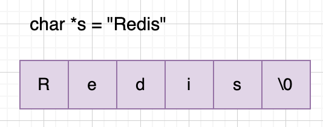
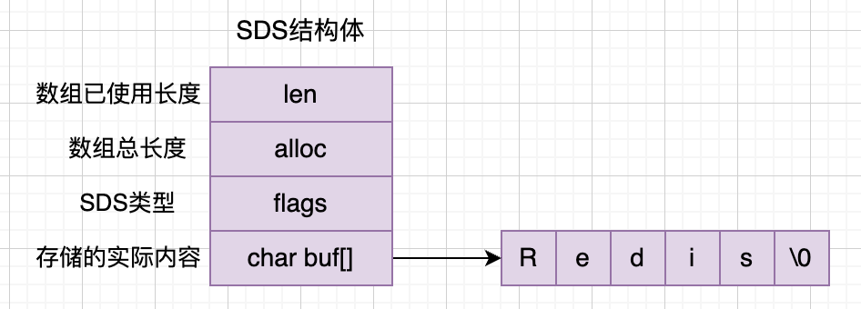
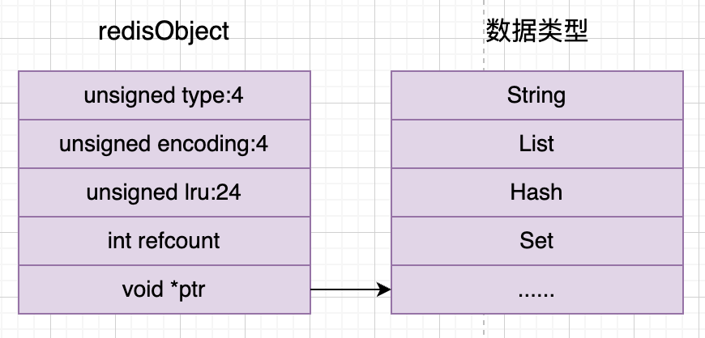
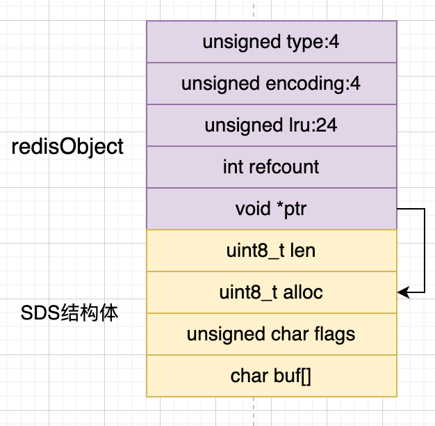

# 字符串实现原理

字符串类型的使用场景最为广泛，例如计数器，缓存，分布式锁以及存储登录后的用户信息，key保存token，value存储登录用户对象的JSON字符串等。

```
SET username shengduiliang
```

C语言原生支持字符串类型，如下所示



原生字符串有以下缺点:

- 原生字符串需要手动检查和分配字符串空间，要获取字符串长度需要遍历整个字符串
- 原生字符串是以\0作为字符串作为结束符的，没有办法存储二进制数据，比如bitmap/图片
- 字符串的扩容和缩容很麻烦

所以redis基于C语言的原生字符串重新封装了一个字符串的结构---SDS

## SDS结构体



SDS结构体的组成如上所示，需要注意的是也遵循以空字符"\0"结尾的惯例，但是最后这个空字符不算入SDS的长度len中。

SDS结构体有5种类型，分别是sdshdr5，sdshdr8，sdshdr16，sdshdr32，sdshdr64。sdshdr5已经不同了，所以我们主要了解剩下几种，这里以sdshdr8为例，代码如下:

```sds.h
struct __attribute__ ((__packed__)) sdshdr8 {
  uint8_t len; /* used */
  uint8_t alloc; /* excluding the header and null terminator */
  unsigned char flags; /* 3 lsb of type, 5 unused bits */
  char buf[];
};
```

注意上面结构体前面的__attribute__ ((\_\_packed\_\_)), 这句代码的作用是告诉编译器，不要使用字节对齐的方式（默认按8字节对齐），而是采用紧凑的方法来分配内存。

## 字符串编码格式

Redis对字符串类型使用了三种编码格式来存储，分别是int，embstr和raw类型。

- int编码: 8字节的长整型，值是数字类型且数字的长度小于20。（这个没用到SDS结构体）
- embstr编码: 长度小于等于44字节的字符串。
- raw编码： 长度大于44字节的字符串。

为什么会有三种编码形式呢？都是为了内存效率考虑的, 下面就来讲解一下。

**int编码**

前面第二篇文章介绍redis的所有键值对的值都是使用redisObject对象来存储的，这里重新放一下。



redisObject一共占用的内存大小为 (4(type) + 4(encoding) + 24(lru)) / 8 + 4(int占用4个字节) + 8(void *类型占用8个字节)，刚好16个字节，内存对齐。

但是如果ptr直接用来存储数字的话，可以存放8字节的数字，可以放多大的数呢？Math.pow(2, 64) = 18446744073709552000。刚好20位数字，所以可以直接用一个redisObject存储就可以了。

**embstr编码**

对于内存分配来说，分配连续的内存会比分散的内存效率更高，这就是embstr编码要考虑，在embstr编码中，redisObject跟SDS结构体是相邻的，如下图所示



redisObject占用了16个字节，而SDS结构体占用的内存大小为1(len) + 1(alloc) + 1(flags) + 8(buf) + 1("\0") = 12个字节。

如果分配一个64个字节的内存，那么可以算出字符串长度为 64 - 16 - 12 = 44个字节。

**raw编码**

这种编码形式就不细说了，redisObject跟SDS结构分别分配空间，即分配两次空间。

**源码分析**

接下来我们查看一下字符串的设置流程。上节课我们知道了一个命令是怎么查找对应的处理函数的，这里重新讲一下，后面就不讲了。

我们打开commands.c文件，搜索set字符好，可以找到对应的执行命令，然后点击查看即可。

```command.c
{"set","Set the string value of a key",...,SET_History,SET_tips,setCommand,...}
```

可以看到setCommand在t_string.c文件下面，查看代码。

``` t_string.c
void setCommand(client *c) {
  robj *expire = NULL;
  int unit = UNIT_SECONDS;
  int flags = OBJ_NO_FLAGS;

  // 检查额外的参数
  if (parseExtendedStringArgumentsOrReply(c,&flags,&unit,&expire,COMMAND_SET) != C_OK) {
      return;
  }
  
  // 重新编码，核心函数
  c->argv[2] = tryObjectEncoding(c->argv[2]);
  // 实际设置命令
  setGenericCommand(c,flags,c->argv[1],c->argv[2],expire,unit,NULL,NULL);
}
```

主要看tryObjectEncoding函数，点击代码查看。

``` object.c
robj *tryObjectEncoding(robj *o) {

  // 如果长度小于20并且可以转化成数字
  if (len <= 20 && string2l(s,len,&value)) {
    // 数值小于10000，从share内存池返回
    if ((server.maxmemory == 0 ||
    !(server.maxmemory_policy & MAXMEMORY_FLAG_NO_SHARED_INTEGERS)) &&
    value >= 0 &&
    value < OBJ_SHARED_INTEGERS)
    {
      decrRefCount(o);
      incrRefCount(shared.integers[value]);
      return shared.integers[value];
    } else {
      if (o->encoding == OBJ_ENCODING_RAW) {
        // 释放o->ptr
        sdsfree(o->ptr);
        o->encoding = OBJ_ENCODING_INT;
        // 可以看到直接是把value当成指针
        o->ptr = (void*) value;
        return o;
      } else if (o->encoding == OBJ_ENCODING_EMBSTR) {
        decrRefCount(o);
        // 重新构造一个robj
        return createStringObjectFromLongLongForValue(value);
      }
    }
  }

  // 如果字符串长度小于或等于44，创建embstr对象
  if (len <= OBJ_ENCODING_EMBSTR_SIZE_LIMIT) {
    robj *emb;

    if (o->encoding == OBJ_ENCODING_EMBSTR) return o;
    emb = createEmbeddedStringObject(s,sdslen(s));
    decrRefCount(o);
    return emb;
  }

  // 尝试优化SDS字符串对象的空间
  trimStringObjectIfNeeded(o);
}
```

raw编码SDS的创建是在readQueryFromClient->processInputBuffer->processMultibulkBuffer->createStringObject中

## 空间预分配

在需要对SDS的空间进行扩容时，不仅仅分配所需的空间，还会分配额外的空间，减少内存重分配次数

- 如果字符串长度小于 1MB，则采用 加倍扩展 策略，新分配的内存大小为当前字符串长度的 2 22 倍。
- 如果字符串长度超过 1MB，则每次额外分配 1MB 的空间。

根据查找的资料，SDS的扩缩容实现在_sdsMakeRoomFor这个函数里面，查看实现方法。

```
sds _sdsMakeRoomFor(sds s, size_t addlen, int greedy) {
  ... sds.c
  len = sdslen(s);
  sh = (char*)s-sdsHdrSize(oldtype);
  reqlen = newlen = (len+addlen);
  assert(newlen > len);   /* Catch size_t overflow */
  // 有足够的空间，直接返回
  if (avail >= addlen) return s;
  if (greedy == 1) {
    // 小于1MB时，翻倍
    if (newlen < SDS_MAX_PREALLOC)
      newlen *= 2;
    else
      // 大于1M时，增加1M大小
      //#define SDS_MAX_PREALLOC (1024*1024)
      newlen += SDS_MAX_PREALLOC;
  }
  ...
  return s;
}
```

这个方法的调用在readQueryFromClient方法中的sdsMakeRoomFor()


## 惰性删除

当对SDS进行缩短操作时，程序并不会回收多余的内存空间，留给后面使用。 

``` sds.c
void sdsupdatelen(sds s) {
  int reallen = strlen(s);
  sdssetlen(s, reallen);
}

static inline void sdssetlen(sds s, size_t newlen) {
  unsigned char flags = s[-1];
  switch(flags&SDS_TYPE_MASK) {
    case SDS_TYPE_5:
      {
          unsigned char *fp = ((unsigned char*)s)-1;
          *fp = SDS_TYPE_5 | (newlen << SDS_TYPE_BITS);
      }
      break;
    case SDS_TYPE_8:
        SDS_HDR(8,s)->len = newlen;
        break;
    case SDS_TYPE_16:
        SDS_HDR(16,s)->len = newlen;
        break;
    case SDS_TYPE_32:
        SDS_HDR(32,s)->len = newlen;
        break;
    case SDS_TYPE_64:
        SDS_HDR(64,s)->len = newlen;
        break;
  }
}
```

可以从上面源码中看到，在更新字符串长度的过程中并没有涉及到内存的重分配策略，只是简单的修改sdshdr头中的Len字段。

