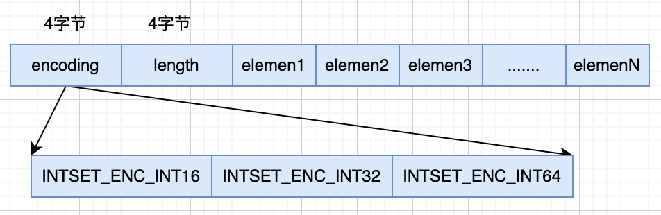

# Sets实现原理与实战

如果需要存储多个元素，并且要求不能出现重复数据，无须考虑数据的有序性，可以使用Sets。Sets还支持在集合之间做交集，并集，差集操作，比如统计元素的聚合结果。

- 统计多个元素的共有数据(交集)
- 统计多个元素的所有元素(并集)
- 对于两个集合，统计其中的一个独有元素(差集)

常见的使用场景如下:

- 社交软件中共同关注：通过交集实现
- 每日新增关注数：对近两天的总注册用户集合取差值
- 打标签：为自己收藏的每一篇文章打标签

## Sets用法

- 添加元素: SADD key value
- 删除元素: SREM key value
- 获取集合元素: SMEMBER key
- 随机获取一个元素: SPOP key [number]
- 取交集, 把key1和key2的交集放到destination: SINTERSTORE destination key1 key2 [key3 ...]
- 取并集, 返回key1和key2的并集: SUNION key1 key2
- 取差集, 返回key1和key2的差集: SDIFF key1 key2

## 底层数据结构

Sets的底层数据结构有两种，具体如下：

- intset: 如果元素内容都是64位以内的十进制整数，并且元素不超过 set-max-intset-entries的，默认为512
- 散列表: 其余使用全局散列表的结构

散列表的实现可以点击[此处](/redis/ht_table.html)查看，接下来我们看看intset的实现。

### intset

首先我们看一下intset的结构体是怎么样的，结构体定义如下:

``` intset.h
typedef struct intset {
  uint32_t encoding;
  // content数组长度
  uint32_t length;
  // 存放intset整数集合的数组
  int8_t contents[];
} intset;
```

其中encoding是比较重要，决定数组的类型，一共有三种不同的值。

- INTSET_ENC_INT16: 每2个字节一个元素
- INTSET_ENC_INT32: 每4个字节一个元素
- INTSET_ENC_INT64: 每8个字节一个元素



intset的结构体设计图如上所示，有几个特性:

- 每次新增元素都会重新扩容
- encoding编码升级都会重新分配空间
- encoding编码不会降级
- intset的content是有序的，可以二分查找


## 源码讲解

下面我们看一下Sets的源码，SADD对应指令的方法是saddCommand，看执行方法

``` t_set.c
void saddCommand(client *c) {
  robj *set;
  int j, added = 0;

  // 查看key是否存在
  set = lookupKeyWrite(c->db,c->argv[1]);
  if (checkType(c,set,OBJ_SET)) return;
  
  // 不存在，创建key
  if (set == NULL) {
      set = setTypeCreate(c->argv[2]->ptr);
      dbAdd(c->db,c->argv[1],set);
  }

  // 添加元素
  for (j = 2; j < c->argc; j++) {
      if (setTypeAdd(set,c->argv[j]->ptr)) added++;
  }

  // 添加成功，发送成功通知
  if (added) {
      signalModifiedKey(c,c->db,c->argv[1]);
      notifyKeyspaceEvent(NOTIFY_SET,"sadd",c->argv[1],c->db->id);
  }
  server.dirty += added;
  addReplyLongLong(c,added);
}
```

可以看到核心的方法是setTypeAdd，那么我们跟进去看一下:

``` t_set.c
int setTypeAdd(robj *subject, sds value) {
  long long llval;
  // 如果已经是使用hashtable的话，直接添加元素
  if (subject->encoding == OBJ_ENCODING_HT) {
    .....
  } else if (subject->encoding == OBJ_ENCODING_INTSET) {
    // 是数字类型
    if (isSdsRepresentableAsLongLong(value,&llval) == C_OK) {
        uint8_t success = 0;
        subject->ptr = intsetAdd(subject->ptr,llval,&success);
        if (success) {
            // 根据set_max_intset_entries判断是否要切换成hashtable
            size_t max_entries = server.set_max_intset_entries;
            /* limit to 1G entries due to intset internals. */
            if (max_entries >= 1<<30) max_entries = 1<<30;
            if (intsetLen(subject->ptr) > max_entries)
                setTypeConvert(subject,OBJ_ENCODING_HT);
            return 1;
        }
    } else {
      // 转化成hashtable
        /* Failed to get integer from object, convert to regular set. */
        setTypeConvert(subject,OBJ_ENCODING_HT);

        /* The set *was* an intset and this value is not integer
          * encodable, so dictAdd should always work. */
        serverAssert(dictAdd(subject->ptr,sdsdup(value),NULL) == DICT_OK);
        return 1;
    }
  } else {
      serverPanic("Unknown set encoding");
  }
  return 0;
}
```

由于hashtable的插入之前已经讲过了，所以这里讲一下intsetAdd这个方法，执行intset的插入的方法。

``` intset.c
intset *intsetAdd(intset *is, int64_t value, uint8_t *success) {
  // 获取编码
  uint8_t valenc = _intsetValueEncoding(value);
  uint32_t pos;
  if (success) *success = 1;

  // 如果需要升级编码，则升级编码
  if (valenc > intrev32ifbe(is->encoding)) {
    /* This always succeeds, so we don't need to curry *success. */
    return intsetUpgradeAndAdd(is,value);
  } else {
  // 二分查找是否已经存在元素了
    if (intsetSearch(is,value,&pos)) {
      if (success) *success = 0;
      return is;
    }
    // 重新分配空间
    is = intsetResize(is,intrev32ifbe(is->length)+1);
    if (pos < intrev32ifbe(is->length)) intsetMoveTail(is,pos,pos+1);
  }
  // 设置值
  _intsetSet(is,pos,value);
  // 获取当前长度
  is->length = intrev32ifbe(intrev32ifbe(is->length)+1);
  return is;
}
```

可以看到插入元素很简单。

