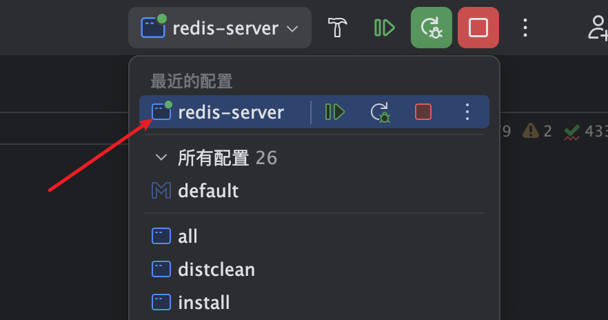
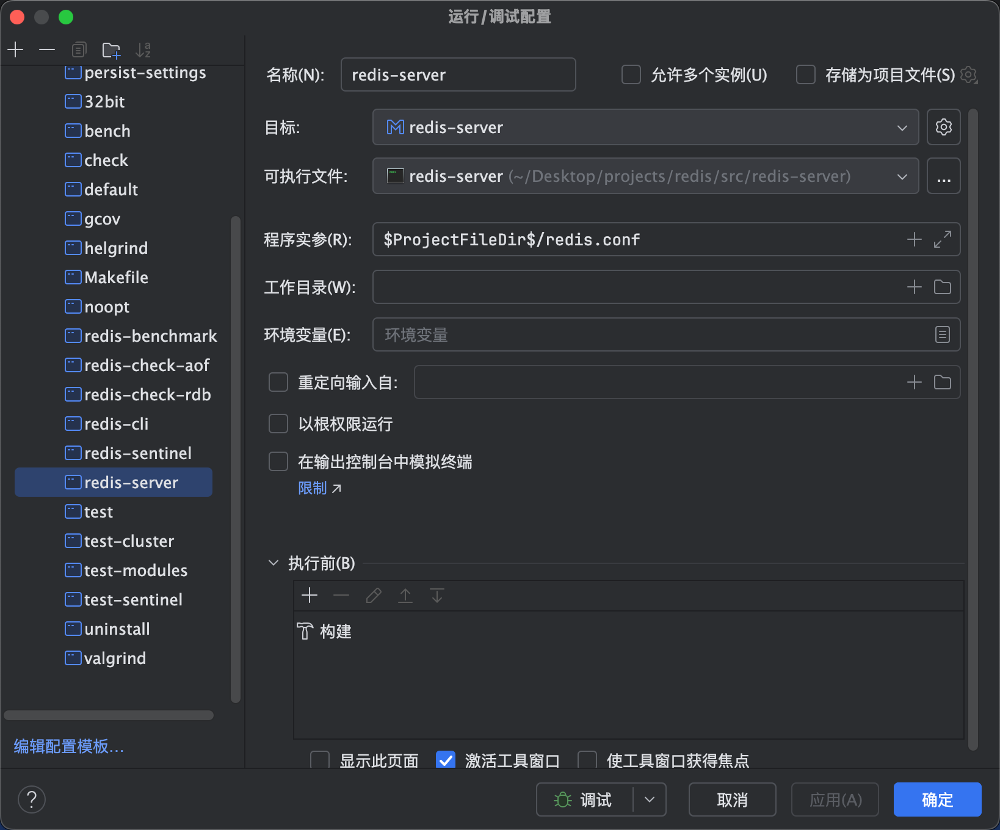
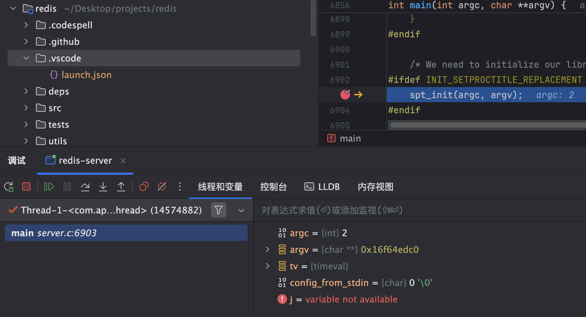

# 源码环境的搭建

本篇主要介绍如果通过CLion来搭建redis的源码环境和调试redis的源码。

## 下载redis源码

通过git下载redis的源码，直接在github上搜索redis，将仓库克隆到本地。

```
git clone https://github.com/redis/redis.git
```

本系列文章主要讲解redis 7的源码，进入redis目录，使用git checkout切换到7.0目录

```
git checkout -b 7.0 origin/7.0
```

## 编译redis

执行gcc -v命令判断是否安装了gcc编译器，如果没有则执行以下命令安装。

```
xcode-select --install
```

准备就绪后，进入redis的根目录，使用make编译项目的源代码

```
make CFLAGS="-g -O0" MALLOC=jemalloc
```

CFLAGS="-g -O0"表示不要优化代码，避免在Debug的时候，CLion里面的源码与实际的代码对应不上。如果编译过程遇到有什么库没有安装的错误，安装上即可。

## 启动redis

在redis的根目录下使用以下命令启动redis，如果启动正常则表示编译成功。

```
shengduiliang@liangchengduideMac-mini redis % ./src/redis-server ./redis.conf 
49193:C 09 Jan 2025 02:24:00.815 # oO0OoO0OoO0Oo Redis is starting oO0OoO0OoO0Oo
49193:C 09 Jan 2025 02:24:00.815 # Redis version=7.0.15, bits=64, commit=f35f36a2, modified=0, pid=49193, just started  runtest*            runtest-moduleapi*  sentinel.conf       tests/              
49193:C 09 Jan 2025 02:24:00.815 # Configuration loaded
49193:M 09 Jan 2025 02:24:00.815 * monotonic clock: POSIX clock_gettime
                _._                                                  
           _.-``__ ''-._                                             
      _.-``    `.  `_.  ''-._           Redis 7.0.15 (f35f36a2/0) 64 bit
  .-`` .-```.  ```\/    _.,_ ''-._                                  
 (    '      ,       .-`  | `,    )     Running in standalone mode
 |`-._`-...-` __...-.``-._|'` _.-'|     Port: 6379
 |    `-._   `._    /     _.-'    |     PID: 49193
  `-._    `-._  `-./  _.-'    _.-'                                   
 |`-._`-._    `-.__.-'    _.-'_.-'|                                  
 |    `-._`-._        _.-'_.-'    |           https://redis.io       
  `-._    `-._`-.__.-'_.-'    _.-'                                   
 |`-._`-._    `-.__.-'    _.-'_.-'|                                  
 |    `-._`-._        _.-'_.-'    |                                  
  `-._    `-._`-.__.-'_.-'    _.-'                                   
      `-._    `-.__.-'    _.-'                                       
          `-._        _.-'                                           
              `-.__.-'                                               

49193:M 09 Jan 2025 02:24:00.817 # WARNING: The TCP backlog setting of 511 cannot be enforced because kern.ipc.somaxconn is set to the lower value of 128.
49193:M 09 Jan 2025 02:24:00.817 # Server initialized
49193:M 09 Jan 2025 02:24:00.818 * Ready to accept connections
```

## CLion调试源码

使用CLion打开redis源码目录，在下拉菜单中选择redis-server。



点击右边的三个点，指定redis-server的配置和redis.conf的目录。



可执行文件选中项目下的redis-server可执行文件，程序实参填入$ProjectFileDir$/redis.conf

打开src/server.c文件，在该文件中的main方法里面打断点，然后debug启动redis-server。



如果程序卡在断点处，则说明环境搭建完成

::: warning
Mac M4系列一开始一直进不去断点，后面莫名其妙就可以了，不确定跟这个有没有关系: 在命令行中执行了brew install cmake
:::

## 源码结构

我们来了解一下redis的源码的整体目录结构，形成全局的认识。

**deps**

这个目录包含了redis依赖的第三方代码库。

- jemallo: 内存分配器，默认情况下选择该内存分配器来代替Linux操作系统的libc-malloc
- Hiredis： 官方C语言客户端
- Linenoise： 读线替换
- Lua： Lua语言的相关功能
- hdr_histogram: 用于生成每个命令的延迟跟踪直方图

**src**

这个目录是redis的源码目了，包括commands和modules两个子目录，以及其余模块的功能，这是redis最重要的目录

**test**

该目录下包含功能模块测试和单元测试的代码。

- Cluster: Redis集群功能测试
- sentinel: 哨兵集群功能测试
- Unit: 单元测试
- Integration: 主从复制功能测试

此外，还有assets，helps，modules和support 4个子目录，它们用来支撑测试功能

**utils**

包括辅助性功能的脚本或者代码，例如用于创建Redis集群的脚本，Lru算法效果展示代码等

**redis.conf**

redis的配置文件，核心文件，配置redis实例的参数

**sentinel.conf**

哨兵集群的配置文件
