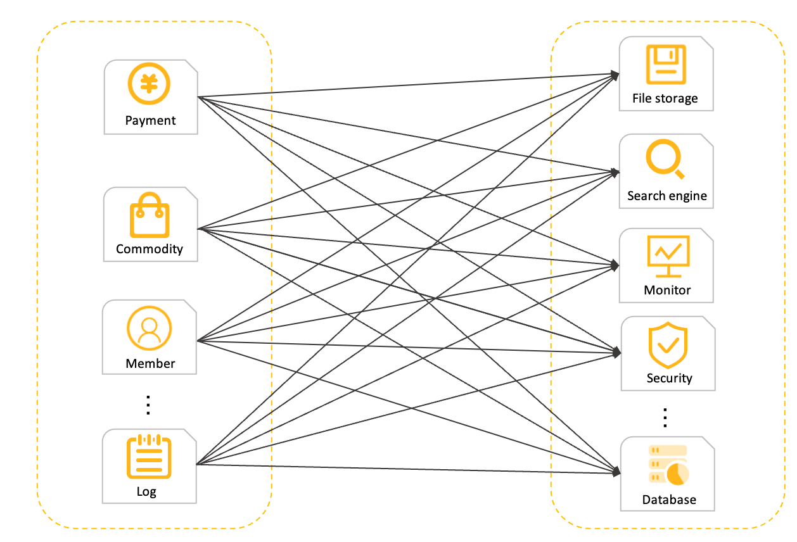
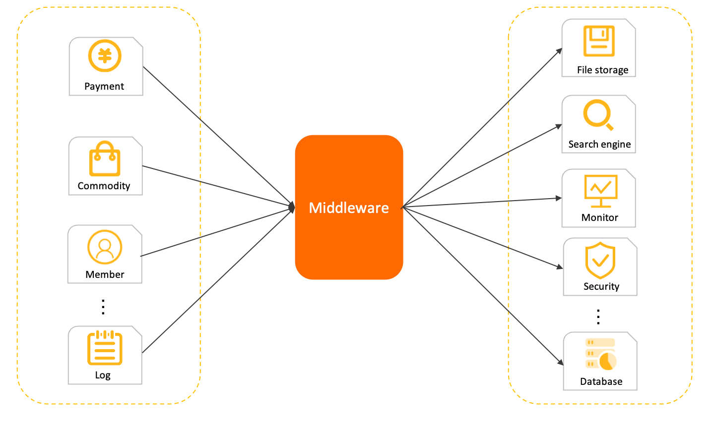
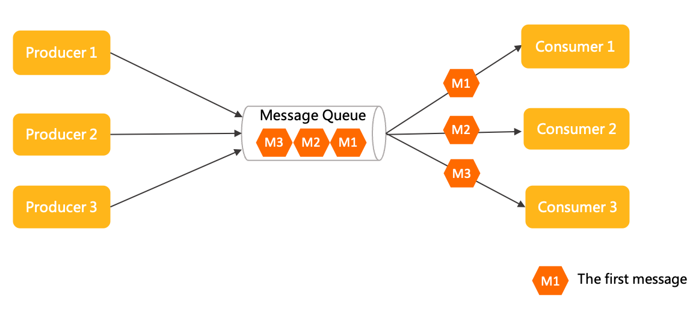
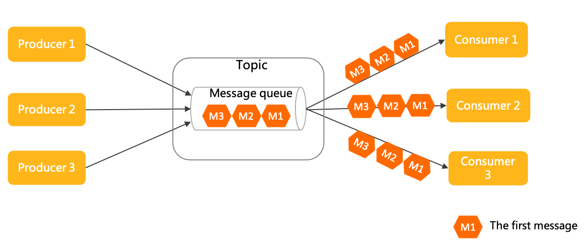
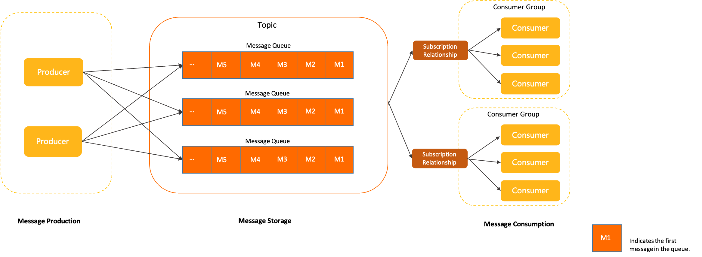
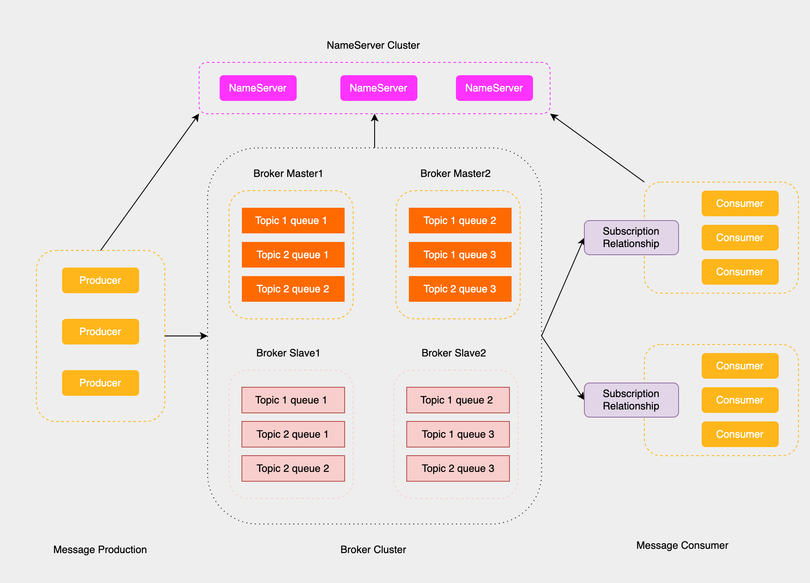

# rocketmq架构设计

Apache RocketMQ 是一款典型的分布式架构下的中间件产品，使用异步通信方式和发布订阅的消息传输模型。Apache RocketMQ 产品具备异步通信的优势，系统拓扑简单、上下游耦合较弱，主要应用于异步解耦，流量削峰填谷等场景。

- **异步处理**: 相比传统的串行方式，使用并行方式，提高系统的吞吐量
- **应用解耦**: 系统之间通过消息通信，不用关心其他系统的处理
- **流量削峰**: 可以通过消息队列长度控制请求量，缓解短时间内的高并发请求
- 日志处理: 解决大量日志传输的问题
- 消息通信: 基于发布订阅模型可以实现点对点消息队列，又或者聊天室等

接下来我们就一步一步分析rocketmq的架构设计。

## 通信模型

### 同步RPC调用模型

在分布式系统架构下, 会将复杂系统拆分成多个独立的子模块，例如微服务模块。这式需要考虑子模块之间的远程通信，传统的同步RPC远程调用模型如下所示

同步RPC调用模型下，不同的系统直接进行调用通信，每个请求直接直接从调用方发送到被调用方，然后要求被调用方立即返回响应结果给调用方，以确定本次调用结果是否成功。

同步RPC调用模型有以下几个缺点：

- 拓扑结构复杂: 在上图就可以看到，每个调用方都要维护被调用方的连接，非常复杂
- 上下游耦合性强: 调用方需要拿到被调用方的结果，如果被调用方挂了，调用方也会出问题

### 异步通信模型

由于同步RPC调用模型有比较多的缺点，于是就在调用方与被调用方中间加上一层中间件，由中间件对消息进行缓存，然后被调用方再拉取消息来进行处理，模型如下所示:

异步消息通信模式下，各子系统之间无需强耦合直接连接，调用方只需要将请求转化成为消息发送给中间代理，发送成功即可认为该异步链路调用完成了，剩下的工作中间代理会负责将事件可靠通知到下游的调用系统，确保任务执行完成。该中间代理一般就是消息中间件。

异步通信模型有以下几个优点:

- 系统拓扑简单。由于调用方和被调用方统一和中间代理通信，系统是星型结构，易于维护和管理。
- 上下游耦合性弱。上下游系统之间弱耦合，结构更灵活，由中间代理负责缓冲和异步恢复。 上下游系统间可以独立升级和变更，不会互相影响。
- 容量削峰填谷。基于消息的中间代理往往具备很强的流量缓冲和整形能力，业务流量高峰到来时不会击垮下游。

::: warning
对于强同步性的流程不太适合使用该模型, 比如转账流程，需要扣减用户A的钱再增加用户B的钱。当然，如果扣减完用户A的钱之后，发送消息，然后再增加用户B的钱也是可以的，不过会有延时性。
:::

而rokectmq就是这个中间件(消息队列)的一种实现，除了rocketmq，还有kafka，rabbitmq以及pulsar。本系列主要讲解rocketmq。

::: info
pulsar号称是下一代中间件，大家有兴趣的话可以了解一下，点击[此处](https://pulsar.apache.org/)
:::

## 消息传输模型

主流的消息中间件的传输模型主要有点对点模型和发布订阅模型。

### 点对点模型

点对点模型也称队列模型，就是生产者往消息队列中发送信息，下游消费者即使有多个，但都没有自己独立的身份，因此共享队列中的消息，每一条消息都只会被唯一一个消费者处理。

### 发布订阅模型

发布订阅模型就是消息队列中的每个消息都会被消费者处理，可以用来实现一对多通信。比如物流服务，积分服务都要监听订单付款消息进行处理，就很适合使用这种模式。

## rocketmq消息消费模型

rocketmq同时集成了点对点模型跟发布订阅模型，rocketmq的消息消费模型如下所示:

RocketMQ中消息的生命周期主要分为消息生产、消息存储、消息消费这三部分。

- 生产者（Producer）:就是消息的生成者，生产者生成消息后，把消息发送到主题里面的消息队列里面，生产者可以有很多个，同时往一个主题里面发送消息 
- 主题（Topic）: 消息传输和存储的分组容器，内部由多个消息队列组成，可以缓解单个消息队列压力过大的问题
- 队列 (MessageQueue): 消息传输和存储的实际单元容器，一个无界队列，消息在队列中保持有序性
- 消息 (Message): Apache RocketMQ 的最小传输单元。消息具备不可变性，在初始化发送和完成存储后即不可变。
- 消费者组（MessageGroup）: 每个消费者组由多个消费者组成，消费者组之间是发布订阅模型，消费者组内部的消费者使用点对点模型
- 订阅关系(Subscription): Apache RocketMQ 发布订阅模型中消息过滤、重试、消费进度的规则配置。订阅关系以消费组粒度进行管理，消费组通过定义订阅关系控制指定消费组下的消费者如何实现消息过滤、消费重试及消费进度恢复等。

Apache RocketMQ 的订阅关系除过滤表达式之外都是持久化的，即服务端重启或请求断开，订阅关系依然保留。

## rocketmq集群设计

rocketmq为了避免消息服务器的单点故障导致的整个系统瘫痪，通常会采用多台消息服务器共同承担消息的储存。这就会有一个问题，生产者怎么知道往哪一台消息服务器发送消息呢，消费者怎么知道从哪台消息服务器接收消息呢？如果消息服务器宕机了，生产者和消费者怎么感知？这时就引入了rocketmq的集群设计。

### Broker集群

**Broker Cluster**

在前面rocketmq消息消费模型的基础上，rocketmq进一步抽象出了Broker Cluster的模型，每个主题上的多个消息队列（也叫分区）分散在多个消息服务器（也叫Broker）当中，这样就可以由多个消息服务器来分担消息了；

**Broker Master和Broker Slave**

当然，为了避免单点故障，比如说如果某一个消息服务器挂了，上面的消息也就获取不到了，为每个Broker引入主从复制的思想，分成Broker Master和Broker Slave，Broker Slave从Broker Master和中复制消息，当Broker Master，可以切换到Broker Slave上进行读写操作。

Broker Slave只支持消费者读，不允许生产者写，而Broker Master同时支持读写操作

### NameServer Cluster

NameServer相当于Rockermq集群中的注册中心，Broker消息服务器在启动时向所有的NameServer注册，生产者在发送消息之前先从NameServer中获取Broker服务器的地址列表，然后根据负载算法从列表中选择一台消息服务器进行消息发送；消息消费者类似。

NameServer只负责接收请求并且回复，不负责发送请求。并且NameServer之间互不干扰，这样的话设计起来更加简单。

本文参考资料： RocketMQ[官方网站](https://rocketmq.apache.org/zh/docs/domainModel/01main/)