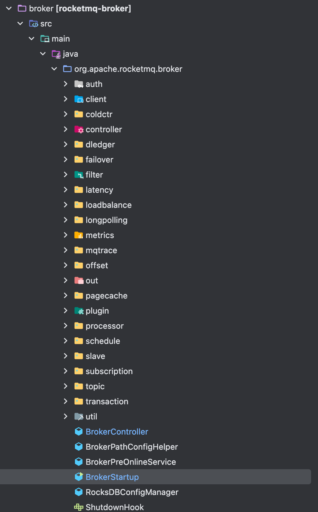

# Broker启动流程

从这节课开始，我们就进入Rocketmq的核心部分--Broker的讲解，这也是整个Rocketmq当中最复杂的一部份内容了，绝大部分消息队列的特性都在这个模块中, 我们先看目录结构。



## 入口代码分析

Broker的启动类是BrokerStartup，我们直接看这个类的入口函数

```BrokerStartup
public class BrokerStartup {
  public static void main(String[] args) {
    start(createBrokerController(args));
  }

  public static BrokerController createBrokerController(String[] args) {
    // 注册controller
    BrokerController controller = buildBrokerController(args);
    // 初始化controller
    boolean initResult = controller.initialize();
    // 注册shutdown hook
    Runtime.getRuntime().addShutdownHook(new Thread(buildShutdownHook(controller)));
  }

  public static BrokerController start(BrokerController controller) {
    controller.start();
  }
}
```

启动流程跟之前分析的NameServer的启动流程有点类似

- 解析Broker配置文件，创建BrokerController, 初始化BrokerController
- 启动BrokerController

## 解析