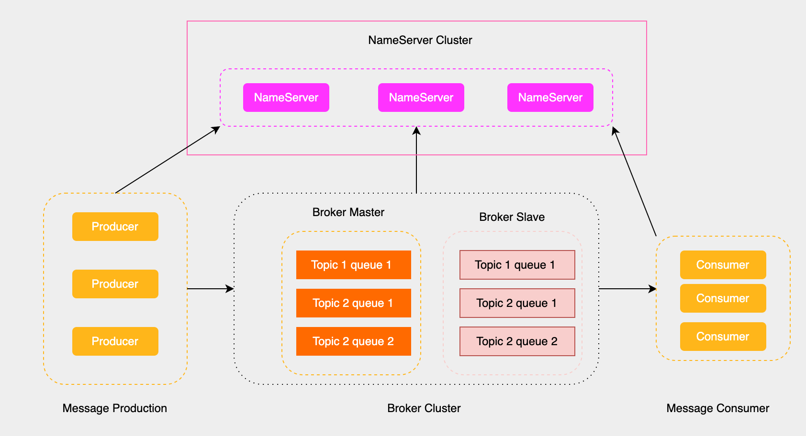
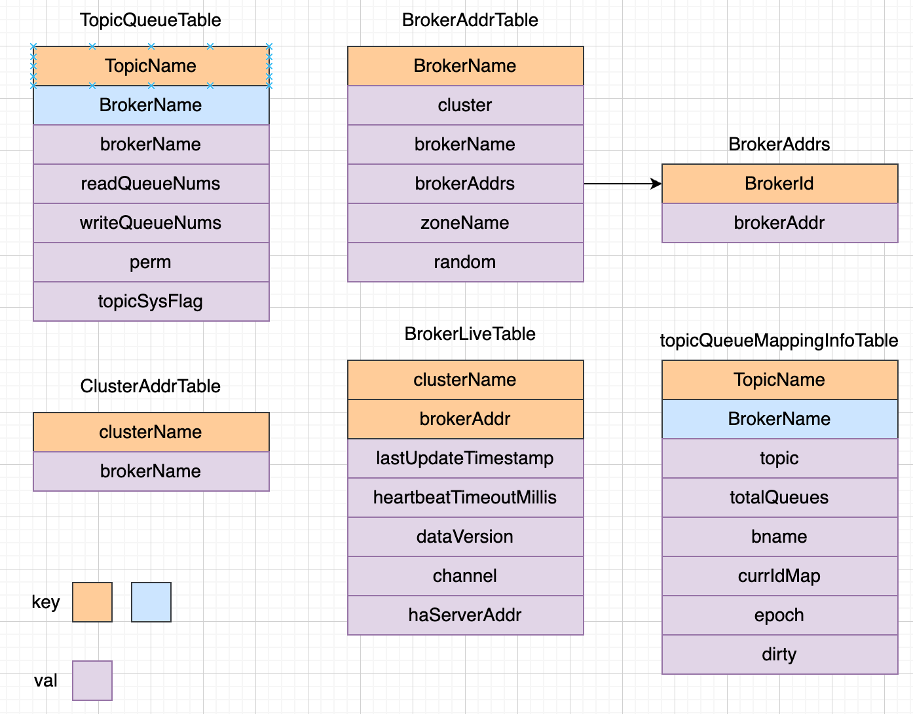
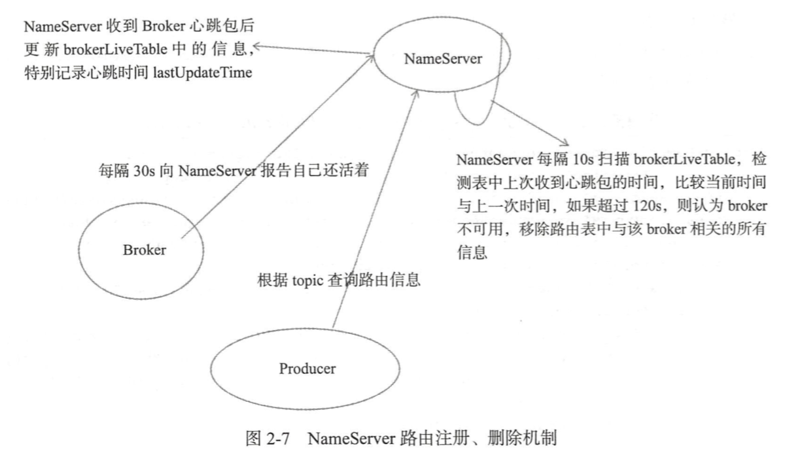

# NameServer初始化流程与路由



前面提到NameServer就相当于Rockermq集群中的注册中心，用来存储RocketMq集群中所有的Broker服务器地址列表，具体的流程如下所示:

- Broker消息服务器在启动时会向所有的NameServer注册自己的信息，然后生产者和消费者从NameServer中获取Broker的信息。
- NameServer跟每一台Broker保持长连接，并间隔30s检查Broker是否存活，如果检测到Broker宕机，则从路由注册表中将其移除。

路由变化不会马上通知到消息生产者，而是会在生产者实际发送信息的时候利用容错机制实现消息发送的高可用性。

为了保证NameServer设计的简单，NameServer之间不共享信息，互不通信，所以NameServer之间的路由信息有可能是不一致的。

## NameServer入口代码分析

NameServer的启动类是NamesrvStartup，我们直接看这个类的入口函数。

``` NamesrvStartup
public class NamesrvStartup {
  public static void main(String[] args) {
    // 主处理函数
    main0(args);
    // controllerManager相关
    controllerManagerMain();
  }
  public static NamesrvController main0(String[] args) {
    // 解析nameserver的配置
    parseCommandlineAndConfigFile(args);
    // 创建和启动nameserver服务器
    createAndStartNamesrvController();
  }
  public static ControllerManager controllerManagerMain() {
    // 如果isEnableControllerInNamesrv, 创建和启动ControllerManager
    if (namesrvConfig.isEnableControllerInNamesrv()) {
      return createAndStartControllerManager();
    }
  }
}
```

可以看到主要做了两件事情，具体如下：

- 解析配置文件，并且创建和启动Nameserver服务器
- 如果配置了主备自动切换模式，就调用createAndStartControllerManager，点击[此处](https://rocketmq.apache.org/zh/docs/deploymentOperations/03autofailover/)了解

## 解析nameserver配置

我们先来看看parseCommandlineAndConfigFile解析nameServ配置的流程，具体代码如下所示:

``` NamesrvStartup
public static void parseCommandlineAndConfigFile(String[] args) throws Exception {
  // 设置系统环境变量 rocketmq.remoting.version=475
  System.setProperty(RemotingCommand.REMOTING_VERSION_KEY, Integer.toString(MQVersion.CURRENT_VERSION));
  // 解析命令行参数
  Options options = ServerUtil.buildCommandlineOptions(new Options());
  CommandLine commandLine = ServerUtil.parseCmdLine("mqnamesrv", args, buildCommandlineOptions(options), new DefaultParser());
  // 初始化NameServer, nettyServernettyClient和的配置
  namesrvConfig = new NamesrvConfig();
  nettyServerConfig = new NettyServerConfig();
  nettyClientConfig = new NettyClientConfig();
  // 指定监听端口为9876
  nettyServerConfig.setListenPort(9876);
  // 如果有配置文件，则将配置文件的属性解析出来
  if (commandLine.hasOption('c')) {
    String file = commandLine.getOptionValue('c');
    InputStream in = new BufferedInputStream(Files.newInputStream(Paths.get(file)));
    properties = new Properties();
    properties.load(in);
    // 解析配置文件的属性
    MixAll.properties2Object(properties, namesrvConfig);
    MixAll.properties2Object(properties, nettyServerConfig);
    MixAll.properties2Object(properties, nettyClientConfig);
    if (namesrvConfig.isEnableControllerInNamesrv()) {
      # 主备自动切换模式下的逻辑，后续单开一篇说明
    }
    namesrvConfig.setConfigStorePath(file);
  }
  // 将命令行的参数写入到namesrvConfig中
  MixAll.properties2Object(ServerUtil.commandLine2Properties(commandLine), namesrvConfig);
  // 打印namesrvConfig配置和nettyServerConfig配置
  ...
}
```

可以看到主要是是解析namesrvConfig，nettyServerConfig和nettyClientConfig这三个配置，优先级顺序：命令行参数 > 配置文件参数 > 默认参数。

nettyServerConfig和nettyClientConfig这两个配置Broker也会用到，到时单开一篇讲解，我们主要看一下nameserver提供了什么参数给我们配置。

**文件路径相关**

- rocketmqHome: RocketMQ主目录，通过系统属性ROCKETMQ_HOME_PROPERTY(JVM属性)或环境变量ROCKETMQ_HOME_ENV 获取
- kvConfigPath: kv配置文件路径，包含顺序消息主题的配置信息, 默认用户主目录/namesrv/kvConfig.json
- configStorePath: 存储NameServer的默认配置文件路径, 默认为用户主目录/namesrv/namesrv.properties

**环境与模式**
- productEnvName: 定义当前运行环境的名称，默认值为"center"
- clusterTest: 用于标识是否处于集群测试模式，默认值为false
- orderMessageEnable: 是否支持顺序消息的发送，默认值为false
- returnOrderTopicConfigToBroker: 是否将顺序主题的配置信息返回给Broker，默认值为true

**线程池和任务队列**

- clientRequestThreadPoolNums: 用于处理客户端请求（如GET_ROUTEINTO_BY_TOPIC）的线程池大小，默认值为8
- defaultThreadPoolNums: 用于处理Broker或operation请求的线程池大小，默认值为16
- clientRequestThreadPoolQueueCapacity: 客户端请求线程池的任务队列容量，默认值为50000
- defaultThreadPoolQueueCapacity: Broker或operation请求线程池的任务队列容量，默认值为10000

**心跳与超时相关**

- scanNotActiveBrokerInterval: 周期性扫描非活跃Broker的时间间隔，默认值为5000ms（5秒）
- unRegisterBrokerQueueCapacity: 用于注销Broker的任务队列容量，默认值为3000

**主从模式与高可用**

- supportActingMaster: 是否支持“代理主节点”模式, 当主节点不可用时，Slave节点可以作为代理主节点提供有限功能支持, 包括：消息队列锁定/解锁、查询偏移量、获取最早消息存储时间等, 默认为false

**主题配置相关**

- enableAllTopicList: 是否启用所有主题列表的功能，默认值为true
- enableTopicList: 是否启用主题列表功能，默认值为true
- notifyMinBrokerIdChanged: 是否在Broker最小id发生变化时发送通知，默认值为false
- enableControllerInNamesrv: 是否启用主备自动切换模式

**服务等待相关**

- needWaitForService: 是否需要等待服务启动完成，默认值为false
- waitSecondsForService: 等待服务启动完成的时间（秒），默认值为45秒

**主题注册与删除相关**

- deleteTopicWithBrokerRegistration: 是否在Broker注册时删除不存在于注册信息中的主题, 同时启用此标志和Broker配置中的enableSingleTopicRegister以避免意外丢失主题路由信息, 不支持静态主题，默认值为false

**配置黑名单**

- configBlackList: 配置更新的黑名单，黑名单中的配置不能通过命令更新，必须通过重启进程更新。默认值：configBlackList;configStorePath;kvConfigPath

## NamesrvController的创建

接下来我们就进入createAndStartNamesrvController这个方法查看，代码如下:

``` NamesrvStartup
public static NamesrvController createAndStartNamesrvController() throws Exception {
  // 创建命名服务控制器
  NamesrvController controller = createNamesrvController();
  // 启动控制器
  start(controller);
  // 打印NettyServer的信息
  NettyServerConfig serverConfig = controller.getNettyServerConfig();
  String tip = String.format("The Name Server boot success. serializeType=%s, address %s:%d", RemotingCommand.getSerializeTypeConfigInThisServer(), serverConfig.getBindAddress(), serverConfig.getListenPort());
  return controller;
}
```

可以看到核心就是createNamesrvController和start方法。

### createNamesrvController

``` NamesrvStartup
public static NamesrvController createNamesrvController() {
  // 构建NamesrvController对象
  final NamesrvController controller = new NamesrvController(namesrvConfig, nettyServerConfig, nettyClientConfig);
  // 将properties，即配置文件的信息记录起来防止丢失
  controller.getConfiguration().registerConfig(properties);
  return controller;
}
```

查看NamesrvController的构造方法，代码如下：

``` NamesrvController
public class NamesrvController {
  public NamesrvController(NamesrvConfig namesrvConfig, NettyServerConfig nettyServerConfig, NettyClientConfig nettyClientConfig) {
    this.namesrvConfig = namesrvConfig;
    this.nettyServerConfig = nettyServerConfig;
    this.nettyClientConfig = nettyClientConfig;
    this.kvConfigManager = new KVConfigManager(this);
    this.brokerHousekeepingService = new BrokerHousekeepingService(this);
    this.routeInfoManager = new RouteInfoManager(namesrvConfig, this);
    this.configuration = new Configuration(LOGGER, this.namesrvConfig, this.nettyServerConfig);
    // 根据namesrvConfig中的configStorePath属性设置配置文件的存储路径
    this.configuration.setStorePathFromConfig(this.namesrvConfig, "configStorePath");
  }
}
```

下面这个表格简单介绍一下上面这些属性的作用。

| 配置 | 功能 | 主要用途 |
| - | - | - |
| NamesrvConfig | NameServer 的核心配置项	| 初始化 NameServer 行为，如线程池、存储路径等 |
| NettyServerConfig | 配置 Netty 服务端参数	 | 启动 Netty 服务，处理 Broker 和客户端的请求 |
| NettyClientConfig | 配置 Netty 客户端参数	 | NameServer 与其他组件通信时使用 |
| kvConfigManager | 管理动态 KV 配置 | 提供可修改、可持久化的动态配置管理功能 |
| brokerHousekeepingService | 维护 Broker 的状态 | 监控 Broker 状态，清理不活跃的 Broker 信息 |
| routeInfoManager | 管理路由信息	| 提供 Topic 和 Broker 的映射关系，支持客户端路由发现 |
| configuration |  管理和持久化 NameServer 的配置信息	| 统一配置管理，支持动态更新和持久化 |

### createNamesrvController#start

接下来我们看一下start方法的流程，代码如下所示：

``` NamesrvStartup
public static NamesrvController start(final NamesrvController controller) throws Exception {
  // 初始化NamesrvController
  boolean initResult = controller.initialize();
  // 配置JVM关闭钩子
  Runtime.getRuntime().addShutdownHook(new ShutdownHookThread(log, (Callable<Void>) () -> {
    controller.shutdown();
    return null;
  }));
  // 启动controller
  controller.start();
}
```

JVM关闭钩子好理解，就是往JVM注册了一个钩子，JVM关闭的时候将controller关掉。

启动controller的逻辑也很简单，所以在这里先讲了。

``` NamesrvController
public void start() throws Exception {
  // 启动netty服务器
  this.remotingServer.start();
  // 在由操作系统选择可用端口的测试场景中，就是有些系统监听端口可能会变，将监听端口重新设置到nettyServerConfig
  if (0 == nettyServerConfig.getListenPort()) {
      nettyServerConfig.setListenPort(this.remotingServer.localListenPort());
  }
  // 启动netty客户端
  this.remotingClient.updateNameServerAddressList(Collections.singletonList(NetworkUtil.getLocalAddress()
      + ":" + nettyServerConfig.getListenPort()));
  this.remotingClient.start();
  if (this.fileWatchService != null) {
      this.fileWatchService.start();
  }
  // 启动路由管理服务
  this.routeInfoManager.start();
}
```

## NamesrvController的初始化

接下来我们就要进到controller#initialize方法了，查看具体的代码

```NamesrvController
public boolean initialize() {
  // 加载KV配置
  loadConfig();
  // 将remotingServer和remotingClient new出来
  initiateNetworkComponents();
  // 线程池，处理请求
  initiateThreadExecutors();
  // 注册处理器, 客户端的请求在这里处理
  registerProcessor();
  // 启动定时任务
  startScheduleService();
  // 初始化SSL配置
  initiateSslContext();
  // 初始化RPC hooks
  initiateRpcHooks();
  return true;
}
```

我们先看一下initiateThreadExecutors初始化线程池的，就是根据之前namesrvConfig中线程池和任务队列相关的队列初始化线程池。

``` NamesrvController
private void initiateThreadExecutors() {
  this.defaultThreadPoolQueue = new LinkedBlockingQueue<>(this.namesrvConfig.getDefaultThreadPoolQueueCapacity());
  this.defaultExecutor = ThreadUtils.newThreadPoolExecutor(this.namesrvConfig.getDefaultThreadPoolNums(), this.namesrvConfig.getDefaultThreadPoolNums(), 1000 * 60, TimeUnit.MILLISECONDS, this.defaultThreadPoolQueue, new ThreadFactoryImpl("RemotingExecutorThread_"));

  this.clientRequestThreadPoolQueue = new LinkedBlockingQueue<>(this.namesrvConfig.getClientRequestThreadPoolQueueCapacity());
  this.clientRequestExecutor = ThreadUtils.newThreadPoolExecutor(this.namesrvConfig.getClientRequestThreadPoolNums(), this.namesrvConfig.getClientRequestThreadPoolNums(), 1000 * 60, TimeUnit.MILLISECONDS, this.clientRequestThreadPoolQueue, new ThreadFactoryImpl("ClientRequestExecutorThread_"));
}
```

## NamesrvController定时任务

接下来我们看NamesrvController的定时任务，主要有三个

``` NamesrvController
private void startScheduleService() {
  // 每隔scanNotActiveBrokerInterval毫秒扫描一次Broker，默认为5000，移除不激活状态的broker
  this.scanExecutorService.scheduleAtFixedRate(NamesrvController.this.routeInfoManager::scanNotActiveBroker,
      5, this.namesrvConfig.getScanNotActiveBrokerInterval(), TimeUnit.MILLISECONDS);

  // 每隔10分打印一次kv配置
  this.scheduledExecutorService.scheduleAtFixedRate(NamesrvController.this.kvConfigManager::printAllPeriodically,
      1, 10, TimeUnit.MINUTES);

  // 每隔1S打印一次水印
  this.scheduledExecutorService.scheduleAtFixedRate(() -> {
    NamesrvController.this.printWaterMark();
  }, 10, 1, TimeUnit.SECONDS);
}
```

## 路由注册和故障退出

NameServer主要作用是为消息生产者和消息消费者提供关于主题Topic的路由信息，那么NameServer需要存储路由的基础信息，还要能够管理Broker节点，包括路由注册跟路由剔除等功能。

### 路由元信息

路由的元信息保存在RouteInfoManager这个类里面，我们先看看都有什么。

``` RouteInfoManager
public RouteInfoManager(final NamesrvConfig namesrvConfig, NamesrvController namesrvController) {
  // 存储Topic和队列的映射关系，用于客户端路由发现
  this.topicQueueTable = new ConcurrentHashMap<>(1024);
  // 存储Broker名称与地址的映射关系，用于定位Broker地址
  this.brokerAddrTable = new ConcurrentHashMap<>(128);
  // 存储集群和 Broker 的对应关系，用于按集群管理 Broker
  this.clusterAddrTable = new ConcurrentHashMap<>(32);
  // 存储 Broker 的存活状态信息，用于心跳检测和状态管理
  this.brokerLiveTable = new ConcurrentHashMap<>(256);
  // 存储 FilterServer 信息，用于消息过滤
  this.filterServerTable = new ConcurrentHashMap<>(256);
  // 存储 Topic 队列的映射关系，用于分布式环境下的队列管理
  this.topicQueueMappingInfoTable = new ConcurrentHashMap<>(1024);
  // 管理 Broker 的批量注销，清理路由信息
  this.unRegisterService = new BatchUnregistrationService(this, namesrvConfig);
  this.namesrvConfig = namesrvConfig;
  this.namesrvController = namesrvController;
}
```

下图是比较重要的几个对象的结构图。



### 路由信息的注册

由于路由信息的注册是在Broker端执行的，这里讲一下Brokder端注册的代码，入口在BrokerController#start方法，里面定义了一个定时任务。

``` BrokerController
public void start() throws Exception {
  if (!isIsolated && !this.messageStoreConfig.isEnableDLegerCommitLog() && !this.messageStoreConfig.isDuplicationEnable()) {
    this.registerBrokerAll(true, false, true);
  }
  scheduledFutures.add(this.scheduledExecutorService.scheduleAtFixedRate(new AbstractBrokerRunnable(this.getBrokerIdentity()) {
      @Override
      public void run0() {
        BrokerController.this.registerBrokerAll(true, false, brokerConfig.isForceRegister());
      }
  }, 1000 * 10, Math.max(10000, Math.min(brokerConfig.getRegisterNameServerPeriod(), 60000)), TimeUnit.MILLISECONDS));
}
```

Broker在启动的时候会向集群所有的NameServer发送心跳包，每隔30秒(可以配置)向集群所有的NameServer发送心跳包。可以搜一下代码，还有很多地方调用了registerBrokerAll这个方法，5.3.1版本有16处，能力有限，有些场景我也不清楚。

调用栈如下: registerBrokerAll -> doRegisterBrokerAll -> brokerOuterAPI#registerBrokerAll, 可以稍微看一下这个方法。

``` brokerOuterAPI#
public List<RegisterBrokerResult> registerBrokerAll() {
  for (final String namesrvAddr : nameServerAddressList) {
    brokerOuterExecutor.execute(new AbstractBrokerRunnable(brokerIdentity) {
      @Override
      public void run0() {
        RegisterBrokerResult result = registerBroker(namesrvAddr, oneway, timeoutMills, requestHeader, body);
      }
    });
  }
}
```

NameServer收到请求之后，会执行RouteInfoManager#registerBroker方法。这个方法很长，一步一步来吧。

```
this.lock.writeLock().lockInterruptibly();
//init or update the cluster info
Set<String> brokerNames = ConcurrentHashMapUtils.computeIfAbsent((ConcurrentHashMap<String, Set<String>>) this.clusterAddrTable, clusterName, k -> new HashSet<>());
brokerNames.add(brokerName);
```

先加上写锁，防止并发修改RouteInfoManager中的路由表。然后将brokerName加入到clusterAddrTable中。

```
BrokerData brokerData = this.brokerAddrTable.get(brokerName);
if (null == brokerData) {
  registerFirst = true;
  brokerData = new BrokerData(clusterName, brokerName, new HashMap<>());
  this.brokerAddrTable.put(brokerName, brokerData);
}
```

更新brokerAddrTable里面的的BrokerData信息。

```
if (namesrvConfig.isDeleteTopicWithBrokerRegistration() && topicQueueMappingInfoMap.isEmpty()) {
  final Set<String> oldTopicSet = topicSetOfBrokerName(brokerName);
  final Set<String> newTopicSet = tcTable.keySet();
  final Sets.SetView<String> toDeleteTopics = Sets.difference(oldTopicSet, newTopicSet);
  for (final String toDeleteTopic : toDeleteTopics) {
      Map<String, QueueData> queueDataMap = topicQueueTable.get(toDeleteTopic);
      final QueueData removedQD = queueDataMap.remove(brokerName);
      if (queueDataMap.isEmpty()) {
          log.info("deleteTopic, remove the topic all queue {}", toDeleteTopic);
          topicQueueTable.remove(toDeleteTopic);
      }
  }
}
```

在动态管理Topic路由信息时，NameServer会根据Broker的上报信息动态调整路由配置。如果某些Topic不再由当前Broker提供服务，那么需要从NameServer的tcTable（通常表示Topic路由表，topicQueueTable）中移除这些不再存在的Topic，以避免客户端访问失效的路由信息。

```
for (Map.Entry<String, TopicConfig> entry : tcTable.entrySet()) {
  if (registerFirst || this.isTopicConfigChanged(clusterName, brokerAddr,
    topicConfigWrapper.getDataVersion(), brokerName,
    entry.getValue().getTopicName())) {
    final TopicConfig topicConfig = entry.getValue();
    // In Slave Acting Master mode, Namesrv will regard the surviving Slave with the smallest brokerId as the "agent" Master, and modify the brokerPermission to read-only.
    if (isPrimeSlave && brokerData.isEnableActingMaster()) {
      // Wipe write perm for prime slave
      topicConfig.setPerm(topicConfig.getPerm() & (~PermName.PERM_WRITE));
    }
    this.createAndUpdateQueueData(brokerName, topicConfig);
  }
}
```

如果是注册Broker或者Topic的配置改变了，就要创建或更新Topic的路由元数据，填充topicQueueTable，就是为默认主题自动注册理由信息，其中包含MixAll.DEFAULT_TOPIC的路由信息。当生产者发送Topic时，如果Topic还未创建并且BrokerConfig的autoCreateTopicEnable为true时，就会返回MixAll.DEFAULT_TOPIC的路由信息。

```
if (this.isBrokerTopicConfigChanged(clusterName, brokerAddr, topicConfigWrapper.getDataVersion()) || registerFirst) {
  //the topicQueueMappingInfoMap should never be null, but can be empty
  for (Map.Entry<String, TopicQueueMappingInfo> entry : topicQueueMappingInfoMap.entrySet()) {
    if (!topicQueueMappingInfoTable.containsKey(entry.getKey())) {
        topicQueueMappingInfoTable.put(entry.getKey(), new HashMap<>());
    }
    //Note asset brokerName equal entry.getValue().getBname()
    //here use the mappingDetail.bname
    topicQueueMappingInfoTable.get(entry.getKey()).put(entry.getValue().getBname(), entry.getValue());
  }
}
```

如果Broker中的TopicConfig发生变化了，那么就要更新对应的topicQueueMappingInfoTable

```
BrokerAddrInfo brokerAddrInfo = new BrokerAddrInfo(clusterName, brokerAddr);
BrokerLiveInfo prevBrokerLiveInfo = this.brokerLiveTable.put(brokerAddrInfo,
        new BrokerLiveInfo(
                System.currentTimeMillis(),
                timeoutMillis == null ? DEFAULT_BROKER_CHANNEL_EXPIRED_TIME : timeoutMillis,
                topicConfigWrapper == null ? new DataVersion() : topicConfigWrapper.getDataVersion(),
                channel,
                haServerAddr));
if (null == prevBrokerLiveInfo) {
  log.info("new broker registered, {} HAService: {}", brokerAddrInfo, haServerAddr);
}
```

更新brokerLiveTable的信息，包括Broker的存活时间和过期时间等

```
if (filterServerList != null) {
  if (filterServerList.isEmpty()) {
    this.filterServerTable.remove(brokerAddrInfo);
  } else {
    this.filterServerTable.put(brokerAddrInfo, filterServerList);
  }
}
```

更新filterServerTable信息，注册Broker的过滤器Server地址列表，一个Broker上会关联多个FilterServer消息过滤服务器

```
if (MixAll.MASTER_ID != brokerId) {
  String masterAddr = brokerData.getBrokerAddrs().get(MixAll.MASTER_ID);
  if (masterAddr != null) {
    BrokerAddrInfo masterAddrInfo = new BrokerAddrInfo(clusterName, masterAddr);
    BrokerLiveInfo masterLiveInfo = this.brokerLiveTable.get(masterAddrInfo);
    if (masterLiveInfo != null) {
      result.setHaServerAddr(masterLiveInfo.getHaServerAddr());
      result.setMasterAddr(masterAddr);
    }
  }
}
```

如果这个Broker是从节点，就要更新他的主节点信息更新对应的Addr信息

### 路由故障退出

Rocket有两个触发点会触发路由删除。

- NameServer会定时扫描brokerLiveTable中检测上次心跳包与当前系统时间的时间差，如果时间差大于timeoutMillis(默认120秒)，就会移除这个Broker
- Broker在正常退出的时候，会执行unregistereBroker方法

我们直接看第一种方式, 可以回看前面，定时任务的执行方法是routeInfoManager::scanNotActiveBroker

```routeInfoManager
public void scanNotActiveBroker() {
  for (Entry<BrokerAddrInfo, BrokerLiveInfo> next : this.brokerLiveTable.entrySet()) {
    // 获取上次更新的时间戳
    long last = next.getValue().getLastUpdateTimestamp();
    // 获取超时时间戳
    long timeoutMillis = next.getValue().getHeartbeatTimeoutMillis();
    // 如果超时，关闭通道
    if ((last + timeoutMillis) < System.currentTimeMillis()) {
      RemotingHelper.closeChannel(next.getValue().getChannel());
      log.warn("The broker channel expired, {} {}ms", next.getKey(), timeoutMillis);
      this.onChannelDestroy(next.getKey());
    }
  }
}
```

可以看到逻辑是很简单的，发现过期之后就会调用RemotingHelper.closeChannel关闭通道，并且调用this.onChannelDestroy方法，跟进onChannelDestroy方法

```
public void onChannelDestroy(BrokerAddrInfo brokerAddrInfo) {
  UnRegisterBrokerRequestHeader unRegisterRequest = new UnRegisterBrokerRequestHeader();
  boolean needUnRegister = false;
  if (brokerAddrInfo != null) {
    this.lock.readLock().lockInterruptibly();
    // 判断是否需要UnRegister，就是就是看brokerAddrTable有没有brokerAddrInfo，有就返回true
    needUnRegister = setupUnRegisterRequest(unRegisterRequest, brokerAddrInfo);
    this.lock.readLock().unlock();
  }

  if (needUnRegister) {
    boolean result = this.submitUnRegisterBrokerRequest(unRegisterRequest);
  }
}
```

submitUnRegisterBrokerRequest->BatchUnregistrationService#submit放入一个队列，看BatchUnregistrationService#run, 取出来unregistrationRequests然后调用routeInfoManager#unRegisterBroker方法, 大致看一下这个方法的实现

```
BrokerAddrInfo brokerAddrInfo = new BrokerAddrInfo(clusterName, brokerAddr);
BrokerLiveInfo brokerLiveInfo = this.brokerLiveTable.remove(brokerAddrInfo);
this.filterServerTable.remove(brokerAddrInfo);
BrokerData brokerData = this.brokerAddrTable.get(brokerName);
if (null != brokerData) {
  boolean removed = brokerData.getBrokerAddrs().entrySet().removeIf(item -> item.getValue().equals(brokerAddr));
  if (brokerData.getBrokerAddrs().isEmpty()) {
    this.brokerAddrTable.remove(brokerName);
  } else if (isMinBrokerIdChanged) {
    needNotifyBrokerMap.put(brokerName, new BrokerStatusChangeInfo(
            brokerData.getBrokerAddrs(), brokerAddr, null));
  }
}
Set<String> nameSet = this.clusterAddrTable.get(clusterName);
boolean removed = nameSet.remove(brokerName);
this.clusterAddrTable.remove(clusterName);
// 清除Topic信息
cleanTopicByUnRegisterRequests(removedBroker, reducedBroker);
```

可以看到其实就是移除brokerLiveTable，filterServerTable，brokerAddrTable，clusterAddrTable里面的信息以及Topic信息，很好理解，就不细讲了

## 路由发现

RocketMq的路由发现是非实时的，当Topic路由发生变化之后不会主动推送给客户端，而是由客户端来进行拉取的。

我们回到controller#initialize方法，里面调用了registerProcessor方法，看这个方法的实现

```
private void registerProcessor() {
  if (namesrvConfig.isClusterTest()) {
    this.remotingServer.registerDefaultProcessor(new ClusterTestRequestProcessor(this, namesrvConfig.getProductEnvName()), this.defaultExecutor);
  } else {
    // 走这个分支，暂时支持获取Topic信息
    // Support get route info only temporarily
    ClientRequestProcessor clientRequestProcessor = new ClientRequestProcessor(this);
    this.remotingServer.registerProcessor(RequestCode.GET_ROUTEINFO_BY_TOPIC, clientRequestProcessor, this.clientRequestExecutor);
    this.remotingServer.registerDefaultProcessor(new DefaultRequestProcessor(this), this.defaultExecutor);
  }
}
```

可以看到RequestCode.GET_ROUTEINFO_BY_TOPIC这个请求会使用ClientRequestProcessor，看它的processRequest方法

```NamesrvController
public class ClientRequestProcessor implements NettyRequestProcessor {
  @Override
  public RemotingCommand processRequest(final ChannelHandlerContext ctx,
    final RemotingCommand request) throws Exception {
    return this.getRouteInfoByTopic(ctx, request);
  }

  public RemotingCommand getRouteInfoByTopic(ChannelHandlerContext ctx,
                                          RemotingCommand request) throws RemotingCommandException {
    // 如果namesrv还没有ready，返回错误码
    if (namesrvController.getNamesrvConfig().isNeedWaitForService() && !namesrvReady) {
      log.warn("name server not ready. request code {} ", request.getCode());
      response.setCode(ResponseCode.SYSTEM_ERROR);
      response.setRemark("name server not ready");
      return response;
    }

    // 调用RouteInfoManager().pickupTopicRouteData方法
    TopicRouteData topicRouteData = this.namesrvController.getRouteInfoManager().pickupTopicRouteData(requestHeader.getTopic());

    // 如果NamesrvConfig支持顺序消息，则从KvConfig中拉取NAMESPACE_ORDER_TOPIC_CONFIG配置信息
    if (this.namesrvController.getNamesrvConfig().isOrderMessageEnable()) {
      String orderTopicConf =
              this.namesrvController.getKvConfigManager().getKVConfig(NamesrvUtil.NAMESPACE_ORDER_TOPIC_CONFIG,
                      requestHeader.getTopic());
      topicRouteData.setOrderTopicConf(orderTopicConf);
    }
  }
}
```

pickupTopicRouteData的细节我们就不看了，看看TopicRouteData这个类包含了什么信息。

```
public class TopicRouteData extends RemotingSerializable {
  // 顺序消息配置
  private String orderTopicConf;
  // topic队列元数据
  private List<QueueData> queueDatas;
  // broker元数据
  private List<BrokerData> brokerDatas;
  // broker上过滤服务器地址列表
  private HashMap<String/* brokerAddr */, List<String>/* Filter Server */> filterServerTable;
  //It could be null or empty
  private Map<String/*brokerName*/, TopicQueueMappingInfo> topicQueueMappingByBroker;
}
```

## 总结

上面的路由发现，路由注册和路由剔除的流程可以用下图概括

