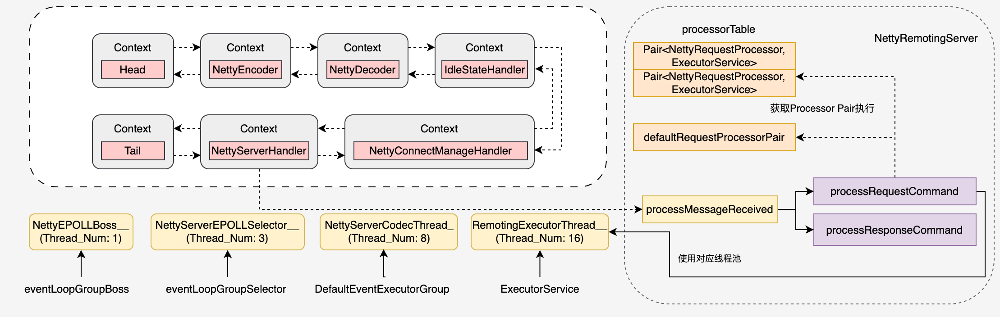

# rocketmq网络请求处理

这篇文章就来梳理一下RocketMq的网络请求流程，RocketMq底层是使用Netty来进行请求收发的，这里就不讲解Netty的使用细节了，这里提供两个资料

- RocketMq的Netty模型: https://juejin.cn/post/7103437918366089230
- Netty服务端与客户端通信代码: https://juejin.cn/post/6844904122441809934

RocketMQ中的Broker跟NameServer都要实现请求的收发，都有Netty服务器和客户端

- Netty服务器的实现在NettyRemotingServer，配置文件是NettyServerConfig
- Netty客户端的实现在NettyRemotingClient，配置文件是NettyClientConfig

## NettyServer网络请求模型



rocketmq使用四个线程池，分别进行不同的处理，线程池分别对应数字：1 + N + M1 + M2。

- 一个 Reactor 主线程（eventLoopGroupBoss，即为上面的1）负责监听 TCP 网络连接请求，建立好连接，创建SocketChannel，并注册到 selector 上。
- Metty拿到网络数据后，再丢给Worker线程池（eventLoopGroupSelector，即为上面的“N”，源码中默认设置为 3）。
- 在真正执行业务逻辑之前需要进行 SSL 验证、编解码、空闲检查、网络连接管理，这些工作交给defaultEventExecutorGroup（即为上面的“M1”，源码中默认设置为8）去做。
- 而处理业务操作放在业务线程池中执行，根据 RomotingCommand 的业务请求码 code 去processorTable 这个本地缓存变量中找到对应的 processor，然后封装成 task 任务后，提交给对应的业务 processor 处理线程池来执行（sendMessageExecutor，以发送消息为例，即为上面的 “M2”）。

注意，M2线程池不止只有一个，而是根据业务来的，rocketmq会区分不同的业务使用不同的线程池，这里只是一个示例。

## NettyServer初始化

这节简单介绍一下NettyServer是怎么启动的，以及怎么处理请求分发的，因为NettyServer的代码是共用的，Broker跟NameServer的区别只是在处理业务的逻辑不一样，这里直接以NameServer的代码举例。回到NamesrvStartup类里面的parseCommandlineAndConfigFile解析配置方法，里面代码如下所示

``` NamesrvStartup
public static void parseCommandlineAndConfigFile(String[] args) throws Exception {
  // 初始化nettyServer配置
  nettyServerConfig = new NettyServerConfig();
  nettyServerConfig.setListenPort(9876);
  // 用配置文件的配置覆盖nettyServerConfig
  MixAll.properties2Object(properties, nettyServerConfig);
}
```

我们看一下NettyServerConfig的配置属性，具体如下所示：

**网络监听相关配置**

- bindAddress: Netty服务器监听的网络地址，默认0.0.0.0
- listenPort: Netty服务器监听的具体端口，默认0, 随机分配，NameServer使用9876端口

**线程池配置**

- serverWorkerThreads: 业务线程池的线程数, 处理具体的业务逻辑(如请求解析、响应处理等), 默认为8
- serverCallbackExecutorThreads: 公共任务线程池的线程数, 即一个业务请求没有线程池处理，就会分配到这个线程池上，默认为0，即未单独配置线程池
- serverSelectorThreads: I/O线程池的线程数, 解析网络请求，并将请求转发给业务线程池处理, 默认为3
- serverNettyWorkerGroupEnable: 是否启用Netty的Worker Group(工作线程组), 默认为true

**并发度相关配置**

- serverOnewaySemaphoreValue: 限制单向消息发送的最大并发度, 默认为256
- serverAsyncSemaphoreValue: 限制异步消息发送的最大并发度, 默认为64

**网络连接相关配置**

- serverChannelMaxIdleTimeSeconds: 如果连接的空闲时间超过该值，连接会被关闭，防止资源浪费, 默认为120秒，就是IdleStateHandler的检测超时时间
- serverSocketSndBufSize: Socket发送缓冲区大小，影响数据发送性能, 读取JVM配置com.rocketmq.remoting.socket.sndbuf.size, 默认0
- serverSocketRcvBufSize: Socket接收缓冲区大小，影响数据接收性能, 读取JVM配置com.rocketmq.remoting.socket.rcvbuf.size, 默认0
- writeBufferHighWaterMark: 写缓冲区的高水位标记, 超过该值时暂停写操作，避免过度消耗内存, 读取JVM配置com.rocketmq.remoting.write.buffer.high.water.mark, 默认0
- writeBufferLowWaterMark: 写缓冲区的低水位标记，低于该值时恢复写操作，读取JVM配置com.rocketmq.remoting.write.buffer.low.water.mark，默认0
- serverSocketBacklog: 限制连接队列的大小，即未被 accept 的连接数, 读取JVM配置com.rocketmq.remoting.socket.backlog，默认1024

**缓存与内存管理**

- serverPooledByteBufAllocatorEnable: 是否开启ByteBuffer的内存池，默认为true

**优雅关闭与关闭等待**

- enableShutdownGracefully: 是否支持优雅关闭，默认为false
- shutdownWaitTimeSeconds: 在关闭过程中，最多等待完成任务的时间，默认为30秒

**高性能网络模型**

- useEpollNativeSelector: 是否启用Epoll模型，Linux环境建议使用

## NettyServer启动

在NamesrvStartup#start中会调用NamesrvStartup#initiateNetworkComponents，里面初始化nettyServer跟nettyClient

``` NamesrvStartup
private void initiateNetworkComponents() {
  this.remotingServer = new NettyRemotingServer(this.nettyServerConfig, this.brokerHousekeepingService);
  this.remotingClient = new NettyRemotingClient(this.nettyClientConfig);
}
```

可以看到就是传入了前面解析出来的nettyServerConfig配置, 这里大致给一下NettyRemotingServer的构造方法代码吧。

``` NettyRemotingServer
public NettyRemotingServer(final NettyServerConfig nettyServerConfig,
  final ChannelEventListener channelEventListener) {
  super(nettyServerConfig.getServerOnewaySemaphoreValue(), nettyServerConfig.getServerAsyncSemaphoreValue());
  this.serverBootstrap = new ServerBootstrap();
  this.nettyServerConfig = nettyServerConfig;
  this.channelEventListener = channelEventListener;

  this.publicExecutor = buildPublicExecutor(nettyServerConfig);
  this.scheduledExecutorService = buildScheduleExecutor();

  this.eventLoopGroupBoss = buildBossEventLoopGroup();
  this.eventLoopGroupSelector = buildEventLoopGroupSelector();

  loadSslContext();
}
```

在NamesrvStartup#start最终会调用controller#start方法，看看这个方法的实现

``` NamesrvController
public void start() throws Exception {
  this.remotingServer.start();
}
```

可以看到调用了remotingServer的start方法，进入这个方法里面看看

``` NettyRemotingServer
public class NettyRemotingServer extends NettyRemotingAbstract implements RemotingServer {
  @Override
  public void start() {
    this.defaultEventExecutorGroup = new DefaultEventExecutorGroup(nettyServerConfig.getServerWorkerThreads(),
            new ThreadFactoryImpl("NettyServerCodecThread_"));

    prepareSharableHandlers();

    serverBootstrap.group(this.eventLoopGroupBoss, this.eventLoopGroupSelector)
      .channel(useEpoll() ? EpollServerSocketChannel.class : NioServerSocketChannel.class)
      .option(ChannelOption.SO_BACKLOG, 1024)
      .option(ChannelOption.SO_REUSEADDR, true)
      .childOption(ChannelOption.SO_KEEPALIVE, false)
      .childOption(ChannelOption.TCP_NODELAY, true)
      .localAddress(new InetSocketAddress(this.nettyServerConfig.getBindAddress(),
              this.nettyServerConfig.getListenPort()))
      .childHandler(new ChannelInitializer<SocketChannel>() {
        @Override
        public void initChannel(SocketChannel ch) {
          // 实际处理方法
          configChannel(ch);
        }
      });

    addCustomConfig(serverBootstrap);
    ChannelFuture sync = serverBootstrap.bind().sync();
  }
}
```

好了，在这里我们就可以分析前面的那些线程池实现了。

**Reactor主线程**

跟进eventLoopGroupBoss的实现，调用了buildBossEventLoopGroup方法。

``` NettyRemotingServer
private EventLoopGroup buildBossEventLoopGroup() {
  if (useEpoll()) {
    return new EpollEventLoopGroup(1, new ThreadFactoryImpl("NettyEPOLLBoss_"));
  } else {
    return new NioEventLoopGroup(1, new ThreadFactoryImpl("NettyNIOBoss_"));
  }
}
```

可以看到初始化了只有1个线程的线程池

**Worker线程**

跟进eventLoopGroupSelector的实现，调用了buildEventLoopGroupSelector方法。
 
``` NettyRemotingServer
private EventLoopGroup buildEventLoopGroupSelector() {
  if (useEpoll()) {
    return new EpollEventLoopGroup(nettyServerConfig.getServerSelectorThreads(), new ThreadFactoryImpl("NettyServerEPOLLSelector_"));
  } else {
    return new NioEventLoopGroup(nettyServerConfig.getServerSelectorThreads(), new ThreadFactoryImpl("NettyServerNIOSelector_"));
  }
}
```

可以看到这个线程池的线程个数就是上面nettyServerConfig里的serverSelectorThreads

继续跟进具体的请求处理方法configChannel，代码如下所示

``` NettyRemotingServer
protected ChannelPipeline configChannel(SocketChannel ch) {
  return ch.pipeline()
    .addLast(nettyServerConfig.isServerNettyWorkerGroupEnable() ? defaultEventExecutorGroup : null,
            HANDSHAKE_HANDLER_NAME, new HandshakeHandler())
    .addLast(nettyServerConfig.isServerNettyWorkerGroupEnable() ? defaultEventExecutorGroup : null,
            encoder,
            new NettyDecoder(),
            distributionHandler,
            new IdleStateHandler(0, 0,
                    nettyServerConfig.getServerChannelMaxIdleTimeSeconds()),
            connectionManageHandler,
            serverHandler
    );
}
```

**工作组线程**

如果启用了serverNettyWorkerGroupEnable，那么将会用defaultEventExecutorGroup来处理握手操作和解析请求，跟进defaultEventExecutorGroup的实现，就在NettyRemotingServer#start方法里面。

``` NettyRemotingServer
@Override
public void start() {
  this.defaultEventExecutorGroup = new DefaultEventExecutorGroup(nettyServerConfig.getServerWorkerThreads(),
    new ThreadFactoryImpl("NettyServerCodecThread_"));
}
```

可以看到初始化了一个线程池，线程个数就是nettyServerConfig的serverWorkerThreads个数

## NettyServer处理请求

接下来进入Netty处理请求的核心Handler，即serverHandler, 看一下做了什么。

```
@ChannelHandler.Sharable
public class NettyServerHandler extends SimpleChannelInboundHandler<RemotingCommand> {
  @Override
  protected void channelRead0(ChannelHandlerContext ctx, RemotingCommand msg) {
    int localPort = RemotingHelper.parseSocketAddressPort(ctx.channel().localAddress());
    NettyRemotingAbstract remotingAbstract = NettyRemotingServer.this.remotingServerTable.get(localPort);
    if (localPort != -1 && remotingAbstract != null) {
      # 主要调用了这个方法
      remotingAbstract.processMessageReceived(ctx, msg);
      return;
    }
    // The related remoting server has been shutdown, so close the connected channel
    RemotingHelper.closeChannel(ctx.channel());
  } 
}
```

进入remotingAbstract#processMessageReceived方法，代码如下

``` NettyRemotingAbstract
public void processMessageReceived(ChannelHandlerContext ctx, RemotingCommand msg) {
  if (msg != null) {
    switch (msg.getType()) {
      case REQUEST_COMMAND:
        processRequestCommand(ctx, msg);
        break;
      case RESPONSE_COMMAND:
        processResponseCommand(ctx, msg);
        break;
      default:
        break;
    }
  }
}
```

由于现在是处理请求，所以会调用processRequestCommand方法，进入这个方法:

``` NettyRemotingAbstract
public void processRequestCommand(final ChannelHandlerContext ctx, final RemotingCommand cmd) {
  // 先从processorTable中获取对应的处理函数
  final Pair<NettyRequestProcessor, ExecutorService> matched = this.processorTable.get(cmd.getCode());
  // 如果processorTable中没有，那么就从defaultRequestProcessorPair中获取
  final Pair<NettyRequestProcessor, ExecutorService> pair = null == matched ? this.defaultRequestProcessorPair : matched;
  Runnable run = buildProcessRequestHandler(ctx, cmd, pair, opaque);
  final RequestTask requestTask = new RequestTask(run, ctx.channel(), cmd);
  //async execute task, current thread return directly
  pair.getObject2().submit(requestTask);
}
```

接下来看看processorTable跟defaultRequestProcessorPair都是什么，有什么内容。

``` NettyRemotingAbstract
protected final HashMap<Integer/* request code */, Pair<NettyRequestProcessor, ExecutorService>> processorTable =
  new HashMap<>(64);
protected Pair<NettyRequestProcessor, ExecutorService> defaultRequestProcessorPair;
```

接下来看一下是在哪里往这两个属性里面放入对象的，具体实现是在NettyRemotingServer这个类中，

``` NettyRemotingServer
@Override
public void registerProcessor(int requestCode, NettyRequestProcessor processor, ExecutorService executor) {
  ExecutorService executorThis = executor;
  if (null == executor) {
    executorThis = this.publicExecutor;
  }

  Pair<NettyRequestProcessor, ExecutorService> pair = new Pair<>(processor, executorThis);
  this.processorTable.put(requestCode, pair);
}

@Override
public void registerDefaultProcessor(NettyRequestProcessor processor, ExecutorService executor) {
  this.defaultRequestProcessorPair = new Pair<>(processor, executor);
}
```

**业务线程池**

具体NameServer是在哪里注册processor的呢，回看NameSrvController#registerProcessor方法

``` NameSrvController
private void registerProcessor() {
  if (namesrvConfig.isClusterTest()) {

    this.remotingServer.registerDefaultProcessor(new ClusterTestRequestProcessor(this, namesrvConfig.getProductEnvName()), this.defaultExecutor);
  } else {
    // Support get route info only temporarily
    ClientRequestProcessor clientRequestProcessor = new ClientRequestProcessor(this);
    this.remotingServer.registerProcessor(RequestCode.GET_ROUTEINFO_BY_TOPIC, clientRequestProcessor, this.clientRequestExecutor);
    this.remotingServer.registerDefaultProcessor(new DefaultRequestProcessor(this), this.defaultExecutor);
  }
}
```

好了，看看这连个线程池的声明。

``` NamesrvController
private void initiateThreadExecutors() {
  this.defaultThreadPoolQueue = new LinkedBlockingQueue<>(this.namesrvConfig.getDefaultThreadPoolQueueCapacity());
  this.defaultExecutor = ThreadUtils.newThreadPoolExecutor(this.namesrvConfig.getDefaultThreadPoolNums(), this.namesrvConfig.getDefaultThreadPoolNums(), 1000 * 60, TimeUnit.MILLISECONDS, this.defaultThreadPoolQueue, new ThreadFactoryImpl("RemotingExecutorThread_"));

  this.clientRequestThreadPoolQueue = new LinkedBlockingQueue<>(this.namesrvConfig.getClientRequestThreadPoolQueueCapacity());
  this.clientRequestExecutor = ThreadUtils.newThreadPoolExecutor(this.namesrvConfig.getClientRequestThreadPoolNums(), this.namesrvConfig.getClientRequestThreadPoolNums(), 1000 * 60, TimeUnit.MILLISECONDS, this.clientRequestThreadPoolQueue, new ThreadFactoryImpl("ClientRequestExecutorThread_"));
}
```

由于业务处理是具体的项目实现的，所以对应的线程也由对应的项目来创建，这两个线程池的参数定义可以回看《NameServer初始化流程与路由机制》章节

具体的请求处理方法，只要看ClientRequestProcessor跟DefaultRequestProcessor的实现就好了。看registerProcessor的实现，很明显前端发送GET_ROUTEINFO_BY_TOPIC请求的时候就是clientRequestProcessor做处理的，其他的是DefaultRequestProcessor做处理的


## NettyClient初始化

NettyClient的初始化跟NettyServer的初始化是同一个地方，所以我们直接看NettyClient都有哪些配置吧。

**客户端线程池和资源配置**

- clientWorkerThreads: 客户端的工作线程池线程数，主要负责处理 I/O 操作和业务逻辑的调度, 默认值NettySystemConfig.clientWorkerSize(4)
- clientCallbackExecutorThreads: 客户端回调线程池线程数，用于处理异步回调任务, 默认值CPU核心线程数(Runtime.getRuntime().availableProcessors())
- disableCallbackExecutor: 是否禁用回调线程池，如果启用，回调操作可能直接在 I/O 线程中执行
- clientOnewaySemaphoreValue: 限制客户端可以同时发送的单向消息数量, 默认值NettySystemConfig.CLIENT_ONEWAY_SEMAPHORE_VALUE(65535)
- clientAsyncSemaphoreValue: 限制客户端可以同时发送的异步消息数量, 默认值COM_ROCKETMQ_REMOTING_CLIENT_ASYNC_SEMAPHORE_VALUE(65535)

**超时和连接管理**

- connectTimeoutMillis: 客户端与服务端建立连接的超时时间, 默认值COM_ROCKETMQ_REMOTING_CLIENT_CONNECT_TIMEOUT(3秒)
- channelNotActiveInterval: 定期检查通道是否活跃，便于及时清理无效连接，默认值1000*60(1分钟)
- clientChannelMaxIdleTimeSeconds: 客户端通道的最大空闲时间（秒），超过此时间将触发IdleStateEvent, 默认值NettySystemConfig.clientChannelMaxIdleTimeSeconds（120秒）
- clientCloseSocketIfTimeout: 在连接超时时是否主动关闭套接字, 提高资源回收效率，避免死连接, 默认值NettySystemConfig.clientCloseSocketIfTimeout(true)

**缓冲区与内存管理**

- clientSocketSndBufSize和clientSocketRcvBufSize: 客户端套接字的发送和接收缓冲区大小
- clientPooledByteBufAllocatorEnable: 是否启用ByteBuffer池化, 默认为false
- writeBufferHighWaterMark 和 writeBufferLowWaterMark: 写缓冲区的高水位和低水位阈值

**其他配置**

- isScanAvailableNameSrv: 如果启用，客户端会定期刷新和检查 NameServer 的可用性, 默认为true
- useTLS: 是否启用TLS加密通信
- socksProxyConfig: 配置了代理，客户端会通过代理发送请求
- maxReconnectIntervalTimeSeconds, 客户端重来的最大时间间隔，默认60秒
- maxReconnectIntervalTimeSeconds: 当服务器发送GOAWAY信息是，是否允许重连, 默认为true
- enableTransparentRetry 是否启用透明重传，传输失败时，自动尝试发送请求，默认为true

## NettyClient启动

我们直接看NettyRemotingClient#start方法吧。

```NettyRemotingClient
@Override
public void start() {
  if (this.defaultEventExecutorGroup == null) {
      this.defaultEventExecutorGroup = new DefaultEventExecutorGroup(
          nettyClientConfig.getClientWorkerThreads(),
          new ThreadFactoryImpl("NettyClientWorkerThread_"));
  }
  Bootstrap handler = this.bootstrap.group(this.eventLoopGroupWorker).channel(NioSocketChannel.class)
    .option(ChannelOption.TCP_NODELAY, true)
    .option(ChannelOption.SO_KEEPALIVE, false)
    .option(ChannelOption.CONNECT_TIMEOUT_MILLIS, nettyClientConfig.getConnectTimeoutMillis())
    .handler(new ChannelInitializer<SocketChannel>() {
        @Override
        public void initChannel(SocketChannel ch) throws Exception {
            ChannelPipeline pipeline = ch.pipeline();
            if (nettyClientConfig.isUseTLS()) {
                if (null != sslContext) {
                    pipeline.addFirst(defaultEventExecutorGroup, "sslHandler", sslContext.newHandler(ch.alloc()));
                    LOGGER.info("Prepend SSL handler");
                } else {
                    LOGGER.warn("Connections are insecure as SSLContext is null!");
                }
            }
            ch.pipeline().addLast(
                nettyClientConfig.isDisableNettyWorkerGroup() ? null : defaultEventExecutorGroup,
                new NettyEncoder(),
                new NettyDecoder(),
                new IdleStateHandler(0, 0, nettyClientConfig.getClientChannelMaxIdleTimeSeconds()),
                new NettyConnectManageHandler(),
                new NettyClientHandler());
        }
  });

  // 定时扫描ResponseTable，清除没有用的请求
  TimerTask timerTaskScanResponseTable = new TimerTask() {
    @Override
    public void run(Timeout timeout) {
      NettyRemotingClient.this.scanResponseTable();
      timer.newTimeout(this, 1000, TimeUnit.MILLISECONDS);
    }
  };
  this.timer.newTimeout(timerTaskScanResponseTable, 1000 * 3, TimeUnit.MILLISECONDS);

  // 定时扫描可用的NameSrv
  if (nettyClientConfig.isScanAvailableNameSrv()) {
      int connectTimeoutMillis = this.nettyClientConfig.getConnectTimeoutMillis();
      TimerTask timerTaskScanAvailableNameSrv = new TimerTask() {
          @Override
          public void run(Timeout timeout) {
            NettyRemotingClient.this.scanAvailableNameSrv();
            timer.newTimeout(this, connectTimeoutMillis, TimeUnit.MILLISECONDS);
      };
      this.timer.newTimeout(timerTaskScanAvailableNameSrv, 0, TimeUnit.MILLISECONDS);
  }
}
```

### NettyClient发送请求

直接跟进NettyRemotingClient#invokeSync -> invokeSyncImpl -> invokeSyncImpl -> invoke0 -> channel.writeAndFlush(request)流程，这条流程不复杂，下节课讲消息发送的时候再讲吧。

这里主要讲一下channel的连接建立。

``` NettyRemotingClient
@Override
public RemotingCommand invokeSync(String addr, final RemotingCommand request, long timeoutMillis) {
  final Channel channel = this.getAndCreateChannel(addr);
}
```

调用路径为: getAndCreateChannel -> getAndCreateChannelAsync -> createChannelAsync -> createChannel, 看看createChannel的实现

``` NettyRemotingClient
private ChannelWrapper createChannel(String addr) {
    String[] hostAndPort = getHostAndPort(addr);
    // 建立连接
    ChannelFuture channelFuture = fetchBootstrap(addr)
        .connect(hostAndPort[0], Integer.parseInt(hostAndPort[1]));
    LOGGER.info("createChannel: begin to connect remote host[{}] asynchronously", addr);
    // 封装ChannelWrapper
    ChannelWrapper cw = new ChannelWrapper(addr, channelFuture);
    this.channelTables.put(addr, cw);
    this.channelWrapperTables.put(channelFuture.channel(), cw);
    return cw;
}
```


## 补充

NameServer的业务请求入口代码是这两个

``` NameSrvController
private void registerProcessor() {
  // GET_ROUTEINFO_BY_TOPIC请求由clientRequestProcessor处理
  this.remotingServer.registerProcessor(RequestCode.GET_ROUTEINFO_BY_TOPIC, clientRequestProcessor, this.clientRequestExecutor);
  // 其它请求由DefaultRequestProcessor处理
  this.remotingServer.registerDefaultProcessor(new DefaultRequestProcessor(this), this.defaultExecutor);
}
```

Broker的业务处理入口代码是这个

``` BrokerController
public void registerProcessor() {
    /*
      * SendMessageProcessor
      */
    sendMessageProcessor.registerSendMessageHook(sendMessageHookList);
    sendMessageProcessor.registerConsumeMessageHook(consumeMessageHookList);

    this.remotingServer.registerProcessor(RequestCode.SEND_MESSAGE, sendMessageProcessor, this.sendMessageExecutor);
    this.remotingServer.registerProcessor(RequestCode.SEND_MESSAGE_V2, sendMessageProcessor, this.sendMessageExecutor);
    this.remotingServer.registerProcessor(RequestCode.SEND_BATCH_MESSAGE, sendMessageProcessor, this.sendMessageExecutor);
    this.remotingServer.registerProcessor(RequestCode.CONSUMER_SEND_MSG_BACK, sendMessageProcessor, this.sendMessageExecutor);
    this.fastRemotingServer.registerProcessor(RequestCode.SEND_MESSAGE, sendMessageProcessor, this.sendMessageExecutor);
    this.fastRemotingServer.registerProcessor(RequestCode.SEND_MESSAGE_V2, sendMessageProcessor, this.sendMessageExecutor);
    this.fastRemotingServer.registerProcessor(RequestCode.SEND_BATCH_MESSAGE, sendMessageProcessor, this.sendMessageExecutor);
    this.fastRemotingServer.registerProcessor(RequestCode.CONSUMER_SEND_MSG_BACK, sendMessageProcessor, this.sendMessageExecutor);
    /**
      * PullMessageProcessor
      */
    this.remotingServer.registerProcessor(RequestCode.PULL_MESSAGE, this.pullMessageProcessor, this.pullMessageExecutor);
    this.remotingServer.registerProcessor(RequestCode.LITE_PULL_MESSAGE, this.pullMessageProcessor, this.litePullMessageExecutor);
    this.pullMessageProcessor.registerConsumeMessageHook(consumeMessageHookList);
    /**
      * PeekMessageProcessor
      */
    this.remotingServer.registerProcessor(RequestCode.PEEK_MESSAGE, this.peekMessageProcessor, this.pullMessageExecutor);
    /**
      * PopMessageProcessor
      */
    this.remotingServer.registerProcessor(RequestCode.POP_MESSAGE, this.popMessageProcessor, this.pullMessageExecutor);

    /**
      * AckMessageProcessor
      */
    this.remotingServer.registerProcessor(RequestCode.ACK_MESSAGE, this.ackMessageProcessor, this.ackMessageExecutor);
    this.fastRemotingServer.registerProcessor(RequestCode.ACK_MESSAGE, this.ackMessageProcessor, this.ackMessageExecutor);

    this.remotingServer.registerProcessor(RequestCode.BATCH_ACK_MESSAGE, this.ackMessageProcessor, this.ackMessageExecutor);
    this.fastRemotingServer.registerProcessor(RequestCode.BATCH_ACK_MESSAGE, this.ackMessageProcessor, this.ackMessageExecutor);
    /**
      * ChangeInvisibleTimeProcessor
      */
    this.remotingServer.registerProcessor(RequestCode.CHANGE_MESSAGE_INVISIBLETIME, this.changeInvisibleTimeProcessor, this.ackMessageExecutor);
    this.fastRemotingServer.registerProcessor(RequestCode.CHANGE_MESSAGE_INVISIBLETIME, this.changeInvisibleTimeProcessor, this.ackMessageExecutor);
    /**
      * notificationProcessor
      */
    this.remotingServer.registerProcessor(RequestCode.NOTIFICATION, this.notificationProcessor, this.pullMessageExecutor);

    /**
      * pollingInfoProcessor
      */
    this.remotingServer.registerProcessor(RequestCode.POLLING_INFO, this.pollingInfoProcessor, this.pullMessageExecutor);

    /**
      * ReplyMessageProcessor
      */

    replyMessageProcessor.registerSendMessageHook(sendMessageHookList);

    this.remotingServer.registerProcessor(RequestCode.SEND_REPLY_MESSAGE, replyMessageProcessor, replyMessageExecutor);
    this.remotingServer.registerProcessor(RequestCode.SEND_REPLY_MESSAGE_V2, replyMessageProcessor, replyMessageExecutor);
    this.fastRemotingServer.registerProcessor(RequestCode.SEND_REPLY_MESSAGE, replyMessageProcessor, replyMessageExecutor);
    this.fastRemotingServer.registerProcessor(RequestCode.SEND_REPLY_MESSAGE_V2, replyMessageProcessor, replyMessageExecutor);

    /**
      * QueryMessageProcessor
      */
    NettyRequestProcessor queryProcessor = new QueryMessageProcessor(this);
    this.remotingServer.registerProcessor(RequestCode.QUERY_MESSAGE, queryProcessor, this.queryMessageExecutor);
    this.remotingServer.registerProcessor(RequestCode.VIEW_MESSAGE_BY_ID, queryProcessor, this.queryMessageExecutor);

    this.fastRemotingServer.registerProcessor(RequestCode.QUERY_MESSAGE, queryProcessor, this.queryMessageExecutor);
    this.fastRemotingServer.registerProcessor(RequestCode.VIEW_MESSAGE_BY_ID, queryProcessor, this.queryMessageExecutor);

    /**
      * ClientManageProcessor
      */
    this.remotingServer.registerProcessor(RequestCode.HEART_BEAT, clientManageProcessor, this.heartbeatExecutor);
    this.remotingServer.registerProcessor(RequestCode.UNREGISTER_CLIENT, clientManageProcessor, this.clientManageExecutor);
    this.remotingServer.registerProcessor(RequestCode.CHECK_CLIENT_CONFIG, clientManageProcessor, this.clientManageExecutor);

    this.fastRemotingServer.registerProcessor(RequestCode.HEART_BEAT, clientManageProcessor, this.heartbeatExecutor);
    this.fastRemotingServer.registerProcessor(RequestCode.UNREGISTER_CLIENT, clientManageProcessor, this.clientManageExecutor);
    this.fastRemotingServer.registerProcessor(RequestCode.CHECK_CLIENT_CONFIG, clientManageProcessor, this.clientManageExecutor);

    /**
      * ConsumerManageProcessor
      */
    ConsumerManageProcessor consumerManageProcessor = new ConsumerManageProcessor(this);
    this.remotingServer.registerProcessor(RequestCode.GET_CONSUMER_LIST_BY_GROUP, consumerManageProcessor, this.consumerManageExecutor);
    this.remotingServer.registerProcessor(RequestCode.UPDATE_CONSUMER_OFFSET, consumerManageProcessor, this.consumerManageExecutor);
    this.remotingServer.registerProcessor(RequestCode.QUERY_CONSUMER_OFFSET, consumerManageProcessor, this.consumerManageExecutor);

    this.fastRemotingServer.registerProcessor(RequestCode.GET_CONSUMER_LIST_BY_GROUP, consumerManageProcessor, this.consumerManageExecutor);
    this.fastRemotingServer.registerProcessor(RequestCode.UPDATE_CONSUMER_OFFSET, consumerManageProcessor, this.consumerManageExecutor);
    this.fastRemotingServer.registerProcessor(RequestCode.QUERY_CONSUMER_OFFSET, consumerManageProcessor, this.consumerManageExecutor);

    /**
      * QueryAssignmentProcessor
      */
    this.remotingServer.registerProcessor(RequestCode.QUERY_ASSIGNMENT, queryAssignmentProcessor, loadBalanceExecutor);
    this.fastRemotingServer.registerProcessor(RequestCode.QUERY_ASSIGNMENT, queryAssignmentProcessor, loadBalanceExecutor);
    this.remotingServer.registerProcessor(RequestCode.SET_MESSAGE_REQUEST_MODE, queryAssignmentProcessor, loadBalanceExecutor);
    this.fastRemotingServer.registerProcessor(RequestCode.SET_MESSAGE_REQUEST_MODE, queryAssignmentProcessor, loadBalanceExecutor);

    /**
      * EndTransactionProcessor
      */
    this.remotingServer.registerProcessor(RequestCode.END_TRANSACTION, endTransactionProcessor, this.endTransactionExecutor);
    this.fastRemotingServer.registerProcessor(RequestCode.END_TRANSACTION, endTransactionProcessor, this.endTransactionExecutor);

    /*
      * Default
      */
    AdminBrokerProcessor adminProcessor = new AdminBrokerProcessor(this);
    this.remotingServer.registerDefaultProcessor(adminProcessor, this.adminBrokerExecutor);
    this.fastRemotingServer.registerDefaultProcessor(adminProcessor, this.adminBrokerExecutor);

    /*
      * Initialize the mapping of request codes to request headers.
      */
    RequestHeaderRegistry.getInstance().initialize();
}
```

可以看到Broker有很多，后面可能会讲到这些请求的处理。