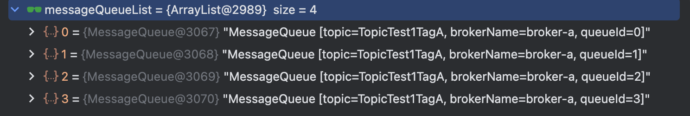

# 生产者启动和消息发送流程

本章节主要介绍Rocketmq中Producer的启动流程以及消息发送的流程。

## 消息发送方式

RocketMQ支持3种消息发送方式：同步(sync), 异步(async), 单向(oneway)。

- 同步: 发送者向MQ发送消息时，同步等待，直到消息服务器返回发送结果

```
Message<String> msg = MessageBuilder.withPayload("Hello,RocketMQ").build();
rocketmqTemplate.convertAndSend("Hello", msg);
```

- 异步: 发送者向MQ发送消息时，指定消息发送成功后的回调函数，然后调用消息发送API之后，立即返回，消息发送者线程不阻塞，直到消息发送成功或者发送失败的回调任务在一个新的线程中执行

```
Message<String> msg = MessageBuilder.withPayload("Hello,RocketMQ oneway").build();
rocketmqTemplate.asyncSend("Hello", msg, new SendCallback() {
  @Override
  public void onSuccess(SendResult sendResult) {
    System.out.println(sendResult);
  }

  @Override
  public void onException(Throwable e) {
    System.out.println(e.getMessage());
  }
});
```

- 单向: 发送者只管向MQ发送消息，直接返回，不在乎消息是否成功在消息服务器上存储

```
Message<String> msg = MessageBuilder.withPayload("Hello,RocketMQ oneway").build();
rocketmqTemplate.sendOneWay("Hello", msg);
```

::: warning
上面代码中的Message跟Producer里面的Message不是同一个类，rocketmq-spring-boot-starter重新定义了一个Message，并且会在实际发送的时候转化为Producer内部的Message类, 这篇文章不分析这个
:::

## Producer发送消息Demo

下面我们看一个Rocketmq原生的Producer发送消息的案例，可以参考这个类org.apache.rocketmq.example.quickstart.Producer, 代码有删减

``` Producer{9,12,15}
public class Producer {
  public static final String PRODUCER_GROUP = "please_rename_unique_group_name";
  public static final String DEFAULT_NAMESRVADDR = "127.0.0.1:9876";
  public static final String TOPIC = "TopicTest";
  public static final String TAG = "TagA";

  public static void main(String[] args) throws MQClientException, InterruptedException {
    // 初始化Producer
    DefaultMQProducer producer = new DefaultMQProducer(PRODUCER_GROUP); 
    producer.setNamesrvAddr(DEFAULT_NAMESRVADDR);
    // 启动Producer
    producer.start();
    Message msg = new Message(TOPIC, TAG, ("Hello RocketMQ " + i).getBytes(RemotingHelper.DEFAULT_CHARSET));
    // 发送消息
    SendResult sendResult = producer.send(msg, 20 * 1000)
  }
}
```

## Producer初始化

可以看到上面第9行新建了一个DefaultMQProducer对象，那么我们就来看看这个类做了什么。

### DefaultMQProducer

``` DefaultMQProducer
public DefaultMQProducer(final String producerGroup, RPCHook rpcHook, final List<String> topics,
    boolean enableMsgTrace, final String customizedTraceTopic) {
    this.producerGroup = producerGroup;
    this.rpcHook = rpcHook;
    this.topics = topics;
    this.enableTrace = enableMsgTrace;
    this.traceTopic = customizedTraceTopic;
    defaultMQProducerImpl = new DefaultMQProducerImpl(this, rpcHook);
    produceAccumulator = MQClientManager.getInstance().getOrCreateProduceAccumulator(this);
}
```

可以看到就是赋值了producerGroup, rpcHook，topics这些属性，然后初始化了一个DefaultMQProducerImpl对象，这个对象看名字就知道是具体的实现类了。

### DefaultMQProducer核心属性

我们看看DefaultMQProducer这个类有什么可以配置的, 这里说明一下。

**主题队列**
- **producerGroup**: 生产者组的名字，Broker在回查事务消息的时候会随机选择生产者组当中的任何一个生产者发起事务回查请求
- topics: 指定事务生产者需要初始化的主题
- createTopicKey: 用于测试Demo，在测试或者演示程序中自动创建主题的关键字，默认为AUTO_CREATE_TOPIC_KEY_TOPIC(TBW102)
- **defaultTopicQueueNums**: 创建每个默认主题中的队列数量, 默认为4

**消息发送**
- **sendMsgTimeout**: 消息发送的超时时间，默认3秒
- **compressMsgBodyOverHowmuch**: 消息体超过此阈值就会进行压缩，默认1024 * 4(4K)
- **retryTimesWhenSendFailed**: 同步模式下发送失败的最大重试次数, 默认为2
- **retryTimesWhenSendAsyncFailed**: 异步模式下发送失败时的最大重试次数，默认为2
- **retryAnotherBrokerWhenNotStoreOK**: 消息未成功存储时是否尝试其他Broker，默认为false
- **maxMessageSize**: 消息体的最大允许大小，默认为1024 * 1024 * 4(4MB)

**异步发送控制**
- traceDispatcher: 异步传输的接口，默认为null
- autoBatch: 是否开启自动批量发送消息的开关
- produceAccumulator: 自动批量发送消息的累积器实例
- enableBackpressureForAsyncMode: 是否在异步发送流量过大时启用阻塞机制, 默认false
- backPressureForAsyncSendNum: 异步发送时最大允许的正在发送的消息数量，默认10000
- backPressureForAsyncSendSize: 异步发送时最大允许的正在发送的消息总大小, 默认100 * 1024 * 1024(100MB)
- **rpcHook**: RPC 调用的钩子接口，用于处理调用前后的自定义逻辑
- backPressureForAsyncSendNumLock: 确保backPressureForAsyncSendNum属性在运行时修改时是线程安全的
- backPressureForAsyncSendSizeLock: 确保 backPressureForAsyncSendSize 属性在运行时修改时是线程安全的

**压缩算法**

- **compressLevel**: 压缩算法的压缩级别, 默认为5
- compressType: 压缩算法的类型，默认为ZLIB
- compressor: 压缩算法的具体实现，由compressType决定

### ClientConfig客户端配置

由于DefaultMQProducer继承了ClientConfig这个类，可以看一下ClientConfig的属性都有什么，主要是用来管理客户端与RocketMQ集群之间的各种功能配置的。

**网络配置**

- namesrvAddr: 指定NameServer的地址列表，用于客户端连接和获取主题路由信息，默认值NameServerAddressUtils.getNameServerAddresses()
- clientIP: 客户端本机的IP地址, 默认值NetworkUtil.getLocalAddress()
- instanceName: 用于标识客户端实例的名称，最后有唯一性，默认值System.getProperty("rocketmq.client.name", "DEFAULT")
- accessChannel: 指定访问渠道，主要区分本地部署和云服务
- socksProxyConfig: 配置SOCKS代理，用于跨网络访问

**线程和性能配置**

- clientCallbackExecutorThreads: 回调线程池的线程数，用于处理异步操作的回调任务, 默认与CPU核心数一致
- pollNameServerInterval: 定期从 NameServer 拉取路由信息的间隔时间, 默认30S
- heartbeatBrokerInterval: 与Broker之间发送心跳包的间隔时间, 用于维持连接，通知Broker客户端的存活状态, 默认30秒
- persistConsumerOffsetInterval: 消费者定期持久化消费进度的时间间隔, 防止因异常导致消费进度丢失, 默认5秒
- pullTimeDelayMillsWhenException: 在拉取消息发生异常时，延迟下一次拉取的时间

**功能开关和行为控制**

- enableTrace: 开启后，可以记录消息的流转过程，用于监控和问题排查, 默认为false
- traceTopic: 指定消息追踪的主题名。如果未设置，将使用默认的追踪主题
- decodeReadBody: 指定是否解码读取的消息体, 默认值System.getProperty(DECODE_READ_BODY, "true")
- decodeDecompressBody: 当消息被压缩时，该选项决定是否在客户端进行解压, 默认值System.getProperty(DECODE_DECOMPRESS_BODY, "true")
- vipChannelEnabled: VIP 通道是 RocketMQ 的一种优化机制，通过专用端口提高性能, System.getProperty(SEND_MESSAGE_WITH_VIP_CHANNEL_PROPERTY, "false")
- useTLS: 是否启用TLS加密，默认为false
- unitMode和unitName: 支持多租户的功能
- enableStreamRequestType: 是否启用流式请求类型, 默认为false
- sendLatencyEnable: 是否开启发送延迟容错机制, 不要在顺序消息（Order Message）场景下开启，否则可能破坏顺序性, 默认为false
- enableHeartbeatChannelEventListener: 在心跳检测失败时触发事件处理逻辑, 默认值为true
- startDetectorEnable: 开启后，在客户端启动时进行一系列检测，如网络连接和配置验证, 默认为false

**超时和检测相关**

- mqClientApiTimeout: 指定客户端API调用的超时时间, 默认3秒
- detectTimeout: 检测操作的超时时间，通常用于快速检查机制，默认200毫秒
- detectInterval: 检测操作的间隔时间，默认2*1000(2秒)

**语言和环境**

- language: 指定客户端使用的编程语言, 主要用于服务端统计和标识客户端来源, 默认值JAVA

::: warning
可以看出来ClientConfig是生产者跟消费者都要用到的
:::

### DefaultMQProducerImpl

```
public DefaultMQProducerImpl(final DefaultMQProducer defaultMQProducer, RPCHook rpcHook) {
  this.defaultMQProducer = defaultMQProducer;
  this.rpcHook = rpcHook;
  // 初始化异步发送线程池
  this.asyncSenderThreadPoolQueue = new LinkedBlockingQueue<>(50000);
  this.defaultAsyncSenderExecutor = new ThreadPoolExecutor(Runtime.getRuntime().availableProcessors(), Runtime.getRuntime().availableProcessors(),1000 * 60,TimeUnit.MILLISECONDS,this.asyncSenderThreadPoolQueue,new ThreadFactoryImpl("AsyncSenderExecutor_"));
  semaphoreAsyncSendNum = new Semaphore(Math.max(defaultMQProducer.getBackPressureForAsyncSendNum(), 10), true);
  semaphoreAsyncSendSize = new Semaphore(Math.max(defaultMQProducer.getBackPressureForAsyncSendSize(), 1024 * 1024), true);
  ServiceDetector serviceDetector = new ServiceDetector() {
      @Override
      public boolean detect(String endpoint, long timeoutMillis) {
        MessageQueue mq = new MessageQueue(candidateTopic.get(), null, 0);
        mQClientFactory.getMQClientAPIImpl().getMaxOffset(endpoint, mq, timeoutMillis);
        return true;
      }
  };
  this.mqFaultStrategy = new MQFaultStrategy(defaultMQProducer.cloneClientConfig(), new Resolver() {
      @Override
      public String resolve(String name) {
          return DefaultMQProducerImpl.this.mQClientFactory.findBrokerAddressInPublish(name);
      }
  }, serviceDetector);
}
```

### DefaultMQProducerImpl核心属性

我们看看DefaultMQProducerImpl这个类有什么属性, 这里说明一下。

**消息发布管理**

- topicPublishInfoTable: 用于存储主题与其发布信息之间的关系, TopicPublishInfo包含了与主题相关的路由和消息发布信息

**钩子扩展相关**
- sendMessageHookList: 存储发送消息的钩子列表，用于在消息发送之前或之后执行一些自定义逻辑。
- endTransactionHookList: 存储事务结束的钩子列表, 用于在事务消息提交或回滚后执行额外的逻辑
- rpcHook: 用于在 RPC 调用之前和之后执行自定义逻辑, 常用于处理认证、日志记录或其他与 RPC 相关的操作
- checkForbiddenHookList: 存储检查是否禁止某些操作的钩子列表,在执行操作之前进行权限或逻辑验证

**异步发送相关**

- asyncSenderThreadPoolQueue: 异步消息发送线程池的任务队列, 默认队列大小50000
- defaultAsyncSenderExecutor: 默认的异步消息发送线程池, 默认最大线程数跟最小线程数都是CPU核数
- asyncSenderExecutor: 异步消息发送线程池的实现，自定义自己的异步发送队列线程池
- semaphoreAsyncSendNum: 限制异步发送消息时的最大并发消息数量
- semaphoreAsyncSendSize: 限制异步发送消息时的最大消息大小总量

**事务消息相关**
- endTransactionHookList: 存储事务结束的钩子列表, 用于在事务消息提交或回滚后执行额外的逻辑
- checkRequestQueue: 用于存储校验任务（如事务校验）的任务队列, 默认大小3000
- checkExecutor: 执行校验任务（如事务检查）的线程池， 默认最大线程数跟最小线程数都是1

**容错策略相关**

- mqFaultStrategy: 消息队列的容错策略, 用于处理在Broker不可用或其他故障情况下的消息发送策略选择


## Producer启动

接下来我们看一下Producer发送消息Demo中第12行代码生产者的启动流程，具体为DefaultMQProducer#start方法。

``` DefaultMQProducer{4,6,18}
@Override 
public void start() throws MQClientException {
  this.setProducerGroup(withNamespace(this.producerGroup));
  this.defaultMQProducerImpl.start();
  if (this.produceAccumulator != null) {
    this.produceAccumulator.start();
  }
  if (enableTrace) {
    AsyncTraceDispatcher dispatcher = new AsyncTraceDispatcher(producerGroup, TraceDispatcher.Type.PRODUCE, getTraceMsgBatchNum(), traceTopic, rpcHook);
    traceDispatcher = dispatcher;
    this.defaultMQProducerImpl.registerSendMessageHook(
            new SendMessageTraceHookImpl(traceDispatcher));
    this.defaultMQProducerImpl.registerEndTransactionHook(
            new EndTransactionTraceHookImpl(traceDispatcher));
  }
  if (null != traceDispatcher) {
    ((AsyncTraceDispatcher) traceDispatcher).getTraceProducer().setUseTLS(isUseTLS());
    traceDispatcher.start(this.getNamesrvAddr(), this.getAccessChannel());
  }
}
```

可以看到核心做了三件事，具体如下

- 调用defaultMQProducerImpl的start方法
- 如果启用监控功能，就注册两个钩子，分别在消息发送跟事务消息结束的时候调用钩子将消息放到traceDispatcher里面
- 启用traceDispatcher的start方法，启用traceDispatcher

traceDispatcher是一种异步追踪分发器，用于处理消息追踪 (Message Trace) 的功能, 点击[这里](https://www.jianshu.com/p/c722cbfe96d9)

- 当消息生产者生产消息时，AsyncTraceDispatcher 会捕获相关的追踪数据（例如消息的唯一 ID、发送时间、目标队列等）
- 收集到的追踪数据会被异步发送到**traceTopic**，这样可以减少对正常业务逻辑的干扰
- 消息追踪数据存储在traceTopic后，可以通过专门的分析工具进行消费和分析，方便排查问题或监控性能。

### defaultMQProducerImpl#start

接下来看看defaultMQProducerImpl#start这个方法做的事情。

```
// 检查producerGroup是否合法
this.checkConfig();
// 修改生产者的InstanceNameToPID
if (!this.defaultMQProducer.getProducerGroup().equals(MixAll.CLIENT_INNER_PRODUCER_GROUP)) {
  this.defaultMQProducer.changeInstanceNameToPID();
}
// 创建MQClientInstance实例，有则返回，无则创建
this.mQClientFactory = MQClientManager.getInstance().getOrCreateMQClientInstance(this.defaultMQProducer, rpcHook);
// 向mQClientInstance注册生产者
boolean registerOK = mQClientFactory.registerProducer(this.defaultMQProducer.getProducerGroup(), this);
// 启动mQClientFactory
mQClientFactory.start();
```

- 首先检查配置是否有效；如果不是默认的ProducerGroup，则将其转化为PID
- 创建mQClientFactory，注意整个JVM只有一个MQClientManager实例，维护的是一个ConcurrentMap<String/* clientId */, MQClientInstance>表，根据ClientId来区分mQClientFactory，我们看看获取ClientId的方法。
  ```
  public String buildMQClientId() {
    StringBuilder sb = new StringBuilder();
    sb.append(this.getClientIP());
    sb.append("@");
    sb.append(this.getInstanceName());
    if (!UtilAll.isBlank(this.unitName)) {
        sb.append("@");
        sb.append(this.unitName);
    }
    if (enableStreamRequestType) {
        sb.append("@");
        sb.append(RequestType.STREAM);
    }
    return sb.toString();
  }
  ```
  可以看到是用了InstanceName，为了避免唯一性问题，如果使用的不是默认的生产者组话，会将InstanceName转化成为PID

```
// 初始化主题路由
this.initTopicRoute();
// 启动消息队列的容错策略的检查
this.mqFaultStrategy.startDetector();
```
- 将生产者组注册到mQClientFactory中，并且启动mQClientFactory


### mQClientFactory#start

``` MQClientFactory
public void start() throws MQClientException {

  synchronized (this) {
    switch (this.serviceState) {
      case CREATE_JUST:
        this.serviceState = ServiceState.START_FAILED;
        // 如果没有配置NameServer，则拉取NameServer的地址
        if (null == this.clientConfig.getNamesrvAddr()) {
          this.mQClientAPIImpl.fetchNameServerAddr();
        }
        // 启动remotingClient, 即netty客户端
        this.mQClientAPIImpl.start();
        // 启动定时任务
        this.startScheduledTask();
        // 启动pullMessage的服务
        this.pullMessageService.start();
        // 启动重平衡服务
        this.rebalanceService.start();
        // 启动PushMessage服务
        this.defaultMQProducer.getDefaultMQProducerImpl().start(false);
        log.info("the client factory [{}] start OK", this.clientId);
        this.serviceState = ServiceState.RUNNING;
        break;
      case START_FAILED:
        throw new MQClientException("The Factory object[" + this.getClientId() + "] has been created before, and failed.", null);
      default:
        break;
    }
  }
}
```

这个是客户端启动的核心方法，做了很多事情，我们先看整体代码, 下面一个一个分析，有些复杂的跟后面相关的内容就先留着。

### 拉取NameServer地址

``` MQClientAPIImpl{2}
public String fetchNameServerAddr() {
  String addrs = this.topAddressing.fetchNSAddr();
  if (!UtilAll.isBlank(addrs)) {
      if (!addrs.equals(this.nameSrvAddr)) {
          log.info("name server address changed, old=" + this.nameSrvAddr + ", new=" + addrs);
          this.updateNameServerAddressList(addrs);
          this.nameSrvAddr = addrs;
          return nameSrvAddr;
      }
  }
  return nameSrvAddr;
}
```

主要通过topAddressing.fetchNSAddr, 默认会去 http://jmenv.tbsite.net:8080/rocketmq/nsaddr 拉取NameServer地址，具体可以参照[这里](https://rocketmq.apache.org/zh/docs/4.x/parameterConfiguration/01local/)


### 启动MQClient

this.mQClientAPIImpl#start里面调用了remotingClient#start，remotingClient就是一个NettyClient, 我们大致看一下MQClientAPIImpl初始化remotingClient的地方。

``` MQClientAPIImpl
public MQClientAPIImpl(final NettyClientConfig nettyClientConfig,
                        final ClientRemotingProcessor clientRemotingProcessor,
                        RPCHook rpcHook, final ClientConfig clientConfig, final ChannelEventListener channelEventListener) {
  this.clientConfig = clientConfig;
  topAddressing = new DefaultTopAddressing(MixAll.getWSAddr(), clientConfig.getUnitName());
  topAddressing.registerChangeCallBack(this);
  this.remotingClient = new NettyRemotingClient(nettyClientConfig, channelEventListener);
  this.clientRemotingProcessor = clientRemotingProcessor;

  this.remotingClient.registerRPCHook(new NamespaceRpcHook(clientConfig));
  // Inject stream rpc hook first to make reserve field signature
  if (clientConfig.isEnableStreamRequestType()) {
    this.remotingClient.registerRPCHook(new StreamTypeRPCHook());
  }
  this.remotingClient.registerRPCHook(rpcHook);
  this.remotingClient.registerRPCHook(new DynamicalExtFieldRPCHook());
  this.remotingClient.registerProcessor(RequestCode.CHECK_TRANSACTION_STATE, this.clientRemotingProcessor, null);
  this.remotingClient.registerProcessor(RequestCode.NOTIFY_CONSUMER_IDS_CHANGED, this.clientRemotingProcessor, null);
  this.remotingClient.registerProcessor(RequestCode.RESET_CONSUMER_CLIENT_OFFSET, this.clientRemotingProcessor, null);
  this.remotingClient.registerProcessor(RequestCode.GET_CONSUMER_STATUS_FROM_CLIENT, this.clientRemotingProcessor, null);
  this.remotingClient.registerProcessor(RequestCode.GET_CONSUMER_RUNNING_INFO, this.clientRemotingProcessor, null);
  this.remotingClient.registerProcessor(RequestCode.CONSUME_MESSAGE_DIRECTLY, this.clientRemotingProcessor, null);
  this.remotingClient.registerProcessor(RequestCode.PUSH_REPLY_MESSAGE_TO_CLIENT, this.clientRemotingProcessor, null);
}
```

也是定义了一系列的业务处理函数，看起来还是消费者用得会比较多。

### 启动定时任务

MQClientInstance定义的定时任务有五个，我们先看一下代码，然后再说明一下这些定时任务做了什么。

```
private void startScheduledTask() {
  // 获取nameserver地址
  if (null == this.clientConfig.getNamesrvAddr()) {
    this.scheduledExecutorService.scheduleAtFixedRate(() -> {
      MQClientInstance.this.mQClientAPIImpl.fetchNameServerAddr()
    }, 1000 * 10, 1000 * 60 * 2, TimeUnit.MILLISECONDS);
  }
  // 更新topic信息
  this.scheduledExecutorService.scheduleAtFixedRate(() -> {
    MQClientInstance.this.updateTopicRouteInfoFromNameServer();
  }, 10, this.clientConfig.getPollNameServerInterval(), TimeUnit.MILLISECONDS);
  // 发送心跳到broker，
  this.scheduledExecutorService.scheduleAtFixedRate(() -> {
      MQClientInstance.this.cleanOfflineBroker();
      MQClientInstance.this.sendHeartbeatToAllBrokerWithLock();
  }, 1000, this.clientConfig.getHeartbeatBrokerInterval(), TimeUnit.MILLISECONDS);
  // 持久化消费的Offset
  this.scheduledExecutorService.scheduleAtFixedRate(() -> {
    MQClientInstance.this.persistAllConsumerOffset();
  }, 1000 * 10, this.clientConfig.getPersistConsumerOffsetInterval(), TimeUnit.MILLISECONDS);
  // 调整线程池
  this.scheduledExecutorService.scheduleAtFixedRate(() -> {
    MQClientInstance.this.adjustThreadPool();
  }, 1, 1, TimeUnit.MINUTES);
}
```

- 如果用户没有定义clientConfig的nameServer地址的话，每隔两分钟刷新一遍
- 每隔pollNameServerInterval(默认30秒)从NameServer当中更新一遍TopicRoute的信息
- 每隔heartbeatBrokerInterval(默认30秒)发送一次心跳给Broker，并且清理不在线的Broker
- 每隔PersistConsumerOffsetInterval(默认5秒)持久化一遍ConsumerOffset
- 每分钟调整一遍线程池的corePoolSize

### pullMessage服务和PushMessage服务

消费者消费消息的章节再讲

### 重平衡服务

消费者重平衡章节再讲

## Producer消息发送

接下来我们梳理一下Producer的消息发送流程，DefaultMQProducer#send -> DefaultMQProducerImpl#send -> DefaultMQProducerImpl#sendDefaultImpl, 直接从这个方法开始看起。

### 消息校验

```
this.makeSureStateOK();
Validators.checkMessage(msg, this.defaultMQProducer);
```

首先检查一下MQProducer是处于运行状态，然后检查消息是否符合规范，比如主题是否为空，长度是否正常(小于127)，是否包含不合法字符, 是否禁止发送的主题；消息体不能为空，长度是否满足要求(小于4M)等等

### 查找Topic的路由信息

```
TopicPublishInfo topicPublishInfo = this.tryToFindTopicPublishInfo(msg.getTopic());
```

跟进tryToFindTopicPublishInfo这个方法里面看一下，代码如下

``` DefaultMQProducerImpl
private TopicPublishInfo tryToFindTopicPublishInfo(final String topic) {
  TopicPublishInfo topicPublishInfo = this.topicPublishInfoTable.get(topic);
  if (null == topicPublishInfo || !topicPublishInfo.ok()) {
    this.topicPublishInfoTable.putIfAbsent(topic, new TopicPublishInfo());
    // 从nameserver获取topic路由信息
    this.mQClientFactory.updateTopicRouteInfoFromNameServer(topic);
    topicPublishInfo = this.topicPublishInfoTable.get(topic);
  }

  if (topicPublishInfo.isHaveTopicRouterInfo() || topicPublishInfo.ok()) {
    return topicPublishInfo;
  } else {
    this.mQClientFactory.updateTopicRouteInfoFromNameServer(topic, true, this.defaultMQProducer);
    topicPublishInfo = this.topicPublishInfoTable.get(topic);
    return topicPublishInfo;
  }
}
```

- 首先看topicPublishInfoTable是否已经有这个Topic的路由信息了，如果有直接返回
- 如果没有，则调用updateTopicRouteInfoFromNameServer(topic)从NameServer查找这个主题的路由信息
- 如果NameServer没有这个主题的路由信息，那么就会调用updateTopicRouteInfoFromNameServer(topic, true, this.defaultMQProducer)获取默认的主题路由信息, 默认的主题是TBW102

:::warning
如果是新的主题，只是在本地生成了一个新的主题路由信息，具体是否可以创建主题要看Broker的配置，如果Broker的autoCreateTopicEnable为true，就可以自动创建主题。
:::

**updateTopicRouteInfoFromNameServer**

大致看一下updateTopicRouteInfoFromNameServer这个方法做的事情吧。

``` DefaultMQProducerImpl
public boolean updateTopicRouteInfoFromNameServer(final String topic, boolean isDefault,
                                                  DefaultMQProducer defaultMQProducer) {
  if (isDefault && defaultMQProducer != null) {
    // 获取默认的主题TBW102的路由信息
    topicRouteData = this.mQClientAPIImpl.getDefaultTopicRouteInfoFromNameServer(clientConfig.getMqClientApiTimeout());
  } else {
    // 获取传进来的主题的路由信息
    topicRouteData = this.mQClientAPIImpl.getTopicRouteInfoFromNameServer(topic, clientConfig.getMqClientApiTimeout());
  }
  TopicRouteData old = this.topicRouteTable.get(topic);
  boolean changed = topicRouteData.topicRouteDataChanged(old);
  if (changed) {
    // 更新topicEndPointsTable
    topicEndPointsTable.put(topic, mqEndPoints);
    // 更新topicPublishInfoTable，所以在tryToFindTopicPublishInfo中调用了这个方法之后topicPublishInfoTable会更新
    impl.updateTopicPublishInfo(topic, publishInfo);
    if (!consumerTable.isEmpty()) {
      // 消费者也更新路由信息
      impl.updateTopicSubscribeInfo(topic, subscribeInfo);
    }
    // 放入topicRouteTable
    this.topicRouteTable.put(topic, cloneTopicRouteData);
  }
}
```

目前有两个地方会拉取刷新主题的路由信息

- 每隔30S会刷新所有主题的路由信息(只有这里会刷新所有的路由信息)
- 在发送信息的时候如果本地没有保存主题的路由信息，会拉取该主题的路由信息


### 选择消息队列

``` DefaultMQProducerImpl
int times = 0;
// 如果是同步消息发送，timesTotal就是1+retryTimesWhenSendFailed配置的次数
int timesTotal = communicationMode == CommunicationMode.SYNC ? 1 + this.defaultMQProducer.getRetryTimesWhenSendFailed() : 1;
for (; times < timesTotal; times++) {
  String lastBrokerName = null == mq ? null : mq.getBrokerName();
  if (times > 0) {
    resetIndex = true;
  }
  MessageQueue mqSelected = this.selectOneMessageQueue(topicPublishInfo, lastBrokerName, resetIndex);
  mq = mqSelected;
  beginTimestampPrev = System.currentTimeMillis();
  sendResult = this.sendKernelImpl(msg, mq, communicationMode, sendCallback, topicPublishInfo, timeout - costTime);
  this.updateFaultItem(mq.getBrokerName(), endTimestamp - beginTimestampPrev, false, true);
  .....
  # 发送失败重新走发送循环
}
```

调用栈selectOneMessageQueue->this.mqFaultStrategy#selectOneMessageQueue, mqFaultStrategy只有一个实现类MQFaultStrategy，查看MQFaultStrategy#selectOneMessageQueue方法。

``` MQFaultStrategy
public MessageQueue selectOneMessageQueue(final TopicPublishInfo tpInfo, final String lastBrokerName, final boolean resetIndex) {
  BrokerFilter brokerFilter = threadBrokerFilter.get();
  brokerFilter.setLastBrokerName(lastBrokerName);
  // 是否启用Broker故障延迟机制，默认为false
  if (this.sendLatencyFaultEnable) {
    if (resetIndex) {
        tpInfo.resetIndex();
    }
    // 注释1
    MessageQueue mq = tpInfo.selectOneMessageQueue(availableFilter, brokerFilter);
    if (mq != null) {
        return mq;
    }
    // 注释2
    mq = tpInfo.selectOneMessageQueue(reachableFilter, brokerFilter);
    if (mq != null) {
        return mq;
    }
    return tpInfo.selectOneMessageQueue();
  }
  // 注释3
  MessageQueue mq = tpInfo.selectOneMessageQueue(brokerFilter);
  if (mq != null) {
      return mq;
  }
  return tpInfo.selectOneMessageQueue();
}
```

我们先分析一下上面这些代码涉及的选择队列的方法跟一些过滤器

**selectOneMessageQueue**

``` TopicPublishInfo
public MessageQueue selectOneMessageQueue() {
    int index = this.sendWhichQueue.incrementAndGet();
    int pos = index % this.messageQueueList.size();

    return this.messageQueueList.get(pos);
}
```

没有参数的这个selectOneMessageQueue方法很好理解，就是轮询算法。

``` TopicPublishInfo
public MessageQueue selectOneMessageQueue(QueueFilter ...filter) {
  return selectOneMessageQueue(this.messageQueueList, this.sendWhichQueue, filter);
}

private MessageQueue selectOneMessageQueue(List<MessageQueue> messageQueueList, ThreadLocalIndex sendQueue, QueueFilter ...filter) {
  if (messageQueueList == null || messageQueueList.isEmpty()) {
    return null;
  }
  // 调用QueueFilter的filter方法，队列满足就返回
  if (filter != null && filter.length != 0) {
    for (int i = 0; i < messageQueueList.size(); i++) {
      int index = Math.abs(sendQueue.incrementAndGet() % messageQueueList.size());
      MessageQueue mq = messageQueueList.get(index);
      boolean filterResult = true;
      for (QueueFilter f: filter) {
        Preconditions.checkNotNull(f);
        filterResult &= f.filter(mq);
      }
      if (filterResult) {
        return mq;
      }
    }

    return null;
  }
  // 没有Filter, 就跟selectOneMessageQueue()一样了
  int index = Math.abs(sendQueue.incrementAndGet() % messageQueueList.size());
  return messageQueueList.get(index);
}
```

注释1，注释2，注释3用的都是这个方法来发送的，解释一下这几个参数。

- messageQueueList: 消息队列列表，就是上面从NameServer里面拉取的路由信息, 里面包含了主题，BrokerName跟queueId，queueId在每个Broker里都是从0开始的



- sendWhichQueue: 一个ThreadLocal变量，保存上一次发送的队列序号
- filter: 就是用来筛选队列的过滤器

**brokerFilter**

``` MQFaultStrategy
public static class BrokerFilter implements QueueFilter {
  private String lastBrokerName;
  @Override
  public boolean filter(MessageQueue mq) {
    if (lastBrokerName != null) {
        return !mq.getBrokerName().equals(lastBrokerName);
    }
    return true;
  }
}
```

BrokerFilter的filter方法很简单，就是看是不是上次发送的BrokerName，如果是的话则过滤掉，因为之前往这个Broker发送信息已经失败了

**availableFilter**

``` MQFaultStrategy
private QueueFilter availableFilter = new QueueFilter() {
  @Override public boolean filter(MessageQueue mq) {
    return latencyFaultTolerance.isAvailable(mq.getBrokerName());
  }
};
```

latencyFaultTolerance的具体实现是LatencyFaultToleranceImpl，很明显就是看这个Broker是否可用的。如果想探究细节可以往下看，不然就可以拉到下一个reachableFilter过滤器了。

我们看一下他的isAvailable方法。

``` LatencyFaultToleranceImpl
@Override
public boolean isAvailable(final String name) {
  final FaultItem faultItem = this.faultItemTable.get(name);
  if (faultItem != null) {
      return faultItem.isAvailable();
  }
  return true;
}
```

可以看到是从faultItemTable中通过BrokerName获取了一个FaultItem，看一下FaultItem都有什么。

```
public class FaultItem implements Comparable<FaultItem> {
  private final String name;
  /* 当前的延迟时间 */
  private volatile long currentLatency;
  /* 从startTimestamp开始该FaultItem可用*/
  private volatile long startTimestamp;
  private volatile long checkStamp;
  /* 是否可达 */
  private volatile boolean reachableFlag;
}
```

我们看看是在哪里往faultItemTable更新FaultItem的，具体代码如下所示

``` LatencyFaultToleranceImpl
@Override
public void updateFaultItem(final String name, final long currentLatency, final long notAvailableDuration,
                            final boolean reachable) {
  FaultItem old = this.faultItemTable.get(name);
  // 如果之前没有则创建
  if (null == old) {
    final FaultItem faultItem = new FaultItem(name);
    faultItem.setCurrentLatency(currentLatency);
    faultItem.updateNotAvailableDuration(notAvailableDuration);
    faultItem.setReachable(reachable);
    old = this.faultItemTable.putIfAbsent(name, faultItem);
  }

  // 如果之前有则更新
  if (null != old) {
    old.setCurrentLatency(currentLatency);
    old.updateNotAvailableDuration(notAvailableDuration);
    old.setReachable(reachable);
  }
}
```

具体是在哪里调用updateFaultItem的呢，回看DefaultMQProducerImpl#sendDefaultImpl发送信息的方法，在调用消息发送之后，不管成功还是失败都会调用。

``` DefaultMQProducerImpl
this.updateFaultItem(mq.getBrokerName(), endTimestamp - beginTimestampPrev, false, true);
this.updateFaultItem(mq.getBrokerName(), endTimestamp - beginTimestampPrev, false, true);
this.updateFaultItem(mq.getBrokerName(), endTimestamp - beginTimestampPrev, true, false);
```

代码调用栈: DefaultMQProducerImpl#updateFaultItem -> MqFaultStrategy#updateFaultItem, 我们看看这个的实现

``` MQFaultStrategy
public void updateFaultItem(final String brokerName, final long currentLatency, boolean isolation,
                            final boolean reachable) {
  if (this.sendLatencyFaultEnable) {
    /**
      * RemotingException跟MQBrokerException的isolation是true，currentLatency为10000，其余的为currentLatency
      * 返回this.notAvailableDuration[index]
      */
    long duration = computeNotAvailableDuration(isolation ? 10000 : currentLatency);
    this.latencyFaultTolerance.updateFaultItem(brokerName, currentLatency, duration, reachable);
  }
}

/**
  *     private long[] latencyMax = {50L, 100L, 550L, 1800L, 3000L, 5000L, 15000L};
  *     private long[] notAvailableDuration = {0L, 0L, 2000L, 5000L, 6000L, 10000L, 30000L};
  *     从latencyMax的最后开始查找，找到小于currentLatency的index，返回notAvailableDuration[index]
  *     如果找不到，则返回0
  */
private long computeNotAvailableDuration(final long currentLatency) {
  for (int i = latencyMax.length - 1; i >= 0; i--) {
    if (currentLatency >= latencyMax[i]) {
      return this.notAvailableDuration[i];
    }
  }

  return 0;
}
```

根据延迟时间在latencyMax从后往前找到一个等级，然后根据这个等级获取对应的notAvailableDuration。

好了，这个时候我们再回看availableFilter#filter里面的isAvailable方法, 其实就是看一下当前时间是否大于startTimestamp

``` LatencyFaultToleranceImpl
public void updateNotAvailableDuration(long notAvailableDuration) {
  if (notAvailableDuration > 0 && System.currentTimeMillis() + notAvailableDuration > this.startTimestamp) {
    this.startTimestamp = System.currentTimeMillis() + notAvailableDuration;
    log.info(name + " will be isolated for " + notAvailableDuration + " ms.");
  }
}

public boolean isAvailable() {
  return System.currentTimeMillis() >= startTimestamp;
}
```

而startTimestamp就是前面LatencyFaultToleranceImpl#updateFaultItem根据computeNotAvailableDuration计算出来的不可用时间+updateFaultItem的时间

**reachableFilter**

``` MQFaultStrategy
private QueueFilter reachableFilter = new QueueFilter() {
  @Override public boolean filter(MessageQueue mq) {
    return latencyFaultTolerance.isReachable(mq.getBrokerName());
  }
};
```

这个过滤器也很简单，就是看消息队列是否可达的。具体实现如下所示:

```
@Override
public boolean isReachable(final String name) {
  final FaultItem faultItem = this.faultItemTable.get(name);
  if (faultItem != null) {
    return faultItem.isReachable();
  }
  return true;
}

public class FaultItem implements Comparable<FaultItem> {
  public boolean isReachable() {
    return reachableFlag;
  }
}
```

这个条件跟上一个可用的条件相比会简单一些，具体这个值的更新上面availableFilter的代码分析已经讲到了，跟进一下就好了。

### 消息队列选择总结

有了以上分析，选择消息队列的策略就很简单了

1. 查看是否启用Broker故障延迟机制，如果没有开启故障延迟策略走第4步，否则走第2步
2. 根据消息队列列表找到第一个Broker可用的消息队列，找到了直接返回，否则走下一步
3. 根据消息队列列表找到第一个Broker可达的消息队列，找到了直接返回，否则走下一步
4. 根据轮询方法在消息队列列表里面找下一个消息队列返回

每一次发送消息失败或者成功都会更新消息队列列表里面Broker的可达/可用信息

``` MQFaultStrategy
public MessageQueue selectOneMessageQueue(final TopicPublishInfo tpInfo, final String lastBrokerName, final boolean resetIndex) {
  if (resetIndex) {
    tpInfo.resetIndex();
  }
}
```

注意MQFaultStrategy#selectOneMessageQueue方法里面在开启故障延迟的时候会根据resetIndex重置一下tpInfo选择的消息队列的下标，这是一个随机数，这样可以每次选择的时候随机一下，具体什么时候传入resetIndex，就是看当前发送的消息是不是重试的，如果是重试的，那么就重置一下。

### 自定义消息选择策略

前面讲的消息队列是Rocketmq自己默认的消息队列选择策略，那么我们可以定义自己的路由选择策略吗？答案是有的。我们回看Provider发送消息的方法。

``` DefaultMQProducer{5}
@Override
public SendResult send(Message msg, MessageQueueSelector selector, Object arg)
        throws MQClientException, RemotingException, MQBrokerException, InterruptedException {
  msg.setTopic(withNamespace(msg.getTopic()));
  MessageQueue mq = this.defaultMQProducerImpl.invokeMessageQueueSelector(msg, selector, arg, this.getSendMsgTimeout());
  mq = queueWithNamespace(mq);
  if (this.getAutoBatch() && !(msg instanceof MessageBatch)) {
    return sendByAccumulator(msg, mq, null);
  } else {
    return sendDirect(msg, mq, null);
  }
}

public SendResult sendDirect(Message msg, MessageQueue mq,
                              SendCallback sendCallback) throws MQClientException, RemotingException, InterruptedException, MQBrokerException {
  if (mq == null) {
    return this.defaultMQProducerImpl.send(msg);
  } else {
    return this.defaultMQProducerImpl.send(msg, mq);
  }
}
```

看看invokeMessageQueueSelector方法

``` DefaultMQProducerImpl{6}
public MessageQueue invokeMessageQueueSelector(Message msg, MessageQueueSelector selector, Object arg,
        final long timeout) throws MQClientException, RemotingTooMuchRequestException {
  List<MessageQueue> messageQueueList =
          mQClientFactory.getMQAdminImpl().parsePublishMessageQueues(topicPublishInfo.getMessageQueueList());
  Message userMessage = MessageAccessor.cloneMessage(msg);
  String userTopic = NamespaceUtil.withoutNamespace(userMessage.getTopic(), mQClientFactory.getClientConfig().getNamespace());
  userMessage.setTopic(userTopic);

  mq = mQClientFactory.getClientConfig().queueWithNamespace(selector.select(messageQueueList, userMessage, arg));
}
```

可以看到流程跟默认的发送消息函数也是差不多的，都是先获取Topic的消息队列信息，然后选择队列，不同的地方有两个。

- 如果使用的MessageQueueSelector没有找到消息队列的话，也会走默认的消息发送流程，用rocketmq的默认消息队列选择策略
- 如果使用的MessageQueueSelector消息队列找到消息队列就往这个消息队列发，但是发送消息之后不会更新这个消息队列所在的Broker的信息了

Rocketmq也默认给我提供了几个MessageQueueSelector，这里大致说一下:

- SelectMessageQueueByHash: 根据DefaultMQProducer#send传入的arg生成一个hash值，然后对消息列表取余
- SelectMessageQueueByMachineRoom: 这个默认返回空，所以还是会走默认的消息队列选择方式，可以继承这个selector做扩展
- SelectMessageQueueByRandom: 随机选择策略

如果我们想要实现自己的selector，只要实现MessageQueueSelector这个接口就好了。

``` MessageQueueSelector
public interface MessageQueueSelector {
    MessageQueue select(final List<MessageQueue> mqs, final Message msg, final Object arg);
}
```

### 消息发送

不管是同步消息，异步消息还是OneWay消息，核心的方法就是DefaultMQProducerImpl#sendKernelImpl方法。

``` DefaultMQProducerImpl
private SendResult sendKernelImpl(
  final Message msg,   // 消息体
  final MessageQueue mq, // 消息队列
  final CommunicationMode communicationMode, // 消息发送模式，同步，异步，oneway
  final SendCallback sendCallback, // 异步发送回调函数
  final TopicPublishInfo topicPublishInfo, // 主题信息
  final long timeout // 超时时间
)
```

**获取Broker地址**

``` DefaultMQProducerImpl{8}
long beginStartTime = System.currentTimeMillis();
String brokerName = this.mQClientFactory.getBrokerNameFromMessageQueue(mq);
String brokerAddr = this.mQClientFactory.findBrokerAddressInPublish(brokerName);
if (null == brokerAddr) {
  tryToFindTopicPublishInfo(mq.getTopic());
  brokerName = this.mQClientFactory.getBrokerNameFromMessageQueue(mq);
  brokerAddr = this.mQClientFactory.findBrokerAddressInPublish(brokerName);
  brokerAddr = MixAll.brokerVIPChannel(this.defaultMQProducer.isSendMessageWithVIPChannel(), brokerAddr);
}
```

如果前面的ClientConfig配置了vipChannelEnabled这个参数，那么就会转化一下BrokerAddr，RocketMQ通常使用broker默认端口减2来实现VIP通道

**处理消息**

```
if (!(msg instanceof MessageBatch)) {
  MessageClientIDSetter.setUniqID(msg);
}
boolean topicWithNamespace = false;
if (null != this.mQClientFactory.getClientConfig().getNamespace()) {
  msg.setInstanceId(this.mQClientFactory.getClientConfig().getNamespace());
  topicWithNamespace = true;
}
int sysFlag = 0;
boolean msgBodyCompressed = false;
if (this.tryToCompressMessage(msg)) {
  sysFlag |= MessageSysFlag.COMPRESSED_FLAG;
  sysFlag |= this.defaultMQProducer.getCompressType().getCompressionFlag();
  msgBodyCompressed = true;
}

final String tranMsg = msg.getProperty(MessageConst.PROPERTY_TRANSACTION_PREPARED);
if (Boolean.parseBoolean(tranMsg)) {
  sysFlag |= MessageSysFlag.TRANSACTION_PREPARED_TYPE;
}
```

- 如果是批量消息，设置全局唯一ID；设置topicWithNamespace
- 如果消息大小超过compressMsgBodyOverHowmuch(4K), 则压缩消息
- 如果是事务消息，则将sysFlag设置为MessageSysFlag.TRANSACTION_PREPARED_TYPE

**调用Hook**

```
if (hasCheckForbiddenHook()) {
  CheckForbiddenContext checkForbiddenContext = new CheckForbiddenContext();
  ...
  this.executeCheckForbiddenHook(checkForbiddenContext);
}
if (this.hasSendMessageHook()) {
  context = new SendMessageContext();
  ...
  this.executeSendMessageHookBefore(context);
}
```

调用禁止发送钩子，跟发送消息钩子

**处理请求头**

```
SendMessageRequestHeader requestHeader = new SendMessageRequestHeader();
requestHeader.setProducerGroup(this.defaultMQProducer.getProducerGroup());
requestHeader.setTopic(msg.getTopic());
requestHeader.setDefaultTopic(this.defaultMQProducer.getCreateTopicKey());
requestHeader.setDefaultTopicQueueNums(this.defaultMQProducer.getDefaultTopicQueueNums());
requestHeader.setQueueId(mq.getQueueId());
requestHeader.setSysFlag(sysFlag);
requestHeader.setBornTimestamp(System.currentTimeMillis());
requestHeader.setFlag(msg.getFlag());
requestHeader.setProperties(MessageDecoder.messageProperties2String(msg.getProperties()));
requestHeader.setReconsumeTimes(0);
requestHeader.setUnitMode(this.isUnitMode());
requestHeader.setBatch(msg instanceof MessageBatch);
requestHeader.setBrokerName(brokerName);
if (requestHeader.getTopic().startsWith(MixAll.RETRY_GROUP_TOPIC_PREFIX)) {
  String reconsumeTimes = MessageAccessor.getReconsumeTime(msg);
  if (reconsumeTimes != null) {
    requestHeader.setReconsumeTimes(Integer.valueOf(reconsumeTimes));
    MessageAccessor.clearProperty(msg, MessageConst.PROPERTY_RECONSUME_TIME);
  }

  String maxReconsumeTimes = MessageAccessor.getMaxReconsumeTimes(msg);
  if (maxReconsumeTimes != null) {
    requestHeader.setMaxReconsumeTimes(Integer.valueOf(maxReconsumeTimes));
    MessageAccessor.clearProperty(msg, MessageConst.PROPERTY_MAX_RECONSUME_TIMES);
  }
}
```

构建消息发送请求包，主要包含如下信息：生产者组，主题名称，默认创建主题Key，该主题在单个Broker默认队列数，队列ID，消息系统标识，消息发送时间，消息标记，消息扩散属性，消息重试次数，是否是批量消息等等

**发送信息**

```
switch (communicationMode) {
  case ASYNC:
    sendResult = this.mQClientFactory.getMQClientAPIImpl().sendMessage(
          brokerAddr,
          brokerName,
          tmpMessage,
          requestHeader,
          timeout - costTimeAsync,
          communicationMode,
          sendCallback,
          topicPublishInfo,
          this.mQClientFactory,
          this.defaultMQProducer.getRetryTimesWhenSendAsyncFailed(),
          context,
          this);
  case ONEWAY:
  case SYNC:
    long costTimeSync = System.currentTimeMillis() - beginStartTime;
    if (timeout < costTimeSync) {
      throw new RemotingTooMuchRequestException("sendKernelImpl call timeout");
    }
    sendResult = this.mQClientFactory.getMQClientAPIImpl().sendMessage(
            brokerAddr,
            brokerName,
            msg,
            requestHeader,
            timeout - costTimeSync,
            communicationMode,
            context,
            this); 
  default:
    assert false;
    break;
}
```

根据communicationMode调用this.mQClientFactory.getMQClientAPIImpl().sendMessage发送消息

**调用Hook**

```
if (this.hasSendMessageHook()) {
  context.setSendResult(sendResult);
  this.executeSendMessageHookAfter(context);
}
```

调用相应的发送下消息的钩子

### 消息发送请求

让我进入mQClientFactory.getMQClientAPIImpl().sendMessage方法看一下

```
public SendResult sendMessage(
  final String addr,  // 地址
  final String brokerName, // Broker的名字
  final Message msg, // 消息
  final SendMessageRequestHeader requestHeader,
  final long timeoutMillis, // 超时时间
  final CommunicationMode communicationMode,
  final SendCallback sendCallback, // 发送消息回调函数
  final TopicPublishInfo topicPublishInfo,
  final MQClientInstance instance,
  final int retryTimesWhenSendFailed, // 异步发送超时重试
  final SendMessageContext context,
  final DefaultMQProducerImpl producer
)
```

看一下具体的代码实现, 如下所示

``` MQClientAPIImpl
long beginStartTime = System.currentTimeMillis();
RemotingCommand request = null;
String msgType = msg.getProperty(MessageConst.PROPERTY_MESSAGE_TYPE);
boolean isReply = msgType != null && msgType.equals(MixAll.REPLY_MESSAGE_FLAG);
request = RemotingCommand.createRequestCommand(RequestCode.SEND_MESSAGE, requestHeader);
request.setBody(msg.getBody());

switch (communicationMode) {
  case ONEWAY:
    this.remotingClient.invokeOneway(addr, request, timeoutMillis);
    return null;
  case ASYNC:
    this.sendMessageAsync(addr, brokerName, msg, timeoutMillis - costTimeAsync, request, sendCallback, topicPublishInfo, instance,
            retryTimesWhenSendFailed, times, context, producer);
    return null;
  case SYNC:
    return this.sendMessageSync(addr, brokerName, msg, timeoutMillis - costTimeSync, request);
  default:
    assert false;
    break;
}
return null;
```

我们直接看sendMessageAsync的实现, 具体代码如下所示:

``` MQClientAPIImpl
private void sendMessageAsync(final String addr, ...) {
  final long beginStartTime = System.currentTimeMillis();
  try {
    this.remotingClient.invokeAsync(addr, request, timeoutMillis, new InvokeCallback() {
      @Override
      public void operationSucceed(RemotingCommand response) {
        long cost = System.currentTimeMillis() - beginStartTime;
        if (null == sendCallback) {
          context.getProducer().executeSendMessageHookAfter(context);
          producer.updateFaultItem(brokerName, System.currentTimeMillis() - beginStartTime, false, true);
          return;
        }

        try {
          SendResult sendResult = MQClientAPIImpl.this.processSendResponse(brokerName, msg, response, addr);
          // 调用SendMessageHookAfter钩子
          context.getProducer().executeSendMessageHookAfter(context);
        }
        sendCallback.onSuccess(sendResult);
        producer.updateFaultItem(brokerName, System.currentTimeMillis() - beginStartTime, false, true);
      }

      @Override
      public void operationFail(Throwable throwable) {
        producer.updateFaultItem(brokerName, System.currentTimeMillis() - beginStartTime, true, true);
        // 异步发送重试会在这里处理
        onExceptionImpl(brokerName, msg, timeoutMillis - cost, request, sendCallback, topicPublishInfo, instance,
                  retryTimesWhenSendFailed, times, ex, context, needRetry, producer);
      }
    });
  } 
}
```

可以看到调用了remotingClient#invokeAsync方法，几种消息发送分别对应RemotingClient里面的这几个方法

``` RemotingClient
RemotingCommand invokeSync(final String addr, final RemotingCommand request,
    final long timeoutMillis) throws InterruptedException, RemotingConnectException,
    RemotingSendRequestException, RemotingTimeoutException;

void invokeAsync(final String addr, final RemotingCommand request, final long timeoutMillis,
    final InvokeCallback invokeCallback) throws InterruptedException, RemotingConnectException,
    RemotingTooMuchRequestException, RemotingTimeoutException, RemotingSendRequestException;

void invokeOneway(final String addr, final RemotingCommand request, final long timeoutMillis)
    throws InterruptedException, RemotingConnectException, RemotingTooMuchRequestException,
    RemotingTimeoutException, RemotingSendRequestException;
```

相对来说invokeAsync比较复杂，我们就讲解这个吧。具体实现如下所示:

``` NettyRemotingClient
@Override
public void invokeAsync(String addr, RemotingCommand request, long timeoutMillis, InvokeCallback invokeCallback)
    throws InterruptedException, RemotingConnectException, RemotingTooMuchRequestException, RemotingTimeoutException,
    RemotingSendRequestException {
    final ChannelFuture channelFuture = this.getAndCreateChannelAsync(addr);
    channelFuture.addListener(future -> {
        if (future.isSuccess()) {
          this.invokeAsyncImpl(channel, request, timeoutMillis - costTime, new InvokeCallbackWrapper(invokeCallback, addr));
        }
    });
}
```

继续跟进invokeAsyncImpl方法，具体如下所示

``` NettyRemotingAbstract
public void invokeAsyncImpl(final Channel channel, final RemotingCommand request, final long timeoutMillis,
    final InvokeCallback invokeCallback) {
  invokeImpl(channel, request, timeoutMillis)
      .whenComplete((v, t) -> {
          if (t == null) {
              invokeCallback.operationComplete(v);
          } else {
              ResponseFuture responseFuture = new ResponseFuture(channel, request.getOpaque(), request, timeoutMillis, null, null);
              responseFuture.setCause(t);
              invokeCallback.operationComplete(responseFuture);
          }
      })
      .thenAccept(responseFuture -> invokeCallback.operationSucceed(responseFuture.getResponseCommand()))
      .exceptionally(t -> {
          invokeCallback.operationFail(t);
          return null;
      });
}
```

invokeCallback就是我们的sendCallback，不过封装过了，有netty跟多线程经验的还是很好理解这个过程的，具体invokeImpl做了什么，可以参照[此处](http://localhost:5173/rocketmq/netty-modal.html#nettyclient%E5%8F%91%E9%80%81%E8%AF%B7%E6%B1%82)

## 批量消息发送

批量消息发送是将同一主题的多条消息一起打包发送到消息服务器，减少网络的调用次数，提高网络传输效率。下面看看批量消息发送的用法。

``` DefaultMQProducer
@Override
public SendResult send(
        Collection<Message> msgs) throws MQClientException, RemotingException, MQBrokerException, InterruptedException {
  return this.defaultMQProducerImpl.send(batch(msgs));
}
```

可以看到调用了DefaultMQProducerImpl.send，跟前面的消息发送一模一样，明显就是将msg封装成了一个Message类，我们看一下batch方法

``` DefaultMQProducerImpl
private MessageBatch batch(Collection<Message> msgs) throws MQClientException {
  MessageBatch msgBatch;
  try {
    msgBatch = MessageBatch.generateFromList(msgs);
    for (Message message : msgBatch) {
      Validators.checkMessage(message, this);
      MessageClientIDSetter.setUniqID(message);
      message.setTopic(withNamespace(message.getTopic()));
    }
    MessageClientIDSetter.setUniqID(msgBatch);
    msgBatch.setBody(msgBatch.encode());
  } catch (Exception e) {
    throw new MQClientException("Failed to initiate the MessageBatch", e);
  }
  msgBatch.setTopic(withNamespace(msgBatch.getTopic()));
  return msgBatch;
}
```

可以看到返回了MessageBatch这个类，这里的封装过程就不细看了。我们看一下MessageBatch

``` MessageBatch
public class MessageBatch extends Message implements Iterable<Message> {
  private static final long serialVersionUID = 621335151046335557L;
  private final List<Message> messages;
  public byte[] encode() {
    return MessageDecoder.encodeMessages(messages);
  }
}
```

可以看到MessageBatch就只有messages一个属性，并且继承了Message, 有什么不同呢，回看上面的msgBatch.setBody(msgBatch.encode())，调用了encode方法。
 
``` MessageDecoder{6}
public static byte[] encodeMessages(List<Message> messages) {
  //TO DO refactor, accumulate in one buffer, avoid copies
  List<byte[]> encodedMessages = new ArrayList<>(messages.size());
  int allSize = 0;
  for (Message message : messages) {
      byte[] tmp = encodeMessage(message);
      encodedMessages.add(tmp);
      allSize += tmp.length;
  }
  byte[] allBytes = new byte[allSize];
  int pos = 0;
  for (byte[] bytes : encodedMessages) {
      System.arraycopy(bytes, 0, allBytes, pos, bytes.length);
      pos += bytes.length;
  }
  return allBytes;
}

public static byte[] encodeMessage(Message message) {
  //only need flag, body, properties
  byte[] body = message.getBody();
  int bodyLen = body.length;
  String properties = messageProperties2String(message.getProperties());
  byte[] propertiesBytes = properties.getBytes(CHARSET_UTF8);
  //note properties length must not more than Short.MAX
  short propertiesLength = (short) propertiesBytes.length;
  int storeSize = 4 // 1 TOTALSIZE
      + 4 // 2 MAGICCOD
      + 4 // 3 BODYCRC
      + 4 // 4 FLAG
      + 4 + bodyLen // 4 BODY
      + 2 + propertiesLength;
  ByteBuffer byteBuffer = ByteBuffer.allocate(storeSize);
  // 1 TOTALSIZE
  byteBuffer.putInt(storeSize);

  // 2 MAGICCODE
  byteBuffer.putInt(0);

  // 3 BODYCRC
  byteBuffer.putInt(0);

  // 4 FLAG
  int flag = message.getFlag();
  byteBuffer.putInt(flag);

  // 5 BODY
  byteBuffer.putInt(bodyLen);
  byteBuffer.put(body);

  // 6 properties
  byteBuffer.putShort(propertiesLength);
  byteBuffer.put(propertiesBytes);

  return byteBuffer.array();
}
```

这块细节我们就不看了，就是按照固定的编码格式编码数据，然后消息服务器按照这个编码格式解码就好了。

## 消息批量发送

RocketMq还提供了消息的分区和批次发送管理，跟前面的批量发送有些不一样，我们先来看看发送消息的实现。

``` DefaultMQProducer{6,21}
@Override
public SendResult send(
        Message msg) throws MQClientException, RemotingException, MQBrokerException, InterruptedException {
  msg.setTopic(withNamespace(msg.getTopic()));
  if (this.getAutoBatch() && !(msg instanceof MessageBatch)) {
    return sendByAccumulator(msg, null, null);
  } else {
    return sendDirect(msg, null, null);
  }
}

public SendResult sendByAccumulator(Message msg, MessageQueue mq,
                                    SendCallback sendCallback) throws MQClientException, RemotingException, InterruptedException, MQBrokerException {
  // check whether it can batch
  if (!canBatch(msg)) {
    return sendDirect(msg, mq, sendCallback);
  } else {
    Validators.checkMessage(msg, this);
    MessageClientIDSetter.setUniqID(msg);
    if (sendCallback == null) {
      return this.produceAccumulator.send(msg, mq, this);
    } else {
      this.produceAccumulator.send(msg, mq, sendCallback, this);
      return null;
    }
  }
}
```

可以看到只有消息，不设置超时时间的话，就会判断是否自动Batch，满足条件就会调用sendByAccumulator，否则就会直接发送，直接发送跟前面消息发送的一样，不细说。

:::warning
想要使用这个功能，要设置Producer的autoBatch属性为true
:::

### ProduceAccumulator

同步消息跟异步消息的处理不一样，我们直接看同步信息吧, 异步消息比同步消息类似，也会简单一些。

``` ProduceAccumulator
SendResult send(Message msg, MessageQueue mq,
    DefaultMQProducer defaultMQProducer) throws InterruptedException, MQBrokerException, RemotingException, MQClientException {
    AggregateKey partitionKey = new AggregateKey(msg, mq);
    while (true) {
        MessageAccumulation batch = getOrCreateSyncSendBatch(partitionKey, defaultMQProducer);
        int index = batch.add(msg);
        if (index == -1) {
          syncSendBatchs.remove(partitionKey, batch);
        } else {
          return batch.sendResults[index];
        }
    }
}
```

- 首先获取一个MessageAccumulation，可以认为就是一个待发送的消息队列，根据partitionKey获取，如果没有就创建
- 将消息放入消息队列，获取返回值
- 如果index=-1, 就调用remove方式移除MessageAccumulation，注意这是一个while循环，然后重新创建一个。为什么要移除呢? 因为如果index=-1，说明这个消息队列里面的消息正在发送，不能再放消息了。
- 如果index!=-1, 就返回发送结果

### MessageAccumulation

我们进去batch#add方法看看，代码如下:

``` MessageAccumulation
public int add(
    Message msg) throws InterruptedException, MQBrokerException, RemotingException, MQClientException {
    int ret = -1;
    // 获取锁
    synchronized (this.closed) {
      // 如果close为true，说明这个累加器在发送消息
      if (this.closed.get()) {
          return ret;
      }
      ret = this.count++;
      // 添加消息
      this.messages.add(msg);
      messagesSize.addAndGet(msg.getBody().length);
      String msgKeys = msg.getKeys();
      if (msgKeys != null) {
          this.keys.addAll(Arrays.asList(msgKeys.split(MessageConst.KEY_SEPARATOR)));
      }
    }
    // 等待消息发送完成
    synchronized (this) {
      while (!this.closed.get()) {
        if (readyToSend()) {
          // 发送消息
          this.send();
          break;
        } else {
          // 等待
          this.wait();
        }
      }
      return ret;
    }
}

private boolean readyToSend() {
  // holdSize大于32 * 1024或者holdMs大于10ms
  if (this.messagesSize.get() > holdSize
    || System.currentTimeMillis() >= this.createTime + holdMs) {
    return true;
  }
  return false;
}
```

这里有一个疑问，如果readyToSend返回false不就睡眠等待了么？在那唤醒呢？

### GuardForSyncSendService

在ProduceAccumulator初始化的时候声明了两个Service, 我们看看

``` ProduceAccumulator
public ProduceAccumulator(String instanceName) {
  this.instanceName = instanceName;
  // 处理同步消息的
  this.guardThreadForSyncSend = new GuardForSyncSendService(this.instanceName);
  // 处理异步消息
  this.guardThreadForAsyncSend = new GuardForAsyncSendService(this.instanceName);
}

void start() {
  guardThreadForSyncSend.start();
  guardThreadForAsyncSend.start();
}
```

我们看看guardThreadForSyncSend做了什么事。

``` GuardForSyncSendService{22}
private class GuardForSyncSendService extends ServiceThread  {
  @Override
  public void run() {
    while (!this.isStopped()) {
      this.doWork();
    }
  }

  private void doWork() throws InterruptedException {
    Collection<MessageAccumulation> values = syncSendBatchs.values();
    final int sleepTime = Math.max(1, holdMs / 2);
    for (MessageAccumulation v : values) {
      v.wakeup();
      synchronized (v) {
        synchronized (v.closed) {
          // 如果没有消息，移除
          if (v.messagesSize.get() == 0) {
            v.closed.set(true);
            syncSendBatchs.remove(v.aggregateKey, v);
          } else {
            // 唤醒这个累加器
            v.notify();
          }
        }
      }
    }
    Thread.sleep(sleepTime);
  }
}
```

好了，我们看一下这个累加器的send的方法，如下所示:

``` MessageAccumulation
private void send() throws InterruptedException, MQClientException, MQBrokerException, RemotingException {
  // 可以看到在这里会将closed设置为true
  synchronized (this.closed) {
    if (this.closed.getAndSet(true)) {
      return;
    }
  }
  // 包装成一个MessageBatch
  MessageBatch messageBatch = this.batch();
  SendResult sendResult = null;
  try {
    if (defaultMQProducer != null) {
      // 直接发送消息
      sendResult = defaultMQProducer.sendDirect(messageBatch, aggregateKey.mq, null);
      // 将结果保存在sendResults里面
      this.splitSendResults(sendResult);
    } else {
      throw new IllegalArgumentException("defaultMQProducer is null, can not send message");
    }
  } finally {
    // 将currentlyHoldSize设置为0
    currentlyHoldSize.addAndGet(-messagesSize.get());
    // 唤醒所有等待的线程
    this.notifyAll();
  }
}
```

好了，同步消息的批量发送就到这里了。

:::info
异步消息的批量发送类似，区别就是往MessageAccumulation添加时先看看可不可以发送，可以发送就发送，不可以就直接返回。然后在GuardForAsyncSendService中检查是否可以发送消息，如果可以的话就发送
:::

