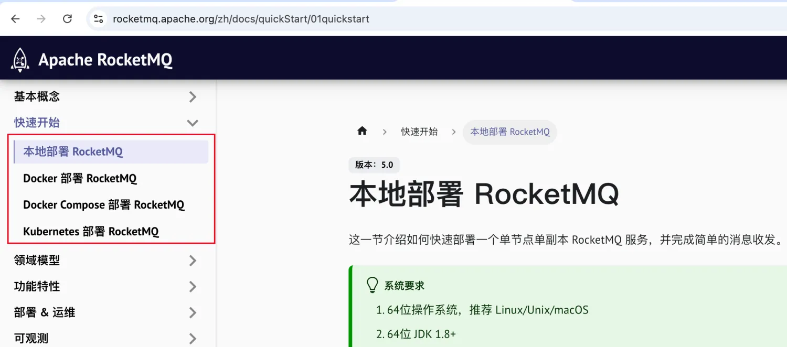
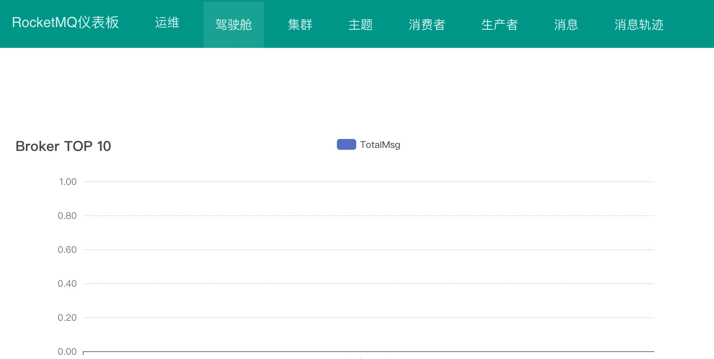
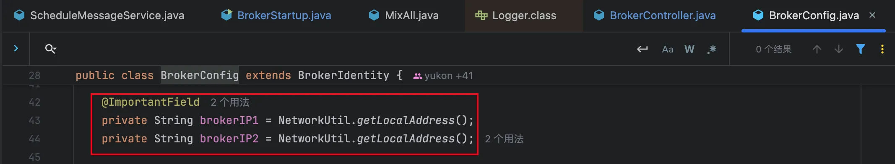

# SpringBoot接入rocketmq

## 安装Rocketmq

rocketmq的安装步骤可以参照rocketmq的[官网](https://rocketmq.apache.org/zh/)



可以参照这部分文档，由于本人比较热衷于使用docker来部署，并且rocketmq里面包含namesrv，broker，proxy等组件，所以直接使用docker-compose来安装了。

如果不用rocketmq的dashboard控制台的话，可以直接拷贝官网的docker-compose文件来安装。如果要使用dashboard的话，可以参照下面的docker-compose文件。

```
version: '3.8'
services:
  namesrv:
    image: apache/rocketmq:5.3.1
    container_name: rmqnamesrv
    ports:
      - 9876:9876
    networks:
      - rocketmq
    command: sh mqnamesrv
  broker:
    image: apache/rocketmq:5.3.1
    container_name: rmqbroker
    ports:
      - 10909:10909
      - 10911:10911
      - 10912:10912
    environment:
      - NAMESRV_ADDR=rmqnamesrv:9876
    depends_on:
      - namesrv
    networks:
      - rocketmq
    command: sh mqbroker
  proxy:
    image: apache/rocketmq:5.3.1
    container_name: rmqproxy
    networks:
      - rocketmq
    depends_on:
      - broker
      - namesrv
    ports:
      - 8080:8080
      - 8081:8081
    restart: on-failure
    environment:
      - NAMESRV_ADDR=rmqnamesrv:9876
    command: sh mqproxy
  dashboard:
    image: apacherocketmq/rocketmq-dashboard:latest
    container_name: rmqdashboard
    networks:
      - rocketmq
    depends_on:
      - broker
      - namesrv
      - proxy
    restart: on-failure
    environment:
      - JAVA_OPTS=-Drocketmq.namesrv.addr=rmqnamesrv:9876
    ports:
      - 8082:8080
networks:
  rocketmq:
    driver: bridge
```

执行docker-compose up -d启动即可。访问rocketmq控制台。



::: warning
官方没有提供ARM系统的docker镜像, 需要自己构建。
:::

### 问题修复

**springboot客户端访问broker失败**

如果rocketmq的客户端跟broker是同一个局域网的话，上面的配置就可以了。但是如果不是同一个局域网的话，访问broker会报错，因为客户端通过namesrv获取到的broker ip是docker-compose里面的局域网ip，会访问失败。

查看rocketmq的源码，里面broker的ip地址配置字段有两个，如下所示:



- brokerIP1：broker对外提供服务的IP地址，即生产者和消费者访问broker的地址
- brokerIP2: broker向namesrv注册时的IP地址，用于namesrv和broker通信

所以只要将brokerIP1设置为外网可以访问的地址即可。

如果需要改动这两个地址，只能通过配置文件来配置，所以docker-compose要做数据卷映射。创建broker.conf文件，然后启动的时候指定这个文件即可。docker-compose里面文件改动的部份如下所示：

```
version: '3.8'
services:
  broker:
    image: apache/rocketmq:5.3.1
    container_name: rmqbroker
    ports:
      - 10909:10909
      - 10911:10911
      - 10912:10912
    # 映射文件
    volumes: 
      - ./broker/conf/broker.conf:/opt/rocketmq/conf/broker.conf
    environment:
      - NAMESRV_ADDR=rmqnamesrv:9876
    depends_on:
      - namesrv
    networks:
      - rocketmq
    # 启动命令
    command: sh mqbroker -c /opt/rocketmq/conf/broker.conf
```

在当前目录下创建了./broker/conf/broker.conf这个文件，具体的配置如下所示：

```
brokerClusterName = DefaultCluster
brokerName = broker-a
brokerId = 0
deleteWhen = 04
fileReservedTime = 48
brokerRole = ASYNC_MASTER
flushDiskType = ASYNC_FLUSH
# 配置brokerIP1, 改成docker主机的IP
brokerIP1=106.52.101.174
#brokerIP2=106.52.101.174
```

重新启动docker-compose up -d即可。

## springboot接入rocketmq

springboot中引入rocketmq，只需要以下四步

### 引入rocketmq依赖

```
<!-- https://mvnrepository.com/artifact/org.apache.rocketmq/rocketmq-spring-boot-starter -->
<dependency>
    <groupId>org.apache.rocketmq</groupId>
    <artifactId>rocketmq-spring-boot-starter</artifactId>
    <version>xxxx</version>
</dependency>
```

### 添加rocketmq的配置

```
rocketmq:
    consumer:
        group: springboot_consumer_group
        # 一次拉取消息最大值，注意是拉取消息的最大值而非消费最大值
        pull-batch-size: 10
    name-server: 10.5.103.6:9876
    producer:
        # 发送同一类消息的设置为同一个group，保证唯一
        group: springboot_producer_group
        # 发送消息超时时间，默认3000
        sendMessageTimeout: 10000
        # 发送消息失败重试次数，默认2
        retryTimesWhenSendFailed: 2
        # 异步消息重试此处，默认2
        retryTimesWhenSendAsyncFailed: 2
        # 消息最大长度，默认1024 * 1024 * 4(默认4M)
        maxMessageSize: 4096
        # 压缩消息阈值，默认4k(1024 * 4)
        compressMessageBodyThreshold: 4096
        # 是否在内部发送失败时重试另一个broker，默认false
        retryNextServer: false
```

### 发送消息

```
@RestController
public class NormalProduceController {
  @Setter(onMethod_ = @Autowired)
  private RocketMQTemplate rocketmqTemplate;
  
  @GetMapping("/test")
  public SendResult test() {
    Message<String> msg = MessageBuilder.withPayload("Hello,RocketMQ").build();
    SendResult sendResult = rocketmqTemplate.send(topic, msg);
  }
}
```

### 消费消息

```
@Component
@RocketMQMessageListener(topic = "your_topic_name", consumerGroup = "your_consumer_group_name")
public class MyConsumer implements RocketMQListener<String> {

  @Override
  public void onMessage(String message) {
    // 处理消息的逻辑
    System.out.println("Received message: " + message);
  }
}
```

可以参照这篇文档：https://www.cnblogs.com/jianzh5/p/17301690.html