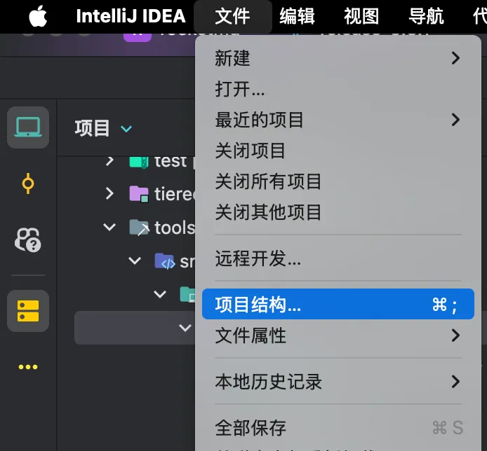
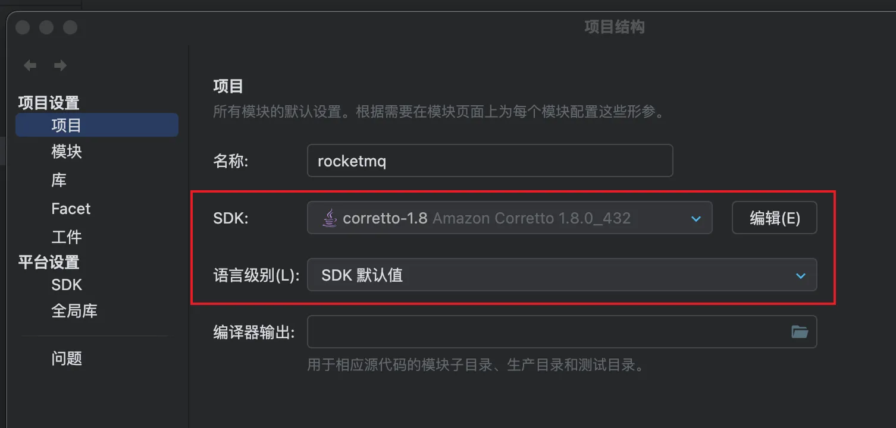
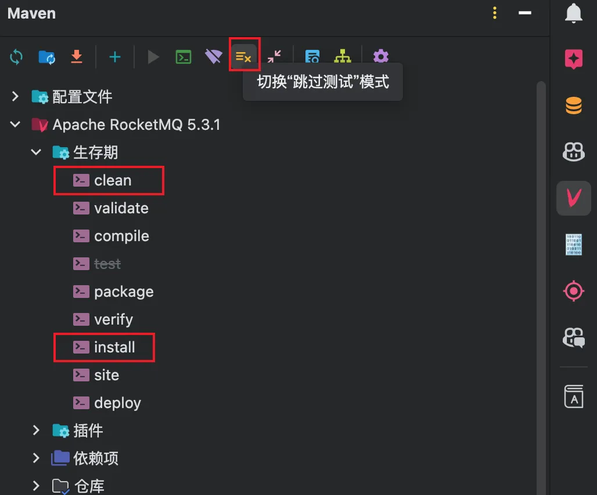
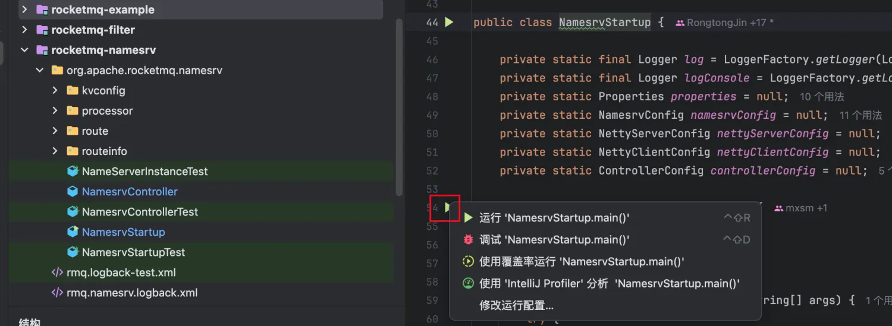
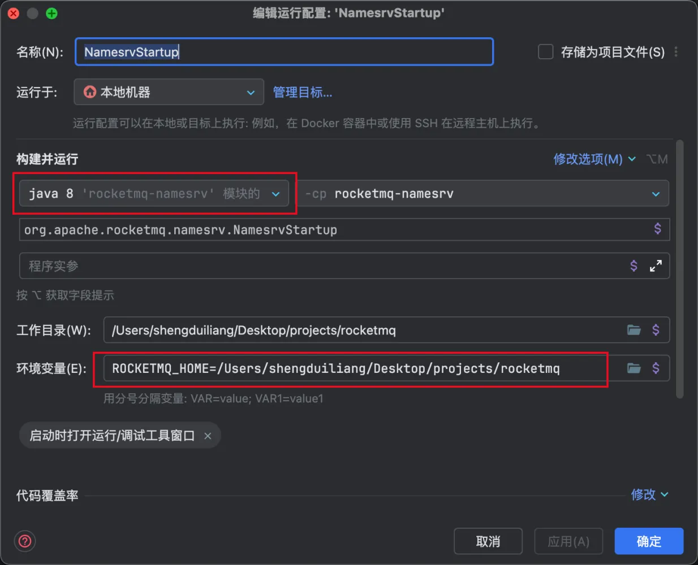
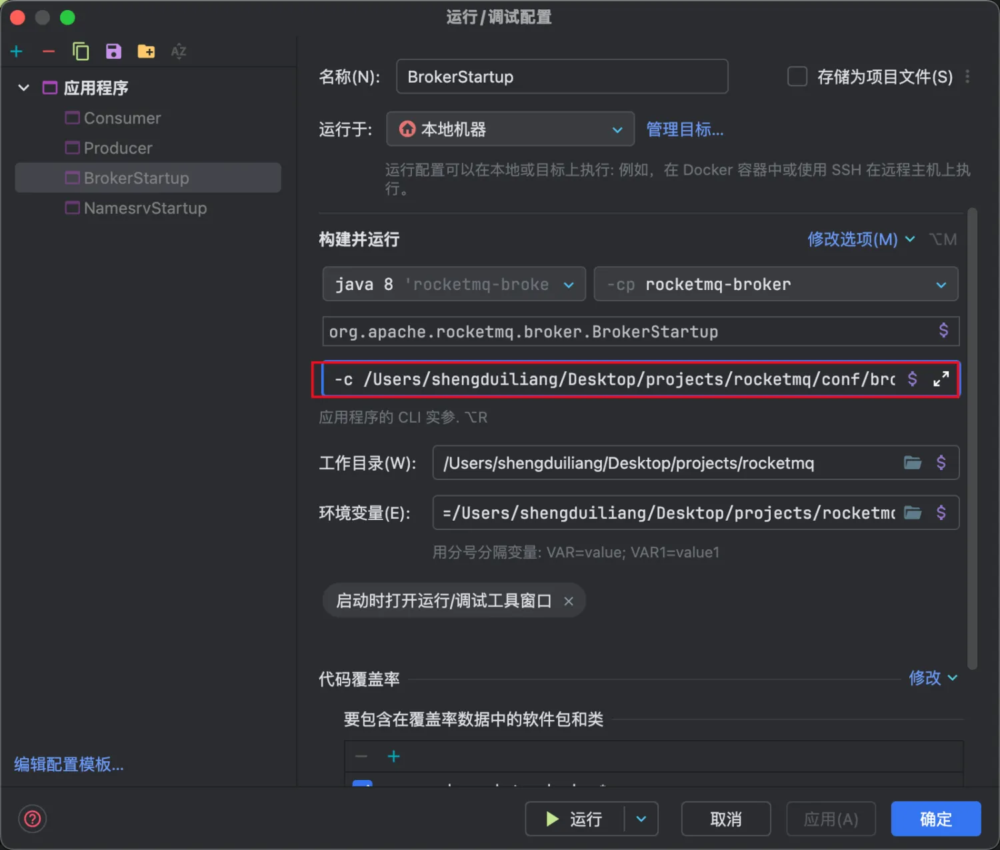
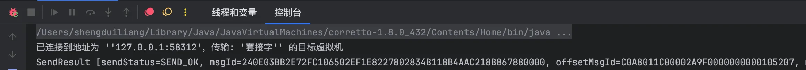

# 源码环境搭建

## 源码下载

直接上rocketmq的[github](https://github.com/apache/rocketmq)下载rocketmq源码，使用git下载

```
git clone https://github.com/apache/rocketmq.git
```

如果无法下载可以使用github代理加速，下面提供一个：

```
git clone https://ghp.ci/https://github.com/apache/rocketmq.git
```

截止到2024-12-05，最新的rocketmq的版本为5.3.1，切换到该分支

```
git checkout -b release-5.3.1 origin/release-5.3.1
```

## 源代码的目录结构

rocketmq的源码目录结构如下所示：

```
rocketmq %  tree -L 1 -d
├── acl			# 权限控制模块
├── auth		# 认证模块
├── bazel
├── broker  # broker模块
├── client  # 消息客户端，包括消息生产者跟消息消费者相关类
├── common	# 公共模块
├── container
├── controller
├── dev			# 开发者信息，非代码模块
├── distribution	# 部署信息模块，存放搭建rocketmq集群常用的配置文件
├── docs		# rocketmq的文档说明
├── example	# rocketmq示例代码
├── filter	# 消息过滤相关基础类
├── namesrv	# namesrv相关代码
├── openmessaging	# 消息开放标准
├── proxy		# rocketmq proxy代理模块，TODO
├── remoting	# 远程通信模块，基于Netty
├── srvutil	# 服务器工具类
├── store		# 消息储存模块，核心模块，存储rocketmq的消息
├── style		# checkstyle相关实现
├── test		# 测试相关类
├── tieredstore
└── tools		# 工具类
```

## IDEA调试rocketmq源码

使用IDEA打开rocketmq目录，等待maven下载依赖完毕。

### JDK环境配置

由于rocketmq是基于Java1.8写的，先将项目的SDK环境设置为1.8。点击IDEA上面的文件->项目结构。



项目的SDK设置为1.8。语言级别调整为SDK默认值



### maven构建项目

点击IDEA右侧的maven按钮，界面如下所示



### 源码测试

**启动nameserver**



在rocketmq-namesrv模块中找到NamesrvStartup模块，找到main函数左边的启动按钮，鼠标右键，跳出上述选项，点击修改运行配置。

 

 主要看环境变量，添加ROCKETMQ_HOME环境变量，值为rockermq源码的根目录，点击确定。然后右键执行namesrv即可。

**启动broker**

broker的前两步配置跟namesrv类似，找到broker的目录，在rocketmq-broker模块下面。不过broker除了配置环境变量之外，还要配置以下信息。
在根目录新建conf目录跟datadir目录，然后在conf目录下新建broker.conf文件，输入以下内容：

```
brokerClusterName = DefaultCluster
brokerName = broker-a
brokerId = 0
deleteWhen = 04
fileReservedTime = 48
brokerRole = ASYNC_MASTER
flushDiskType = ASYNC_FLUSH

namesrvAddr = 127.0.0.1:9876
autoCreateTopicEnable = true

storePathRootDir = /rocketmq/datadir	
storePathCommitLog = /rocketmq/datadir/commitlog # commitlog文件目录
storePathConsumeQueue = /rocketmq/datadir/consumequeue # consumequeue文件目录
storePathIndex = /rocketmq/datadir/index # indexFile文件目录
storeCheckPoint = /rocketmq/datadir/storeCheckPoint
abortFile = /rocketmq/datadir/abort
```

在datadir目录下新建commitlog，consumequeue，index目录。
然后修改broker的运行配置。在程序参数下面输入-c，后面跟着broker.conf的文件路径



启动broker即可, 成功运行即可。

**启动生产者**

在example下的quickstart目录打开Producer文件，然后把下面的注释放开

```
producer.setNamesrvAddr(DEFAULT_NAMESRVADDR);
```

运行即可。



如果控制台有上面的打印，则说明源码已经成功运行。