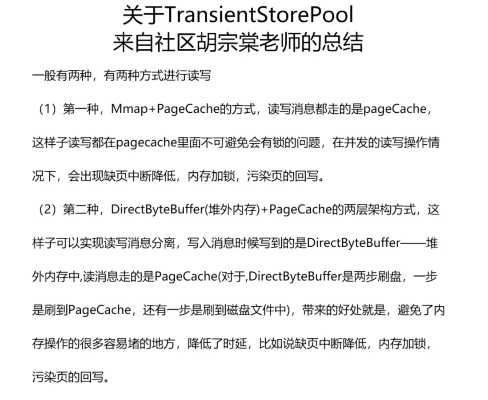

# RocketMQ消息存储

## 消息储存架构

### 元数据管理

为了提升整体的吞吐量跟整体的可用性，RocketMq服务器一般会为单个Topic创建多个分区，就是在每个Broker主从集群里面维护部分分区(Partition), 也就是队列(MessageQueue)。同一个Broker主从集群中每个Topic的队列数相同并且从0开始编号，不同Broker主从集群中的消息队列数量可以不一样。


-  一个主题在Broker-1主副本上有4个队列，编号是0-3, 在Broker-1备副本上完全相同；在Broker-2上可能只有2个队列，编号是0-1
- Broker上元数据中每个Topic的配置包含了几个核心属性，名称，读写队列数，权限和其他元数据标识
- 队列从0开始编号，扩缩队列都在尾部操作，比如24个队列缩分区到16，会留下编号为0-15的队列
- Broker 还管理着当前节点上 Group 的相关信息和消费进度（位点），当消费进度更新时 并不会像 Topic Group 那样立刻持久化，而是使用一个定时任务做 CheckPoint。这个周期默认是 5 秒，所以当客户端有上下线，服务端主备切换或者正常发布时，可能会有秒级的消息重复，并观察到堆积量的短暂上升。

### mmap文件存储

为了实现高效的写消息操作，RocketMQ使用顺序写盘的方法，通过append only将数据追加到文件末尾。利用NIO的FileChannel模型，通过使用偏移量的形式写入磁盘而不用read/write的系统调用，减少了数据在缓冲区之间拷贝的开销。但是这种实现机制有一些限制，单个mmap的文件不能太大（RocketMQ选择了1G），一旦超过这个这个容量，就会新建一个文件组成一个链表（MappedFileQueue），就可以用来存储消息了。


### 消息储存格式

RocketMQ 有一套相对复杂的消息存储编码用来将消息对象序列化，随后再将非定长的数据落到上述的真实的写入到文件中，存储格式中包括了索引队列的编号和位置。单条消息的存储格式如下：


可以发现，单条消息本身元数据占用的存储空间为固定的描述信息和变长的 body 和 properties 部分，而消息的 payload 通常大于 2K，也就是说元数据带来的额外存储开销只增加了 5%-10% 左右。很明显，单条消息越大，存储本身额外的开销（比例）就相对的越少。

### 存储架构设计


在数据写入 CommitLog 后，有一个后端的 ReputMessageService 服务 (也被称为 dispatch 线程) 会异步的构建多种索引（例如 ConsumeQueue 和 Index），满足不同形式的读取和查询诉求。在 RocketMQ 的模型下，消息本身存在的逻辑队列称为 MessageQueue，而对应的物理索引文件称为 ConsumeQueue。其中 dispatch 线程会源源不断的将消息从 CommitLog 取出，再拿出消息在 CommitLog 中的物理偏移量，消息长度以及 Tag Hash 等信息作为单条消息的索引，分发到对应的消费队列，构成了对 CommitLog 的引用 (Reference)。ConsumeQueue 中单条消息占用的索引空间只有 20B。当客户端尝试从服务端拉取消息时，会先读取索引并进行过滤，随后根据索引从 CommitLog 中获得真实的消息并返回。

### 索引架构设计


RocketMQ 作为业务消息的首选，除了上文中 ReputMessageService 线程除了构建消费队列的索引外，还同时为每条消息根据 id, key 构建了索引到 IndexFile。这是方便快速快速定位目标消息而产生的，当然这个构建随机索引的能力是可以降级的，IndexFile文件结构如下：


IndexFile 也是定长的，从单个文件的数据结构来说，这是实现了一种简单原生的哈希拉链机制。当一条新的消息索引进来时，首先使用 hash 算法命中黄色部分 500w 个 slot 中的一个，如果存在冲突就使用拉链解决，将最新索引数据的 next 指向上一条索引位置。同时将消息的索引数据 append 至文件尾部（绿色部分），这样便形成了一条当前 slot 按照时间存入的倒序的链表。这里其实也是一种 LSM compaction 在消息模型下的改进，降低了写放大。当用户按照 UniqueKey（MsgId）或者业务 Key 来进行查询时，会先从索引查询消息报存在 CommitLog 中的位置并取回数据返回客户端。

### 总结

这节的最后我们看看消息实际在目录上是怎么储存的。


- index目录: index目录就是储存索引文件的目录, 里面的每个文件400M
- commitlog: commitlog目录就是储存具体消息内容的，每个文件的大小1G
- consumequeue: consumequeue目录是用来储存消费队列的信息，每个主题是一个目录，每个主题目录下有多个目录，0/1/2那些是队列目录，里面的文件就是ConsumeQueue, 每个文件的大小5.7M


## 消息发送

我们从Broker消息发送请求的方法开始梳理Rocketmq消息存储commitLog的存储流程, 首先我们看Broker注册消息发送的处理器。

``` BrokerController
public void registerProcessor() {
  this.remotingServer.registerProcessor(RequestCode.SEND_MESSAGE, sendMessageProcessor, this.sendMessageExecutor);
  this.remotingServer.registerProcessor(RequestCode.SEND_MESSAGE_V2, sendMessageProcessor, this.sendMessageExecutor);
  this.remotingServer.registerProcessor(RequestCode.SEND_BATCH_MESSAGE, sendMessageProcessor, this.sendMessageExecutor);
  this.remotingServer.registerProcessor(RequestCode.CONSUMER_SEND_MSG_BACK, sendMessageProcessor, this.sendMessageExecutor);
}
```

可以看到所有的消息发送都是由sendMessageProcessor做处理的，我们跟进去看一下

``` SendMessageProcessor{17-18}
public class SendMessageProcessor extends AbstractSendMessageProcessor implements NettyRequestProcessor {
  @Override
  public RemotingCommand processRequest(ChannelHandlerContext ctx,
    RemotingCommand request) throws RemotingCommandException {
    switch (request.getCode()) {
      case RequestCode.CONSUMER_SEND_MSG_BACK:
        return this.consumerSendMsgBack(ctx, request);
      default:
        SendMessageRequestHeader requestHeader = parseRequestHeader(request);
        sendMessageContext = buildMsgContext(ctx, requestHeader, request);
        // 调用SendMessageHook
        this.executeSendMessageHookBefore(sendMessageContext);
        if (requestHeader.isBatch()) {
          response = this.sendBatchMessage(ctx, request, sendMessageContext, requestHeader, mappingContext,
                  (ctx1, response1) -> executeSendMessageHookAfter(response1, ctx1));
        } else {
          response = this.sendMessage(ctx, request, sendMessageContext, requestHeader, mappingContext,
                  (ctx12, response12) -> executeSendMessageHookAfter(response12, ctx12));
        }
        return response
      }
  }
}
```

可以看到根据批量消息跟普通消息调用了不同的sendMessage方法，我们只看普通消息的发送方法即可。

``` SendMessageProcessor{13}
public RemotingCommand sendMessage(final ChannelHandlerContext ctx, final RemotingCommand request, final SendMessageContext sendMessageContext,final SendMessageRequestHeader requestHeader, final TopicQueueMappingContext mappingContext, final SendMessageCallback sendMessageCallback) throws RemotingCommandException {
  // 检查消息是否可以写入Broker
  final RemotingCommand response = preSend(ctx, request, requestHeader);
  if (response.getCode() != -1) {
    return response;
  }
  if (brokerController.getBrokerConfig().isAsyncSendEnable()) {
    // 发送事务消息，事务消息章节讲解
    if (sendTransactionPrepareMessage) {
      asyncPutMessageFuture = this.brokerController.getTransactionalMessageService().asyncPrepareMessage(msgInner);
    } else {
      // 普通消息
      asyncPutMessageFuture = this.brokerController.getMessageStore().asyncPutMessage(msgInner);
    }
    ...
  } else {
    if (sendTransactionPrepareMessage) {
      putMessageResult = this.brokerController.getTransactionalMessageService().prepareMessage(msgInner);
    } else {
      putMessageResult = this.brokerController.getMessageStore().putMessage(msgInner);
    }
    ...
  }
}
```

brokerController.getBrokerConfig().isAsyncSendEnable()可以看到是根据BrokerConfig的asyncSendEnable这个配置

### 消息检查

在preSend中会对发送的消息进行一系列的检查，判断该消息是否可以写入Broker，这里大致跟者代码说明一下:

``` SendMessageProcessor
private RemotingCommand preSend(ChannelHandlerContext ctx, RemotingCommand request,
                                SendMessageRequestHeader requestHeader) {
  // 如果Broker还没准备好，报错
  if (this.brokerController.getMessageStore().now() < startTimestamp) {
    response.setCode(ResponseCode.SYSTEM_ERROR);
    response.setRemark(String.format("broker unable to service, until %s", UtilAll.timeMillisToHumanString2(startTimestamp)));
    return response;
  }
  response.setCode(-1);
  super.msgCheck(ctx, requestHeader, request, response);
  return response;
}
```

继续看一下msgCheck方法，代码如下：

```
protected RemotingCommand msgCheck(final ChannelHandlerContext ctx,
                                    final SendMessageRequestHeader requestHeader, final RemotingCommand request,
                                    final RemotingCommand response) {
  // 如果Broker没有权限写消息，报错
  if (!PermName.isWriteable(this.brokerController.getBrokerConfig().getBrokerPermission())
          && this.brokerController.getTopicConfigManager().isOrderTopic(requestHeader.getTopic())) {
    response.setCode(ResponseCode.NO_PERMISSION);
    return response;
  }
  // 检查Topic的名字是否为空，是否存在非法字符，长度是否满足等
  TopicValidator.ValidateTopicResult result = TopicValidator.validateTopic(requestHeader.getTopic());
  if (!result.isValid()) {
    response.setCode(ResponseCode.SYSTEM_ERROR);
    return response;
  }
  // 检查主题是否在禁止发送的主题里面，比如RMQ_SYS_SCHEDULE_TOPIC/RMQ_SYS_SELF_TEST_TOPIC等等
  if (TopicValidator.isNotAllowedSendTopic(requestHeader.getTopic())) {
    response.setCode(ResponseCode.NO_PERMISSION);
    return response;
  }
  // 从topicConfigTable获取topicConfig
  TopicConfig topicConfig =
          this.brokerController.getTopicConfigManager().selectTopicConfig(requestHeader.getTopic());
  if (null == topicConfig) {
    // 检查是否可以创建该主题，这里会根据Broker的配置autoCreateTopicEnable来判定
    topicConfig = this.brokerController.getTopicConfigManager().createTopicInSendMessageMethod(
            requestHeader.getTopic(),
            requestHeader.getDefaultTopic(),
            RemotingHelper.parseChannelRemoteAddr(ctx.channel()),
            requestHeader.getDefaultTopicQueueNums(), topicSysFlag);

    if (null == topicConfig) {
      // 如果是重试主题，那么会新创建一个主题
      if (requestHeader.getTopic().startsWith(MixAll.RETRY_GROUP_TOPIC_PREFIX)) {
        topicConfig =
                this.brokerController.getTopicConfigManager().createTopicInSendMessageBackMethod(
                        requestHeader.getTopic(), 1, PermName.PERM_WRITE | PermName.PERM_READ,
                        topicSysFlag);
      }
    }

    if (null == topicConfig) {
      response.setCode(ResponseCode.TOPIC_NOT_EXIST);
      return response;
    }
  }
  // 判断queueId是否在Broker的queueId范围里面
  int queueIdInt = requestHeader.getQueueId();
  int idValid = Math.max(topicConfig.getWriteQueueNums(), topicConfig.getReadQueueNums());
  if (queueIdInt >= idValid) {
    response.setCode(ResponseCode.SYSTEM_ERROR);
    return response;
  }
  return response;
}
```

**主动创建主题**

如果Broker的配置autoCreateTopicEnable打开了，那么Broker就支持创建新主题了。我们看看这个配置都做了什么，在Broker启动的时候，会根据这个属性往NameServer新建一个默认主题。

``` TopicConfigManager
protected void init() {
  protected void init() {
    TopicConfig defaultTopicConfig = getTopicConfig(defaultTopic);
    if (this.brokerController.getBrokerConfig().isAutoCreateTopicEnable()) {
      String topic = TopicValidator.AUTO_CREATE_TOPIC_KEY_TOPIC;
      TopicConfig topicConfig = new TopicConfig(topic);
      ....
      putTopicConfig(topicConfig);
    }
  }
}
```

然后在上面的BrokerController#getTopicConfigManager#createTopicInSendMessageMethod会判断这个参数。

```TopicConfigManager
public TopicConfig createTopicInSendMessageMethod(final String topic, final String defaultTopic,
                                                  final String remoteAddress, final int clientDefaultTopicQueueNums, final int topicSysFlag) {
  ...
  TopicConfig defaultTopicConfig = getTopicConfig(defaultTopic);
  if (defaultTopicConfig != null) {
    if (defaultTopic.equals(TopicValidator.AUTO_CREATE_TOPIC_KEY_TOPIC)) {
      if (!this.brokerController.getBrokerConfig().isAutoCreateTopicEnable()) {
        defaultTopicConfig.setPerm(PermName.PERM_READ | PermName.PERM_WRITE);
      }
    }
    if (PermName.isInherited(defaultTopicConfig.getPerm())) {
      ...
    } else {
      log.warn("Create new topic failed, because the default topic[{}] has no perm [{}] producer:[{}]",
        defaultTopic, defaultTopicConfig.getPerm(), remoteAddress);
    }
  }
}
```

可以看到如果没有配置了autoCreateTopicEnable的话，defaultTopicConfig是空的，而如果配置了autoCreateTopicEnable，那么就会赋予defaultTopicConfig读写权限，否则无法写消息

### DefaultMessageStore#asyncPutMessage

好了，让我们回到BrokerController.getMessageStore()的putMessage跟asyncPutMessage这两个发送消息方法

``` DefaultMessageStore
@Override
public PutMessageResult putMessage(MessageExtBrokerInner msg) {
  return waitForPutResult(asyncPutMessage(msg));
}
```

可以看到putMessage调用的也是asyncPutMessage, 所以我们只要看asyncPutMessage这个方法就好了。

``` DefaultMessageStore{12}
@Override
public CompletableFuture<PutMessageResult> asyncPutMessage(MessageExtBrokerInner msg) {
  // 执行所有的PutMessageHook
  for (PutMessageHook putMessageHook : putMessageHookList) {
    PutMessageResult handleResult = putMessageHook.executeBeforePutMessage(msg);
    if (handleResult != null) {
      return CompletableFuture.completedFuture(handleResult);
    }
  }
  ....
  long beginTime = this.getSystemClock().now();
  CompletableFuture<PutMessageResult> putResultFuture = this.commitLog.asyncPutMessage(msg);
  putResultFuture.thenAccept(result -> {
    long elapsedTime = this.getSystemClock().now() - beginTime;
    this.storeStatsService.setPutMessageEntireTimeMax(elapsedTime);
    if (null == result || !result.isOk()) {
      this.storeStatsService.getPutMessageFailedTimes().add(1);
    }
  });
  return putResultFuture;
}
```

### PutMessageHook

PutMessageHook是在消息写入commitLog之前对消息进行一些处理，如果对事务消息进行处理，处理延迟消息等等，我们可以看一下这个接口的定义

``` PutMessageHook
public interface PutMessageHook {
  /* Name of the hook. */
  String hookName();
  /* Execute before put message. For example, Message verification or special message transform */
  PutMessageResult executeBeforePutMessage(MessageExt msg);
}
```

具体有哪些钩子？在BrokerControlle初始化的时候会调用一个registerMessageStoreHook方法来注册钩子函数，这里列一下:

```BrokerController
public void registerMessageStoreHook() {
  // 获取messageStore的putMessage钩子列表
  List<PutMessageHook> putMessageHookList = messageStore.getPutMessageHookList();
  // 检查消息状态
  putMessageHookList.add(new PutMessageHook() {
    public PutMessageResult executeBeforePutMessage(MessageExt msg) {
      return HookUtils.checkBeforePutMessage(BrokerController.this, msg);
    }
  });
  // 处理innerbatch消息
  putMessageHookList.add(new PutMessageHook() {
    public PutMessageResult executeBeforePutMessage(MessageExt msg) {
      if (msg instanceof MessageExtBrokerInner) {
        return HookUtils.checkInnerBatch(BrokerController.this, msg);
      }
      return null;
    }
  });
  // 处理延迟消息
  putMessageHookList.add(new PutMessageHook() {
    @Override
    public PutMessageResult executeBeforePutMessage(MessageExt msg) {
      if (msg instanceof MessageExtBrokerInner) {
        return HookUtils.handleScheduleMessage(BrokerController.this, (MessageExtBrokerInner) msg);
      }
      return null;
    }
  });
}
```

**检查消息状态**

- 如果broker的消息存储处于关闭状态，直接返回服务不可用
- 如果不允许重复复制，并且broker角色为slave，直接返回服务不可用
- 如果MessageStore不可写，直接返回服务不可用
- 非重试topic且topic超长，则直接返回消息非法
- 如果消息topic大于MAX_TOPIC_LENGTH(255)，则直接返回消息非法
- 消息体为空，直接返回消息非法
- PageCache繁忙，直接返回服务不可用

**处理innerbatch消息**

主要是检查消息的SysFlag跟消息的配置对不对得上，对不上就报错

**处理延迟消息**

等讲到延迟消息跟定时消息章节再讲解，主要会对消息的内容跟主题做一些转换

### CommitLog#asyncPutMessage

在DefaultMessageStore#asyncPutMessage中最终是调用CommitLog#asyncPutMessage发送消息的，我们再来看看这个方法:

```  CommitLog{60}
public CompletableFuture<PutMessageResult> asyncPutMessage(final MessageExtBrokerInner msg) {
  // 设置消息储存时间
  if (!defaultMessageStore.getMessageStoreConfig().isDuplicationEnable()) {
    msg.setStoreTimestamp(System.currentTimeMillis());
  }
  // 设置消息CRC校验码
  msg.setBodyCRC(UtilAll.crc32(msg.getBody()));
  if (enabledAppendPropCRC) {
    // delete crc32 properties if exist
    msg.deleteProperty(MessageConst.PROPERTY_CRC32);
  }
  // 设置消息版本号
  String topic = msg.getTopic();
  msg.setVersion(MessageVersion.MESSAGE_VERSION_V1);
  boolean autoMessageVersionOnTopicLen =
          this.defaultMessageStore.getMessageStoreConfig().isAutoMessageVersionOnTopicLen();
  if (autoMessageVersionOnTopicLen && topic.length() > Byte.MAX_VALUE) {
    msg.setVersion(MessageVersion.MESSAGE_VERSION_V2);
  }
  // 设置消息产生的host
  InetSocketAddress bornSocketAddress = (InetSocketAddress) msg.getBornHost();
  if (bornSocketAddress.getAddress() instanceof Inet6Address) {
    msg.setBornHostV6Flag();
  }
  // 设置消息储存的host
  InetSocketAddress storeSocketAddress = (InetSocketAddress) msg.getStoreHost();
  if (storeSocketAddress.getAddress() instanceof Inet6Address) {
    msg.setStoreHostAddressV6Flag();
  }
  // 获取要写入的mappedFile文件
  PutMessageThreadLocal putMessageThreadLocal = this.putMessageThreadLocal.get();
  updateMaxMessageSize(putMessageThreadLocal);
  String topicQueueKey = generateKey(putMessageThreadLocal.getKeyBuilder(), msg);
  long elapsedTimeInLock = 0;
  MappedFile unlockMappedFile = null;
  MappedFile mappedFile = this.mappedFileQueue.getLastMappedFile();
  // 获取要写入的mappedFile文件的位置
  long currOffset;
  if (mappedFile == null) {
    currOffset = 0;
  } else {
    currOffset = mappedFile.getFileFromOffset() + mappedFile.getWrotePosition();
  }
  // 主从相关配置
  try {
    long beginLockTimestamp = this.defaultMessageStore.getSystemClock().now();
    this.beginTimeInLock = beginLockTimestamp;
    // 设置保存时间，为了确保全局顺序性
    if (!defaultMessageStore.getMessageStoreConfig().isDuplicationEnable()) {
      msg.setStoreTimestamp(beginLockTimestamp);
    }
    // 如果mappedFile为空或者mappedFile已经满了，重新获取mappedFile
    if (null == mappedFile || mappedFile.isFull()) {
      mappedFile = this.mappedFileQueue.getLastMappedFile(0); // Mark: NewFile may be cause noise
      if (isCloseReadAhead()) {
        setFileReadMode(mappedFile, LibC.MADV_RANDOM);
      }
    }
    // 实际保存方法
    result = mappedFile.appendMessage(msg, this.appendMessageCallback, putMessageContext);
    ...
    // 获取保存结果做处理
  }
  PutMessageResult putMessageResult = new PutMessageResult(PutMessageStatus.PUT_OK, result);

  // Statistics
  storeStatsService.getSinglePutMessageTopicTimesTotal(msg.getTopic()).add(result.getMsgNum());
  storeStatsService.getSinglePutMessageTopicSizeTotal(topic).add(result.getWroteBytes());
  // 同步刷盘等待刷盘结束跟主从处理
  return handleDiskFlushAndHA(putMessageResult, msg, needAckNums, needHandleHA);
}
```

好了，可以看到最终就是调用了MappedFile#appendMessage来保存消息的。

### 总结


## 消息存储

- RocketMQ底层使用mmap文件格式来进行消息的存储的, 而负责单个mmap文件的操作逻辑的类就是DefaultMappedFile
- 由于每个mmap文件的大小是有限制的(RocketMQ默认是1G), 当一个mmap文件内容写满了之后，就要新建一个mmap文件来存储新的消息，这样多个mmap之间就组成了一个mmap文件链表，而负责管理这个链表的类就是MappedFileQueue
- 前面两个类只是负责文件的读写，刷新/清除操作等等，对于CommitLog，需要新增加一个类来管理每个mmap文件的格式定义以及读写消息等等，这个类就是CommitLog
- 为了扩展性，可能需要更换默认的存储实现(比如DLedger模式下使用DLedgerCommitLog)，所以在CommitLog之上再增加了一层，那就是DefaultMessageStore

:::info
如果想了解DLedger模式，即自动主从切换模式, 可以点击[此处](https://rocketmq.apache.org/zh/docs/4.x/bestPractice/02dledger/); Rocketmq5之后又推出了Controller模式，将主从集群的管理和协调交给Controller来做，点击[此处](https://rocketmq.apache.org/zh/docs/deploymentOperations/03autofailover/)。
:::


### DefaultMappedFile

RocketMQ用来实现最底层Mmap文件读写操作的具体实现类是DefaultMappedFile，先看看这个类的属性定义。

``` DefaultMappedFile
// 操作系统每页的大小，默认4K
public static final int OS_PAGE_SIZE = 1024 * 4;
public static final Unsafe UNSAFE = getUnsafe();
// 用来检查MappedFile中某个位置是否已经加载了
private static final Method IS_LOADED_METHOD;
// Unsafe使用的页面大小
public static final int UNSAFE_PAGE_SIZE = UNSAFE == null ? OS_PAGE_SIZE : UNSAFE.pageSize();
// 统计 RocketMQ 使用的所有内存映射文件的虚拟内存总量
protected static final AtomicLong TOTAL_MAPPED_VIRTUAL_MEMORY = new AtomicLong(0);
// RocketMQ 中已映射的文件数量
protected static final AtomicInteger TOTAL_MAPPED_FILES = new AtomicInteger(0);
// 当前写入的文件偏移位置
protected static final AtomicIntegerFieldUpdater<DefaultMappedFile> WROTE_POSITION_UPDATER;
// 已提交的文件偏移位置
protected static final AtomicIntegerFieldUpdater<DefaultMappedFile> COMMITTED_POSITION_UPDATER;
// 已刷盘的文件偏移位置
protected static final AtomicIntegerFieldUpdater<DefaultMappedFile> FLUSHED_POSITION_UPDATER;
// 当前文件中写入的位置
protected volatile int wrotePosition;
// 消息已经提交（即成功写入到文件并被确认）的偏移位置
protected volatile int committedPosition;
// 已刷盘（即成功持久化到磁盘）的偏移位置
protected volatile int flushedPosition;
// 当前文件的大小
protected int fileSize;
// 用于操作文件的通道，允许对文件进行读写操作
protected FileChannel fileChannel;
/* 如果使用了transientStorePool，那么先会将写入的数据放到writeBuffer，然后再刷新到transientStorePool */
protected ByteBuffer writeBuffer = null;
// 存暂时存储的数据。当内存足够时，可以将消息先存储到内存池中，待合适时机再写入磁盘，减少磁盘的 I/O 操作
protected TransientStorePool transientStorePool = null;
// 当前映射文件的文件名
protected String fileName;
// 文件中存储的消息的起始偏移量。即这个文件从哪个消息位置开始存储
protected long fileFromOffset;
// 当前映射文件对应的 File 对象，用于进行文件操作（例如打开、关闭文件）
protected File file;
// 通过内存映射技术映射到内存的字节缓冲区，用于高效地存取文件中的数据
protected MappedByteBuffer mappedByteBuffer;
// 当前文件的创建时间或最后修改时间，通常用于日志或文件管理
protected volatile long storeTimestamp = 0;
// 标识当前映射文件是否是队列中的第一个文件
protected boolean firstCreateInQueue = false;
// 记录上次刷新操作的时间。用于控制消息刷盘的频率，避免频繁的磁盘I/O操作
private long lastFlushTime = -1L;
// 某些情况下，映射文件可能需要被清理或重新映射，这个字段存储待清理的内存映射缓冲区
protected MappedByteBuffer mappedByteBufferWaitToClean = null;
// 最近一次内存映射的时间。它可能用于控制内存映射的频率，以优化性能
protected long swapMapTime = 0L;
// 记录自上次映射交换以来，mappedByteBuffer 被访问的次数。可以帮助决定何时重新映射文件或交换内存区域，以提高性能
protected long mappedByteBufferAccessCountSinceLastSwap = 0L;
/* 如果当前映射文件属于消费队列，记录该文件存储的第一个消息的时间戳 */
private long startTimestamp = -1;
/* 如果当前映射文件属于消费队列，记录该文件存储的最后一个消息的时间戳 */
private long stopTimestamp = -1;
```

DefaultMappedFile初始化就是在DefaultMappedFile的构造函数中执行的，代码如下:

``` DefaultMappedFile
public DefaultMappedFile(final String fileName, final int fileSize) throws IOException {
    init(fileName, fileSize);
}

public void init(final String fileName, final int fileSize,
    final TransientStorePool transientStorePool) throws IOException {
    init(fileName, fileSize);
    this.writeBuffer = transientStorePool.borrowBuffer();
    this.transientStorePool = transientStorePool;
}

private void init(final String fileName, final int fileSize) throws IOException {
  this.fileName = fileName;
  this.fileSize = fileSize;
  this.file = new File(fileName);
  this.fileFromOffset = Long.parseLong(this.file.getName());
  UtilAll.ensureDirOK(this.file.getParent());
  // 打开对应的文件，获取到fileChannel
  this.fileChannel = new RandomAccessFile(this.file, "rw").getChannel();
  // 通过fileChannel获取到mmap内存映射buffer
  this.mappedByteBuffer = this.fileChannel.map(MapMode.READ_WRITE, 0, fileSize);
  TOTAL_MAPPED_VIRTUAL_MEMORY.addAndGet(fileSize);
  TOTAL_MAPPED_FILES.incrementAndGet();
}
```

可以看到就是创建了一个mmap文件并且映射了Mmap操作; 我们看看是DefaultMappedFile是在哪里创建出来的。

``` DefaultMappedFile
protected MappedFile doCreateMappedFile(String nextFilePath, String nextNextFilePath) {
  MappedFile mappedFile = null;
  if (this.allocateMappedFileService != null) {
    mappedFile = this.allocateMappedFileService.putRequestAndReturnMappedFile(nextFilePath,
            nextNextFilePath, this.mappedFileSize);
  } else {
    mappedFile = new DefaultMappedFile(nextFilePath, this.mappedFileSize);
  }
  if (mappedFile != null) {
    if (this.mappedFiles.isEmpty()) {
      mappedFile.setFirstCreateInQueue(true);
    }
    this.mappedFiles.add(mappedFile);
  }
  return mappedFile;
}
```

可以看到如果存在AllocateMappedFileService，就调用allocateMappedFileService.putRequestAndReturnMappedFile来创建mappedFile，否则直接new一个mappedFile。

AllocateMappedFileService的逻辑就不细说了，看AllocateMappedFileService#putRequestAndReturnMappedFile->requestTable#putIfAbsent和AllocateMappedFileService#run -> AllocateMappedFileService#mmapOperation里面关于MappedFile的new方法

### MappedFileQueue

当MappedFile文件有多个的时候，就要使用MappedFileQueue来管理MappedFile了，我们看一下这个类的属性。

``` MappedFileQueue
// 消息存储的根目录路径
protected final String storePath;
// 单个文件的存储大小
protected final int mappedFileSize;
// MappedFile文件集合
protected final CopyOnWriteArrayList<MappedFile> mappedFiles = new CopyOnWriteArrayList<>();
// 创建MappedFile服务类
protected final AllocateMappedFileService allocateMappedFileService;
// 当前刷盘指针
protected long flushedWhere = 0;
// 当前数据提交指针
protected long committedWhere = 0;
// 当前存储文件的创建时间或最后更新时间
protected volatile long storeTimestamp = 0;
```

再看一下这个类是在哪里初始化的。

``` CommitLog
public CommitLog(final DefaultMessageStore messageStore) {
  String storePath = messageStore.getMessageStoreConfig().getStorePathCommitLog();
  if (storePath.contains(MixAll.MULTI_PATH_SPLITTER)) {
    this.mappedFileQueue = new MultiPathMappedFileQueue(messageStore.getMessageStoreConfig(),
            messageStore.getMessageStoreConfig().getMappedFileSizeCommitLog(),
            messageStore.getAllocateMappedFileService(), this::getFullStorePaths);
  } else {
    this.mappedFileQueue = new MappedFileQueue(storePath,
            messageStore.getMessageStoreConfig().getMappedFileSizeCommitLog(),
            messageStore.getAllocateMappedFileService());
  }
}
```

可以看到storePath跟mappedFileSize这两个参数都是可以进行配置的。

### CommitLog

CommitLog就是用来定义消息储存格式以及消息保存的类，我们看一下这个类的属性都有什么。

``` CommitLog
// Message's MAGIC CODE daa320a7
public final static int MESSAGE_MAGIC_CODE = -626843481;
// End of file empty MAGIC CODE cbd43194
public final static int BLANK_MAGIC_CODE = -875286124;
// 用来计算 CRC32 校验值的存储所需的字节数，确保消息的一致性和完整性
// CRC32 Format: [PROPERTY_CRC32 + NAME_VALUE_SEPARATOR + 10-digit fixed-length string + PROPERTY_SEPARATOR]
public static final int CRC32_RESERVED_LEN = MessageConst.PROPERTY_CRC32.length() + 1 + 10 + 1;
// 处理消息存储的队列。它利用内存映射文件 (Memory-Mapped Files) 来优化文件的读写性能，支持快速的文件操作
protected final MappedFileQueue mappedFileQueue;
// DefaultMessageStore
protected final DefaultMessageStore defaultMessageStore;
// 默认的消息存储实现类。它负责消息的持久化和加载，并提供存储相关的接口，保证消息的可靠存储和检索
private final FlushManager flushManager;
// 负责检查“冷数据”, 监控存储中的数据是否符合“热/冷”数据的分类，可能会影响存储的管理和清理策略
private final ColdDataCheckService coldDataCheckService;
// 回调函数，用于处理消息的追加操作。在消息写入磁盘时，RocketMQ 会通过回调函数来控制如何将消息追加到文件中，确保数据一致性和高效写入
private final AppendMessageCallback appendMessageCallback;
// 线程局部变量，用于存储与当前线程相关的消息存储信息
private final ThreadLocal<PutMessageThreadLocal> putMessageThreadLocal;
// 确认偏移量是指消费者已经成功消费的消息的位移。在消息消费过程中，确认偏移量是用来确保消息被成功消费且不会重复消费的关键。
protected volatile long confirmOffset = -1L;
// 记录进入锁定状态的开始时间,它用于跟踪获取锁时的时间戳，可能用于分析锁的持有时间，以帮助进行性能调优和锁管理。
private volatile long beginTimeInLock = 0;
// 用于消息存储操作时的锁对象
protected final PutMessageLock putMessageLock;
// 消息是按主题（Topic）和队列（Queue）组织的，因此为了避免多个生产者或消费者并发访问同一个队列而产生冲突，TopicQueueLock 用来控制队列级别的锁，确保操作的顺序和一致性
protected final TopicQueueLock topicQueueLock;
// 保存了已经满载的存储路径。消息存储通常会分配多个存储路径（如文件目录），当某个路径的磁盘空间已满时，它会被标记为“满载”。这个集合帮助 RocketMQ 了解哪些存储路径已被占用，避免进一步写入
private volatile Set<String> fullStorePaths = Collections.emptySet();
// 监控磁盘刷写操作的工具，它帮助监控磁盘是否达到预期的写入性能或者是否出现异常
private final FlushDiskWatcher flushDiskWatcher;
// 消息提交日志（CommitLog）的大小，通常与文件分配和存储容量相关
protected int commitLogSize;
// 启用消息的 CRC 校验属性, 如果这个属性为 true，那么每条消息都会附带一个 CRC 校验值
private final boolean enabledAppendPropCRC;
// 多路分发机制，用于在多个消息消费者之间分发消息。它能够处理消息的负载均衡和分发逻辑，确保消息能够高效地分配到各个消费者上
protected final MultiDispatch multiDispatch;
```

CommitLog的初始化是在DefaultMessageStore中做处理的，具体代码如下:

``` DefaultMessageStore
public DefaultMessageStore(final MessageStoreConfig messageStoreConfig, final BrokerStatsManager brokerStatsManager,
                            final MessageArrivingListener messageArrivingListener, final BrokerConfig brokerConfig, final ConcurrentMap<String, TopicConfig> topicConfigTable) throws IOException {
  if (messageStoreConfig.isEnableDLegerCommitLog()) {
    this.commitLog = new DLedgerCommitLog(this);
  } else {
    this.commitLog = new CommitLog(this);
  }
}
```

### DefaultMessageStore

这个类就是具体最终实现消息存储的类，包含了很多对存储文件操作的API，其他模块对消息实体的操作都是通过这个类来进行操作的。

我们看看这个类的一些属性，具体如下所示：

``` DefaultMessageStore
// 包含消息存储的相关参数，比如存储路径、CommitLog 文件大小、刷盘策略、消息存储的最大大小等
private final MessageStoreConfig messageStoreConfig;
// RocketMQ 的核心存储文件，所有消息都会首先写入 CommitLog 文件。commitLog 存储消息的持久化记录，是消息存储的主要组件
protected final CommitLog commitLog;
// 消费队列
protected final ConsumeQueueStoreInterface consumeQueueStore;
// 消费队列的刷盘服务，负责周期性地将消费队列数据刷写到磁盘，确保消费进度持久化
private final FlushConsumeQueueService flushConsumeQueueService;
// 清除commitlog文件服务
protected final CleanCommitLogService cleanCommitLogService;
// 定期清理已不再使用的CommitLog文件，RocketMQ 会在消息消费并持久化后，定期清理旧的 CommitLog 文件，释放磁盘空间。
private final CleanConsumeQueueService cleanConsumeQueueService;
// 用于修正消息的逻辑偏移量（例如，逻辑错误导致的偏移量不一致），确保消息消费的准确性和一致性
private final CorrectLogicOffsetService correctLogicOffsetService;
// 维护消息索引，RocketMQ 为提高消息查询效率，会生成索引文件
protected final IndexService indexService;
// 负责分配新的MappedFile文件，此服务确保新的文件在需要时得到分配，并且管理文件的生命周期
private final AllocateMappedFileService allocateMappedFileService;
// CommitLog消息分发，根据CommitLog文件构建ConsumeQueue，IndexFile文件
private ReputMessageService reputMessageService;
// 存储HA机制
private HAService haService;
// 压缩存储的组件。为了节省存储空间和提高性能，RocketMQ 会定期执行日志压缩操作，将旧的、无效的数据合并成更小的存储文件
private CompactionStore compactionStore;
// 启动和执行日志压缩操作。通过定期合并和删除无效数据，它优化了存储空间的使用和文件系统的性能
private CompactionService compactionService;
// 消息存储相关的统计信息，帮助监控和分析存储系统的运行状态和性能
private final StoreStatsService storeStatsService;
// 临时存储池，用于缓存消息数据。当内存足够时，消息数据会先存储在临时池中，然后再写入磁盘
private final TransientStorePool transientStorePool;
// 存储 RocketMQ 当前运行状态的标志，例如是否处于运行中、是否在执行任务等
protected final RunningFlags runningFlags = new RunningFlags();
// 获取系统的当前时间
private final SystemClock systemClock = new SystemClock();
// 调度线程池，用于定时执行任务。RocketMQ 使用它来定时执行一些任务，比如文件刷盘、清理过期文件、心跳检测等
private final ScheduledExecutorService scheduledExecutorService;
// Broker状态管理，如吞吐量、消息量等，帮助监控和分析 broker 的性能
private final BrokerStatsManager brokerStatsManager;
// 消息拉取长轮询模式到达监听器
private final MessageArrivingListener messageArrivingListener;
// 包含了 broker 的网络、存储、消息处理等各项参数。
private final BrokerConfig brokerConfig;
private volatile boolean shutdown = true;
// 批量消息到达通知
protected boolean notifyMessageArriveInBatch = false;
// 文件刷盘监测点
protected StoreCheckpoint storeCheckpoint;
// 存储定时消息。RocketMQ 支持定时消息功能，timerMessageStore 负责存储这些延迟投递的消息
private TimerMessageStore timerMessageStore;
// CommitLog文件转发
private final LinkedList<CommitLogDispatcher> dispatcherList;
// RocksDB存储
private RocksDBMessageStore rocksDBMessageStore;
private RandomAccessFile lockFile;
private FileLock lock;
boolean shutDownNormal = false;
// 最大拉取消息大小，用于控制消息消费时每次拉取的最大数据量
private final static int MAX_PULL_MSG_SIZE = 128 * 1024 * 1024;
// 可用的副本数量
private volatile int aliveReplicasNum = 1;
// Refer the MessageStore of MasterBroker in the same process.
// If current broker is master, this reference point to null or itself.
// If current broker is slave, this reference point to the store of master broker, and the two stores belong to
// different broker groups.
private MessageStore masterStoreInProcess = null;
private volatile long masterFlushedOffset = -1L;
private volatile long brokerInitMaxOffset = -1L;
// 存储 PutMessage 钩子列表，RocketMQ 支持在消息存储前后执行钩子操作
private List<PutMessageHook> putMessageHookList = new ArrayList<>();
// 发送消息回调的钩子，允许在消息发送后执行回调操作
private SendMessageBackHook sendMessageBackHook;
// 存储延迟消息的延迟级别和对应的延迟时间
private final ConcurrentSkipListMap<Integer /* level */, Long/* delay timeMillis */> delayLevelTable =
        new ConcurrentSkipListMap<>();
// 最大的延迟级别
private int maxDelayLevel;
// 统计当前持有的映射页面数
private final AtomicInteger mappedPageHoldCount = new AtomicInteger(0);
// 存储批量调度请求，处理多个请求的批量调度
private final ConcurrentLinkedQueue<BatchDispatchRequest> batchDispatchRequestQueue = new ConcurrentLinkedQueue<>();
// 顺序调度队列的大小
private int dispatchRequestOrderlyQueueSize = 16;
// 顺序调度队列 
private final DispatchRequestOrderlyQueue dispatchRequestOrderlyQueue = new DispatchRequestOrderlyQueue(dispatchRequestOrderlyQueueSize);
// 状态机版本号 
private long stateMachineVersion = 0L;
// 主题配置表
private ConcurrentMap<String, TopicConfig> topicConfigTable;
// 用于定期清理消费队列。它在后台定时执行任务，清理过期或无效的消费队列文件
private final ScheduledExecutorService scheduledCleanQueueExecutorService =
        ThreadUtils.newSingleThreadScheduledExecutor(new ThreadFactoryImpl("StoreCleanQueueScheduledThread"));
```

我们看看DefaultMessageStore是在哪里初始化的吧，具体代码如下所示:

``` BrokerController
public boolean initializeMessageStore() {
  DefaultMessageStore defaultMessageStore;
  if (this.messageStoreConfig.isEnableRocksDBStore()) {
    defaultMessageStore = new RocksDBMessageStore(this.messageStoreConfig, this.brokerStatsManager, this.messageArrivingListener, this.brokerConfig, topicConfigManager.getTopicConfigTable());
  } else {
    defaultMessageStore = new DefaultMessageStore(this.messageStoreConfig, this.brokerStatsManager, this.messageArrivingListener, this.brokerConfig, topicConfigManager.getTopicConfigTable());
    if (messageStoreConfig.isRocksdbCQDoubleWriteEnable()) {
      defaultMessageStore.enableRocksdbCQWrite();
    }
  }
}
```

### 消息写入缓存

由于DefaultMessageStore#[asyncPutMessage](/rocketmq/store.html#defaultmessagestore-asyncputmessage)在存储消息就只有三步

- 调用putMessageHook钩子列表
- 调用commitLog#asyncPutMessage方法存储消息
- 存储消息完毕之后调用storeStatsService记录消息存储相关的统计信息

**commitLog#asyncPutMessage**

我们直接从commitLog#asyncPutMessage开始看起，忽略具体代码细节，只讲流程实现。

```CommitLog
public CompletableFuture<PutMessageResult> asyncPutMessage(final MessageExtBrokerInner msg) {
  ...
  // 从MappedFileQueue获取最新的MappedFile
  MappedFile mappedFile = this.mappedFileQueue.getLastMappedFile();
  long currOffset;
  // 如果mappedFile为空，说明现在是初始化状态
  if (mappedFile == null) {
    currOffset = 0;
  } else {
    // 记录当前的消息写位置
    currOffset = mappedFile.getFileFromOffset() + mappedFile.getWrotePosition();
  }
  // 如果mappedFile为空，那么创建一个mappedFile
  if (null == mappedFile || mappedFile.isFull()) {
    mappedFile = this.mappedFileQueue.getLastMappedFile(0); // Mark: NewFile may be cause noise
  }
  // 存储消息
  result = mappedFile.appendMessage(msg, this.appendMessageCallback, putMessageContext);
  switch (result.getStatus()) {
    case PUT_OK:
      // 存储消息成功
      onCommitLogAppend(msg, result, mappedFile);
      break;
    case END_OF_FILE:
      // MappedFile文件已经满了，重新创建一个MappedFile
      onCommitLogAppend(msg, result, mappedFile);
      unlockMappedFile = mappedFile;
      // Create a new file, re-write the message
      mappedFile = this.mappedFileQueue.getLastMappedFile(0);
      // 重新保存
      result = mappedFile.appendMessage(msg, this.appendMessageCallback, putMessageContext);
      if (AppendMessageStatus.PUT_OK.equals(result.getStatus())) {
        onCommitLogAppend(msg, result, mappedFile);
      }
      break;
  }
  PutMessageResult putMessageResult = new PutMessageResult(PutMessageStatus.PUT_OK, result);
  // 同步发送等待刷盘结束，主从设备需要复制到从机
  return handleDiskFlushAndHA(putMessageResult, msg, needAckNums, needHandleHA);
}
```

**MappedFile#appendMessag**

MappedFile#appendMessag -> DefaultMappedFile#appendMessag -> DefaultMappedFile#appendMessagesInner, 我们看看这个方法

``` DefaultMappedFile
public AppendMessageResult appendMessagesInner(final MessageExt messageExt, final AppendMessageCallback cb,
    PutMessageContext putMessageContext) {
  // 获取当前写位置
  int currentPos = WROTE_POSITION_UPDATER.get(this);
  if (currentPos < this.fileSize) {
    // 获取读写buffer
    ByteBuffer byteBuffer = appendMessageBuffer().slice();
    byteBuffer.position(currentPos);
    AppendMessageResult result;
    if (messageExt instanceof MessageExtBatch && !((MessageExtBatch) messageExt).isInnerBatch()) {
       // traditional batch message
      result = cb.doAppend(this.getFileFromOffset(), byteBuffer, this.fileSize - currentPos,
            (MessageExtBatch) messageExt, putMessageContext);
    } else if (messageExt instanceof MessageExtBrokerInner) {
      // traditional single message or newly introduced inner-batch message
      // 将消息追加到byteBuffer后面
      result = cb.doAppend(this.getFileFromOffset(), byteBuffer, this.fileSize - currentPos,
          (MessageExtBrokerInner) messageExt, putMessageContext);
    } else {
      return new AppendMessageResult(AppendMessageStatus.UNKNOWN_ERROR);
    }
    WROTE_POSITION_UPDATER.addAndGet(this, result.getWroteBytes());
    this.storeTimestamp = result.getStoreTimestamp();
    return result;
  }
  log.error("MappedFile.appendMessage return null, wrotePosition: {} fileSize: {}", currentPos, this.fileSize);
  return new AppendMessageResult(AppendMessageStatus.UNKNOWN_ERROR);
}
```

这里有个核心的方法就是第7行byteBuffer，我们看看里面的实现

```  DefaultMappedFile
protected ByteBuffer appendMessageBuffer() {
  this.mappedByteBufferAccessCountSinceLastSwap++;
  return writeBuffer != null ? writeBuffer : this.mappedByteBuffer;
}
```

可以看到如果writeBuffer不为空，就会返回writeBuffer，否则才会返回mappedByteBuffer(即Mmap), 可以看到RocketMQ不全是使用MMAP来存储消息的。

``` DefaultMappedFile
@Override
public void init(final String fileName, final int fileSize,
                  final TransientStorePool transientStorePool) throws IOException {
  init(fileName, fileSize);
  this.writeBuffer = transientStorePool.borrowBuffer();
  this.transientStorePool = transientStorePool;
}
```

如果开启了transientStorePool, 在broker.conf中定义了transientStorePoolEnable这个参数，那么就会开启内存池，使用内存池来缓存消息。至于为什么要这么做，可以看一下这个图。




我们再看看transientStorePool初始化的地方，看看有什么配置

``` DefaultMessageStore
public DefaultMessageStore(final MessageStoreConfig messageStoreConfig, final BrokerStatsManager brokerStatsManager,
                            final MessageArrivingListener messageArrivingListener, final BrokerConfig brokerConfig, final ConcurrentMap<String, TopicConfig> topicConfigTable) throws IOException {
  this.transientStorePool = new TransientStorePool(messageStoreConfig.getTransientStorePoolSize(), messageStoreConfig.getMappedFileSizeCommitLog());
}
```

可以看到有两个配置参数，可以broker.conf配置，如下所示

- transientStorePoolSize: transientStorePool的个数，默认是5个
- mappedFileSizeCommitLog: 每个transientStorePool的大小，默认是1G，即CommitlLog的大小

再看看transientStorePoolSize的初始化函数，如下所示

```
public TransientStorePool(final int poolSize, final int fileSize) {
    this.poolSize = poolSize;
    this.fileSize = fileSize;
    this.availableBuffers = new ConcurrentLinkedDeque<>();
}

public void init() {
  for (int i = 0; i < poolSize; i++) {
    ByteBuffer byteBuffer = ByteBuffer.allocateDirect(fileSize);
    final long address = ((DirectBuffer) byteBuffer).address();
    Pointer pointer = new Pointer(address);
    LibC.INSTANCE.mlock(pointer, new NativeLong(fileSize));
    availableBuffers.offer(byteBuffer);
  }
}
```

:::warning
如果使用了TransientStorePool，可以看到会额外占用 transientStorePoolSize * mappedFileSizeCommitLog大小的堆外内存，注意要预留内存空间
:::


**CommitLog#doAppend**

接下来看具体的消息写入方法CommitLog#doAppend，代码如下所示:

```CommitLog{97}
public AppendMessageResult doAppend(final long fileFromOffset, final ByteBuffer byteBuffer, final int maxBlank,
                                    final MessageExtBrokerInner msgInner, PutMessageContext putMessageContext) {
  // STORETIMESTAMP + STOREHOSTADDRESS + OFFSET <br>

  ByteBuffer preEncodeBuffer = msgInner.getEncodedBuff();
  final boolean isMultiDispatchMsg = CommitLog.isMultiDispatchMsg(messageStoreConfig, msgInner);
  if (isMultiDispatchMsg) {
    AppendMessageResult appendMessageResult = handlePropertiesForLmqMsg(preEncodeBuffer, msgInner);
    if (appendMessageResult != null) {
      return appendMessageResult;
    }
  }

  final int msgLen = preEncodeBuffer.getInt(0);
  preEncodeBuffer.position(0);
  preEncodeBuffer.limit(msgLen);

  // PHY OFFSET
  long wroteOffset = fileFromOffset + byteBuffer.position();

  Supplier<String> msgIdSupplier = () -> {
    int sysflag = msgInner.getSysFlag();
    int msgIdLen = (sysflag & MessageSysFlag.STOREHOSTADDRESS_V6_FLAG) == 0 ? 4 + 4 + 8 : 16 + 4 + 8;
    ByteBuffer msgIdBuffer = ByteBuffer.allocate(msgIdLen);
    MessageExt.socketAddress2ByteBuffer(msgInner.getStoreHost(), msgIdBuffer);
    msgIdBuffer.clear();//because socketAddress2ByteBuffer flip the buffer
    msgIdBuffer.putLong(msgIdLen - 8, wroteOffset);
    return UtilAll.bytes2string(msgIdBuffer.array());
  };

  // Record ConsumeQueue information
  Long queueOffset = msgInner.getQueueOffset();

  // this msg maybe an inner-batch msg.
  short messageNum = getMessageNum(msgInner);

  // Transaction messages that require special handling
  final int tranType = MessageSysFlag.getTransactionValue(msgInner.getSysFlag());
  switch (tranType) {
    // Prepared and Rollback message is not consumed, will not enter the consume queue
    case MessageSysFlag.TRANSACTION_PREPARED_TYPE:
    case MessageSysFlag.TRANSACTION_ROLLBACK_TYPE:
      queueOffset = 0L;
      break;
    case MessageSysFlag.TRANSACTION_NOT_TYPE:
    case MessageSysFlag.TRANSACTION_COMMIT_TYPE:
    default:
      break;
  }

  // Determines whether there is sufficient free space
  if ((msgLen + END_FILE_MIN_BLANK_LENGTH) > maxBlank) {
    this.msgStoreItemMemory.clear();
    // 1 TOTALSIZE
    this.msgStoreItemMemory.putInt(maxBlank);
    // 2 MAGICCODE
    this.msgStoreItemMemory.putInt(CommitLog.BLANK_MAGIC_CODE);
    // 3 The remaining space may be any value
    // Here the length of the specially set maxBlank
    final long beginTimeMills = CommitLog.this.defaultMessageStore.now();
    byteBuffer.put(this.msgStoreItemMemory.array(), 0, 8);
    return new AppendMessageResult(AppendMessageStatus.END_OF_FILE, wroteOffset,
            maxBlank, /* only wrote 8 bytes, but declare wrote maxBlank for compute write position */
            msgIdSupplier, msgInner.getStoreTimestamp(),
            queueOffset, CommitLog.this.defaultMessageStore.now() - beginTimeMills);
  }

  int pos = 4     // 1 TOTALSIZE
          + 4     // 2 MAGICCODE
          + 4     // 3 BODYCRC
          + 4     // 4 QUEUEID
          + 4;    // 5 FLAG
  // 6 QUEUEOFFSET
  preEncodeBuffer.putLong(pos, queueOffset);
  pos += 8;
  // 7 PHYSICALOFFSET
  preEncodeBuffer.putLong(pos, fileFromOffset + byteBuffer.position());
  pos += 8;
  int ipLen = (msgInner.getSysFlag() & MessageSysFlag.BORNHOST_V6_FLAG) == 0 ? 4 + 4 : 16 + 4;
  // 8 SYSFLAG, 9 BORNTIMESTAMP, 10 BORNHOST
  pos += 4 + 8 + ipLen;
  // 11 STORETIMESTAMP refresh store time stamp in lock
  preEncodeBuffer.putLong(pos, msgInner.getStoreTimestamp());
  if (enabledAppendPropCRC) {
    // 18 CRC32
    int checkSize = msgLen - crc32ReservedLength;
    ByteBuffer tmpBuffer = preEncodeBuffer.duplicate();
    tmpBuffer.limit(tmpBuffer.position() + checkSize);
    int crc32 = UtilAll.crc32(tmpBuffer);   // UtilAll.crc32 function will change the position to limit of the buffer
    tmpBuffer.limit(tmpBuffer.position() + crc32ReservedLength);
    MessageDecoder.createCrc32(tmpBuffer, crc32);
  }

  final long beginTimeMills = CommitLog.this.defaultMessageStore.now();
  CommitLog.this.getMessageStore().getPerfCounter().startTick("WRITE_MEMORY_TIME_MS");
  // Write messages to the queue buffer
  byteBuffer.put(preEncodeBuffer);
  CommitLog.this.getMessageStore().getPerfCounter().endTick("WRITE_MEMORY_TIME_MS");
  msgInner.setEncodedBuff(null);

  if (isMultiDispatchMsg) {
    CommitLog.this.multiDispatch.updateMultiQueueOffset(msgInner);
  }

  return new AppendMessageResult(AppendMessageStatus.PUT_OK, wroteOffset, msgLen, msgIdSupplier,
          msgInner.getStoreTimestamp(), queueOffset, CommitLog.this.defaultMessageStore.now() - beginTimeMills, messageNum);
}
```
 
可以看到就是封装了一个preEncodeBuffer，然后将preEncodeBuffer放入到byteBuffer里面，最后返回结果，很简单。具体的preEncodeBuffer封装不是重点，就不细讲了。

## 消息刷盘

前面消息写入缓存的时候最终只是调用了byteBuffer#put把消息写入到缓冲区里面就返回了，具体的消息是在什么时候写入到磁盘里面的。

### DefaultFlushManager

这个是由CommitLog的一个服务 -> flushManager进行处理的，我们看看flushManager这个类

``` DefaultFlushManager
class DefaultFlushManager implements FlushManager {

  private final FlushCommitLogService flushCommitLogService;

  //If TransientStorePool enabled, we must flush message to FileChannel at fixed periods
  private final FlushCommitLogService commitRealTimeService;

  public DefaultFlushManager() {
    if (FlushDiskType.SYNC_FLUSH == CommitLog.this.defaultMessageStore.getMessageStoreConfig().getFlushDiskType()) {
      this.flushCommitLogService = new CommitLog.GroupCommitService();
    } else {
      this.flushCommitLogService = new CommitLog.FlushRealTimeService();
    }

    this.commitRealTimeService = new CommitLog.CommitRealTimeService();
  }
}
```

可以看到定义了两个CommitLogService，它们具体的作用如下所示:

- flushCommitLogService: CommitLog刷盘服务，如果是broker.conf中定义的flushDiskType是SYNC_FLUSH，就使用GroupCommitService，否则使用FlushRealTimeService
- commitRealTimeService: 针对TransientStorePool模式，需要新增一个服务，将writebuffer的数据写入到fileChannel里面

### GroupCommitService
 
``` GroupCommitService
class GroupCommitService extends FlushCommitLogService {
  private volatile LinkedList<GroupCommitRequest> requestsWrite = new LinkedList<>();
  private volatile LinkedList<GroupCommitRequest> requestsRead = new LinkedList<>();

  private void doCommit() {
    if (!this.requestsRead.isEmpty()) {
      for (GroupCommitRequest req : this.requestsRead) {
        boolean flushOK = CommitLog.this.mappedFileQueue.getFlushedWhere() >= req.getNextOffset();
        for (int i = 0; i < 1000 && !flushOK; i++) {
          CommitLog.this.mappedFileQueue.flush(0);
          flushOK = CommitLog.this.mappedFileQueue.getFlushedWhere() >= req.getNextOffset();
          if (flushOK) {
            break;
          } else {
            // When transientStorePoolEnable is true, the messages in writeBuffer may not be committed
            // to pageCache very quickly, and flushOk here may almost be false, so we can sleep 1ms to
            // wait for the messages to be committed to pageCache.
            try {
              Thread.sleep(1);
            } catch (InterruptedException ignored) {
            }
          }
        }

        req.wakeupCustomer(flushOK ? PutMessageStatus.PUT_OK : PutMessageStatus.FLUSH_DISK_TIMEOUT);
      }

      long storeTimestamp = CommitLog.this.mappedFileQueue.getStoreTimestamp();
      if (storeTimestamp > 0) {
        CommitLog.this.defaultMessageStore.getStoreCheckpoint().setPhysicMsgTimestamp(storeTimestamp);
      }

      this.requestsRead = new LinkedList<>();
    } else {
      // Because of individual messages is set to not sync flush, it
      // will come to this process
      CommitLog.this.mappedFileQueue.flush(0);
    }
  }

  @Override
  public void run() {
    while (!this.isStopped()) {
      // 注意此处可以被唤醒
      this.waitForRunning(10);
      this.doCommit();
    }
    // Under normal circumstances shutdown, wait for the arrival of the
    // request, and then flush
    Thread.sleep(10);
    this.swapRequests();
    this.doCommit();
  }
}
```

可以看到同步刷盘服务GroupCommitService这个服务就是每隔10ms调用一次磁盘刷新，核心是调用CommitLog.this.mappedFileQueue.flush函数

### FlushRealTimeService

```
class FlushRealTimeService extends FlushCommitLogService {
  private long lastFlushTimestamp = 0;
  private long printTimes = 0;

  @Override
  public void run() {
    CommitLog.log.info(this.getServiceName() + " service started");

    while (!this.isStopped()) {
      // 定时刷盘 CommitLog，默认开启
      boolean flushCommitLogTimed = CommitLog.this.defaultMessageStore.getMessageStoreConfig().isFlushCommitLogTimed();
      // 刷盘间隔时间，默认 500ms
      int interval = CommitLog.this.defaultMessageStore.getMessageStoreConfig().getFlushIntervalCommitLog();
      // 每次刷盘页数，默认 4
      int flushPhysicQueueLeastPages = CommitLog.this.defaultMessageStore.getMessageStoreConfig().getFlushCommitLogLeastPages();
      // 强制物理刷盘间隔时间，默认 10s
      int flushPhysicQueueThoroughInterval =
              CommitLog.this.defaultMessageStore.getMessageStoreConfig().getFlushCommitLogThoroughInterval();

      boolean printFlushProgress = false;

      // Print flush progress
      long currentTimeMillis = System.currentTimeMillis();
      if (currentTimeMillis >= (this.lastFlushTimestamp + flushPhysicQueueThoroughInterval)) {
        this.lastFlushTimestamp = currentTimeMillis;
        flushPhysicQueueLeastPages = 0;
        printFlushProgress = (printTimes++ % 10) == 0;
      }

      // 根据flushCommitLogTimed这个配置看是休眠还是可以被唤醒的
      if (flushCommitLogTimed) {
        Thread.sleep(interval);
      } else {
        this.waitForRunning(interval);
      }
      if (printFlushProgress) {
        this.printFlushProgress();
      }
      long begin = System.currentTimeMillis();
      CommitLog.this.mappedFileQueue.flush(flushPhysicQueueLeastPages);
      long storeTimestamp = CommitLog.this.mappedFileQueue.getStoreTimestamp();
      if (storeTimestamp > 0) {
        CommitLog.this.defaultMessageStore.getStoreCheckpoint().setPhysicMsgTimestamp(storeTimestamp);
      }
      long past = System.currentTimeMillis() - begin;
      CommitLog.this.getMessageStore().getPerfCounter().flowOnce("FLUSH_DATA_TIME_MS", (int) past);
      if (past > 500) {
        log.info("Flush data to disk costs {} ms", past);
      }
    }
    // Normal shutdown, to ensure that all the flush before exit
    boolean result = false;
    for (int i = 0; i < RETRY_TIMES_OVER && !result; i++) {
      result = CommitLog.this.mappedFileQueue.flush(0);
      CommitLog.log.info(this.getServiceName() + " service shutdown, retry " + (i + 1) + " times " + (result ? "OK" : "Not OK"));
    }
    this.printFlushProgress();
  }
}
```

而异步刷盘服务会根据broker.conf的配置参数来执行刷新服务，总的来说就是每隔flushIntervalCommitLog(500ms)刷新flushCommitLogLeastPages个页（4 * 4K）。

### handleDiskFlushAndHA

看完上面两个服务，肯定会有疑问，就是上面的同步刷盘跟异步刷盘都是每隔一段时间执行的，那么如果生产者发送了消息，需要结果不就要等待这个间隔时间吗？这样等待结果会有延迟吧，当然不会，RocketMQ在每一次把消息写入到byteBuffer之后，都会唤醒一次flushCommitLogService服务，我们回看CommitLog#asyncPutMessage的最后一行代码

```  CommitLog
public CompletableFuture<PutMessageResult> asyncPutMessage(final MessageExtBrokerInner msg) {
  // 同步刷盘等待刷盘结束跟主从处理
  return handleDiskFlushAndHA(putMessageResult, msg, needAckNums, needHandleHA);
}
```

进入这个方法里面看看

``` CommitLog
private CompletableFuture<PutMessageResult> handleDiskFlushAndHA(PutMessageResult putMessageResult,
                                                                  MessageExt messageExt, int needAckNums, boolean needHandleHA) {
  CompletableFuture<PutMessageStatus> flushResultFuture = handleDiskFlush(putMessageResult.getAppendMessageResult(), messageExt);
}

private CompletableFuture<PutMessageStatus> handleDiskFlush(AppendMessageResult result, MessageExt messageExt) {
  return this.flushManager.handleDiskFlush(result, messageExt);
}
```

可以看到调用了flushManager#handleDiskFlush函数，继续进去看看

``` DefaultFlushManager
@Override
public CompletableFuture<PutMessageStatus> handleDiskFlush(AppendMessageResult result, MessageExt messageExt) {
  // 如果是同步刷新
  if (FlushDiskType.SYNC_FLUSH == CommitLog.this.defaultMessageStore.getMessageStoreConfig().getFlushDiskType()) {
    final GroupCommitService service = (GroupCommitService) this.flushCommitLogService;
    // 查看消息是否要等待刷盘完毕
    if (messageExt.isWaitStoreMsgOK()) {
      // 等待刷盘完成
      GroupCommitRequest request = new GroupCommitRequest(result.getWroteOffset() + result.getWroteBytes(), CommitLog.this.defaultMessageStore.getMessageStoreConfig().getSyncFlushTimeout());
      flushDiskWatcher.add(request);
      service.putRequest(request);
      return request.future();
    } else {
      // 唤醒flushCommitLogService
      service.wakeup();
      return CompletableFuture.completedFuture(PutMessageStatus.PUT_OK);
    }
  }
  // Asynchronous flush
  else {
    // 如果使用TransientStorePoolEnable，则将flushCommitLogService唤醒
    if (!CommitLog.this.defaultMessageStore.isTransientStorePoolEnable()) {
      flushCommitLogService.wakeup();
    } else {
      // 否则唤醒commitRealTimeService
      commitRealTimeService.wakeup();
    }
    return CompletableFuture.completedFuture(PutMessageStatus.PUT_OK);
  }
}
```

如果是同步刷新，则走下面的逻辑：

- 判断是否等等消息存储完成，这个在构建 Message 时默认是 true
- 然后创建 GroupCommitRequest，第一个参数是 nextOffset，第二个参数 syncFlushTimeout 同步超时时间默认是5秒。result 中 wroteOffset = fileFromOffset + byteBuffer.position()，也就是这条消息开始写入的物理偏移量。然后 nextOffset = wroteOffset + wroteBytes，就是说下一个偏移量 = 等于写入起始偏移量 + 写入的字节数，看的出来 nextOffset 其实就是写入消息后的偏移量位置。
- 然后将 GroupCommitRequest 添加到 FlushDiskWatcher 监视器中。
- 最后才是将 GroupCommitRequest 提交到 GroupCommitService 中，然后返回 Future 对象。这个 future 对象就是同步的关键，GroupCommitService 提交请求后，处理完请求会将flush结果通过 GroupCommitRequest 的 wakeupCustomer 来传递，future 就会同步拿到处理结果。

如果是异步刷新，则走以下逻辑：

- 如果未启用瞬时存储池技术，则调用 flushCommitLogService（FlushRealTimeService）唤醒方法
- 如果启用了瞬时存储池技术，则调用 commitLogService（CommitRealTimeService）唤醒方法。

**flushDiskWatcher**

``` FlushDiskWatcher
public class FlushDiskWatcher extends ServiceThread {
  // 组提交请求阻塞队列
  private final LinkedBlockingQueue<GroupCommitRequest> commitRequests = new LinkedBlockingQueue<>();

  @Override
  public void run() {
    while (!isStopped()) {
      GroupCommitRequest request = commitRequests.take();
      
      while (!request.future().isDone()) {
        long now = System.nanoTime();
        if (now - request.getDeadLine() >= 0) {
            request.wakeupCustomer(PutMessageStatus.FLUSH_DISK_TIMEOUT);
            break;
        }
        long sleepTime = (request.getDeadLine() - now) / 1_000_000;
        sleepTime = Math.min(10, sleepTime);
        if (sleepTime == 0) {
            request.wakeupCustomer(PutMessageStatus.FLUSH_DISK_TIMEOUT);
            break;
        }
        Thread.sleep(sleepTime);
      }
    }
  }

  public void add(GroupCommitRequest request) {
      commitRequests.add(request);
  }
}
```

flushDiskWatcher的功能很简单，就是判断GroupCommitRequest是否超时了，超时就直接通知刷盘超时了。


### CommitRealTimeService

在讲CommitRealTimeService之前，我们先对比一下使用FileChannel跟Mmap读写文件的不同，下面是一个伪代码。

```
private static void fileChannel(int size) throws IOException {
  init(size);
  RandomAccessFile rw = new RandomAccessFile(file, "rw");
  static ByteBuffer buffer
  FileChannel channel = rw.getChannel();
  buffer.put(new byte[size]);
  channel.write(buffer);
  channel.force(false);
}

private static void testMappedByteBuffer(int size) throws IOException {
  init(size);
  RandomAccessFile rw = new RandomAccessFile(file, "rw");
  FileChannel channel = rw.getChannel();
  MappedByteBuffer map = channel.map(FileChannel.MapMode.READ_WRITE, 0, fileSize);
  map.put(new byte[size]);
  map.force();
}
```

- 先写入writeBuffer，再将writeBuffer写入到FileChannel再调用force()刷盘；
- 数据直接写入MappedByteBuffer， 调用force()刷盘；

再回看CommitLog#doAppend是调用了byteBuffer.put(preEncodeBuffer); 而GroupCommitService里面是通过mappedFileQueue#flush->MappedFileQueue#flush->mappedFile#flush刷盘的，我们看看这个方法。

``` DefaultMappedFile
@Override
public int flush(final int flushLeastPages) {
  //We only append data to fileChannel or mappedByteBuffer, never both.
  if (writeBuffer != null || this.fileChannel.position() != 0) {
    this.fileChannel.force(false);
  } else {
    this.mappedByteBuffer.force();
  }
}
```

可以看到是调用了force方法。好像漏了什么步骤，没错，就是在启用TransientStorePoolEnable的时候少了一步：将writeBuffer写入到FileChannel。这一步操作就是FlushRealTimeService这个服务完成的，我们看看这个服务做了什么事情。

``` CommitRealTimeService
class CommitRealTimeService extends FlushCommitLogService {
  @Override
  public void run() {
    CommitLog.log.info(this.getServiceName() + " service started");
    while (!this.isStopped()) {
      int interval = CommitLog.this.defaultMessageStore.getMessageStoreConfig().getCommitIntervalCommitLog();

      int commitDataLeastPages = CommitLog.this.defaultMessageStore.getMessageStoreConfig().getCommitCommitLogLeastPages();

      int commitDataThoroughInterval =
              CommitLog.this.defaultMessageStore.getMessageStoreConfig().getCommitCommitLogThoroughInterval();

      long begin = System.currentTimeMillis();
      if (begin >= (this.lastCommitTimestamp + commitDataThoroughInterval)) {
        this.lastCommitTimestamp = begin;
        commitDataLeastPages = 0;
      }

      try {
        // 核心方法是这一行
        boolean result = CommitLog.this.mappedFileQueue.commit(commitDataLeastPages);
        long end = System.currentTimeMillis();
        if (!result) {
          this.lastCommitTimestamp = end; // result = false means some data committed.
          CommitLog.this.flushManager.wakeUpFlush();
        }
        CommitLog.this.getMessageStore().getPerfCounter().flowOnce("COMMIT_DATA_TIME_MS", (int) (end - begin));
        if (end - begin > 500) {
          log.info("Commit data to file costs {} ms", end - begin);
        }
        this.waitForRunning(interval);
      } catch (Throwable e) {
        CommitLog.log.error(this.getServiceName() + " service has exception. ", e);
      }
    }

    boolean result = false;
    for (int i = 0; i < RETRY_TIMES_OVER && !result; i++) {
      result = CommitLog.this.mappedFileQueue.commit(0);
      CommitLog.log.info(this.getServiceName() + " service shutdown, retry " + (i + 1) + " times " + (result ? "OK" : "Not OK"));
    }
    CommitLog.log.info(this.getServiceName() + " service end");
  }
}
```

这个扫描的时间间隔是commitIntervalCommitLog，默认是200ms。可以看到调用了mappedFileQueue#commit方法，MappedFileQueue#commit->DefaultMappedFile#commit->DefaultMappedFile#commit0, 看看代码实现

``` DefaultMappedFile
protected void commit0() {
  int writePos = WROTE_POSITION_UPDATER.get(this);
  int lastCommittedPosition = COMMITTED_POSITION_UPDATER.get(this);

  if (writePos - lastCommittedPosition > 0) {
    ByteBuffer byteBuffer = writeBuffer.slice();
    byteBuffer.position(lastCommittedPosition);
    byteBuffer.limit(writePos);
    this.fileChannel.position(lastCommittedPosition);
    // 核心代码
    this.fileChannel.write(byteBuffer);
    COMMITTED_POSITION_UPDATER.set(this, writePos);
  }
}
```

这里只是介绍消息刷盘的基本流程，如果想要更详细的可以点击[此处](https://juejin.cn/post/7280435431334297655)

## 更新消费队列与索引文件

消费队列文件，消息属性索引文件都是基于CommitLog构建的，当消息生产者提交的消息存储在CommitLog文件中时，ConsumeQueue, IndexFile需要及时更新，否则消息无法及时被消费，根据消息属性查找消息也会出现较大延迟。RocketMQ通过开启一个线程ReputMessageService来准时转发CommitLog文件更新时间，相应的任务处理器根据转发的消息及时更新ConsumeQueue，IndexFile文件。

``` DefaultMessageStore
public class DefaultMessageStore implements MessageStore {
  if (!messageStoreConfig.isEnableBuildConsumeQueueConcurrently()) {
    this.reputMessageService = new ReputMessageService();
  } else {
    this.reputMessageService = new ConcurrentReputMessageService();
  }
}
```

如果配置文件中的enableBuildConsumeQueueConcurrently，那么就会初始化一个ConcurrentReputMessageService，否则就初始化一个ReputMessageService，而ConcurrentReputMessageService是继承ReputMessageService的。

:::info
ConcurrentReputMessageService就是为了避免ReputMessageService的性能问题，将其中的一些步骤交由线程池来处理，如果想了解这个机制，可以点击[此处](https://yu7y22ce7k.feishu.cn/docx/doxcnltrB7VzUKCqx0yxqMgJ4RM)
- batchDispatchRequestThreadPoolNums: batchDispatchRequestThreadPool线程池线程数，默认16
- enableBuildConsumeQueueConcurrently: 开启并行处理
:::


Broker在启动时会启动reputMessageService线程，并初始化一个参数reputFromOffset, 标明reputMessageService是从这个物理偏移量开始转发消息的。

```DefaultMessageStore
@Override
public void start() throws Exception {
  // 实现commitLog文件转发
  this.reputMessageService.setReputFromOffset(this.commitLog.getConfirmOffset());
  this.reputMessageService.start();
}
```

CommitLog#getConfirmOffset方法很复杂，了解就好了。

``` CommitLog
// Fetch and compute the newest confirmOffset.
// Even if it is just inited.
public long getConfirmOffset() {
  if (this.defaultMessageStore.getBrokerConfig().isEnableControllerMode()) {
    if (this.defaultMessageStore.getMessageStoreConfig().getBrokerRole() != BrokerRole.SLAVE && !this.defaultMessageStore.getRunningFlags().isFenced()) {
      if (((AutoSwitchHAService) this.defaultMessageStore.getHaService()).getLocalSyncStateSet().size() == 1
              || !this.defaultMessageStore.getMessageStoreConfig().isAllAckInSyncStateSet()) {
        return this.defaultMessageStore.getMaxPhyOffset();
      }
      // First time it will compute the confirmOffset.
      if (this.confirmOffset < 0) {
        setConfirmOffset(((AutoSwitchHAService) this.defaultMessageStore.getHaService()).computeConfirmOffset());
        log.info("Init the confirmOffset to {}.", this.confirmOffset);
      }
    }
    return this.confirmOffset;
  } else if (this.defaultMessageStore.getMessageStoreConfig().isDuplicationEnable()) {
    return this.confirmOffset;
  } else {
    return this.defaultMessageStore.isSyncDiskFlush()  ? getFlushedWhere() : getMaxOffset();
  }
}
```

- 控制器模式启用时：如果是主节点且没有封锁，且同步状态集合大小为 1 或未强制所有副本确认时，返回 maxPhyOffset。如果 confirmOffset 未初始化，则计算并初始化它。
- 控制器模式未启用时：如果启用了重复消息处理，直接返回 confirmOffset；否则根据是否启用同步刷盘来选择返回刷盘位置或最大偏移量。


### ReputMessageService

我们看看ReputMessageService的实现，代码如下所示：

``` ReputMessageService
class ReputMessageService extends ServiceThread {
  @Override
  public void run() {
    while (!this.isStopped()) {
      TimeUnit.MILLISECONDS.sleep(1);
      this.doReput();
    }
  }

private void doReput() {
    // 初始化重新投递的起始偏移量为第一个 MappedFile 的 fileFromOffset
    if (this.reputFromOffset < commitLog.getMinOffset()) {
        this.reputFromOffset = commitLog.getMinOffset();
    }
    // reputFromOffset < 当前写入偏移量
    for (boolean doNext = true; this.isCommitLogAvailable() && doNext; ) {
        // 从 CommitLog 读取所有消息
        SelectMappedBufferResult result = commitLog.getData(reputFromOffset);
        if (result != null) {
            this.reputFromOffset = result.getStartOffset();
            // 读取每一条消息
            for (int readSize = 0; readSize < result.getSize() && doNext; ) {
                // 检查消息是否合法，返回要分发的请求，依次读取每一条消息
                DispatchRequest dispatchRequest = commitLog.checkMessageAndReturnSize(result.getByteBuffer(), false, false);
                // 消息的大小
                int size = dispatchRequest.getBufferSize() == -1 ? dispatchRequest.getMsgSize() : dispatchRequest.getBufferSize();
                if (size > 0) {
                    // 消息分发，分到到 ConsumeQueue 和 IndexService
                    DefaultMessageStore.this.doDispatch(dispatchRequest);
                    // 通知消息到达
                    if (BrokerRole.SLAVE != getMessageStoreConfig().getBrokerRole()
                            && brokerConfig.isLongPollingEnable() && messageArrivingListener != null) {
                        // 非 slave，启用了长轮询，消息到达监听器不为空
                        DefaultMessageStore.this.messageArrivingListener.arriving(....);
                        // 多路分发，分发到多个队列里
                        notifyMessageArrive4MultiQueue(dispatchRequest);
                    }
                    // 投递偏移量增加
                    this.reputFromOffset += size;
                    readSize += size;
                }
                // 返回成功而且 size = 0，说明是读到文件末尾的空消息了，表示这个文件读到末尾了
                else if (size == 0) {
                    // 切换到下一个 MappedFile 继续
                    this.reputFromOffset = DefaultMessageStore.this.commitLog.rollNextFile(this.reputFromOffset);
                    // 读了整个结果，可以停止for循环了
                    readSize = result.getSize();
                }
            }
            // 释放资源
            result.release();
        } else {
            // 消息读完了，停止循环
            doNext = false;
        }
    }
}
```

可以看到每隔1ms执行一个doReput方法，doReput方法主要做了以下操作：

- 调用commitLog#getData获取全部的CommitLog数据，返回result
- 遍历result里面的数据，依次读取每一条消息，返回一个DispatchRequest
- 对每个DispatchRequest，调用DefaultMessageStore.this.doDispatch(dispatchRequest)进行分发

``` DefaultMessageStore
public void doDispatch(DispatchRequest req) throws RocksDBException {
  for (CommitLogDispatcher dispatcher : this.dispatcherList) {
    dispatcher.dispatch(req);
  }
}
```

dispatcherList都有什么呢，回看DefaultMessageStore的构造函数

```DefaultMessageStore
public DefaultMessageStore(final MessageStoreConfig messageStoreConfig, final BrokerStatsManager brokerStatsManager,
                        final MessageArrivingListener messageArrivingListener, final BrokerConfig brokerConfig, final ConcurrentMap<String, TopicConfig> topicConfigTable) throws IOException {
  this.dispatcherList = new LinkedList<>();
  // 构建ConsumeQueue
  this.dispatcherList.addLast(new CommitLogDispatcherBuildConsumeQueue());
  // 构建Index
  this.dispatcherList.addLast(new CommitLogDispatcherBuildIndex());
  if (messageStoreConfig.isEnableCompaction()) {
    this.compactionStore = new CompactionStore(this);
    this.compactionService = new CompactionService(commitLog, this, compactionStore);
    this.dispatcherList.addLast(new CommitLogDispatcherCompaction(compactionService));
  }
}
```

### CommitLogDispatcherBuildConsumeQueue

这个就是将消息写到消费队列的dispatcher，我们看一下这个dispatcher做了什么事情。

``` CommitLogDispatcherBuildConsumeQueue
class CommitLogDispatcherBuildConsumeQueue implements CommitLogDispatcher {

  @Override
  public void dispatch(DispatchRequest request) throws RocksDBException {
    final int tranType = MessageSysFlag.getTransactionValue(request.getSysFlag());
    switch (tranType) {
      // 消息不是事务消息
      case MessageSysFlag.TRANSACTION_NOT_TYPE:
      // 事务消息已经提交。即该消息属于一个事务，并且事务已经成功提交，可以执行相关操作
      case MessageSysFlag.TRANSACTION_COMMIT_TYPE:
        putMessagePositionInfo(request);
        break;
      // 事务消息处于预备状态（即事务已准备好但尚未提交）
      case MessageSysFlag.TRANSACTION_PREPARED_TYPE:
      // 表示事务消息已经回滚
      case MessageSysFlag.TRANSACTION_ROLLBACK_TYPE:
        break;
    }
  }
}
```

跟进putMessagePositionInfo方法，具体代码如下所示
 
``` DefaultMessageStore
protected void putMessagePositionInfo(DispatchRequest dispatchRequest) throws RocksDBException {
  this.consumeQueueStore.putMessagePositionInfoWrapper(dispatchRequest);
}
```

跟进putMessagePositionInfoWrapper方法, 代码如下所示

``` ConsumeQueueStore
@Override
public void putMessagePositionInfoWrapper(DispatchRequest dispatchRequest) {
  // 根据topic和queueId查找消费队列，没有则新建
  ConsumeQueueInterface cq = this.findOrCreateConsumeQueue(dispatchRequest.getTopic(), dispatchRequest.getQueueId());
  // 向消费队列写入消息
  this.putMessagePositionInfoWrapper(cq, dispatchRequest);
}
```

**findOrCreateConsumeQueue**

根据 topic 和 queueId 查找消费队列，就是从 consumeQueueTable 表获取主题下的队列，如果没有就会创建一个新的Map放入 consumeQueueTable。接着从队列表里取出 ConsumeQueue，如果没有同样会创建一个新的 ConsumeQueue，从这里可以看出消费队列默认的存储路径是 ~/store/consumequeue/。

``` ConsumeQueueStore
@Override
public ConsumeQueueInterface findOrCreateConsumeQueue(String topic, int queueId) {
  ConcurrentMap<Integer, ConsumeQueueInterface> map = consumeQueueTable.get(topic);
  if (null == map) {
    ConcurrentMap<Integer, ConsumeQueueInterface> newMap = new ConcurrentHashMap<>(128);
    ConcurrentMap<Integer, ConsumeQueueInterface> oldMap = consumeQueueTable.putIfAbsent(topic, newMap);
    if (oldMap != null) {
      map = oldMap;
    } else {
      map = newMap;
    }
  }

  ConsumeQueueInterface logic = map.get(queueId);
  if (logic != null) {
    return logic;
  }

  ConsumeQueueInterface newLogic;

  Optional<TopicConfig> topicConfig = this.messageStore.getTopicConfig(topic);
  // TODO maybe the topic has been deleted.
  if (Objects.equals(CQType.BatchCQ, QueueTypeUtils.getCQType(topicConfig))) {
    newLogic = new BatchConsumeQueue(
            topic,
            queueId,
            getStorePathBatchConsumeQueue(this.messageStoreConfig.getStorePathRootDir()),
            this.messageStoreConfig.getMapperFileSizeBatchConsumeQueue(),
            this.messageStore);
  } else {
    newLogic = new ConsumeQueue(
            topic,
            queueId,
            getStorePathConsumeQueue(this.messageStoreConfig.getStorePathRootDir()),
            this.messageStoreConfig.getMappedFileSizeConsumeQueue(),
            this.messageStore);
  }

  ConsumeQueueInterface oldLogic = map.putIfAbsent(queueId, newLogic);
  if (oldLogic != null) {
    logic = oldLogic;
  } else {
    logic = newLogic;
  }

  return logic;
}
```

而 ConsumeQueue 对应的 MappedFile 文件大小是通过计算得来的，ConsumeQueue 存储是以20字节为一个存储单元（CQ_STORE_UNIT_SIZE），MappedFile 文件大小也必须是 20 的倍数，默认情况下一个 ConsumeQueue 文件可以存 30万 个单位数据，那么一个 MappedFile 文件大小就是 300000*20 。

``` MessageStoreConfig
// ConsumeQueue file size,default is 30W
private int mappedFileSizeConsumeQueue = 300000 * ConsumeQueue.CQ_STORE_UNIT_SIZE;
    
public int getMappedFileSizeConsumeQueue() {
    int factor = (int) Math.ceil(this.mappedFileSizeConsumeQueue / (ConsumeQueue.CQ_STORE_UNIT_SIZE * 1.0));
    return (int) (factor * ConsumeQueue.CQ_STORE_UNIT_SIZE);
}
```

**putMessagePositionInfoWrapper**

调用栈: ConsumeQueueStore#putMessagePositionInfoWrapper->ConsumeQueue#putMessagePositionInfoWrapper->ConsumeQueue#putMessagePositionInfo

``` ConsumeQueue
private boolean putMessagePositionInfo(final long offset, final int size, final long tagsCode,
                                        final long cqOffset) {
  this.byteBufferIndex.flip();
  this.byteBufferIndex.limit(CQ_STORE_UNIT_SIZE);
  this.byteBufferIndex.putLong(offset);
  this.byteBufferIndex.putInt(size);
  this.byteBufferIndex.putLong(tagsCode);

  final long expectLogicOffset = cqOffset * CQ_STORE_UNIT_SIZE;

  MappedFile mappedFile = this.mappedFileQueue.getLastMappedFile(expectLogicOffset);
  if (mappedFile != null) {
    this.setMaxPhysicOffset(offset + size);
    boolean appendResult;
    // 如果配置了putConsumeQueueDataByFileChannel，则使用FileChanne
    if (messageStore.getMessageStoreConfig().isPutConsumeQueueDataByFileChannel()) {
      appendResult = mappedFile.appendMessageUsingFileChannel(this.byteBufferIndex.array());
    } else {
      // 否则使用mappedFile
      appendResult = mappedFile.appendMessage(this.byteBufferIndex.array());
    }
    return appendResult;
  }
  return false;
}
```

这里主要看一下储存格式，ConsumeQueue 是以 20 字节为一个存储单元，所以它用了一块 20字节的缓冲区 byteBufferIndex 来写数据，从这可以知道这20字节存储了消息的3个属性：

- offset：消息的物理偏移量，表示的是 commitlog 中的物理偏移量
- size：消息的总大小
- tagsCode：消息tag hash码

**FlushConsumeQueueService**

ConsumeQueue的刷盘是由FlushConsumeQueueService这个线程进行处理的，大致看一下流程。

``` FlushConsumeQueueService
class FlushConsumeQueueService extends ServiceThread {
  @Override
  public void run() {
    while (!this.isStopped()) {
      int interval = DefaultMessageStore.this.getMessageStoreConfig().getFlushIntervalConsumeQueue();
      this.waitForRunning(interval);
      this.doFlush(1);
    }
    this.doFlush(RETRY_TIMES_OVER);
  }

  private void doFlush(int retryTimes) {
    // 获取刷盘的页数
    int flushConsumeQueueLeastPages = DefaultMessageStore.this.getMessageStoreConfig().getFlushConsumeQueueLeastPages();
    if (retryTimes == RETRY_TIMES_OVER) {
      flushConsumeQueueLeastPages = 0;
    }
    long logicsMsgTimestamp = 0;
    int flushConsumeQueueThoroughInterval = DefaultMessageStore.this.getMessageStoreConfig().getFlushConsumeQueueThoroughInterval();
    long currentTimeMillis = System.currentTimeMillis();
    if (currentTimeMillis >= (this.lastFlushTimestamp + flushConsumeQueueThoroughInterval)) {
      this.lastFlushTimestamp = currentTimeMillis;
      flushConsumeQueueLeastPages = 0;
      logicsMsgTimestamp = DefaultMessageStore.this.getStoreCheckpoint().getLogicsMsgTimestamp();
    }
    ConcurrentMap<String, ConcurrentMap<Integer, ConsumeQueueInterface>> tables = DefaultMessageStore.this.getConsumeQueueTable();
    for (ConcurrentMap<Integer, ConsumeQueueInterface> maps : tables.values()) {
      for (ConsumeQueueInterface cq : maps.values()) {
        boolean result = false;
        for (int i = 0; i < retryTimes && !result; i++) {
          // 实际刷盘方法
          result = DefaultMessageStore.this.consumeQueueStore.flush(cq, flushConsumeQueueLeastPages);
        }
      }
    }
    if (messageStoreConfig.isEnableCompaction()) {
      compactionStore.flush(flushConsumeQueueLeastPages);
    }
    if (0 == flushConsumeQueueLeastPages) {
      if (logicsMsgTimestamp > 0) {
        DefaultMessageStore.this.getStoreCheckpoint().setLogicsMsgTimestamp(logicsMsgTimestamp);
      }
      DefaultMessageStore.this.getStoreCheckpoint().flush();
    }
  }
}
```

可以看到线程是每隔flushIntervalConsumeQueue(默认1秒)处理一次刷盘操作的。

### CommitLogDispatcherBuildIndex

``` CommitLogDispatcherBuildIndex
class CommitLogDispatcherBuildIndex implements CommitLogDispatcher {

  @Override
  public void dispatch(DispatchRequest request) {
    // 如果开启messageIndexEnable
    if (DefaultMessageStore.this.messageStoreConfig.isMessageIndexEnable()) {
      DefaultMessageStore.this.indexService.buildIndex(request);
    }
  }
}
```