# 认证流程分析

本文将基于分析表单登录认证流程对Spring Security的认证流程梳理一遍。跟之前一样，我们还是基于Spring Security的配置文件开始讲起。

``` DefaultSecurityConfig
@Configuration
public class DefaultSecurityConfig  {

  @Bean
  SecurityFilterChain defaultSecurityFilterChain(HttpSecurity http) throws Exception {
    http.authorizeHttpRequests((requests) -> requests.anyRequest().authenticated());
    http.formLogin(withDefaults());
    http.httpBasic(withDefaults());
    return http.build();
  }
}
```

## FormLoginConfigurer

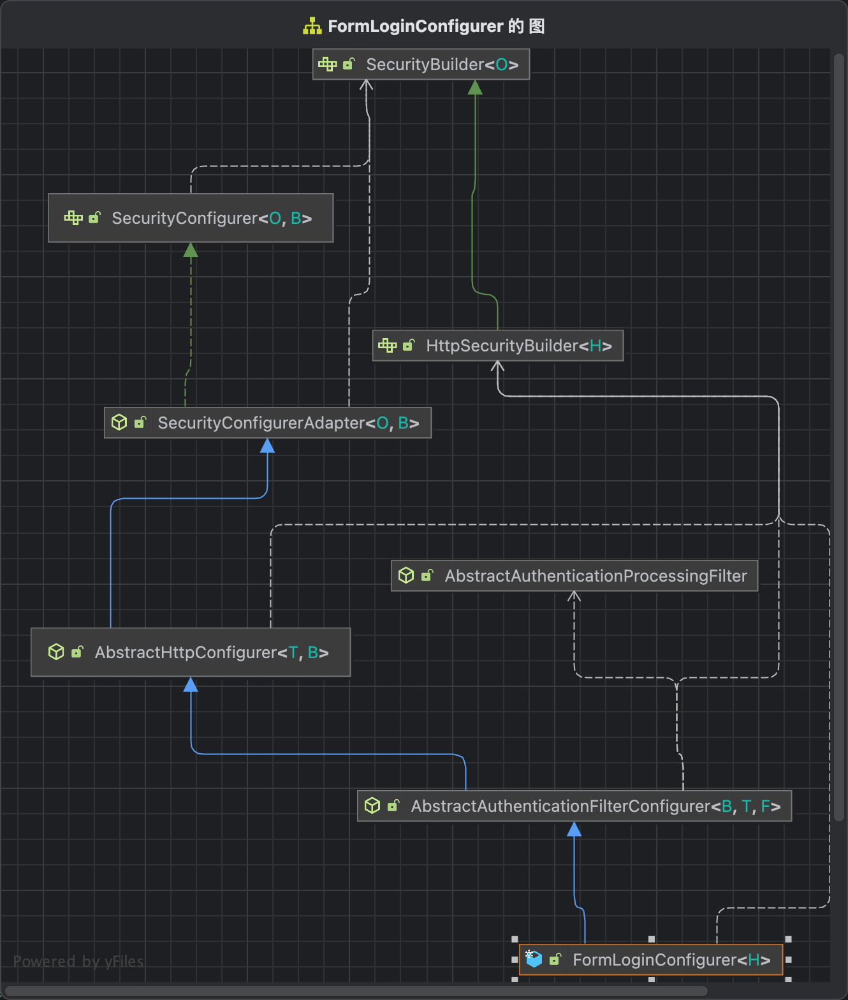

前面有提到过，http.httpBasic其实是往HttpSecurit加入了FormLoginConfigurer这个configurer，而在HttpSecurity的build过程中，密切相关的是configurer#init跟configurer#configure方法，当然还有构造方法，所以我们先分析这三个接口。

首先看FormLoginConfigurer的初始化方法

``` FormLoginConfigurer
public final class FormLoginConfigurer<H extends HttpSecurityBuilder<H>> extends
		AbstractAuthenticationFilterConfigurer<H, FormLoginConfigurer<H>, UsernamePasswordAuthenticationFilter> {
  
  public FormLoginConfigurer() {
    // 可以看到，这里声明了一个UsernamePasswordAuthenticationFilter
    super(new UsernamePasswordAuthenticationFilter(), null);
    usernameParameter("username");
    passwordParameter("password");
  }
}
```

查看父类AbstractAuthenticationFilterConfigurer的构造函数，代码如下

```
public abstract class AbstractAuthenticationFilterConfigurer<B extends HttpSecurityBuilder<B>, T extends AbstractAuthenticationFilterConfigurer<B, T, F>, F extends AbstractAuthenticationProcessingFilter>
		extends AbstractHttpConfigurer<T, B> {

  private F authFilter;

  // 指定登录页面
  protected AbstractAuthenticationFilterConfigurer() {
    setLoginPage("/login");
  }

  protected AbstractAuthenticationFilterConfigurer(F authenticationFilter, String defaultLoginProcessingUrl) {
    this();
    // 将之前的UsernamePasswordAuthenticationFilter赋予this.authFilter
    this.authFilter = authenticationFilter;
    // 指定默认的登录处理url
    if (defaultLoginProcessingUrl != null) {
      loginProcessingUrl(defaultLoginProcessingUrl);
    }
  }

  public T loginProcessingUrl(String loginProcessingUrl) {
    this.loginProcessingUrl = loginProcessingUrl;
    // 设置登录请求URL的requestMatcher
    this.authFilter.setRequiresAuthenticationRequestMatcher(createLoginProcessingUrlMatcher(loginProcessingUrl));
    return getSelf();
  }
}
```

注意UsernamePasswordAuthenticationFilter是重点，这个就是在过滤链中负责用户登录的过滤器。

接下来我们看AbstractAuthenticationFilterConfigurer的init函数，看一下做了什么事情。

``` AbstractAuthenticationFilterConfigurer
public abstract class AbstractAuthenticationFilterConfigurer<B extends HttpSecurityBuilder<B>, T extends AbstractAuthenticationFilterConfigurer<B, T, F>, F extends AbstractAuthenticationProcessingFilter>
		extends AbstractHttpConfigurer<T, B> {
	
  @Override
  public void init(B http) throws Exception {
    updateAuthenticationDefaults();
    updateAccessDefaults(http);
    registerDefaultAuthenticationEntryPoint(http);
  }

  protected final void updateAuthenticationDefaults() {
    // 如果loginProcessingUrl为空，那么就将loginPage设置为loginProcessingUrl
		if (this.loginProcessingUrl == null) {
			loginProcessingUrl(this.loginPage);
		}
    // 如果没有failureHandler，就把failureUrl设置为loginPage + "?error"
		if (this.failureHandler == null) {
			failureUrl(this.loginPage + "?error");
		}
		LogoutConfigurer<B> logoutConfigurer = getBuilder().getConfigurer(LogoutConfigurer.class);
    // 查看是否有LogoutConfigurer，如果不为空，且不是自定义的登出，就把logoutSuccessUrl设置为this.loginPage + "?logout"
    if (logoutConfigurer != null && !logoutConfigurer.isCustomLogoutSuccess()) {
			logoutConfigurer.logoutSuccessUrl(this.loginPage + "?logout");
		}
	}

  protected final void updateAccessDefaults(B http) {
    // 如果this.permitAll为true，会对this.loginPage, this.loginProcessingUrl, this.failureUrl默认放行
    if (this.permitAll) {
      PermitAllSupport.permitAll(http, this.loginPage, this.loginProcessingUrl, this.failureUrl);
    }
	}

  // 后面再讲
  protected final void registerDefaultAuthenticationEntryPoint(B http) {
    registerAuthenticationEntryPoint(http, this.authenticationEntryPoint);
  }
}
```

可以看到init方法主要是对loginPage，loginProcessUrl，failureUrl，logoutSuccessUrl等进行配置和放行。

我们再看看里面的configure方法，看看做了什么。

``` AbstractAuthenticationFilterConfigurer
public abstract class AbstractAuthenticationFilterConfigurer<B extends HttpSecurityBuilder<B>, T extends AbstractAuthenticationFilterConfigurer<B, T, F>, F extends AbstractAuthenticationProcessingFilter>
		extends AbstractHttpConfigurer<T, B> {
  
  @Override
  public void configure(B http) throws Exception {
    PortMapper portMapper = http.getSharedObject(PortMapper.class);
    if (portMapper != null) {
      this.authenticationEntryPoint.setPortMapper(portMapper);
    }
    RequestCache requestCache = http.getSharedObject(RequestCache.class);
    if (requestCache != null) {
      this.defaultSuccessHandler.setRequestCache(requestCache);
    }
    // 设置AuthenticationManager，这个在HttpSecurity的beforeConfigure初始化
    this.authFilter.setAuthenticationManager(http.getSharedObject(AuthenticationManager.class));
    this.authFilter.setAuthenticationSuccessHandler(this.successHandler);
    this.authFilter.setAuthenticationFailureHandler(this.failureHandler);
    if (this.authenticationDetailsSource != null) {
      this.authFilter.setAuthenticationDetailsSource(this.authenticationDetailsSource);
    }
    // 获取Session认证策略，后面讲Session会话的时候会讲到
    SessionAuthenticationStrategy sessionAuthenticationStrategy = http
      .getSharedObject(SessionAuthenticationStrategy.class);
    if (sessionAuthenticationStrategy != null) {
      this.authFilter.setSessionAuthenticationStrategy(sessionAuthenticationStrategy);
    }
    // 如果开启了rememberMeServices，配置rememberMeServices
    RememberMeServices rememberMeServices = http.getSharedObject(RememberMeServices.class);
    if (rememberMeServices != null) {
      this.authFilter.setRememberMeServices(rememberMeServices);
    }
    // 设置securityContextRepository仓库，后面会提到
    SecurityContextConfigurer securityContextConfigurer = http.getConfigurer(SecurityContextConfigurer.class);
    if (securityContextConfigurer != null && securityContextConfigurer.isRequireExplicitSave()) {
      SecurityContextRepository securityContextRepository = securityContextConfigurer
        .getSecurityContextRepository();
      this.authFilter.setSecurityContextRepository(securityContextRepository);
    }
    // 配置securityContextHolderStrategy，后面Session章节会讲到
    this.authFilter.setSecurityContextHolderStrategy(getSecurityContextHolderStrategy());
    F filter = postProcess(this.authFilter);
    http.addFilter(filter);
  }
}
```

可以看到configure方法主要是对UsernamePasswordAuthenticationFilter做了一些设置和初始化。这里有必要说一下AbstractAuthenticationFilterConfigurer，因为后面如果我们要自定义自己的认证逻辑，很大可能会继承这个类来做。


## UsernamePasswordAuthenticationFilter

上面我们知道了FormLoginConfigurer主要是往过SecurityFilterChain加入UsernamePasswordAuthenticationFilter这个过滤器。

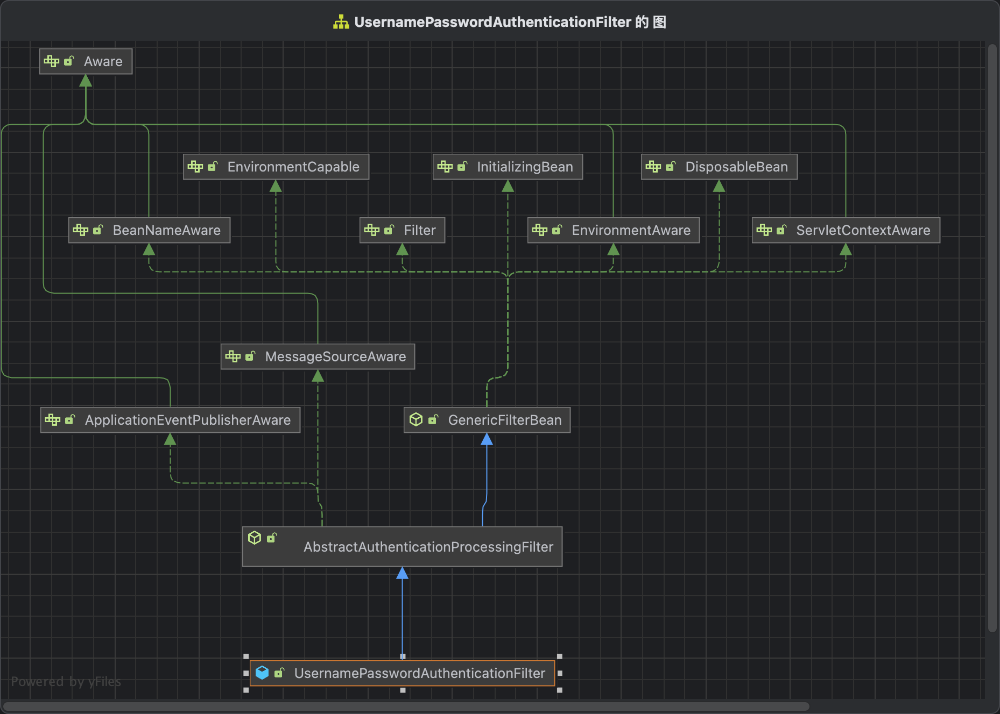

由于SecurityFilterChain在遍历每个Filter的时候，都会调用每个Filter的doFilter方法。所以我们直接看doFilter，这个方法是在UsernamePasswordAuthenticationFilter的父类AbstractAuthenticationProcessingFilter进行声明的。

```
public abstract class AbstractAuthenticationProcessingFilter extends GenericFilterBean
		implements ApplicationEventPublisherAware, MessageSourceAware {
  
  @Override
  public void doFilter(ServletRequest request, ServletResponse response, FilterChain chain)
      throws IOException, ServletException {
    doFilter((HttpServletRequest) request, (HttpServletResponse) response, chain);
  }

  private void doFilter(HttpServletRequest request, HttpServletResponse response, FilterChain chain)
      throws IOException, ServletException {
    // 如果不需要认证，直接跳过，执行下一个过滤器
    if (!requiresAuthentication(request, response)) {
      chain.doFilter(request, response);
      return;
    }
    try {
      // 获取一个经过认证的Authentication对象
      Authentication authenticationResult = attemptAuthentication(request, response);
      // 如果结果为空，直接返回
      if (authenticationResult == null) {
        // return immediately as subclass has indicated that it hasn't completed
        return;
      }
      // 调用sessionStrategy来处理session并发问题，session会话章节会讲到
      this.sessionStrategy.onAuthentication(authenticationResult, request, response);
      // Authentication success
      // 判断过滤器链还需不需要往下走，默认不需要
      if (this.continueChainBeforeSuccessfulAuthentication) {
        chain.doFilter(request, response);
      }
      //成功认证，对应的逻辑会在Seesion章节讲解
      successfulAuthentication(request, response, chain, authenticationResult);
    }
    catch (InternalAuthenticationServiceException failed) {
      this.logger.error("An internal error occurred while trying to authenticate the user.", failed);
      // 认证失败
      unsuccessfulAuthentication(request, response, failed);
    }
    catch (AuthenticationException ex) {
      // Authentication failed
      unsuccessfulAuthentication(request, response, ex);
    }
  }

  protected boolean requiresAuthentication(HttpServletRequest request, HttpServletResponse response) {
    if (this.requiresAuthenticationRequestMatcher.matches(request)) {
      return true;
    }
    ...
    return false;
  }

  protected void successfulAuthentication(HttpServletRequest request, HttpServletResponse response, FilterChain chain,
      Authentication authResult) throws IOException, ServletException {
    SecurityContext context = this.securityContextHolderStrategy.createEmptyContext();
    context.setAuthentication(authResult);
    this.securityContextHolderStrategy.setContext(context);
    this.securityContextRepository.saveContext(context, request, response);
    if (this.logger.isDebugEnabled()) {
      this.logger.debug(LogMessage.format("Set SecurityContextHolder to %s", authResult));
    }
    this.rememberMeServices.loginSuccess(request, response, authResult);
    if (this.eventPublisher != null) {
      this.eventPublisher.publishEvent(new InteractiveAuthenticationSuccessEvent(authResult, this.getClass()));
    }
    this.successHandler.onAuthenticationSuccess(request, response, authResult);
  }
}
```

可以看到，主要是调用子类的attemptAuthentication，即UsernamePasswordAuthenticationFilter，接下来看这个方法:

``` UsernamePasswordAuthenticationFilter
public class UsernamePasswordAuthenticationFilter extends AbstractAuthenticationProcessingFilter {
  @Override
  public Authentication attemptAuthentication(HttpServletRequest request, HttpServletResponse response)
      throws AuthenticationException {
    // 校验请求方法是否正确，只接受POST请求
    if (this.postOnly && !request.getMethod().equals("POST")) {
      throw new AuthenticationServiceException("Authentication method not supported: " + request.getMethod());
    }
    // 获取parameter中的username
    String username = obtainUsername(request);
    username = (username != null) ? username.trim() : "";
    // 获取parameter中的password
    String password = obtainPassword(request);
    password = (password != null) ? password : "";
    // 构造一个未经过认证的UsernamePasswordAuthenticationToken
    UsernamePasswordAuthenticationToken authRequest = UsernamePasswordAuthenticationToken.unauthenticated(username,
        password);
    // Allow subclasses to set the "details" property
    setDetails(request, authRequest);
    // 认证请求，返回一个经过认证的UsernamePasswordAuthenticationToken
    return this.getAuthenticationManager().authenticate(authRequest);
  }
	
  @Nullable
  protected String obtainUsername(HttpServletRequest request) {
    return request.getParameter(this.usernameParameter);
  }

  protected AuthenticationManager getAuthenticationManager() {
    return this.authenticationManager;
  }
}
```

可以看到现在主要调用this.getAuthenticationManager().authenticate(authRequest)来进行验证。

接下来就讲解Spring Security关于认证相关的类和请求了。

## AuthenticationManager

AuthenticationManager是一个认证管理器，它定义了Spring Security要怎么处理认证操作。可以看到AuthenticationManager在认证成功之后会返回一个Authentication对象。这个对象会保存在SecurityContextHoler中（后面章节会讲到，现在可以理解为, 认证成功之后， 要找一个地方保存用户信息，用户再次请求，需要找到该认证信息, 确认用户身份）。

```
@FunctionalInterface
public interface AuthenticationManager {
	Authentication authenticate(Authentication authentication) throws AuthenticationException;
}
```

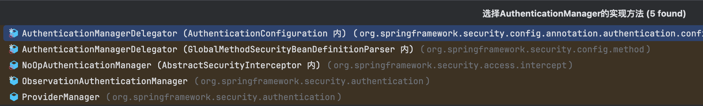

默认的实现类为ProviderManager。这个类是在HttpSecurity的beforeConfigure方法初始化的。


```
public final class HttpSecurity extends AbstractConfiguredSecurityBuilder<DefaultSecurityFilterChain, HttpSecurity>
		implements SecurityBuilder<DefaultSecurityFilterChain>, HttpSecurityBuilder<HttpSecurity> {
	
  @Override
  protected void beforeConfigure() throws Exception {
    if (this.authenticationManager != null) {
      setSharedObject(AuthenticationManager.class, this.authenticationManager);
    }
    else {
      ObjectPostProcessor<AuthenticationManager> postProcessor = getAuthenticationManagerPostProcessor();
      AuthenticationManager manager = getAuthenticationRegistry().build();
      if (manager != null) {
        setSharedObject(AuthenticationManager.class, postProcessor.postProcess(manager));
      }
    }
  }
}
```

在HttpSecurity继承FormLoginConfigurer，可以看里面的configure方法，是在AbstractAuthenticationFilterConfigurer中实现的。

```
``` AbstractAuthenticationFilterConfigurer
public abstract class AbstractAuthenticationFilterConfigurer<B extends HttpSecurityBuilder<B>, T extends AbstractAuthenticationFilterConfigurer<B, T, F>, F extends AbstractAuthenticationProcessingFilter>
		extends AbstractHttpConfigurer<T, B> {
  
  @Override
  public void configure(B http) throws Exception {
    this.authFilter.setAuthenticationManager(http.getSharedObject(AuthenticationManager.class));
  }
}
```

## ProviderManager

可以看到UsernamePasswordAuthenticationFilter是调用AuthenticationManager的authenticate方法进行注册的。所以我们直接看ProviderManager#authenticate。

```
public class ProviderManager implements AuthenticationManager, MessageSourceAware, InitializingBean {

  private List<AuthenticationProvider> providers = Collections.emptyList();

  @Override
  public Authentication authenticate(Authentication authentication) throws AuthenticationException {
    Class<? extends Authentication> toTest = authentication.getClass();
    AuthenticationException lastException = null;
    AuthenticationException parentException = null;
    Authentication result = null;
    Authentication parentResult = null;
    int currentPosition = 0;
    int size = this.providers.size();
    // 遍历this.providers
    for (AuthenticationProvider provider : getProviders()) {
      // 如果不支持认证则跳过
      if (!provider.supports(toTest)) {
        continue;
      }
      try {
        // 认证
        result = provider.authenticate(authentication);
        // 结果不为空，说明认证成功, 将认证信息保存到result
        if (result != null) {
          copyDetails(authentication, result);
          break;
        }
      }
      catch (AccountStatusException | InternalAuthenticationServiceException ex) {
        prepareException(ex, authentication);
        // SEC-546: Avoid polling additional providers if auth failure is due to
        // invalid account status
        throw ex;
      }
      catch (AuthenticationException ex) {
        lastException = ex;
      }
    }
    // 如果认证结果为空，并且ProviderManager有父类，调用父类的authenticate方法
    if (result == null && this.parent != null) {
      // Allow the parent to try.
      try {
        parentResult = this.parent.authenticate(authentication);
        result = parentResult;
      }
      catch (ProviderNotFoundException ex) {
        // ignore as we will throw below if no other exception occurred prior to
        // calling parent and the parent
        // may throw ProviderNotFound even though a provider in the child already
        // handled the request
      }
      catch (AuthenticationException ex) {
        parentException = ex;
        lastException = ex;
      }
    }
    // 如果认证结果不为空
    if (result != null) {
      // 擦除用户的凭证，可以认为是用户的密码
      if (this.eraseCredentialsAfterAuthentication && (result instanceof CredentialsContainer)) {
        // Authentication is complete. Remove credentials and other secret data
        // from authentication
        ((CredentialsContainer) result).eraseCredentials();
      }
      // If the parent AuthenticationManager was attempted and successful then it
      // will publish an AuthenticationSuccessEvent
      // This check prevents a duplicate AuthenticationSuccessEvent if the parent
      // AuthenticationManager already published it
      // 发布认证成功时间
      if (parentResult == null) {
        this.eventPublisher.publishAuthenticationSuccess(result);
      }

      return result;
    }
    
    // 认证失败，返回异常
    // Parent was null, or didn't authenticate (or throw an exception).
    if (lastException == null) {
      lastException = new ProviderNotFoundException(this.messages.getMessage("ProviderManager.providerNotFound",
          new Object[] { toTest.getName() }, "No AuthenticationProvider found for {0}"));
    }
    if (parentException == null) {
      prepareException(lastException, authentication);
    }
    throw lastException;
  }
}
```

可以看到是遍历providers，找到合适的provider进行校验。

## Authentication

可以看到查找provider是根据Authentication来查找的，解析一下这个类。Authentication类就是用来存放用户的认证信息。具体代码如下所示：

``` Authentication
public interface Authentication extends Principal, Serializable {
  // 获取用户权限
  Collection<? extends GrantedAuthority> getAuthorities();
  // 获取用户凭证，一般是用户密码
  Object getCredentials();
  // 用户的详细信息
  Object getDetails();
  // 获取用户信息，可能是一个用户名，也可以是用户对象，可以认为是唯一标记用户的对象
  Object getPrincipal();
  // 是否已经认证
  boolean isAuthenticated();
  // 设置认证信息
  void setAuthenticated(boolean isAuthenticated) throws IllegalArgumentException;
}
```

可以看到只要获取到了Authentication对象，就可以获取到登录用户的详细信息。不同的认证方法对应不同的认证信息，比如用户/密码登录，OAuth2登录，RememberMe登录等，认证信息是不一样的，所以针对不同的认证方式会有不同的Authentication实现，既然Authentication都不一样了，具体认证的AuthenticationProvider也要不一样，这就很好理解了。

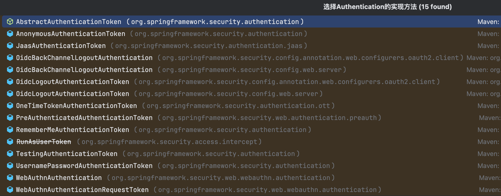

SpringSecurity默认提供了15个Authentication的实现。我们大概讲一下几个比较重要的：

- RememberMeAuthenticationToken: 如果使用RememberMe的方式，用户的信息保存在RememberMeAuthenticationToken中
- UsernamePasswordAuthenticationToken: 如果使用FormLogin的方式，用户的信息保存在UsernamePasswordAuthenticationToken中

这里每一种实现，都会有对应的AuthenticationProvider做验证，比如UsernamePasswordAuthenticationToken使用的是DaoAuthenticationProvider

## AuthenticationProvider

可以看到AuthenticationProvider接口就只有两个方法。

``` AuthenticationProvider
public interface AuthenticationProvider {
  // 认证方法
  Authentication authenticate(Authentication authentication) throws AuthenticationException;
  // 是否支持认证
  boolean supports(Class<?> authentication);
}
```

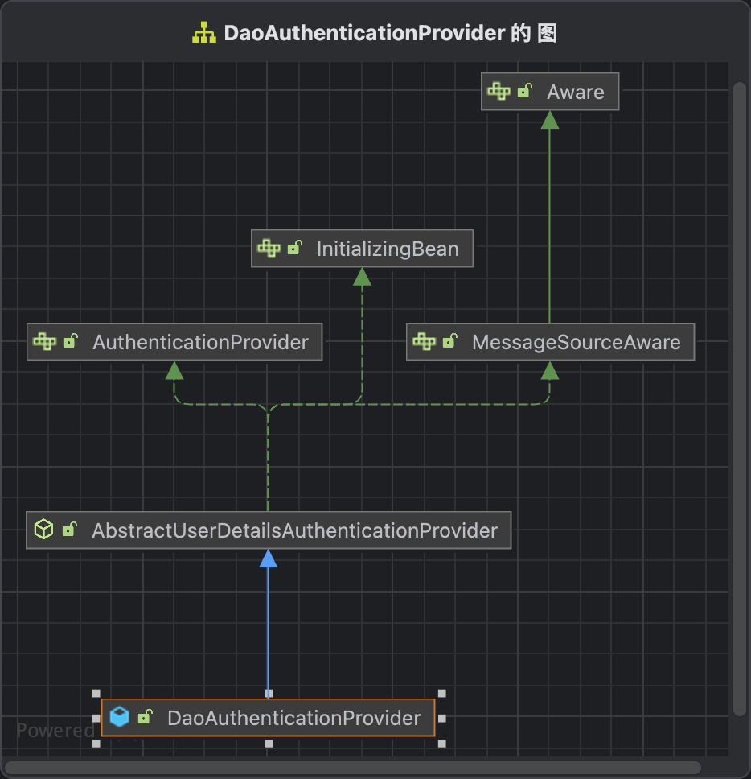

接下来我们分析DaoAuthenticationProvider对于AuthenticationProvider的实现，具体实现是在AbstractUserDetailsAuthenticationProvider中

``` AbstractUserDetailsAuthenticationProvider
public abstract class AbstractUserDetailsAuthenticationProvider
		implements AuthenticationProvider, InitializingBean, MessageSourceAware {
	
  @Override
	public boolean supports(Class<?> authentication) {
		return (UsernamePasswordAuthenticationToken.class.isAssignableFrom(authentication));
	}

  @Override
  public Authentication authenticate(Authentication authentication) throws AuthenticationException {
    // 获取用户名字
    String username = determineUsername(authentication);
    boolean cacheWasUsed = true;
    // 从缓存里面拿user，默认不使用缓存
    UserDetails user = this.userCache.getUserFromCache(username);
    if (user == null) {
      cacheWasUsed = false;
      try {
        // 调用DaoAuthenticationProvider的retrieveUser获取用户
        user = retrieveUser(username, (UsernamePasswordAuthenticationToken) authentication);
      }
      catch (UsernameNotFoundException ex) {
        this.logger.debug("Failed to find user '" + username + "'");
        if (!this.hideUserNotFoundExceptions) {
          throw ex;
        }
        throw new BadCredentialsException(this.messages
          .getMessage("AbstractUserDetailsAuthenticationProvider.badCredentials", "Bad credentials"));
      }
      Assert.notNull(user, "retrieveUser returned null - a violation of the interface contract");
    }
    try {
      // 校验用户状态，比如账户是否被锁定，账户是否可用，账户是否过期等等
      this.preAuthenticationChecks.check(user);
      // 校验密码，DaoAuthenticationProvider实现
      additionalAuthenticationChecks(user, (UsernamePasswordAuthenticationToken) authentication);
    }
    catch (AuthenticationException ex) {
      if (!cacheWasUsed) {
        throw ex;
      }
      // There was a problem, so try again after checking
      // we're using latest data (i.e. not from the cache)
      cacheWasUsed = false;
      user = retrieveUser(username, (UsernamePasswordAuthenticationToken) authentication);
      this.preAuthenticationChecks.check(user);
      additionalAuthenticationChecks(user, (UsernamePasswordAuthenticationToken) authentication);
    }
    this.postAuthenticationChecks.check(user);
    if (!cacheWasUsed) {
      this.userCache.putUserInCache(user);
    }
    Object principalToReturn = user;
    if (this.forcePrincipalAsString) {
      principalToReturn = user.getUsername();
    }
    // 创建成功的Authentication
    return createSuccessAuthentication(principalToReturn, authentication, user);
  }

  protected Authentication createSuccessAuthentication(Object principal, Authentication authentication,
			UserDetails user) {
		UsernamePasswordAuthenticationToken result = UsernamePasswordAuthenticationToken.authenticated(principal,
				authentication.getCredentials(), this.authoritiesMapper.mapAuthorities(user.getAuthorities()));
		result.setDetails(authentication.getDetails());
		this.logger.debug("Authenticated user");
		return result;
	}
}
```

接下来我们查看DaoAuthenticationProvider对应方法的实现

```
public class DaoAuthenticationProvider extends AbstractUserDetailsAuthenticationProvider {
  @Override
  protected final UserDetails retrieveUser(String username, UsernamePasswordAuthenticationToken authentication)
      throws AuthenticationException {
    // 预防prepareTimingAttackProtection攻击
    prepareTimingAttackProtection();
    try {
      // 获取UserDetail
      UserDetails loadedUser = this.getUserDetailsService().loadUserByUsername(username);
      if (loadedUser == null) {
        throw new InternalAuthenticationServiceException(
            "UserDetailsService returned null, which is an interface contract violation");
      }
      return loadedUser;
    }
    catch (UsernameNotFoundException ex) {
      mitigateAgainstTimingAttack(authentication);
      throw ex;
    }
    catch (InternalAuthenticationServiceException ex) {
      throw ex;
    }
    catch (Exception ex) {
      throw new InternalAuthenticationServiceException(ex.getMessage(), ex);
    }
  }

  @Override
  @SuppressWarnings("deprecation")
  protected void additionalAuthenticationChecks(UserDetails userDetails,
      UsernamePasswordAuthenticationToken authentication) throws AuthenticationException {
    // 获取用户凭证
    if (authentication.getCredentials() == null) {
      this.logger.debug("Failed to authenticate since no credentials provided");
      throw new BadCredentialsException(this.messages
        .getMessage("AbstractUserDetailsAuthenticationProvider.badCredentials", "Bad credentials"));
    }
    String presentedPassword = authentication.getCredentials().toString();
    // 对比用户信息的凭证跟传上来的凭证是否一致，使用passwordEncoder对比的
    if (!this.passwordEncoder.matches(presentedPassword, userDetails.getPassword())) {
      this.logger.debug("Failed to authenticate since password does not match stored value");
      throw new BadCredentialsException(this.messages
        .getMessage("AbstractUserDetailsAuthenticationProvider.badCredentials", "Bad credentials"));
    }
  }
}
```

好了，表单登录的基本流程到这里结束了。

## 认证流程总结

接下来对Spring Security的认证过程做一个总结

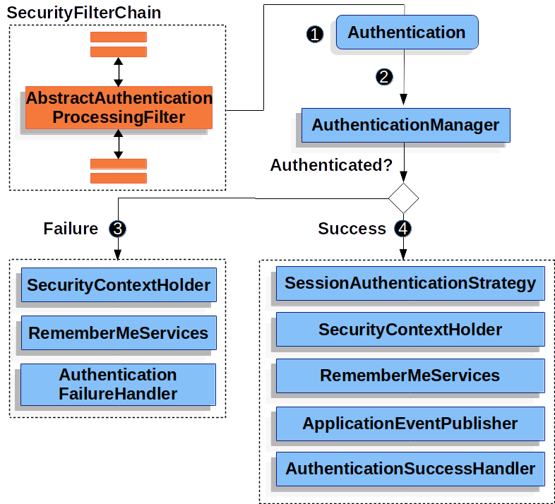

当请求经过Spring Security的SecurityFilterChain后，认证过滤器AbstractAuthenticationProcessingFilter会生成一个Authentication对象，将这个对象交给AuthenticationManager进行认证，认证成功则会走认证成功逻辑，失败则走失败认证逻辑

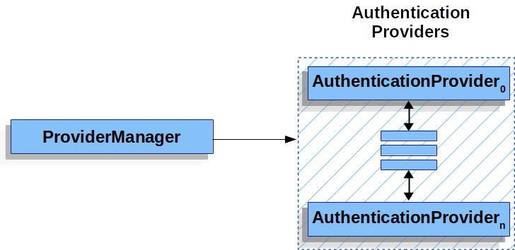

默认的AuthenticationManager实现是ProviderManager， ProviderManager会遍历自己管理的AuthenticationProvider列表，对Authentication对象进行认证，认证成功返回成功的Authentication对象

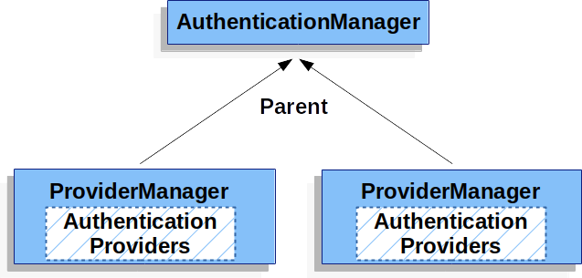

如果ProviderManager认证失败，会将认证转交给自己的父类AuthenticationManager进行认证。

## 补充

在DaoAuthenticationProvider的retrieveUser方法中，用到了UserDetailsService这个类，在调用this.getUserDetailsService().loadUserByUsername(username)的时候;

很容易看出这是获取用户信息的，我们看一下UserDetailsService的定义：

``` UserDetailsService
public interface UserDetailsService {
	UserDetails loadUserByUsername(String username) throws UsernameNotFoundException;
}
```

查看UserDetailsService有哪些实现类，可以看到默认有6种，主要是下面两种：

- InMemoryUserDetailsManager: 把用户信息放在内存上进行查询
- JdbcUserDetailsManager: 使用JDBC从数据库中获取用户信息

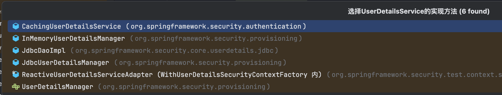

看了第一节配置用户信息那部分，很容易就知道DaoAuthenticationProvider的UserDetailsService默认就是自动配置的那个InMemoryUserDetailsManager。

``` UserDetailsServiceAutoConfiguration
@Bean
public InMemoryUserDetailsManager inMemoryUserDetailsManager(SecurityProperties properties,
    ObjectProvider<PasswordEncoder> passwordEncoder) {
  SecurityProperties.User user = properties.getUser();
  List<String> roles = user.getRoles();
  return new InMemoryUserDetailsManager(User.withUsername(user.getName())
    .password(getOrDeducePassword(user, passwordEncoder.getIfAvailable()))
    .roles(StringUtils.toStringArray(roles))
    .build());
}
```

那么这个UserDetailsService是怎么设置到DaoAuthenticationProvider的呢？

还有一个问题, 我们知道ProviderManager是在HttpSecurity的beforeConfigure中初始化，DaoAuthenticationProvider又是什么时候注册到ProviderManager里面的呢？

之前分析过，Spring Boot继承Spring Security的时候会自动注入@EnableWebSecurity这个注解，我们重新看一下这个注解

``` EnableWebSecurity
@Import({ WebSecurityConfiguration.class, SpringWebMvcImportSelector.class, OAuth2ImportSelector.class,
		HttpSecurityConfiguration.class, ObservationImportSelector.class })
@EnableGlobalAuthentication
public @interface EnableWebSecurity {
  ...
}
```

可以看到引入@EnableGlobalAuthentication这个注解，查看这个注解

``` EnableGlobalAuthentication
@Import(AuthenticationConfiguration.class)
public @interface EnableGlobalAuthentication {

}
```

可以看到引入了AuthenticationConfiguration.class这个类，看名字就知道是认证配置的类，那我们就详细来了解一下这个类。

``` AuthenticationConfiguration
@Configuration(proxyBeanMethods = false)
@Import(ObjectPostProcessorConfiguration.class)
public class AuthenticationConfiguration {
  @Bean
  public AuthenticationManagerBuilder authenticationManagerBuilder(ObjectPostProcessor<Object> objectPostProcessor,
      ApplicationContext context) {
    LazyPasswordEncoder defaultPasswordEncoder = new LazyPasswordEncoder(context);
    AuthenticationEventPublisher authenticationEventPublisher = getAuthenticationEventPublisher(context);
    DefaultPasswordEncoderAuthenticationManagerBuilder result = new DefaultPasswordEncoderAuthenticationManagerBuilder(
        objectPostProcessor, defaultPasswordEncoder);
    if (authenticationEventPublisher != null) {
      result.authenticationEventPublisher(authenticationEventPublisher);
    }
    return result;
  }

  @Bean
  public static GlobalAuthenticationConfigurerAdapter enableGlobalAuthenticationAutowiredConfigurer(
      ApplicationContext context) {
    return new EnableGlobalAuthenticationAutowiredConfigurer(context);
  }

  @Bean
  public static InitializeUserDetailsBeanManagerConfigurer initializeUserDetailsBeanManagerConfigurer(
      ApplicationContext context) {
    return new InitializeUserDetailsBeanManagerConfigurer(context);
  }

  @Bean
  public static InitializeAuthenticationProviderBeanManagerConfigurer initializeAuthenticationProviderBeanManagerConfigurer(
      ApplicationContext context) {
    return new InitializeAuthenticationProviderBeanManagerConfigurer(context);
  }

  @Autowired(required = false)
  public void setGlobalAuthenticationConfigurers(List<GlobalAuthenticationConfigurerAdapter> configurers) {
    configurers.sort(AnnotationAwareOrderComparator.INSTANCE);
    this.globalAuthConfigurers = configurers;
  }
}
```

可以看到声明了好几个Bean，下面说明一下这几个Bean。

- AuthenticationManagerBuilder: AuthenticationManager构建器，返回一个AuthenticationManagerBuilder，用来构造AuthenticationManager，默认实现是DefaultPasswordEncoderAuthenticationManagerBuilder。
- GlobalAuthenticationConfigurerAdapter: 返回一个EnableGlobalAuthenticationAutowiredConfigurer，可以认为什么都不干，不重要
- InitializeUserDetailsBeanManagerConfigurer：看这个Bean的名字就知道跟UserDetailsService有关了，后面分析
- InitializeAuthenticationProviderBeanManagerConfigurer: 看这个Bean的名字就知道跟AuthenticationProvider有关了，后面分析

InitializeUserDetailsBeanManagerConfigurer跟InitializeAuthenticationProviderBeanManagerConfigurer都继承了GlobalAuthenticationConfigurerAdapter这个类

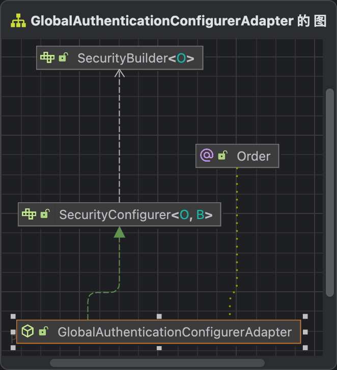

看继承图，是不是很熟悉，肯定有init跟configure方法。刚好注入这两个类的是setGlobalAuthenticationConfigurers，把它们赋给globalAuthConfigurers。

接下来我们回看声明HttpSecurity Bean的代码。

```
@Configuration(proxyBeanMethods = false)
class HttpSecurityConfiguration {
  @Bean(HTTPSECURITY_BEAN_NAME)
  @Scope("prototype")
  HttpSecurity httpSecurity() throws Exception {
    LazyPasswordEncoder passwordEncoder = new LazyPasswordEncoder(this.context);
    // 重新声明一个DefaultPasswordEncoderAuthenticationManagerBuilder
    AuthenticationManagerBuilder authenticationBuilder = new DefaultPasswordEncoderAuthenticationManagerBuilder(
        this.objectPostProcessor, passwordEncoder);
    // 把上面AuthenticationConfiguration声明的AuthenticationManagerBuilder设置为authenticationBuilder的parent
    authenticationBuilder.parentAuthenticationManager(authenticationManager());
    authenticationBuilder.authenticationEventPublisher(getAuthenticationEventPublisher());
    HttpSecurity http = new HttpSecurity(this.objectPostProcessor, authenticationBuilder, createSharedObjects());
    ...
  }

  private AuthenticationManager authenticationManager() throws Exception {
    return this.authenticationConfiguration.getAuthenticationManager();
  }

  @Autowired
  void setAuthenticationConfiguration(AuthenticationConfiguration authenticationConfiguration) {
    this.authenticationConfiguration = authenticationConfiguration;
  }
}
```

authenticationManager()实际调用的是上面声明的AuthenticationConfiguration的getAuthenticationManager方法，我们查看这个方法。

``` AuthenticationConfiguration
public class AuthenticationConfiguration {
  public AuthenticationManager getAuthenticationManager() throws Exception {
    // 如果已经初始化，直接返回
    if (this.authenticationManagerInitialized) {
      return this.authenticationManager;
    }
    // 获取AuthenticationManagerBuilder，就是AuthenticationConfiguration声明的DefaultPasswordEncoderAuthenticationManagerBuilder
    AuthenticationManagerBuilder authBuilder = this.applicationContext.getBean(AuthenticationManagerBuilder.class);
    if (this.buildingAuthenticationManager.getAndSet(true)) {
      return new AuthenticationManagerDelegator(authBuilder);
    }
    // 直接把this.globalAuthConfigurer apply到AuthenticationManagerBuilder
    // InitializeUserDetailsBeanManagerConfigurer跟InitializeAuthenticationProviderBeanManagerConfigurer
    for (GlobalAuthenticationConfigurerAdapter config : this.globalAuthConfigurers) {
      authBuilder.apply(config);
    }
    // 执行AuthenticationManagerBuilder构建函数
    this.authenticationManager = authBuilder.build();
    if (this.authenticationManager == null) {
      this.authenticationManager = getAuthenticationManagerBean();
    }
    this.authenticationManagerInitialized = true;
    return this.authenticationManager;
  }
}
```

查看AuthenticationManagerBuilder的继承图，是不是很熟悉。

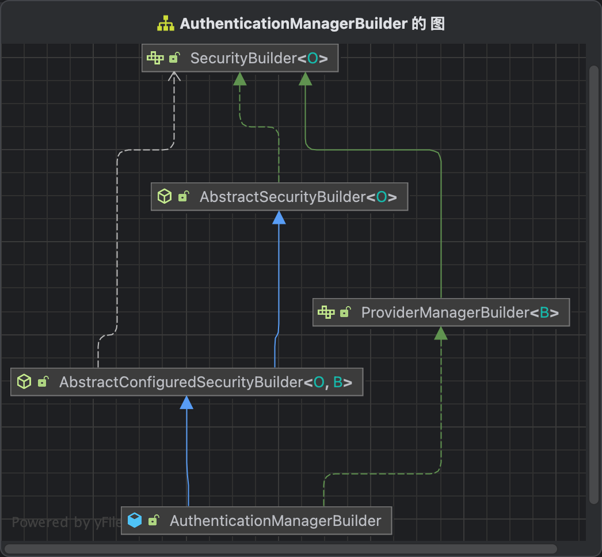

容易看出，authBuilder.build()会遍历globalAuthConfigurers，执行init方法跟configure方法。

### InitializeUserDetailsBeanManagerConfigurer

先看InitializeUserDetailsBeanManagerConfigurer，具体代码如下

```
@Order(InitializeUserDetailsBeanManagerConfigurer.DEFAULT_ORDER)
class InitializeUserDetailsBeanManagerConfigurer extends GlobalAuthenticationConfigurerAdapter {
	@Override
	public void init(AuthenticationManagerBuilder auth) throws Exception {
		auth.apply(new InitializeUserDetailsManagerConfigurer());
	}

  class InitializeUserDetailsManagerConfigurer extends GlobalAuthenticationConfigurerAdapter {
    @Override
    public void configure(AuthenticationManagerBuilder auth) throws Exception {
      // 获取所有UserDetailsService的BeanName
      String[] beanNames = InitializeUserDetailsBeanManagerConfigurer.this.context
        .getBeanNamesForType(UserDetailsService.class);
      if (auth.isConfigured()) {
        return;
      }

      if (beanNames.length == 0) {
        return;
      }
      else if (beanNames.length > 1) {
        return;
      }
      // 获取第1个UserDetailsService
      UserDetailsService userDetailsService = InitializeUserDetailsBeanManagerConfigurer.this.context
        .getBean(beanNames[0], UserDetailsService.class);
      PasswordEncoder passwordEncoder = getBeanOrNull(PasswordEncoder.class);
      UserDetailsPasswordService passwordManager = getBeanOrNull(UserDetailsPasswordService.class);
      CompromisedPasswordChecker passwordChecker = getBeanOrNull(CompromisedPasswordChecker.class);
      // 初始化一个DaoAuthenticationProvider
      DaoAuthenticationProvider provider;
      if (passwordEncoder != null) {
        provider = new DaoAuthenticationProvider(passwordEncoder);
      }
      else {
        provider = new DaoAuthenticationProvider();
      }
      // 设置DaoAuthenticationProvider的userDetailsService为上面拿到的userDetailsService
      provider.setUserDetailsService(userDetailsService);
      if (passwordManager != null) {
        provider.setUserDetailsPasswordService(passwordManager);
      }
      if (passwordChecker != null) {
        provider.setCompromisedPasswordChecker(passwordChecker);
      }
      provider.afterPropertiesSet();
      // 把DaoAuthenticationProvider加入到AuthenticationManagerBuilder中
      auth.authenticationProvider(provider);
      this.logger.info(LogMessage.format(
          "Global AuthenticationManager configured with UserDetailsService bean with name %s", beanNames[0]));
    }
  }
}
```

可以看出来，这里是初始化了DaoAuthenticationProvider，并把UserDetailsService设置到DaoAuthenticationProvider。

```
@Order(InitializeAuthenticationProviderBeanManagerConfigurer.DEFAULT_ORDER)
class InitializeAuthenticationProviderBeanManagerConfigurer extends GlobalAuthenticationConfigurerAdapter {
	@Override
	public void init(AuthenticationManagerBuilder auth) throws Exception {
		auth.apply(new InitializeAuthenticationProviderManagerConfigurer());
	}

  class InitializeAuthenticationProviderManagerConfigurer extends GlobalAuthenticationConfigurerAdapter {
    @Override
		public void configure(AuthenticationManagerBuilder auth) {
			if (auth.isConfigured()) {
				return;
			}
			String[] beanNames = InitializeAuthenticationProviderBeanManagerConfigurer.this.context
				.getBeanNamesForType(AuthenticationProvider.class);
			if (beanNames.length == 0) {
				return;
			}
			else if (beanNames.length > 1) {
				return;
			}
			AuthenticationProvider authenticationProvider = InitializeAuthenticationProviderBeanManagerConfigurer.this.context
				.getBean(beanNames[0], AuthenticationProvider.class);
			auth.authenticationProvider(authenticationProvider);
		}
  }
}
```

这里就是从spring中获取AuthenticationProvider的Bean，注册到AuthenticationManagerBuilder。

最后让我们看一下DefaultPasswordEncoderAuthenticationManagerBuilder的performBuild方法，该类继承了AuthenticationManagerBuilder

``` AuthenticationManagerBuilder
public class AuthenticationManagerBuilder
		extends AbstractConfiguredSecurityBuilder<AuthenticationManager, AuthenticationManagerBuilder>
		implements ProviderManagerBuilder<AuthenticationManagerBuilder> {
	@Override
	protected ProviderManager performBuild() throws Exception {
		if (!isConfigured()) {
			this.logger.debug("No authenticationProviders and no parentAuthenticationManager defined. Returning null.");
			return null;
		}
		ProviderManager providerManager = new ProviderManager(this.authenticationProviders,
				this.parentAuthenticationManager);
		if (this.eraseCredentials != null) {
			providerManager.setEraseCredentialsAfterAuthentication(this.eraseCredentials);
		}
		if (this.eventPublisher != null) {
			providerManager.setAuthenticationEventPublisher(this.eventPublisher);
		}
		providerManager = postProcess(providerManager);
		return providerManager;
	}
}
```

可以看到就是返回了一个providerManager，这个就是HttpSecurity里面的providerManager的父类providerManager。

而HttpSecurity里面的providerManager之前提过了是在HttpSecurity的beforeConfigure构建的。

<!-- 综上所述，AuthenticationConfiguration中构建的ProvierManager是全局的AuthenticationManager，而每个Http Security构建的ProvierManager是局部的AuthenticationManager，
全局的AuthenticationManager是局部AuthenticationManager的父类，如果Http Security的认证失败，会调用全局的AuthenticationManager进行认证。 -->

