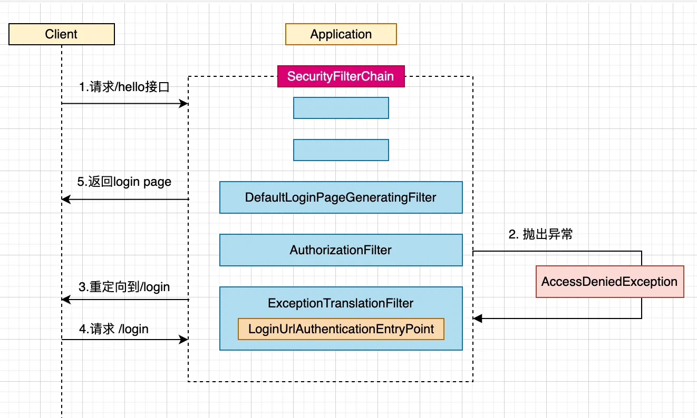

# 异常处理

这里回看一下第一章的登录流程分析。



之前有提到过如果用户的请求未经过认证，会在AuthorizationFilter中被拦截，然后抛出AccessDeniedException异常，然后异常会被ExceptionTranslationFilter捕获，重定向到登录页面。本章节就来详细分析这个流程。

通过查看FilterOrderRegistration的过滤器链顺序，我们可以知道AuthorizationFilter的优先级排倒数第二，ExceptionTranslationFilter排倒数第四，所以可以知道如果前面的过滤器没有异常，必然最后会经过这两个过滤器。

## ExceptionHandlingConfigurer

``` HttpSecurityConfiguration
@Configuration(proxyBeanMethods = false)
class HttpSecurityConfiguration {
  @Bean(HTTPSECURITY_BEAN_NAME)
  @Scope("prototype")
  HttpSecurity httpSecurity() throws Exception {
    HttpSecurity http = new HttpSecurity(this.objectPostProcessor, authenticationBuilder, createSharedObjects());
    http.exceptionHandling(withDefaults())
    return http;
  }
}
```

先看httpSecurity Bean的声明函数，可以看到调用了exceptionHandling，而这个方法引入了ExceptionHandlingConfigurer。

``` HttpSecurity
public final class HttpSecurity extends AbstractConfiguredSecurityBuilder<DefaultSecurityFilterChain, HttpSecurity>
		implements SecurityBuilder<DefaultSecurityFilterChain>, HttpSecurityBuilder<HttpSecurity> {
	
  public HttpSecurity exceptionHandling(
			Customizer<ExceptionHandlingConfigurer<HttpSecurity>> exceptionHandlingCustomizer) throws Exception {
		exceptionHandlingCustomizer.customize(getOrApply(new ExceptionHandlingConfigurer<>()));
		return HttpSecurity.this;
	}
}
```

按照惯例，我们看一下ExceptionHandlingConfigurer的方法，由于该类没有实现init方法，直接看configure方法

```
public final class ExceptionHandlingConfigurer<H extends HttpSecurityBuilder<H>>
		extends AbstractHttpConfigurer<ExceptionHandlingConfigurer<H>, H> {
	@Override
	public void configure(H http) {
		AuthenticationEntryPoint entryPoint = getAuthenticationEntryPoint(http);
		ExceptionTranslationFilter exceptionTranslationFilter = new ExceptionTranslationFilter(entryPoint,
				getRequestCache(http));
		AccessDeniedHandler deniedHandler = getAccessDeniedHandler(http);
		exceptionTranslationFilter.setAccessDeniedHandler(deniedHandler);
		exceptionTranslationFilter.setSecurityContextHolderStrategy(getSecurityContextHolderStrategy());
		exceptionTranslationFilter = postProcess(exceptionTranslationFilter);
		http.addFilter(exceptionTranslationFilter);
	}

  AuthenticationEntryPoint getAuthenticationEntryPoint(H http) {
    AuthenticationEntryPoint entryPoint = this.authenticationEntryPoint;
    if (entryPoint == null) {
      entryPoint = createDefaultEntryPoint(http);
    }
    return entryPoint;
  }
}
```

可以看到往过滤器中加入了一个异常过滤器：ExceptionTranslationFilter

## ExceptionTranslationFilter

Spring Security中的异常处理主要是在ExceptionTranslationFilter中完成的，该过滤器主要处理AuthenticationException和AccessDeniedException异常，其他的异常则继续抛出。我们先来看看代码

```ExceptionTranslationFilter
public class ExceptionTranslationFilter extends GenericFilterBean implements MessageSourceAware {
  private void doFilter(HttpServletRequest request, HttpServletResponse response, FilterChain chain)
      throws IOException, ServletException {
    try {
      chain.doFilter(request, response);
    }
    catch (IOException ex) {
      throw ex;
    }
    catch (Exception ex) {
      // Try to extract a SpringSecurityException from the stacktrace
      Throwable[] causeChain = this.throwableAnalyzer.determineCauseChain(ex);
      // 看是不是AuthenticationException
      RuntimeException securityException = (AuthenticationException) this.throwableAnalyzer
        .getFirstThrowableOfType(AuthenticationException.class, causeChain);
      // 如果不是AuthenticationException，看是不是AccessDeniedException
      if (securityException == null) {
        securityException = (AccessDeniedException) this.throwableAnalyzer
          .getFirstThrowableOfType(AccessDeniedException.class, causeChain);
      }
      // 如果都不是，重新抛出去
      if (securityException == null) {
        rethrow(ex);
      }
      // 如果已经响应客户端，则抛出ServletException异常
      if (response.isCommitted()) {
        throw new ServletException("Unable to handle the Spring Security Exception "
            + "because the response is already committed.", ex);
      }
      // 处理AuthenticationException或者AccessDeniedException
      handleSpringSecurityException(request, response, chain, securityException);
    }
  }

  private void handleSpringSecurityException(HttpServletRequest request, HttpServletResponse response,
      FilterChain chain, RuntimeException exception) throws IOException, ServletException {
    if (exception instanceof AuthenticationException) {
      handleAuthenticationException(request, response, chain, (AuthenticationException) exception);
    }
    else if (exception instanceof AccessDeniedException) {
      handleAccessDeniedException(request, response, chain, (AccessDeniedException) exception);
    }
  }
}
```

### AuthenticationException

我们先看处理AuthenticationException(认证异常)的流程。

```ExceptionTranslationFilter
public class ExceptionTranslationFilter extends GenericFilterBean implements MessageSourceAware {
  private void handleAuthenticationException(HttpServletRequest request, HttpServletResponse response,
        FilterChain chain, AuthenticationException exception) throws ServletException, IOException {
      this.logger.trace("Sending to authentication entry point since authentication failed", exception);
      sendStartAuthentication(request, response, chain, exception);
    }

  protected void sendStartAuthentication(HttpServletRequest request, HttpServletResponse response, FilterChain chain,
      AuthenticationException reason) throws ServletException, IOException {
    // SEC-112: Clear the SecurityContextHolder's Authentication, as the
    // existing Authentication is no longer considered valid
    SecurityContext context = this.securityContextHolderStrategy.createEmptyContext();
    this.securityContextHolderStrategy.setContext(context);
    this.requestCache.saveRequest(request, response);
    this.authenticationEntryPoint.commence(request, response, reason);
  }
}
```

主要做了三件事，清除请求中的认证主体，保存当前请求，调用authenticationEntryPoint.commence的失败认证方法。我们看看authenticationEntryPoint是在哪里初始化的。

```
public final class ExceptionHandlingConfigurer<H extends HttpSecurityBuilder<H>>
		extends AbstractHttpConfigurer<ExceptionHandlingConfigurer<H>, H> {

  private AuthenticationEntryPoint authenticationEntryPoint;

	@Override
  public void configure(H http) {
    AuthenticationEntryPoint entryPoint = getAuthenticationEntryPoint(http);
    ExceptionTranslationFilter exceptionTranslationFilter = new ExceptionTranslationFilter(entryPoint,
      getRequestCache(http));
    ...
  }

  public ExceptionHandlingConfigurer<H> authenticationEntryPoint(AuthenticationEntryPoint authenticationEntryPoint) {
    this.authenticationEntryPoint = authenticationEntryPoint;
    return this;
  }

  AuthenticationEntryPoint getAuthenticationEntryPoint(H http) {
    AuthenticationEntryPoint entryPoint = this.authenticationEntryPoint;
    if (entryPoint == null) {
      entryPoint = createDefaultEntryPoint(http);
    }
    return entryPoint;
  }

  private LinkedHashMap<RequestMatcher, AuthenticationEntryPoint> defaultEntryPointMappings = new LinkedHashMap<>();

  public ExceptionHandlingConfigurer<H> defaultAuthenticationEntryPointFor(AuthenticationEntryPoint entryPoint,
      RequestMatcher preferredMatcher) {
    this.defaultEntryPointMappings.put(preferredMatcher, entryPoint);
    return this;
  }

  private AuthenticationEntryPoint createDefaultEntryPoint(H http) {
    if (this.defaultEntryPointMappings.isEmpty()) {
      return new Http403ForbiddenEntryPoint();
    }
    if (this.defaultEntryPointMappings.size() == 1) {
      return this.defaultEntryPointMappings.values().iterator().next();
    }
    DelegatingAuthenticationEntryPoint entryPoint = new DelegatingAuthenticationEntryPoint(
        this.defaultEntryPointMappings);
    entryPoint.setDefaultEntryPoint(this.defaultEntryPointMappings.values().iterator().next());
    return entryPoint;
  }
}
```

可以看到有两种方法可以定义。

- 如果this.authenticationEntryPoint存在，那么返回this.authenticationEntryPoint，通过authenticationEntryPoint配置
- 如果this.authenticationEntryPoint不存在，则基于defaultEntryPointMappings构建一个复合DelegatingAuthenticationEntryPoint，这个可以耦合很多个authenticationEntryPoint，从中筛选。

让我们查看DelegatingAuthenticationEntryPoint的处理方法，代码如下。

``` DelegatingAuthenticationEntryPoint
public class DelegatingAuthenticationEntryPoint implements AuthenticationEntryPoint, InitializingBean {
  @Override
  public void commence(HttpServletRequest request, HttpServletResponse response,
      AuthenticationException authException) throws IOException, ServletException {
    for (RequestMatcher requestMatcher : this.entryPoints.keySet()) {
      logger.debug(LogMessage.format("Trying to match using %s", requestMatcher));
      if (requestMatcher.matches(request)) {
        AuthenticationEntryPoint entryPoint = this.entryPoints.get(requestMatcher);
        logger.debug(LogMessage.format("Match found! Executing %s", entryPoint));
        entryPoint.commence(request, response, authException);
        return;
      }
    }
    logger.debug(LogMessage.format("No match found. Using default entry point %s", this.defaultEntryPoint));
    // No EntryPoint matched, use defaultEntryPoint
    this.defaultEntryPoint.commence(request, response, authException);
  }
}
```

可以看到会遍历entryPoints集合中entryPoint的的matches函数，如果复合，就调用entryPoint的commence方法。为了扩展性，还是推荐使用第二种方法。

- 表单登录在AbstractAuthenticationFilterConfigurer#registerAuthenticationEntryPoint中会向defaultEntryPointMappings加入一个LoginUrlAuthenticationEntryPoint，自动跳转到登录页面
- HttpBasic在HttpBasicConfigurer#registerDefaultEntryPoint中向defaultEntryPointMappings加入一个BasicAuthenticationEntryPoint，返回认证请求


由于现在基本上都是前后端分离相关，我们写一个返回认证失败的请求。直接拿之前的代码做修改。

新增一个CustomerHandler文件，用来处理异常认证请求。代码如下

``` CustomerHandler
public class CustomerHandler {
  public static void commence(HttpServletRequest request, HttpServletResponse response, AuthenticationException authException) throws IOException {
    ObjectMapper objectMapper = BeanUtil.getBean(ObjectMapper.class);
    CustomResponseImpl failureResponse = new CustomResponseImpl();
    failureResponse.setCode("401");
    failureResponse.setMsg("没有权限访问该路径，请登录后重试");
    response.setHeader(HttpHeaders.CONTENT_TYPE, "application/json;charset=UTF-8");
    response.getWriter().write(objectMapper.writeValueAsString(failureResponse));
  }
}
```

SecurityConfig文件代码如下:

``` DefaultSecurityConfig
@Configuration
public class DefaultSecurityConfig {
  @Bean
  SecurityFilterChain apiSecurityFilterChain(HttpSecurity http) throws Exception {
    http.authorizeHttpRequests(requests -> requests.anyRequest().authenticated());
    http.formLogin(Customizer.withDefaults());
    http.exceptionHandling(exceptionHandling -> exceptionHandling.authenticationEntryPoint(CustomerHandler::commence));
    return http.build();
  }
}
```

启动项目，打开浏览器直接访问/user接口，窗口直接返回认证失败的错误信息。

```
{"msg":"没有权限访问该路径，请登录后重试","status":401}
```

具体代码，点击[此处](https://github.com/shengduiliang/spring-security-demo/tree/main/spring-security-exception-handler)

### AccessDeniedException

我们再看一下AccessDeniedException的处理，

``` ExceptionTranslationFilter
public class ExceptionTranslationFilter extends GenericFilterBean implements MessageSourceAware {
  private void handleAccessDeniedException(HttpServletRequest request, HttpServletResponse response,
      FilterChain chain, AccessDeniedException exception) throws ServletException, IOException {
    Authentication authentication = this.securityContextHolderStrategy.getContext().getAuthentication();
    boolean isAnonymous = this.authenticationTrustResolver.isAnonymous(authentication);
    // 如果是匿名用户，或者是通过Remember登录的，则调用AuthenticationException处理
    if (isAnonymous || this.authenticationTrustResolver.isRememberMe(authentication)) {
      if (logger.isTraceEnabled()) {
        logger.trace(LogMessage.format("Sending %s to authentication entry point since access is denied",
            authentication), exception);
      }
      sendStartAuthentication(request, response, chain,
          new InsufficientAuthenticationException(
              this.messages.getMessage("ExceptionTranslationFilter.insufficientAuthentication",
                  "Full authentication is required to access this resource")));
    }
    else {
      if (logger.isTraceEnabled()) {
        logger.trace(
            LogMessage.format("Sending %s to access denied handler since access is denied", authentication),
            exception);
      }
      // 否则调用accessDeniedHandler.handle
      this.accessDeniedHandler.handle(request, response, exception);
    }
  }
}
```

由于accessDeniedHandler的处理跟authenticationEntryPoint类似，可以直接参照源码解读。

## AuthorizationFilter

那么ExceptionTranslationFilter捕获的异常是在哪里获取的呢，是在ExceptionTranslationFilter抛出的。查看AuthorizationFilter的doFilter

```AuthorizationFilter
public class AuthorizationFilter extends GenericFilterBean {
  @Override
  public void doFilter(ServletRequest servletRequest, ServletResponse servletResponse, FilterChain chain)
      throws ServletException, IOException {

    HttpServletRequest request = (HttpServletRequest) servletRequest;
    HttpServletResponse response = (HttpServletResponse) servletResponse;

    if (this.observeOncePerRequest && isApplied(request)) {
      chain.doFilter(request, response);
      return;
    }

    if (skipDispatch(request)) {
      chain.doFilter(request, response);
      return;
    }

    String alreadyFilteredAttributeName = getAlreadyFilteredAttributeName();
    request.setAttribute(alreadyFilteredAttributeName, Boolean.TRUE);
    try {
      AuthorizationResult result = this.authorizationManager.authorize(this::getAuthentication, request);
      this.eventPublisher.publishAuthorizationEvent(this::getAuthentication, request, result);
      // 如果权限异常，那么抛出AuthorizationDeniedException
      if (result != null && !result.isGranted()) {
        throw new AuthorizationDeniedException("Access Denied", result);
      }
      chain.doFilter(request, response);
    }
    finally {
      request.removeAttribute(alreadyFilteredAttributeName);
    }
  }
}
```

AuthorizationFilter是在AuthorizeHttpRequestsConfigurer中加入的，但是AuthorizeHttpRequestsConfigurer是在什么时候加入的还需梳理。