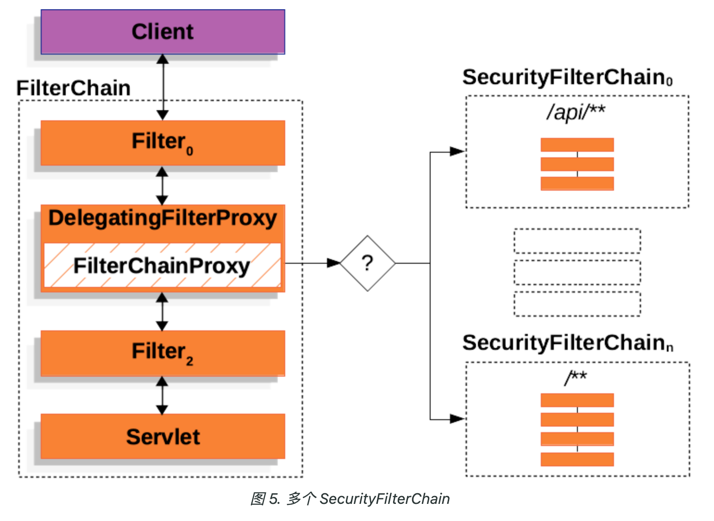
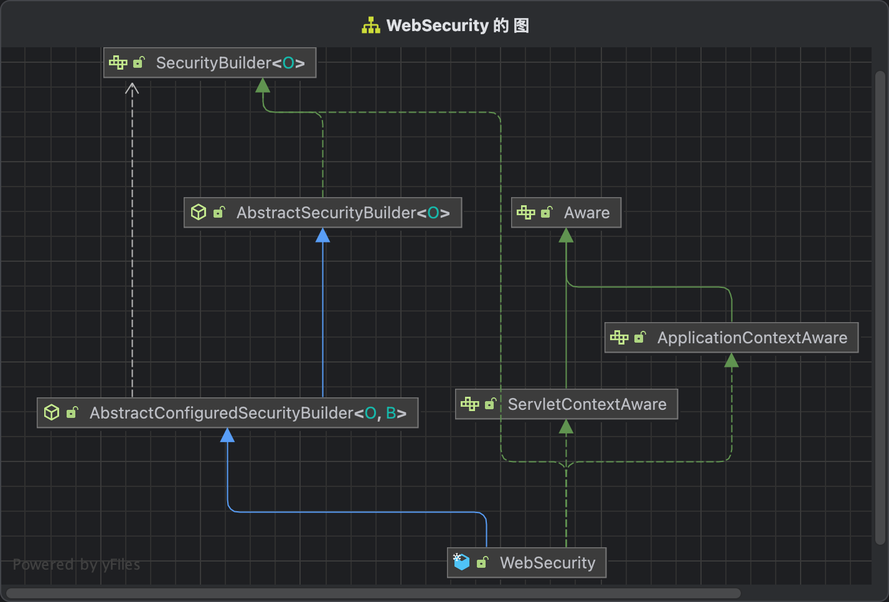
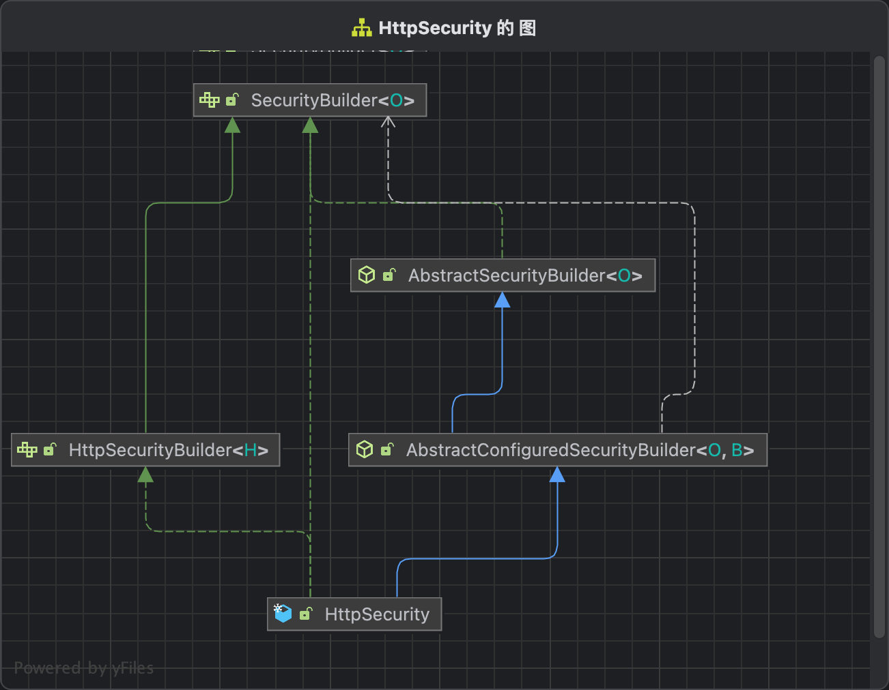
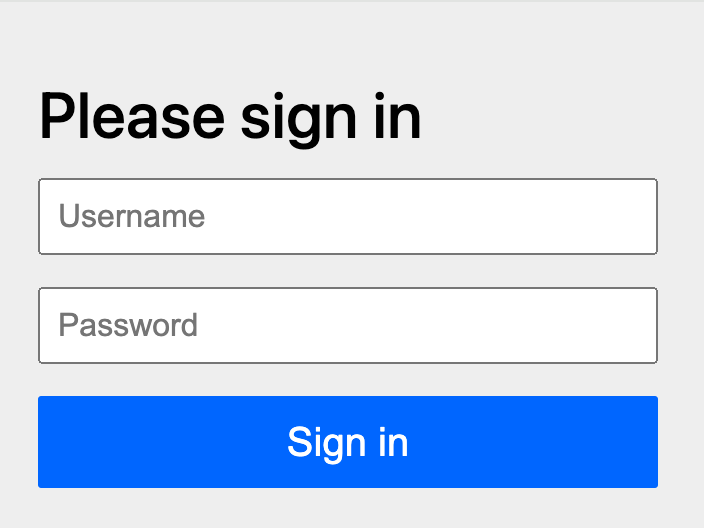
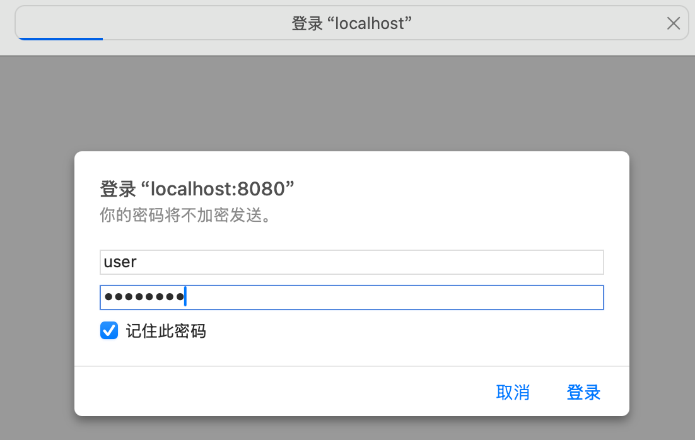

# Spring Security启动流程与架构设计分析

在讲解基于表单认证等的认证流程之前，本人觉得有必要先讲解一下Spring Security的系统架构图，以及各种过滤器链的启动流程，这样子后面在讲解认证流程的时候，能更好理解一些。

## 架构设计

官方参照文档：https://docs.spring.io/spring-security/reference/servlet/architecture.html



下面对最终的架构图结合Spring Security的源代码进行详细讲解。

## FilterChain

Spring Security是基于Servlet的过滤器来实现的。当客户端向服务端发送请求的时候，会经过Servlet的一个个过滤器，就是上图的FilterChain。想要了解Servlet的过滤器，可以参照 https://juejin.cn/post/6878948441335660558 。

在Spring Security初始化的过程中，会向Servlet中注册一个DelegatingFilterProxy过滤器，由该过滤器处理请求。具体注册的位置在AbstractSecurityWebApplicationInitializer

``` AbstractSecurityWebApplicationInitializer
public abstract class AbstractSecurityWebApplicationInitializer
  implements WebApplicationInitializer {
  
  @Override
  public final void onStartup(ServletContext servletContext) {
    ...
    insertSpringSecurityFilterChain(servletContext);
    ...
  }

  private void insertSpringSecurityFilterChain(ServletContext servletContext) {
    // springSecurityFilterChain
    String filterName = DEFAULT_FILTER_NAME;
    DelegatingFilterProxy springSecurityFilterChain = new DelegatingFilterProxy(filterName);
    String contextAttribute = getWebApplicationContextAttribute();
    if (contextAttribute != null) {
      springSecurityFilterChain.setContextAttribute(contextAttribute);
    }
    // 注册DelegatingFilterProxy
    registerFilter(servletContext, true, filterName, springSecurityFilterChain);
  }
}
```

AbstractSecurityWebApplicationInitializer集成了WebApplicationInitializer接口，在服务器启动的时候，会检测WebApplicationInitializer接口的实现类，并且自动调用onStartup方法来配置servletContext，这里向Servlet注册了一个DelegatingFilterProxy拦截器。注意上面的FilterName为springSecurityFilterChain，下文会用到。


## DelegatingFilterProxy

由于Servlet在调用拦截器的时候，会自动调用拦截器的doFilter方法，我们直接看DelegatingFilterProxy的doFilter的doFilter方法。

```
public class DelegatingFilterProxy extends GenericFilterBean {
  public void doFilter(ServletRequest request, ServletResponse response, FilterChain filterChain) throws ServletException, IOException {
    Filter delegateToUse = this.delegate;
    if (delegateToUse == null) {
      this.delegateLock.lock();

      try {
        delegateToUse = this.delegate;
        if (delegateToUse == null) {
          WebApplicationContext wac = this.findWebApplicationContext();
          if (wac == null) {
            throw new IllegalStateException("No WebApplicationContext found: no ContextLoaderListener or DispatcherServlet registered?");
          }
          // 查找代理的拦截器
          delegateToUse = this.initDelegate(wac);
        }

        this.delegate = delegateToUse;
      } finally {
        this.delegateLock.unlock();
      }
    }
    // 调用代理的拦截器
    this.invokeDelegate(delegateToUse, request, response, filterChain);
  }

  protected Filter initDelegate(WebApplicationContext wac) throws ServletException {
    // 这里的targetBeanName就是上文提到的springSecurityFilterChain
    String targetBeanName = this.getTargetBeanName();
    Assert.state(targetBeanName != null, "No target bean name set");
    // 通过WebApplicationContext的getBean获取拦截器
    Filter delegate = (Filter)wac.getBean(targetBeanName, Filter.class);
    if (this.isTargetFilterLifecycle()) {
      delegate.init(this.getFilterConfig());
    }

    return delegate;
  }

  // 执行代理拦截器的doFilter方法
  protected void invokeDelegate(Filter delegate, ServletRequest request, ServletResponse response, FilterChain filterChain) throws ServletException, IOException {
    delegate.doFilter(request, response, filterChain);
  }
}
```

具体调用的拦截器是什么呢，就是上面架构图的FilterChainProxy。

## FilterChainProxy

下面我们看看FilterChainProxy是什么时候注册到Spring中，成为Spring的一个Bean的。

打开之前Spring Boot为Spring Security自动配置的类SecurityAutoConfiguration，可以看到导入了SpringBootWebSecurityConfiguration类

``` SecurityAutoConfiguration
@AutoConfiguration(before = UserDetailsServiceAutoConfiguration.class)
@ConditionalOnClass(DefaultAuthenticationEventPublisher.class)
@EnableConfigurationProperties(SecurityProperties.class)
@Import({ SpringBootWebSecurityConfiguration.class, SecurityDataConfiguration.class })
public class SecurityAutoConfiguration {
  ...
}
```

打开SpringBootWebSecurityConfiguration这个类，可以看到WebSecurityEnablerConfiguration上面实现了@EnableWebSecurity注解

``` SpringBootWebSecurityConfiguration
@Configuration(proxyBeanMethods = false)
@ConditionalOnWebApplication(type = Type.SERVLET)
class SpringBootWebSecurityConfiguration {
  @Configuration(proxyBeanMethods = false)
	@ConditionalOnMissingBean(name = BeanIds.SPRING_SECURITY_FILTER_CHAIN)
	@ConditionalOnClass(EnableWebSecurity.class)
	@EnableWebSecurity
	static class WebSecurityEnablerConfiguration {

	}
}
```

继续看@EnableWebSecurity注解实现，可以看到导入了WebSecurityConfiguration这个类

``` EnableWebSecurity
@Retention(RetentionPolicy.RUNTIME)
@Target(ElementType.TYPE)
@Documented
@Import({ WebSecurityConfiguration.class, SpringWebMvcImportSelector.class, OAuth2ImportSelector.class,
		HttpSecurityConfiguration.class, ObservationImportSelector.class })
@EnableGlobalAuthentication
public @interface EnableWebSecurity {
	boolean debug() default false;
}
```

点进WebSecurityConfiguration这个类，可以看到这个类声明了一个Bean，Bean的名字就是springSecurityFilterChain。

```
@Configuration(proxyBeanMethods = false)
public class WebSecurityConfiguration implements ImportAware, BeanClassLoaderAware {
  @Bean(name = AbstractSecurityWebApplicationInitializer.DEFAULT_FILTER_NAME)
  public Filter springSecurityFilterChain() throws Exception {
    boolean hasFilterChain = !this.securityFilterChains.isEmpty();
    // 如果没有过滤器链，默认构造一个，可以看到这里注册的httpSecurity跟自动配置的是同一个配置
    if (!hasFilterChain) {
      this.webSecurity.addSecurityFilterChainBuilder(() -> {
        this.httpSecurity.authorizeHttpRequests((authorize) -> authorize.anyRequest().authenticated());
        this.httpSecurity.formLogin(Customizer.withDefaults());
        this.httpSecurity.httpBasic(Customizer.withDefaults());
        return this.httpSecurity.build();
      });
    }
    for (SecurityFilterChain securityFilterChain : this.securityFilterChains) {
      this.webSecurity.addSecurityFilterChainBuilder(() -> securityFilterChain);
    }
    for (WebSecurityCustomizer customizer : this.webSecurityCustomizers) {
      customizer.customize(this.webSecurity);
    }
    // 构建SecurityFilterChain
    return this.webSecurity.build();
  }
}
```

this.webSecurity.build()这里就是用于生成上面架构图右边的所有SecurityFilterChain。webSecurity也是在WebSecurityConfiguration里面进行配置的

```
@Autowired(required = false)
public void setFilterChainProxySecurityConfigurer(ObjectPostProcessor<Object> objectPostProcessor,
    ConfigurableListableBeanFactory beanFactory) throws Exception {
  // this.webSecurity赋值
  this.webSecurity = objectPostProcessor.postProcess(new WebSecurity(objectPostProcessor));
  if (this.debugEnabled != null) {
    this.webSecurity.debug(this.debugEnabled);
  }
  // 扫描获取SecurityConfigurer列表
  List<SecurityConfigurer<Filter, WebSecurity>> webSecurityConfigurers = new AutowiredWebSecurityConfigurersIgnoreParents(
      beanFactory)
    .getWebSecurityConfigurers();
  // 对SecurityConfigurer进行排序
  webSecurityConfigurers.sort(AnnotationAwareOrderComparator.INSTANCE);
  Integer previousOrder = null;
  Object previousConfig = null;
  for (SecurityConfigurer<Filter, WebSecurity> config : webSecurityConfigurers) {
    Integer order = AnnotationAwareOrderComparator.lookupOrder(config);
    if (previousOrder != null && previousOrder.equals(order)) {
      throw new IllegalStateException("@Order on WebSecurityConfigurers must be unique. Order of " + order
          + " was already used on " + previousConfig + ", so it cannot be used on " + config + " too.");
    }
    previousOrder = order;
    previousConfig = config;
  }
  // 把所有的webSecurityConfigurer放入webSecurity
  for (SecurityConfigurer<Filter, WebSecurity> webSecurityConfigurer : webSecurityConfigurers) {
    this.webSecurity.apply(webSecurityConfigurer);
  }
  this.webSecurityConfigurers = webSecurityConfigurers;
}
```

可以看到上面使用了@Autowired，是Spring自动导入的。Spring Security6的webSecurityConfigurers列表是空的，所以可以认为这里只是构建了一个webSecurity赋值给this.webSecurity。

在spring security5.7之前，Spring Security的配置方式是下面这种。WebSecurityConfigurerAdapter就是继承了SecurityConfigurer，后面不用了。

```
@Configuration
public class SecurityConfig extends WebSecurityConfigurerAdapter {
  @Override
  protected void configure(HttpSecurity http) throws Exception {
    http.authorizeRequests()
      .antMatchers("/vc.jpg").permitAll()
      .anyRequest().authenticated()
      .and()
      .formLogin()
      .loginPage("/mylogin.html")
      .loginProcessingUrl("/doLogin")
      .defaultSuccessUrl("/index.html")
      .failureForwardUrl("/mylogin.html")
      .usernameParameter("uname")
      .passwordParameter("passwd")
      .permitAll()
      .and()
      .csrf().disable();
  }
}
```

::: info
spring security抛弃WebSecurityConfigurerAdapter的说法如下：
1. 简化安全配置，降低开发者的学习曲线。
2. 使配置更加模块化、显式化和可维护。
3. 让 Spring Security 更加贴合 Spring 的现代配置风格。
4. 提供更灵活的 API，适应复杂的安全需求。
:::

## WebSecurity

由于FilterChainProxy是通过WebSecurity#build方法构建的，所以我们来看看这个方法做了什么事情。

首先我们看看WebSecurity的类继承图



当执行WebSecurity#build方法的时候，实际上执行的是AbstractSecurityBuilder#build方法，查看该方法

``` AbstractSecurityBuilder
public abstract class AbstractSecurityBuilder<O> implements SecurityBuilder<O> {
  private AtomicBoolean building = new AtomicBoolean();

  @Override
	public final O build() throws Exception {
    // 防止重复初始化
    if (this.building.compareAndSet(false, true)) {
      this.object = doBuild();
      return this.object;
    }
    throw new AlreadyBuiltException("This object has already been built");
  }
}
```

调用了AbstractSecurityBuilder#doBuild方法，实际上执行的是AbstractConfiguredSecurityBuilder#doBuild方法，查看该方法

``` AbstractConfiguredSecurityBuilder
public abstract class AbstractConfiguredSecurityBuilder<O, B extends SecurityBuilder<O>>
		extends AbstractSecurityBuilder<O> {
  @Override
  protected final O doBuild() throws Exception {
    synchronized (this.configurers) {
      this.buildState = BuildState.INITIALIZING;
      beforeInit();
      // 执行所有SecurityConfigurer的init方法
      init();
      this.buildState = BuildState.CONFIGURING;
      beforeConfigure();
      // 执行所有SecurityConfigurer的configure方法
      configure();
      this.buildState = BuildState.BUILDING;
      // 核心方法performBuild
      O result = performBuild();
      this.buildState = BuildState.BUILT;
      return result;
    }
  }
}
```

调用了AbstractConfiguredSecurityBuilder#performBuild方法，实际上是调用Web Security#performBuild方法, 这个函数很长，我们只关注本节相关的内容

``` WebSecurity
public final class WebSecurity extends AbstractConfiguredSecurityBuilder<Filter, WebSecurity>
		implements SecurityBuilder<Filter>, ApplicationContextAware, ServletContextAware {

  protected Filter performBuild() throws Exception {
    ...
    // 获取securityFilterChain的个数
    int chainSize = this.ignoredRequests.size() + this.securityFilterChainBuilders.size();
    // 初始化securityFilterChains
    List<SecurityFilterChain> securityFilterChains = new ArrayList<>(chainSize);
    List<RequestMatcherEntry<List<WebInvocationPrivilegeEvaluator>>> requestMatcherPrivilegeEvaluatorsEntries = new ArrayList<>();
    // 对于ignoredRequests的请求，构建一条过滤器，直接放行
    for (RequestMatcher ignoredRequest : this.ignoredRequests) {
      WebSecurity.this.logger.warn("You are asking Spring Security to ignore " + ignoredRequest
          + ". This is not recommended -- please use permitAll via HttpSecurity#authorizeHttpRequests instead.");
      // 针对每个ignoredRequest，构造一个DefaultSecurityFilterChain，默认全部放行
      SecurityFilterChain securityFilterChain = new DefaultSecurityFilterChain(ignoredRequest);
      securityFilterChains.add(securityFilterChain);
      requestMatcherPrivilegeEvaluatorsEntries
        .add(getRequestMatcherPrivilegeEvaluatorsEntry(securityFilterChain));
    }
    DefaultSecurityFilterChain anyRequestFilterChain = null;
    // 对于用户配置的过滤器链，SecurityConfig中配置的过滤器，构建过滤器
    for (SecurityBuilder<? extends SecurityFilterChain> securityFilterChainBuilder : this.securityFilterChainBuilders) {
      // 构建securityFilterChain
      SecurityFilterChain securityFilterChain = securityFilterChainBuilder.build();
      ...
      if (securityFilterChain instanceof DefaultSecurityFilterChain defaultSecurityFilterChain) {
        if (defaultSecurityFilterChain.getRequestMatcher() instanceof AnyRequestMatcher) {
          anyRequestFilterChain = defaultSecurityFilterChain;
        }
      }
      // 加入到securityFilterChains
      securityFilterChains.add(securityFilterChain);
      requestMatcherPrivilegeEvaluatorsEntries
        .add(getRequestMatcherPrivilegeEvaluatorsEntry(securityFilterChain));
    }
    if (this.privilegeEvaluator == null) {
      this.privilegeEvaluator = new RequestMatcherDelegatingWebInvocationPrivilegeEvaluator(
          requestMatcherPrivilegeEvaluatorsEntries);
    }
    // 构建filterChainProxy
    FilterChainProxy filterChainProxy = new FilterChainProxy(securityFilterChains);
    if (this.httpFirewall != null) {
      filterChainProxy.setFirewall(this.httpFirewall);
    }
    if (this.requestRejectedHandler != null) {
      filterChainProxy.setRequestRejectedHandler(this.requestRejectedHandler);
    }
    else if (!this.observationRegistry.isNoop()) {
      CompositeRequestRejectedHandler requestRejectedHandler = new CompositeRequestRejectedHandler(
          new ObservationMarkingRequestRejectedHandler(this.observationRegistry),
          new HttpStatusRequestRejectedHandler());
      filterChainProxy.setRequestRejectedHandler(requestRejectedHandler);
    }
    filterChainProxy.setFilterChainDecorator(getFilterChainDecorator());
    filterChainProxy.afterPropertiesSet();

    Filter result = filterChainProxy;
    ...
    // 返回filterChainProxy
    return result;
  }
}
```

到现在为止，我们只要关心this.ignoredRequests跟this.securityFilterChainBuilders是怎么初始化的就可以了。


## SecurityFilterChain

让我重新回看WebSecurityConfiguration中的springSecurityFilterChain这个Bean

``` WebSecurityConfiguration
@Configuration(proxyBeanMethods = false)
public class WebSecurityConfiguration implements ImportAware, BeanClassLoaderAware {
  @Bean(name = AbstractSecurityWebApplicationInitializer.DEFAULT_FILTER_NAME)
  public Filter springSecurityFilterChain() throws Exception {
    ...
    // 遍历SecurityFilterChain，往WebSecurity中加入securityFilterChainBuilder
    for (SecurityFilterChain securityFilterChain : this.securityFilterChains) {
      this.webSecurity.addSecurityFilterChainBuilder(() -> securityFilterChain);
    }
    // 构建SecurityFilterChain
    return this.webSecurity.build();
  }
}
```

可以看到securityFilterChainBuilder#build返回的是一个SecurityFilterChain对象，这个对象是从哪里来的呢，找到WebSecurityConfiguration的securityFilterChains赋值的地方

``` WebSecurityConfiguration
@Configuration(proxyBeanMethods = false)
public class WebSecurityConfiguration implements ImportAware, BeanClassLoaderAware {
  // 通过Autowired注入securityFilterChains
  @Autowired(required = false)
  void setFilterChains(List<SecurityFilterChain> securityFilterChains) {
    this.securityFilterChains = securityFilterChains;
  }
}
```

::: info
这里注入的securityFilterChains是List类型，Spring框架会自动按照@Order注解进行排序，所以这里得到的就是有优先级的securityFilterChains了
:::

## HttpSecurity

查看SecurityFilterChain接口代码, 可以看到一共有两个方法。

``` SecurityFilterChain
public interface SecurityFilterChain {
  // 请求的request是否可以用该过滤器
  boolean matches(HttpServletRequest request);
  // 获取该过滤器链中所有的过滤器
  List<Filter> getFilters();
}
```

SecurityFilterChain这个接口只有一个实现类，就是DefaultSecurityFilterChain，查看这个类的代码

``` DefaultSecurityFilterChain
public final class DefaultSecurityFilterChain implements SecurityFilterChain, BeanNameAware, BeanFactoryAware {
  public DefaultSecurityFilterChain(RequestMatcher requestMatcher, List<Filter> filters) {
    ...
		this.requestMatcher = requestMatcher;
		this.filters = new ArrayList<>(filters);
	}
}
```

前面讲到WebSecurity#performBuild的时候，针对每个ignoredRequests构建了一个全部放行的DefaultSecurityFilterChain。

那么WebSecurityConfiguration中的securityFilterChains是在哪里赋值的，前面我们看到了是通过注入方式来获取的。重点来了，这个就是我们之前在SecurityConfig中构建出来的。

```
@Configuration
public class DefaultSecurityConfig  {

  @Bean
  SecurityFilterChain defaultSecurityFilterChain(HttpSecurity http) throws Exception {
    http.authorizeHttpRequests((requests) -> requests.anyRequest().authenticated());
    http.formLogin(withDefaults());
    http.httpBasic(withDefaults());
    return http.build();
  }
}
```

上面的代码是不是很熟悉，defaultSecurityFilterChain返回的就是一个SecurityFilterChain。我们查看HttpSecurity的继承关系图。



可以看到HttpSecurity同样是继承AbstractConfiguredSecurityBuilder的，所以http.build()，我们直接看HttpSecurity#performBuild方法。

``` HttpSecurity
public final class HttpSecurity extends AbstractConfiguredSecurityBuilder<DefaultSecurityFilterChain, HttpSecurity>
		implements SecurityBuilder<DefaultSecurityFilterChain>, HttpSecurityBuilder<HttpSecurity> {

  @Override
  protected DefaultSecurityFilterChain performBuild() {
    ExpressionUrlAuthorizationConfigurer<?> expressionConfigurer = getConfigurer(
        ExpressionUrlAuthorizationConfigurer.class);
    ...
    // 针对过滤器链中的filter进行排序，根据@Order注解上的顺序
    this.filters.sort(OrderComparator.INSTANCE);
    List<Filter> sortedFilters = new ArrayList<>(this.filters.size());
    // 排序后的过滤器链
    for (Filter filter : this.filters) {
      sortedFilters.add(((OrderedFilter) filter).filter);
    }
    // 构建DefaultSecurityFilterChain
    return new DefaultSecurityFilterChain(this.requestMatcher, sortedFilters);
  }
}
```

到这里，整个过滤器链的初始化流程就很明了了。可以看到WebSecurity是负责将所有的HttpSecurity构建出来的DefaultSecurityFilterChain放入到FilterChainProxy中的。

## IgnoredRequests

前面提到WebSecurity会针对所有的ignoredRequests构建一个默认放行的过滤器链。本节主要介绍ignoredRequests的构建流程

``` WebSecurity
public final class WebSecurity extends AbstractConfiguredSecurityBuilder<Filter, WebSecurity>
		implements SecurityBuilder<Filter>, ApplicationContextAware, ServletContextAware {
  
  private final List<RequestMatcher> ignoredRequests = new ArrayList<>();

  public class IgnoredRequestConfigurer extends AbstractRequestMatcherRegistry<IgnoredRequestConfigurer> {
    @Override
    protected IgnoredRequestConfigurer chainRequestMatchers(List<RequestMatcher> requestMatchers) {
      WebSecurity.this.ignoredRequests.addAll(requestMatchers);
      return this;
    }
  }
}
```

IgnoredRequestConfigurer继承了AbstractRequestMatcherRegistry类，看看这个类跟IgnoredRequests相关的内容。

```
public abstract class AbstractRequestMatcherRegistry<C> {
  public C requestMatchers(String... patterns) {
    return requestMatchers(null, patterns);
  }

  public C requestMatchers(HttpMethod method, String... patterns) {
    ...
    return requestMatchers(matchers.toArray(new RequestMatcher[0]));
  }

  public C requestMatchers(RequestMatcher... requestMatchers) {
    Assert.state(!this.anyRequestConfigured, "Can't configure requestMatchers after anyRequest");
    // 调用子类的chainRequestMatchers
    return chainRequestMatchers(Arrays.asList(requestMatchers));
  }
}
```
可以看到是在IgnoredRequestConfigurer#chainRequestMatchers中进行添加的，我们看看IgnoredRequestConfigurer中的构建流程。

``` WebSecurity
public final class WebSecurity extends AbstractConfiguredSecurityBuilder<Filter, WebSecurity>
		implements SecurityBuilder<Filter>, ApplicationContextAware, ServletContextAware {
  
  @Override
  public void setApplicationContext(ApplicationContext applicationContext) throws BeansException {
    this.ignoredRequestRegistry = new IgnoredRequestConfigurer(applicationContext);
  }
}
```

由于WebSecurity继承了ApplicationContextAware接口，所以在spring初始化过程中，会调用setApplicationContext，在这里初始化了一个IgnoredRequestConfigurer。

我们要怎么添加ignoredRequests呢？回头看WebSecurityConfiguration的springSecurityFilterChain类。

``` WebSecurityConfiguration
@Configuration(proxyBeanMethods = false)
public class WebSecurityConfiguration implements ImportAware, BeanClassLoaderAware {
  	@Bean(name = AbstractSecurityWebApplicationInitializer.DEFAULT_FILTER_NAME)
	public Filter springSecurityFilterChain() throws Exception {
    ...
		for (WebSecurityCustomizer customizer : this.webSecurityCustomizers) {
			customizer.customize(this.webSecurity);
		}
		return this.webSecurity.build();
	}

	@Autowired(required = false)
	void setWebSecurityCustomizers(List<WebSecurityCustomizer> webSecurityCustomizers) {
		this.webSecurityCustomizers = webSecurityCustomizers;
	}
}
```

可以看到customizer.customize中传入了webSecurity参数，这样子我们可以调用WebSecurity的一些方法，而this.webSecurityCustomizers是通过注入进来的。

```
public final class WebSecurity extends AbstractConfiguredSecurityBuilder<Filter, WebSecurity>
		implements SecurityBuilder<Filter>, ApplicationContextAware, ServletContextAware {
	public IgnoredRequestConfigurer ignoring() {
		return this.ignoredRequestRegistry;
	}
}
```

看看WebSecurity为IgnoredRequests提供了什么接口。IgnoredRequestConfigurer返回了ignoredRequestRegistry，就是上面的IgnoredRequestConfigurer。

所以如果我们如果需要定义某些链接不走spring security的过滤器链，可以实现一个WebSecurityCustomizer的bean就可以了。

```
@Configuration
public class SecurityConfig {
  @Bean
  public WebSecurityCustomizer webSecurityCustomizer() {
    return (web) -> web.ignoring().requestMatchers("/images/**", "/js/**", "/webjars/**");
  }
}
```

上面的配置就是默认放行所有的静态资源。

## Demo


在本章节的最后，我们基于上面的这个架构图创建一个配置吧，上面包含了两个SecurityFilterChain
- 一个过滤器链处理/api/，实现表单认证
- 一个过滤器链处理/**, 实现HttpBasic认证

首先我们定义几个接口。新建一个HelloController，代码如下所示

``` HelloController
@RestController
public class HelloController {

  @GetMapping("/hello")
  public String hello() {
    return "hello spring security";
  }

  @GetMapping("/api/hello")
  public String apiHello() {
    return "hello api spring security";
  }

  @GetMapping("/basic")
  public String basic() {
    return "hello basic spring security";
  }
}
```

然后定义SecurityConfig文件，具体代码如下所示

``` DefaultSecurityConfig
@Configuration
public class DefaultSecurityConfig {

  @Bean
  public WebSecurityCustomizer webSecurityCustomizer() {
    return (web) -> web.ignoring().requestMatchers("/hello");
  }

  @Bean
  SecurityFilterChain apiSecurityFilterChain(HttpSecurity http) throws Exception {
    http.securityMatcher("/api/**", "/login", "/default-ui.css");
    http.authorizeHttpRequests(requests -> requests.anyRequest().authenticated());
    http.formLogin(Customizer.withDefaults());
    return http.build();
  }

  @Bean
  SecurityFilterChain basicSecurityFilterChain(HttpSecurity http) throws Exception {
    http.authorizeHttpRequests(requests -> requests.anyRequest().authenticated());
    http.httpBasic(Customizer.withDefaults());
    return http.build();
  }
}
```

我们讲解一下上面这个配置文件

- 针对/hello接口，直接放行
- 针对/api/**, /login，/default-ui.css接口，我们直接走表单登录，注意/default-ui.css这个文件表单登录页面用到
- 其他的接口，我们直接走HttpBasic校验

在application.yml配置用户名为user，密码为password。启动项目，验证上面几个功能。

访问/api/hello接口，跳转表单登录页面，输入帐号密码，返回hello api spring security字符串



访问/hello接口，直接返回hello spring security

访问/basic接口，跳出HttpBasic校验弹窗，输入帐号密码，返回hello basic spring security字符串



详细代码，点击[此处](https://github.com/shengduiliang/spring-security-demo/tree/main/spring-security-filter-chain)


## 调试指南

如果大家在使用Spring Security过程中遇到问题，实在不知道怎么排查，可以直接从FilterChainProxy开始排查，因为所有的请求都要通过FilterChainProxy#DoFilter。那接下来我们研究一下这块流程吧。

``` FilterChainProxy
public class FilterChainProxy extends GenericFilterBean {
	@Override
	public void doFilter(ServletRequest request, ServletResponse response, FilterChain chain)
			throws IOException, ServletException {
		boolean clearContext = request.getAttribute(FILTER_APPLIED) == null;
		if (!clearContext) {
			doFilterInternal(request, response, chain);
			return;
		}
		try {
			request.setAttribute(FILTER_APPLIED, Boolean.TRUE);
			doFilterInternal(request, response, chain);
		}
    ...
	}

	private void doFilterInternal(ServletRequest request, ServletResponse response, FilterChain chain)
			throws IOException, ServletException {
		FirewalledRequest firewallRequest = this.firewall.getFirewalledRequest((HttpServletRequest) request);
		HttpServletResponse firewallResponse = this.firewall.getFirewalledResponse((HttpServletResponse) response);
    // 从所有的SecurityFilterChains找到对应的SecurityFilterChain
		List<Filter> filters = getFilters(firewallRequest);
    ...
		this.filterChainDecorator.decorate(reset, filters).doFilter(firewallRequest, firewallResponse);
	}
}
```

可以看到doFilter中调用doFilterInternal，先找到对应需要处理的SecurityFilterChain，然后调用this.filterChainDecorator.decorate(reset, filters).doFilter(firewallRequest, firewallResponse)进行处理。

我们先来看看getFilters的流程吧，代码如下所示

``` FilterChainProxy
public class FilterChainProxy extends GenericFilterBean {
  	private List<Filter> getFilters(HttpServletRequest request) {
		int count = 0;
		for (SecurityFilterChain chain : this.filterChains) {
      // 判断是否符合
			if (chain.matches(request)) {
				return chain.getFilters();
			}
		}
		return null;
	}
}
```

可以看到是调用chain.matches(request)方法进行判断的，这里我们回看SecurityFilterChain接口代码, 就很清楚了。

``` SecurityFilterChain
public interface SecurityFilterChain {
  // 请求的request是否可以用该过滤器
  boolean matches(HttpServletRequest request);
  // 获取该过滤器链中所有的过滤器
  List<Filter> getFilters();
}
```

查看matches的具体实现

``` DefaultSecurityFilterChain
public final class DefaultSecurityFilterChain implements SecurityFilterChain, BeanNameAware, BeanFactoryAware {
  @Override
	public boolean matches(HttpServletRequest request) {
		return this.requestMatcher.matches(request);
	}
}
```

this.requestMatcher就是上面表单认证中的http.securityMatcher("/api/**", "/login", "/default-ui.css")生成的校验规则，这里不细讲了。

我们再看this.filterChainDecorator.decorate(reset, filters).doFilter(firewallRequest, firewallResponse)，这里其实就是将过滤器链里面的Fitlers利用装饰器封装一下，最终生成的是VirtualFilterChain，然后执行VirtualFilterChain的DoFilter方法。查看该方法

``` FilterChainProxy
public class FilterChainProxy extends GenericFilterBean {
	private static final class VirtualFilterChain implements FilterChain {
    @Override
		public void doFilter(ServletRequest request, ServletResponse response) throws IOException, ServletException {
			if (this.currentPosition == this.size) {
				this.originalChain.doFilter(request, response);
				return;
			}
			this.currentPosition++;
			Filter nextFilter = this.additionalFilters.get(this.currentPosition - 1);
			if (logger.isTraceEnabled()) {
				String name = nextFilter.getClass().getSimpleName();
				logger.trace(LogMessage.format("Invoking %s (%d/%d)", name, this.currentPosition, this.size));
			}
			nextFilter.doFilter(request, response, this);
		}
  }
}
```

VirtualFilterChain是FilterChainProxy的一个内部类。

如果遇到问题，可以从FilterChainProxy的DoFilter和VirtualFilterChain的DoFilter方法入手。

好了，关于Spring Security的架构设计和初始化流程就介绍到这里了。下一个章节我们开始讲解HttpSecurity是怎么构建出来架构图里面的每一条过滤器的。


