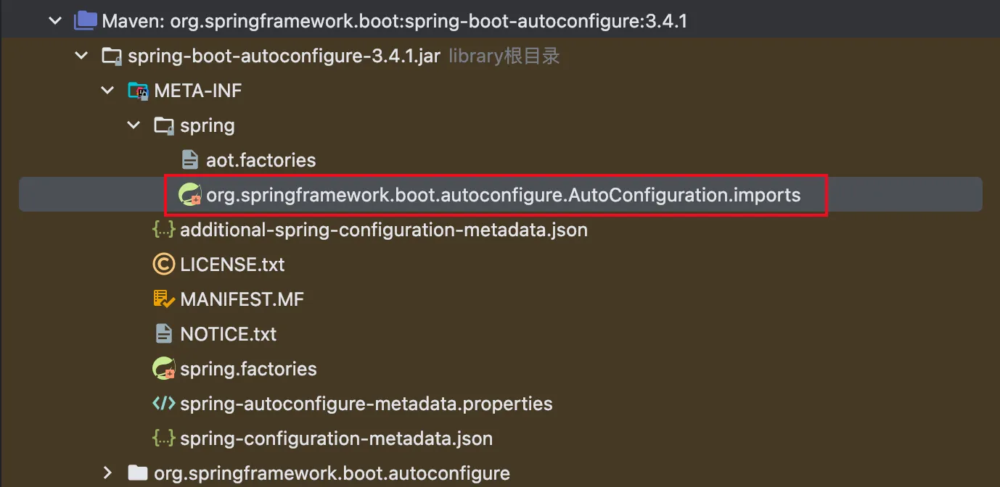
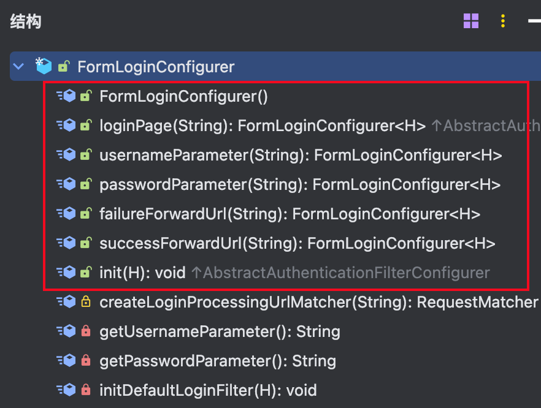
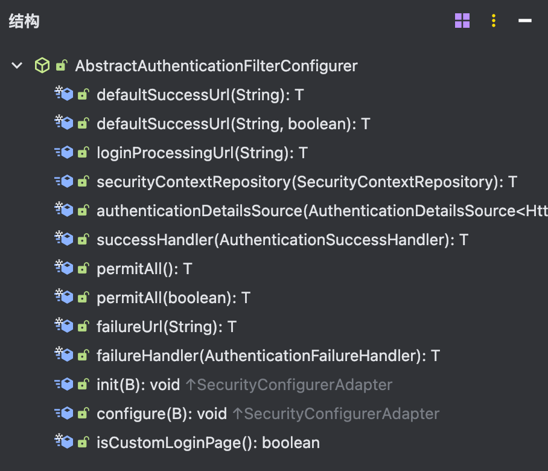
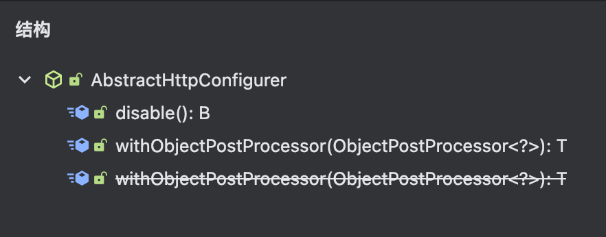
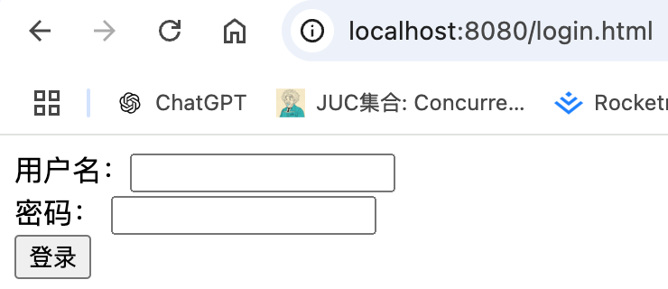
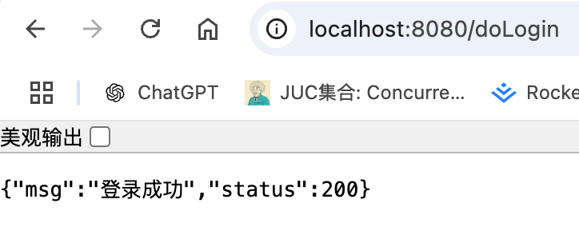

# Spring Security表单登录

本文主要针对默认的表单登录流程进行简单介绍，并且探究一下可以基于默认的表单登录流程扩展出哪些功能。

## 过滤器链初始化

首先我们继续来看spring boot关于spring security的自动配置文件，打开spring boot的配置文件



在里面搜索security的类，可以看到自动配置了SecurityAutoConfiguration这个类

```
org.springframework.boot.autoconfigure.security.servlet.SecurityAutoConfiguration
```

点进这个类查看，代码如下所示：

``` SecurityAutoConfiguration
@AutoConfiguration(before = UserDetailsServiceAutoConfiguration.class)
@ConditionalOnClass(DefaultAuthenticationEventPublisher.class)
@EnableConfigurationProperties(SecurityProperties.class)
@Import({ SpringBootWebSecurityConfiguration.class, SecurityDataConfiguration.class })
public class SecurityAutoConfiguration {
    ...
}
```

可以看到导入了SpringBootWebSecurityConfiguration.class, SecurityDataConfiguration.class这两个类，本文主要查看SpringBootWebSecurityConfiguration这个类。可以看到这个类默认定义出来了一个SecurityFilterChain，这个就是一个请求进来需要走的Filter链条

```
@Configuration(proxyBeanMethods = false)
@ConditionalOnWebApplication(type = Type.SERVLET)
class SpringBootWebSecurityConfiguration {

	@Configuration(proxyBeanMethods = false)
	@ConditionalOnDefaultWebSecurity
	static class SecurityFilterChainConfiguration {

		@Bean
		@Order(SecurityProperties.BASIC_AUTH_ORDER)
		SecurityFilterChain defaultSecurityFilterChain(HttpSecurity http) throws Exception {
			http.authorizeHttpRequests((requests) -> requests.anyRequest().authenticated());
			http.formLogin(withDefaults());
			http.httpBasic(withDefaults());
			return http.build();
		}
	}
}
```

这里大概分析一下这个SecurityFilterChain做了什么事情

- http.authorizeHttpRequests: 指定所有通过这个过滤器的请求都要经过认证（authenticated）
- http.formLogin: 启用表单认证组件
- http.httpBasic: 启用httpBasic认证

由于本文主要讨论表单登录，所以我们详细看http.formLogin做了些什么。

## formLogin功能分析

点击http.formLogin, 具体代码如下所示：

``` HttpSecurity
public HttpSecurity formLogin(Customizer<FormLoginConfigurer<HttpSecurity>> formLoginCustomizer) throws Exception {
	formLoginCustomizer.customize(getOrApply(new FormLoginConfigurer<>()));
	return HttpSecurity.this;
}
```

可以看到往httpSecurity里面引入了FormLoginConfigurer这个配置类，点击进去：

```
public final class FormLoginConfigurer<H extends HttpSecurityBuilder<H>> extends
		AbstractAuthenticationFilterConfigurer<H, FormLoginConfigurer<H>, UsernamePasswordAuthenticationFilter> {

	/**
	 * Creates a new instance
	 * @see HttpSecurity#formLogin()
	 */
	public FormLoginConfigurer() {
		super(new UsernamePasswordAuthenticationFilter(), null);
		usernameParameter("username");
		passwordParameter("password");
	}
}	
```

可以看到继承了AbstractAuthenticationFilterConfigurer这个类。我们先看看FormLoginConfigurer提供了哪些方法, 点击Alt + 7，我们只看Public的方法



- loginPage：指定登录的页面，即上一篇中我们登录的页面，默认 /login.html
- usernameParameter: 指定username的parameter名字，就是前端上传的username对应的key
- passwordParameter: 指定password的parameter名字，就是前端上传的password对应的kty
- failureForwardUrl: 登录失败后跳转的url，服务端跳转
- successForwardUrl: 登录成功后跳转的url，服务端跳转

然后再看AbstractAuthenticationFilterConfigurer的公开方法



- defaultSuccessUrl: 登录成功后跳转的url，客户端跳转
- loginProcessingUrl: 处理登录请求的url，即向这个url发送登录认证请求
- failureHandler: 登录失败的处理接口
- successHandler: 登录成功的处理接口
- permitAll: 对于登录相关的页面放行，无需认证，不然用户无法提交认证请求
- failureUrl: 登录失败后挑战的url，客户端跳转

AbstractAuthenticationFilterConfigurer继承了AbstractHttpConfigurer这个抽象类，查看该类的公开方法。



- disable: 关闭相关的认证流程

综上可以看出，其实Spring Security的表单登录可以修改的地方包括下面几种：

- 定义登录的页面，处理登录请求的页面
- 定义登录失败的处理
- 定义登录成功的处理

下面让我们基于上一节的那个项目，分别对上面几种进行修改说明。在项目中新建一个DefaultSecurityConfig文件, 自定义一个SecurityFilterChain。代码如下所示

``` DefaultSecurityConfig
@Configuration
public class DefaultSecurityConfig {

  @Bean
  SecurityFilterChain defaultSecurityFilterChain(HttpSecurity http) throws Exception {
    http.authorizeHttpRequests((requests) -> requests.anyRequest().authenticated());
    http.formLogin(withDefaults());
    return http.build();
  }
}
```

启动项目，正常登录。


## 登录页面和登录请求URL

在resources/static目录下面新建一个login.html文件，输入以下代码：

``` myLogin.html
<!DOCTYPE html>
<html lang="en">
<head>
    <meta charset="UTF-8">
    <title>登录页面</title>
</head>
<body>
<form action="/doLogin" method="post">
    用户名：<input type="text" name="username"/><br>
    密码： <input type="password" name="password"/><br>
    <input type="submit" value="登录"/>
</form>
</body>
</html>
```

注意上面提交认证请求的URL是/doLogin，修改DefaultSecurityConfig的代码，如下所示

```
@Configuration
public class DefaultSecurityConfig {

  @Bean
  SecurityFilterChain defaultSecurityFilterChain(HttpSecurity http) throws Exception {
    http.authorizeHttpRequests((requests) -> requests.anyRequest().authenticated());
    http.formLogin(
            formLogin -> formLogin.loginPage("/login.html")
                    .loginProcessingUrl("/doLogin")
                    .permitAll()
    );
    http.csrf(AbstractHttpConfigurer::disable);
    return http.build();
  }
}
```

注意，需要把csrf校验关闭，不然登录认证请求提交会无效，还会跳转登录页面。具体原因在CSRF源码章节讲解。

启动项目，用浏览器打开/hello路径，会跳转登录页面。




## 请求成功与请求失败回调

当登录认证成功后，会根据以下配置执行认证成功流程

- successHandler: 登录成功的处理接口
- successForwardUrl: 登录成功后跳转的url，服务端跳转
- defaultSuccessUrl: 登录成功后跳转的url，客户端跳转

优先级顺序：successHandler > successForwardUrl > defaultSuccessUrl

当登录认证失败后，会根据以下配置执行认证失败流程

- failureHandler: 登录失败的处理接口
- failureForwardUrl: 登录失败后跳转的url，服务端跳转

优先级顺序: failureHandler > failureForwardUrl

::: info
为什么没有defaultfailureUrl呢，按我的理解是，设置defaultSuccessUrl 是因为它有一个特殊的逻辑分支：当用户之前访问了需要认证的资源时，会优先重定向到那个资源，但是登录失败不用。
:::


由于现在前后端分离的项目比较多，所以本节内容以successHandler作为示例。

在DefaultSecurityConfig同级目录下，新建一个文件，名字为CustomerHandler，代码如下所示：

``` CustomerHandler
public class CustomerHandler {

	// 登录成功流程
	public static void onAuthenticationSuccess(HttpServletRequest request, HttpServletResponse response, Authentication authentication) throws IOException {
		HashMap<String, Object> resp = new HashMap<>();
		resp.put("status", 200);
		resp.put("msg", "登录成功");
		response.setHeader(HttpHeaders.CONTENT_TYPE, "application/json;charset=UTF-8");
		response.getWriter().write(new ObjectMapper().writeValueAsString(resp));
	}

	// 登录失败流程
	public static void onAuthenticationFailure(HttpServletRequest request, HttpServletResponse response, Exception exception) throws IOException {
		HashMap<String, Object> resp = new HashMap<>();
		resp.put("status", 401);
		resp.put("msg", "用户名或者密码错误");
		response.setHeader(HttpHeaders.CONTENT_TYPE, "application/json;charset=UTF-8");
		response.getWriter().write(new ObjectMapper().writeValueAsString(resp));
	}
}
```

修改DefaultSecurityConfig的配置，内容如下所示：

```
@Bean
SecurityFilterChain defaultSecurityFilterChain(HttpSecurity http) throws Exception {
	http.authorizeHttpRequests((requests) -> requests.anyRequest().authenticated());
	http.formLogin(
		formLogin -> formLogin.loginPage("/login.html")
						.loginProcessingUrl("/doLogin")
						.permitAll()
						.successHandler(CustomerHandler::onAuthenticationSuccess)
						.failureHandler(CustomerHandler::onAuthenticationFailure)
	);
	http.csrf(AbstractHttpConfigurer::disable);
	return http.build();
}
```

重新启动项目，浏览器访问登录页面，输入帐号密码，登录。

::: info
可以基于successHandler，实现使用JWT等认证流程，后续会讲解JWT继承流程
:::



相关源码查看点击[此处](https://github.com/shengduiliang/spring-security-demo/tree/main/spring-security-form-login)