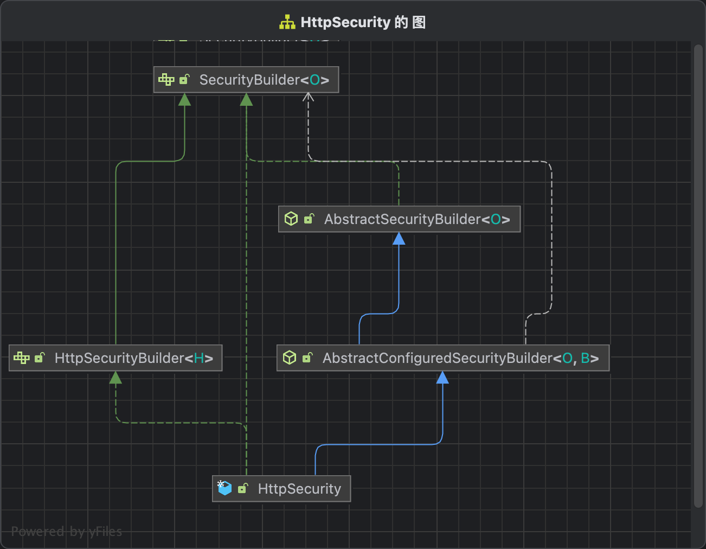

# SecurityFilterChain构建流程

这个章节我们讲解一下HttpSecurity是怎么构建出来FilterChainProxy里面的每一个SecurityFilterChain的。我们从Spring Security的配置文件开始讲起。

```
@Configuration
public class DefaultSecurityConfig  {

  @Bean
  SecurityFilterChain defaultSecurityFilterChain(HttpSecurity http) throws Exception {
    http.authorizeHttpRequests((requests) -> requests.anyRequest().authenticated());
    http.formLogin(withDefaults());
    http.httpBasic(withDefaults());
    return http.build();
  }
}
```

经过了前面几章的讲解，相信大家对上面的代码很熟悉，就是拿到HttpSecurity对象，然后调用里面的build方法，返回一条SecurityFilterChain。

## HttpSecurity导入

我们可以看到defaultSecurityFilterChain中的http是通过Spring注入进来，所以我们先找到这个Bean注册的地方。先看Spring Boot关于Spring Security的自动配置文件

``` SecurityAutoConfiguration
@Import({ SpringBootWebSecurityConfiguration.class, SecurityDataConfiguration.class })
public class SecurityAutoConfiguration {
  ...
}
```

导入了SpringBootWebSecurityConfiguration这个类，查看代码。

``` SpringBootWebSecurityConfiguration
@Configuration(proxyBeanMethods = false)
@ConditionalOnWebApplication(type = Type.SERVLET)
class SpringBootWebSecurityConfiguration {

	@EnableWebSecurity
	static class WebSecurityEnablerConfiguration {

	}
}
```

可以看到WebSecurityEnablerConfiguration声明了@EnableWebSecurity这个注解，查看该注解。

``` EnableWebSecurity
@Import({ WebSecurityConfiguration.class, SpringWebMvcImportSelector.class, OAuth2ImportSelector.class,
		HttpSecurityConfiguration.class, ObservationImportSelector.class })
@EnableGlobalAuthentication
public @interface EnableWebSecurity {

}
```

可以看到导入了HttpSecurityConfiguration这个类, 点击进去查看该类的代码。

```
@Configuration(proxyBeanMethods = false)
class HttpSecurityConfiguration {
  @Bean(HTTPSECURITY_BEAN_NAME)
	@Scope("prototype")
	HttpSecurity httpSecurity() throws Exception {
		LazyPasswordEncoder passwordEncoder = new LazyPasswordEncoder(this.context);
		AuthenticationManagerBuilder authenticationBuilder = new DefaultPasswordEncoderAuthenticationManagerBuilder(
				this.objectPostProcessor, passwordEncoder);
		authenticationBuilder.parentAuthenticationManager(authenticationManager());
		authenticationBuilder.authenticationEventPublisher(getAuthenticationEventPublisher());
		HttpSecurity http = new HttpSecurity(this.objectPostProcessor, authenticationBuilder, createSharedObjects());
		WebAsyncManagerIntegrationFilter webAsyncManagerIntegrationFilter = new WebAsyncManagerIntegrationFilter();
		webAsyncManagerIntegrationFilter.setSecurityContextHolderStrategy(this.securityContextHolderStrategy);
		// @formatter:off
		http
			.csrf(withDefaults()) // 开启csrf检验
			.addFilter(webAsyncManagerIntegrationFilter) // 将WebAsyncManager与Spring Security上下文继承
			.exceptionHandling(withDefaults()) // 异常处理
			.headers(withDefaults()) 
			.sessionManagement(withDefaults()) // 会话管理
			.securityContext(withDefaults()) // spring security 上下文管理
			.requestCache(withDefaults())
			.anonymous(withDefaults())
			.servletApi(withDefaults())
			.apply(new DefaultLoginPageConfigurer<>()); // 生成默认的登录页面
		http.logout(withDefaults()); // logout处理流程
		// @formatter:on
		applyCorsIfAvailable(http);
		applyDefaultConfigurers(http);
		return http;
	}
}
```

可以看到这个类声明一个HttpSecurity Bean, 这个Bean就是我们上面在DefaultSecurityConfig导入的HttpSecurity，另外我们可以看到这是一个原型Bean，也就是说我们每次注入HttpSecurity，得到的对象都是不一样的，这样就可以用来构建多条SecurityFilterChain了。我们可以看到这里的http默认执行了很多函数，这里的函数大多数会往过滤器中加入过滤器。

## HttpSecurity初始化流程

上一篇文章我们粗略的讲解了http.build()逻辑，会针对过滤器链中的filter进行排序，并且构建出来一条SecurityFilterChain。这里给大家详细地讲解一下http.build()流程。



由于HttpSecurity继承了AbstractConfiguredSecurityBuilder这个抽象类，并且http.build()会执行AbstractConfiguredSecurityBuilder的doBuild方法，那么我们来看这个方法。

``` AbstractConfiguredSecurityBuilder
public abstract class AbstractConfiguredSecurityBuilder<O, B extends SecurityBuilder<O>>
		extends AbstractSecurityBuilder<O> {
  @Override
  protected final O doBuild() throws Exception {
    synchronized (this.configurers) {
      this.buildState = BuildState.INITIALIZING;
      // HttpSercurity没有实现这个方法，不用考虑
      beforeInit();
      // 执行所有SecurityConfigurer的init方法
      init();
      this.buildState = BuildState.CONFIGURING;
      beforeConfigure();
      // 执行所有SecurityConfigurer的configure方法
      configure();
      this.buildState = BuildState.BUILDING;
      // 核心方法performBuild
      O result = performBuild();
      this.buildState = BuildState.BUILT;
      return result;
    }
  }
}
```

1. HttpSecurity没有实现beforeInit方法，不用考虑

2. init方法，这里会调用HttpSecurity所有的SecurityConfigurer的init方法实现，具体代码如下
``` AbstractConfiguredSecurityBuilder
public abstract class AbstractConfiguredSecurityBuilder<O, B extends SecurityBuilder<O>>
		extends AbstractSecurityBuilder<O> {
	private void init() throws Exception {
		Collection<SecurityConfigurer<O, B>> configurers = getConfigurers();
		for (SecurityConfigurer<O, B> configurer : configurers) {
			configurer.init((B) this);
		}
		for (SecurityConfigurer<O, B> configurer : this.configurersAddedInInitializing) {
			configurer.init((B) this);
		}
	}
}
```

这些configurers都是什么呢，还记得我们在Security中声明的http.formLogin(withDefaults())吗，查看代码实现:
```
public HttpSecurity formLogin(Customizer<FormLoginConfigurer<HttpSecurity>> formLoginCustomizer) throws Exception {
  formLoginCustomizer.customize(getOrApply(new FormLoginConfigurer<>()));
  return HttpSecurity.this;
}
```
这里的FormLoginConfigurer就是一个SecurityConfigurer。

3. beforeConfigure, 这里调用了HttpSecurity的beforeConfigure方法，具体是忘Http Security写入了一个authenticationManager的对象，这个对象是用来做权限校验的，下一章节会讲到。
```
public final class HttpSecurity extends AbstractConfiguredSecurityBuilder<DefaultSecurityFilterChain, HttpSecurity>
		implements SecurityBuilder<DefaultSecurityFilterChain>, HttpSecurityBuilder<HttpSecurity> {
	
  @Override
  protected void beforeConfigure() throws Exception {
    if (this.authenticationManager != null) {
      setSharedObject(AuthenticationManager.class, this.authenticationManager);
    }
    else {
      ObjectPostProcessor<AuthenticationManager> postProcessor = getAuthenticationManagerPostProcessor();
      AuthenticationManager manager = getAuthenticationRegistry().build();
      if (manager != null) {
        setSharedObject(AuthenticationManager.class, postProcessor.postProcess(manager));
      }
    }
  }
}
```

4. 调用configure方法，这里会调用HttpSecurity所有的SecurityConfigurer的configure方法实现，具体代码如下所示：

``` AbstractConfiguredSecurityBuilder
public abstract class AbstractConfiguredSecurityBuilder<O, B extends SecurityBuilder<O>>
		extends AbstractSecurityBuilder<O> {
	private void configure() throws Exception {
		Collection<SecurityConfigurer<O, B>> configurers = getConfigurers();
		for (SecurityConfigurer<O, B> configurer : configurers) {
			configurer.configure((B) this);
		}
	}
}
```

5. performBuild方法，这个上一篇文章已经讲过了，是用来构建SecurityFilterChain的。


## SecurityConfigurer

上面我们知道了，HttpSecurity#build主要是调用SecurityConfigurer#init和SecurityConfigurer#configure方法的。为了方便理解，这里拿HttpBasic的configurer给大家演示一下（表单登录的有点复杂，下一篇会讲到）。

首先看一下引入，http.httpBasic(withDefaults()), 这个函数会往http中注册一个HttpBasicConfigurer。

```
public HttpSecurity httpBasic(Customizer<HttpBasicConfigurer<HttpSecurity>> httpBasicCustomizer) throws Exception {
  httpBasicCustomizer.customize(getOrApply(new HttpBasicConfigurer<>()));
  return HttpSecurity.this;
}
```

再看一下HttpBasicConfigurer的具体实现

``` HttpBasicConfigurer
public final class HttpBasicConfigurer<B extends HttpSecurityBuilder<B>>
		extends AbstractHttpConfigurer<HttpBasicConfigurer<B>, B> {
	@Override
	public void init(B http) {
		registerDefaults(http);
	}

	private void registerDefaults(B http) {
    ContentNegotiationStrategy contentNegotiationStrategy = http.getSharedObject(ContentNegotiationStrategy.class);
    if (contentNegotiationStrategy == null) {
      contentNegotiationStrategy = new HeaderContentNegotiationStrategy();
    }
    MediaTypeRequestMatcher restMatcher = new MediaTypeRequestMatcher(contentNegotiationStrategy,
        MediaType.APPLICATION_ATOM_XML, MediaType.APPLICATION_FORM_URLENCODED, MediaType.APPLICATION_JSON,
        MediaType.APPLICATION_OCTET_STREAM, MediaType.APPLICATION_XML, MediaType.MULTIPART_FORM_DATA,
        MediaType.TEXT_XML);
    restMatcher.setIgnoredMediaTypes(Collections.singleton(MediaType.ALL));
    MediaTypeRequestMatcher allMatcher = new MediaTypeRequestMatcher(contentNegotiationStrategy, MediaType.ALL);
    allMatcher.setUseEquals(true);
    RequestMatcher notHtmlMatcher = new NegatedRequestMatcher(
        new MediaTypeRequestMatcher(contentNegotiationStrategy, MediaType.TEXT_HTML));
    RequestMatcher restNotHtmlMatcher = new AndRequestMatcher(Arrays.asList(notHtmlMatcher, restMatcher));
    RequestMatcher preferredMatcher = new OrRequestMatcher(
        Arrays.asList(X_REQUESTED_WITH, restNotHtmlMatcher, allMatcher));
    registerDefaultEntryPoint(http, preferredMatcher);
    registerDefaultLogoutSuccessHandler(http, preferredMatcher);
  }

  @Override
  public void configure(B http) {
    AuthenticationManager authenticationManager = http.getSharedObject(AuthenticationManager.class);
    BasicAuthenticationFilter basicAuthenticationFilter = new BasicAuthenticationFilter(authenticationManager,
        this.authenticationEntryPoint);
    if (this.authenticationDetailsSource != null) {
      basicAuthenticationFilter.setAuthenticationDetailsSource(this.authenticationDetailsSource);
    }
    if (this.securityContextRepository != null) {
      basicAuthenticationFilter.setSecurityContextRepository(this.securityContextRepository);
    }
    RememberMeServices rememberMeServices = http.getSharedObject(RememberMeServices.class);
    if (rememberMeServices != null) {
      basicAuthenticationFilter.setRememberMeServices(rememberMeServices);
    }
    basicAuthenticationFilter.setSecurityContextHolderStrategy(getSecurityContextHolderStrategy());
    basicAuthenticationFilter = postProcess(basicAuthenticationFilter);
    http.addFilter(basicAuthenticationFilter);
  }
}
```

- init方法，往http里面注册一些属性和钩子函数
- configure，往http里面添加过滤器，并且配置过滤器的属性

到这里明白了吧，过滤器链的构建其实就是往HttpSecurity注册各种configurer，然后调用configurer.configure添加过滤器，最终基于这些过滤器，构建出来一条过滤器链。


可以看到，Spring Security大概定义了33个configurer配置类。可以按需使用这些配置器。


这两张图大致是一些Configure的一些说明，仅供参考。

## Filter优先级说明

在HttpSecurity#performBuild中，构建过滤器链的时候，会对过滤器链进行排序，然后再构建DefaultSecurityFilterChain的。

``` HttpSecurity
public final class HttpSecurity extends AbstractConfiguredSecurityBuilder<DefaultSecurityFilterChain, HttpSecurity>
		implements SecurityBuilder<DefaultSecurityFilterChain>, HttpSecurityBuilder<HttpSecurity> {
	
  private List<OrderedFilter> filters = new ArrayList<>();

  @Override
  protected DefaultSecurityFilterChain performBuild() {
    ExpressionUrlAuthorizationConfigurer<?> expressionConfigurer = getConfigurer(
        ExpressionUrlAuthorizationConfigurer.class);
    AuthorizeHttpRequestsConfigurer<?> httpConfigurer = getConfigurer(AuthorizeHttpRequestsConfigurer.class);
    boolean oneConfigurerPresent = expressionConfigurer == null ^ httpConfigurer == null;
    // OrderComparator.INSTANCE指根据Order排序
    this.filters.sort(OrderComparator.INSTANCE);
    List<Filter> sortedFilters = new ArrayList<>(this.filters.size());
    for (Filter filter : this.filters) {
      sortedFilters.add(((OrderedFilter) filter).filter);
    }
    return new DefaultSecurityFilterChain(this.requestMatcher, sortedFilters);
  }
}
```

我们看一下OrderedFilter的构造, 可以看到除了filter，还有一个order属性

``` OrderedFilter
private static final class OrderedFilter implements Ordered, Filter {
  private final Filter filter;
  private final int order;
}
```

具体order是在哪里赋值的呢，肯定是在添加过滤器的时候，我们回看http Security的添加过滤器方法。

``` HttpSecurity
public final class HttpSecurity extends AbstractConfiguredSecurityBuilder<DefaultSecurityFilterChain, HttpSecurity>
		implements SecurityBuilder<DefaultSecurityFilterChain>, HttpSecurityBuilder<HttpSecurity> {
  private FilterOrderRegistration filterOrders = new FilterOrderRegistration();
	@Override
	public HttpSecurity addFilter(Filter filter) {
		Integer order = this.filterOrders.getOrder(filter.getClass());
    ...
		this.filters.add(new OrderedFilter(filter, order));
		return this;
	}
}
```

可以看到是从FilterOrderRegistration中获取的，所以我们直接看FilterOrderRegistration，这也是默认过滤器的优先级。

``` FilterOrderRegistration
final class FilterOrderRegistration {
  	FilterOrderRegistration() {
		Step order = new Step(INITIAL_ORDER, ORDER_STEP);
		put(DisableEncodeUrlFilter.class, order.next());
		put(ForceEagerSessionCreationFilter.class, order.next());
		put(ChannelProcessingFilter.class, order.next());
		order.next(); // gh-8105
		put(WebAsyncManagerIntegrationFilter.class, order.next());
		put(SecurityContextHolderFilter.class, order.next());
		put(SecurityContextPersistenceFilter.class, order.next());
		put(HeaderWriterFilter.class, order.next());
		put(CorsFilter.class, order.next());
		put(CsrfFilter.class, order.next());
		put(LogoutFilter.class, order.next());
		this.filterToOrder.put(
				"org.springframework.security.oauth2.client.web.OAuth2AuthorizationRequestRedirectFilter",
				order.next());
		this.filterToOrder.put(
				"org.springframework.security.saml2.provider.service.web.Saml2WebSsoAuthenticationRequestFilter",
				order.next());
		put(GenerateOneTimeTokenFilter.class, order.next());
		put(X509AuthenticationFilter.class, order.next());
		put(AbstractPreAuthenticatedProcessingFilter.class, order.next());
		this.filterToOrder.put("org.springframework.security.cas.web.CasAuthenticationFilter", order.next());
		this.filterToOrder.put("org.springframework.security.oauth2.client.web.OAuth2LoginAuthenticationFilter",
				order.next());
		this.filterToOrder.put(
				"org.springframework.security.saml2.provider.service.web.authentication.Saml2WebSsoAuthenticationFilter",
				order.next());
		put(UsernamePasswordAuthenticationFilter.class, order.next());
		order.next(); // gh-8105
		put(DefaultResourcesFilter.class, order.next());
		put(DefaultLoginPageGeneratingFilter.class, order.next());
		put(DefaultLogoutPageGeneratingFilter.class, order.next());
		put(DefaultOneTimeTokenSubmitPageGeneratingFilter.class, order.next());
		put(ConcurrentSessionFilter.class, order.next());
		put(DigestAuthenticationFilter.class, order.next());
		this.filterToOrder.put(
				"org.springframework.security.oauth2.server.resource.web.authentication.BearerTokenAuthenticationFilter",
				order.next());
		put(BasicAuthenticationFilter.class, order.next());
		put(AuthenticationFilter.class, order.next());
		put(RequestCacheAwareFilter.class, order.next());
		put(SecurityContextHolderAwareRequestFilter.class, order.next());
		put(JaasApiIntegrationFilter.class, order.next());
		put(RememberMeAuthenticationFilter.class, order.next());
		put(AnonymousAuthenticationFilter.class, order.next());
		this.filterToOrder.put("org.springframework.security.oauth2.client.web.OAuth2AuthorizationCodeGrantFilter",
				order.next());
		put(SessionManagementFilter.class, order.next());
		put(ExceptionTranslationFilter.class, order.next());
		put(FilterSecurityInterceptor.class, order.next());
		put(AuthorizationFilter.class, order.next());
		put(SwitchUserFilter.class, order.next());
	}
}
```

下面是一个示例Demo中Filter的顺序图

