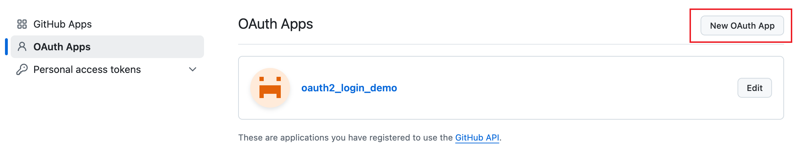
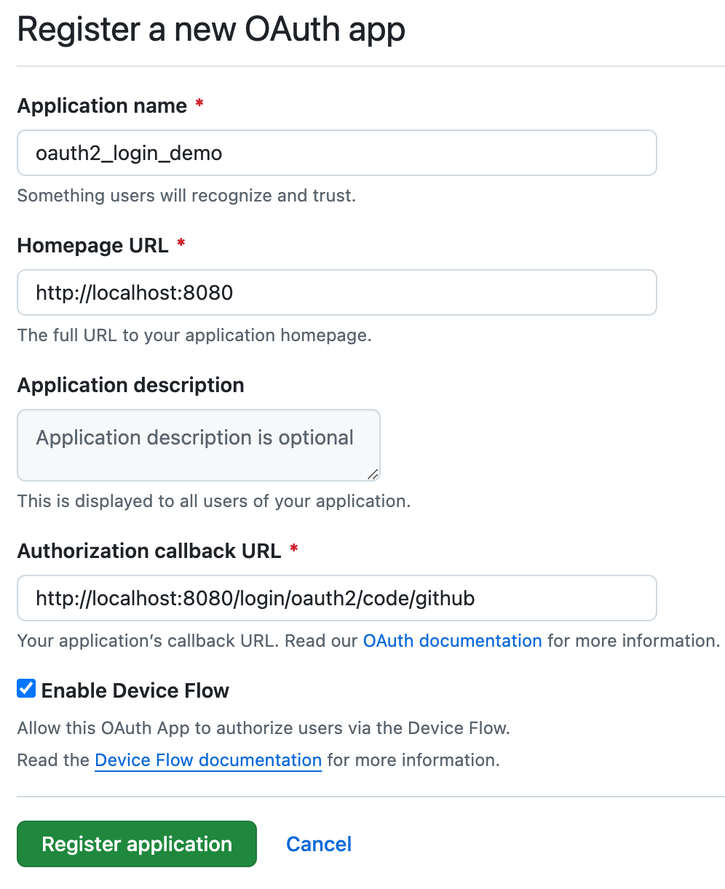
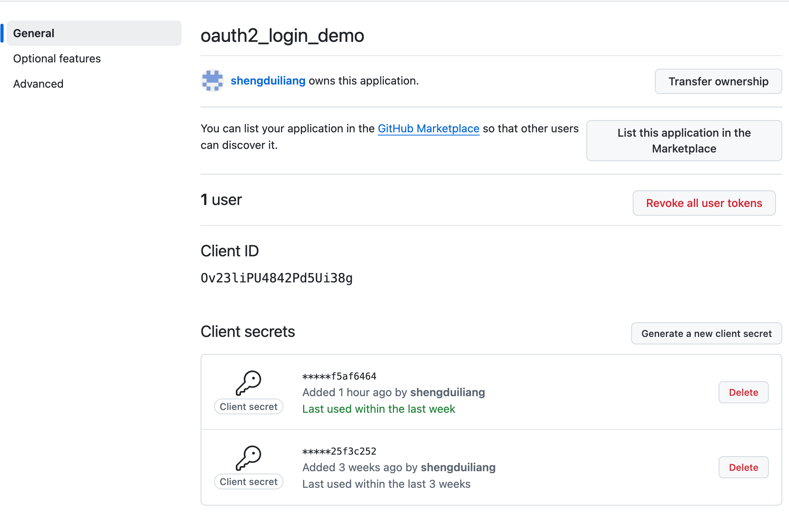
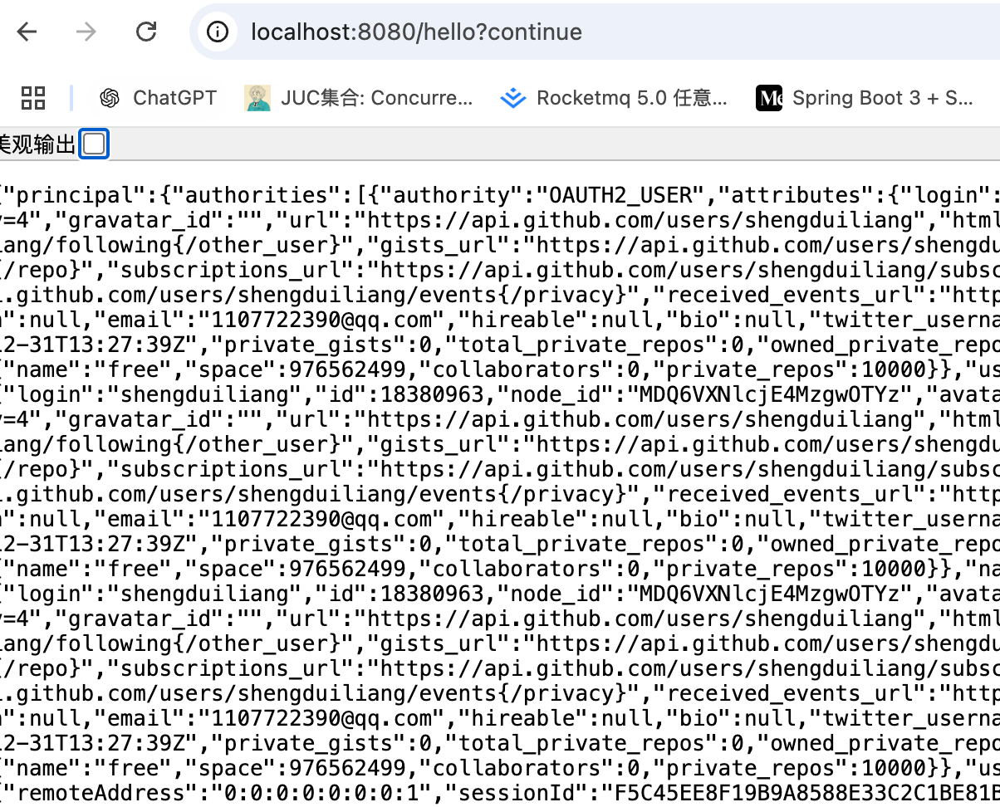
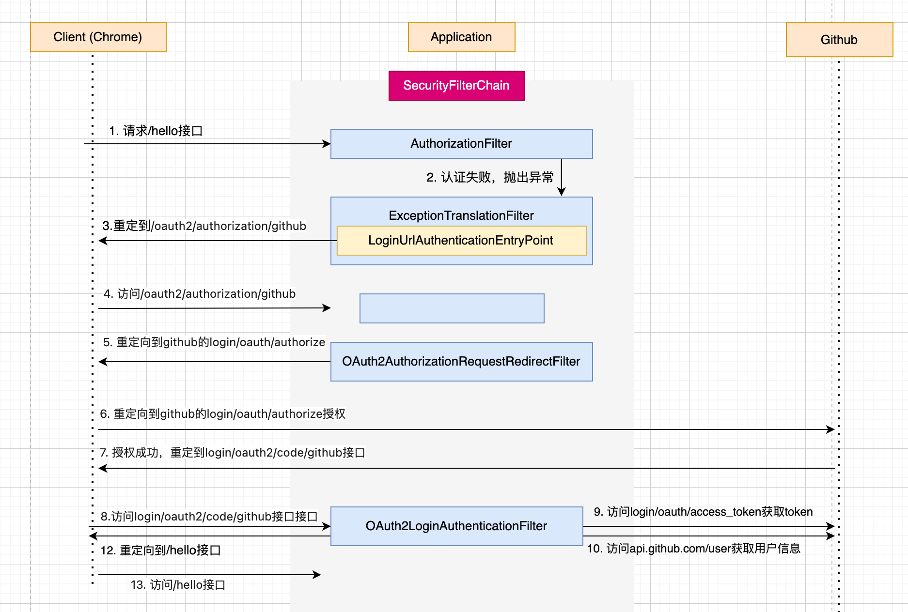

# OAuth2客户端认证流程

## Github授权登录

通过一个Github授权登录来体验一下OAuth2认证流程

### 创建Github OAuth Apps

首先，我们要把第三方应用的注册信息注册到github上，打开github的[开发者设置](https://github.com/settings/developers), 选择OAuth Apps选项。



可以看到我这里已经有一个OAuth App了，如果想要创建一个，那么点击右上角的New OAuth App按钮创建一个应用。



创建完应用之后就可以回到开发者设置那里查看已经注册的OAuth Apps了，这里有一个，点击oauth2_login_demo, 进入App页面



主要看Client ID，还有Client Secrets，注意Client Secrets只有第一次生成的时候可以看到，所以生成的时候要保存好。

### 创建Spring Security项目

新建一个Spring Boot项目，依赖项加入Web，Spring Security和OAuth2 Client依赖，在pom.xml里面可以查看引入的依赖项：

``` pom.xml
<dependency>
  <groupId>org.springframework.boot</groupId>
  <artifactId>spring-boot-starter-oauth2-client</artifactId>
</dependency>
<dependency>
  <groupId>org.springframework.boot</groupId>
  <artifactId>spring-boot-starter-security</artifactId>
</dependency>
<dependency>
  <groupId>org.springframework.boot</groupId>
  <artifactId>spring-boot-starter-web</artifactId>
</dependency>
```

新建一个HelloController，添加一个hello接口

``` HelloController
@RestController
public class HelloController {

  @GetMapping("/hello")
  public Authentication hello() {
    return SecurityContextHolder.getContext().getAuthentication();
  }
}
```

SecurityConfig的配置如下所示：

``` SecurityConfig
@Configuration
public class SecurityConfig {

  @Bean
  SecurityFilterChain securityFilterChain(HttpSecurity http) throws Exception {
    http.authorizeHttpRequests((requests) -> requests.anyRequest().authenticated());
    http.oauth2Login(Customizer.withDefaults());
    return http.build();
  }
}
```

然后我们修改application.properties文件，加入github的配置，很简单，加入下面两个即可，注意是复制github上的Client ID跟Client Secrets

``` application.properties
spring.application.name=spring-security-oauth2
spring.security.oauth2.client.registration.github.client-id=Ov23liPU4842Pd5Ui38g
spring.security.oauth2.client.registration.github.client-secret=15ec180843aa59464e41e2db68207f63f5af6464
```

启动项目，然后访问hello接口, 可以看到跳转到了github的授权网页，然后输入github的用户名跟密码进行授权。


授权成功后就会跳转到hello接口，可以看到返回如下，表示获取用户的认证信息成功。



## 整体登录结构图



## SecurityConfig

首先我们看Spring Security的配置文件，具体代码如下所示:

``` SecurityConfig
@Bean
SecurityFilterChain securityFilterChain(HttpSecurity http) throws Exception {
  http.authorizeHttpRequests((requests) -> requests.anyRequest().authenticated());
  http.oauth2Login(Customizer.withDefaults());
  return http.build();
}
```

可以看到调用了oauth2Login这个方法，我们进去看一下，代码如下：

``` HttpSecurity
public HttpSecurity oauth2Login(Customizer<OAuth2LoginConfigurer<HttpSecurity>> oauth2LoginCustomizer)
    throws Exception {
  oauth2LoginCustomizer.customize(getOrApply(new OAuth2LoginConfigurer<>()));
  return HttpSecurity.this;
}
```

可以看到引入了OAuth2LoginConfigurer这个配置类。


## OAuth2LoginConfigurer

首先我们查看一下这个配置类会往Spring Security注入什么过滤器，老规矩看他的init方法跟configure方法。

``` OAuth2LoginConfigurer
public final class OAuth2LoginConfigurer<B extends HttpSecurityBuilder<B>>
		extends AbstractAuthenticationFilterConfigurer<B, OAuth2LoginConfigurer<B>, OAuth2LoginAuthenticationFilter> {

  public void init(B http) throws Exception {
    OAuth2LoginAuthenticationFilter authenticationFilter = new OAuth2LoginAuthenticationFilter(
    OAuth2ClientConfigurerUtils.getClientRegistrationRepository(this.getBuilder()),
    OAuth2ClientConfigurerUtils.getAuthorizedClientRepository(this.getBuilder()), this.loginProcessingUrl);
    authenticationFilter.setSecurityContextHolderStrategy(getSecurityContextHolderStrategy());
    // 设置认证过滤器OAuth2LoginAuthenticationFilter，将OAuth2LoginAuthenticationFilter设置为AbstractAuthenticationFilterConfigurer的authFilter
    this.setAuthenticationFilter(authenticationFilter);
  }

  @Override
  public void configure(B http) throws Exception {
    OAuth2AuthorizationRequestRedirectFilter authorizationRequestFilter;
    http.addFilter(this.postProcess(authorizationRequestFilter));
  }
}
```

这里讲一下这两个过滤器的作用：

- OAuth2LoginAuthenticationFilter: OAuth2登录认证过滤器，在这个类对用户进行认证操作。
- OAuth2AuthorizationRequestRedirectFilter: 这个过滤器负责将用户跳转到github授权。

## ClientRegistrationRepository

在讲解上面两个过滤器之前，先给大家讲解授权服务器信息保存的内容。

可以看到我们配置了Github登录的Client ID跟Client Secrets后，就可以帮我跳转Github进行授权了，那么Spring Security是怎么知道Github的授权地址，用户接口，令牌这些信息的呢。

### CommonOAuth2Provider

由于授权地址，用户接口，令牌这些信息这些信息一般都不会变化，所以Spring Security将一些常用的第三方登录如Github, Google, Facebook的信息收集起来，保存在一个枚举类CommonOAuth2Provider中，当我们在application.properties里面配置Github的信息的时候，会自动选择这个枚举类里面的Github的设置，看一下这块代码

``` CommonOAuth2Provider
public enum CommonOAuth2Provider {
  GITHUB {
    @Override
    public Builder getBuilder(String registrationId) {
      ClientRegistration.Builder builder = getBuilder(registrationId,
          ClientAuthenticationMethod.CLIENT_SECRET_BASIC, DEFAULT_REDIRECT_URL);
      builder.scope("read:user");
      builder.authorizationUri("https://github.com/login/oauth/authorize");
      builder.tokenUri("https://github.com/login/oauth/access_token");
      builder.userInfoUri("https://api.github.com/user");
      builder.userNameAttributeName("id");
      builder.clientName("GitHub");
      return builder;
    }
  },
}
```

可以看到是返回来一个ClientRegistration.Builder, 很显然调用了他的builder方法之后，会返回一个ClientRegistration对象。

### ClientRegistration

接下来我们看看ClientRegistration这个类的定义，代码如下：

```
public final class ClientRegistration implements Serializable {
  // 区分ClientRegistration，如Github就是github
  private String registrationId;
  private String clientId;
  private String clientSecret;
  // 权限认证方法
  private ClientAuthenticationMethod clientAuthenticationMethod;
  // 权限认证的方式
  private AuthorizationGrantType authorizationGrantType;
  // 认证成功后跳转的url
  private String redirectUri;
  // 跟授权服务器（github）获取的权限
  private Set<String> scopes = Collections.emptySet();
  private ProviderDetails providerDetails = new ProviderDetails();
  private String clientName;
}
```

### ClientRegistrationRepository

接下来我们就看一下我们在application.properties中配置的Github信息是怎么起作用的，打开spring boot关于spring security的自动配置文件

```
org.springframework.boot.autoconfigure.security.oauth2.client.servlet.OAuth2ClientAutoConfiguration
```

可以看到引入OAuth2ClientAutoConfiguration这个类，然后我们进到这个配置类看看

``` OAuth2ClientAutoConfiguration
@Import({ OAuth2ClientRegistrationRepositoryConfiguration.class, OAuth2WebSecurityConfiguration.class })
public class OAuth2ClientAutoConfiguration {

}
```

可以看到引入了OAuth2ClientRegistrationRepositoryConfiguration跟OAuth2WebSecurityConfiguration这两个配置类，这里我们看OAuth2ClientRegistrationRepositoryConfiguration

``` OAuth2ClientRegistrationRepositoryConfiguration
@Configuration(proxyBeanMethods = false)
@EnableConfigurationProperties(OAuth2ClientProperties.class)
@Conditional(ClientsConfiguredCondition.class)
class OAuth2ClientRegistrationRepositoryConfiguration {
	@Bean
	@ConditionalOnMissingBean(ClientRegistrationRepository.class)
	InMemoryClientRegistrationRepository clientRegistrationRepository(OAuth2ClientProperties properties) {
		List<ClientRegistration> registrations = new ArrayList<>(
				new OAuth2ClientPropertiesMapper(properties).asClientRegistrations().values());
		return new InMemoryClientRegistrationRepository(registrations);
	}
}
```

可以看到注入了一个InMemoryClientRegistrationRepository的Bean。我们先看一下这个InMemoryClientRegistrationRepository的定义:

``` InMemoryClientRegistrationRepository
public final class InMemoryClientRegistrationRepository
		implements ClientRegistrationRepository, Iterable<ClientRegistration> {
  private final Map<String, ClientRegistration> registrations;
}
```

可以看到实现了ClientRegistrationRepository这个接口，我们看这个接口

``` ClientRegistrationRepository
public interface ClientRegistrationRepository {
  ClientRegistration findByRegistrationId(String registrationId);
}
```

就只有一个方法，获取ClientRegistration，可以知道如果我们想要拿到ClientRegistration，可以实现这个接口的方法。InMemoryClientRegistrationRepository就是将ClientRegistration的信息保存在内存上的一个Map里面，然后从内存中查找。我们回看InMemoryClientRegistrationRepository这个bean的声明。

### InMemoryClientRegistrationRepository

可以看到参数中注入了OAuth2ClientProperties这个属性，我们看看这个类的定义，如下所示:

``` OAuth2ClientProperties
@ConfigurationProperties(prefix = "spring.security.oauth2.client")
public class OAuth2ClientProperties implements InitializingBean {
  // provider信息，如果需要获取token，需要该信息，先不讲
  private final Map<String, Provider> provider = new HashMap<>();
  private final Map<String, Registration> registration = new HashMap<>();
}
```

可以看到其实我们在application.properties中定义的github的信息会放入这里。

在InMemoryClientRegistrationRepository方法里面，调用了new OAuth2ClientPropertiesMapper(properties).asClientRegistrations().values()获取ClientRegistration的列表，因为ClientRegistration不止一个，然后基于这个列表构建出来一个InMemoryClientRegistrationRepository对象。

### OAuth2ClientPropertiesMapper

我们接下来看一下这个类，简单看一下代码实现:

``` OAuth2ClientPropertiesMapper
public final class OAuth2ClientPropertiesMapper {
  private final OAuth2ClientProperties properties;

  public Map<String, ClientRegistration> asClientRegistrations() {
    Map<String, ClientRegistration> clientRegistrations = new HashMap<>();
    this.properties.getRegistration()
      .forEach((key, value) -> clientRegistrations.put(key,
          getClientRegistration(key, value, this.properties.getProvider())));
    return clientRegistrations;
  }

  private static ClientRegistration getClientRegistration(String registrationId,
      OAuth2ClientProperties.Registration properties, Map<String, Provider> providers) {
    Builder builder = getBuilderFromIssuerIfPossible(registrationId, properties.getProvider(), providers);
    if (builder == null) {
      // 这里是核心
      builder = getBuilder(registrationId, properties.getProvider(), providers);
    }
    // 在这里调用ClientRegistration.Builder的build方法
    return builder.build();    
  }

  private static Builder getBuilder(String registrationId, String configuredProviderId,
      Map<String, Provider> providers) {
    String providerId = (configuredProviderId != null) ? configuredProviderId : registrationId;
    CommonOAuth2Provider provider = getCommonProvider(providerId);
    Builder builder = (provider != null) ? provider.getBuilder(registrationId)
        : ClientRegistration.withRegistrationId(registrationId);
    if (providers.containsKey(providerId)) {
      return getBuilder(builder, providers.get(providerId));
    }
    return builder;
  }

  private static CommonOAuth2Provider getCommonProvider(String providerId) {
    try {
      return ApplicationConversionService.getSharedInstance().convert(providerId, CommonOAuth2Provider.class);
    }
    catch (ConversionException ex) {
      return null;
    }
  }
}
```

首先调用了getBuilderFromIssuerIfPossible这个方法获取builder，如果builder不为空则返回这个builder。至于什么情况下会使用这个builder呢？如果我们在配置文件中定义了provider属性，如下所示

```
spring
  security:
    oauth2:
      client:
        registration:
          messaging-client-oidc:
            provider: spring
            client-id: messaging-client
            client-secret: secret
            authorization-grant-type: authorization_code
            redirect-uri: "http://127.0.0.1:8080/login/oauth2/code/{registrationId}"
            scope: openid, profile
            client-name: messaging-client-oidc
        provider:
          spring:
            issuer-uri: http://192.168.1.30:9000
```

可以看到messaging-client-oidc指定了spring这个provider，而spring有issuer-uri，那么构建出来的认证服务器的一些配置就通过拉取provider的/.well-known/openid-configuration接口获取了，具体流程路径列出来，不细讲，getBuilderFromIssuerIfPossible -> fromIssuerLocation -> getBuilder -> oidc(uri)

如果没有配置provider属性，那么则走下面的流程，getCommonProvider的流程比较复杂，我们只需要看返回值就是我们之前提到的CommonOAuth2Provider就好。

### 扩展点

我们可以实现自己的ClientRegistrationRepository类，是扩展其他的授权服务器的信息以及定义ClientRegistration的保存策略，比如保存到数据库中，直接从数据库里面获取

## AuthenticationEntryPoint

首先我们看用户是怎么跳转到/oauth2/authorization/github这个URL，学过了异常处理那块内容的都可以猜出个大概，就是OAuth2LoginConfigurer注册了一个AuthenticationEntryPoint。那我们就看看注册了什么。

``` OAuth2LoginConfigurer
public final class OAuth2LoginConfigurer<B extends HttpSecurityBuilder<B>>
		extends AbstractAuthenticationFilterConfigurer<B, OAuth2LoginConfigurer<B>, OAuth2LoginAuthenticationFilter> {
  @Override
  public void init(B http) throws Exception {
    // 如果定义了loginPage, 那么直接跳转loginPage
    if (this.loginPage != null) {
      // Set custom login page
      super.loginPage(this.loginPage);
      super.init(http);
    }
    else {
      // 看定义了多少个clientRegistrations, 如果只有一个，那么就用对应的url作为登录页面入口, 现在只有github，所以只有github
      Map<String, String> loginUrlToClientName = this.getLoginLinks();
      if (loginUrlToClientName.size() == 1) {
        // Setup auto-redirect to provider login page
        // when only 1 client is configured
        this.updateAuthenticationDefaults();
        this.updateAccessDefaults(http);
        String providerLoginPage = loginUrlToClientName.keySet().iterator().next();
        this.registerAuthenticationEntryPoint(http, this.getLoginEntryPoint(http, providerLoginPage));
      }
      else {
        super.init(http);
      }
    }
  }
}
```

直接看getLoginEntryPoint方法，代码如下：

``` OAuth2LoginConfigurer
public final class OAuth2LoginConfigurer<B extends HttpSecurityBuilder<B>>
		extends AbstractAuthenticationFilterConfigurer<B, OAuth2LoginConfigurer<B>, OAuth2LoginAuthenticationFilter> {
  private AuthenticationEntryPoint getLoginEntryPoint(B http, String providerLoginPage) {
    .....
    LinkedHashMap<RequestMatcher, AuthenticationEntryPoint> entryPoints = new LinkedHashMap<>();
    // 在这里根据构建了providerLoginPage构建了重定向页面
    entryPoints.put(new AndRequestMatcher(notXRequestedWith, new NegatedRequestMatcher(defaultLoginPageMatcher),
        formLoginNotEnabled), new LoginUrlAuthenticationEntryPoint(providerLoginPage));
    DelegatingAuthenticationEntryPoint loginEntryPoint = new DelegatingAuthenticationEntryPoint(entryPoints);
    loginEntryPoint.setDefaultEntryPoint(this.getAuthenticationEntryPoint());
    return loginEntryPoint;
  }
}
```

## OAuth2AuthorizationRequestRedirectFilter

接下来我们看一下这个跳转URL过滤器OAuth2AuthorizationRequestRedirectFilter的实现，打开代码，由于OAuth2AuthorizationRequestRedirectFilter继承了OncePerRequestFilter，查看doFilterInternal方法，具体如下所示:

``` OAuth2AuthorizationRequestRedirectFilter
public class OAuth2AuthorizationRequestRedirectFilter extends OncePerRequestFilter {
  private OAuth2AuthorizationRequestResolver authorizationRequestResolver;

	@Override
	protected void doFilterInternal(HttpServletRequest request, HttpServletResponse response, FilterChain filterChain)
			throws ServletException, IOException {
    OAuth2AuthorizationRequest authorizationRequest = this.authorizationRequestResolver.resolve(request);
    if (authorizationRequest != null) {
      this.sendRedirectForAuthorization(request, response, authorizationRequest);
      return;
    }
    filterChain.doFilter(request, response);
  }
}
```

核心代码比较简单，就是看一下this.authorizationRequestResolver.resolve(request)的返回值有没有，如果则跳转，没有就放行。

### OAuth2AuthorizationRequestResolver

我们看一下这个接口的定义，具体如下：

``` OAuth2AuthorizationRequestResolver
public interface OAuth2AuthorizationRequestResolver {
  // 根据请求获取OAuth2AuthorizationRequest
  OAuth2AuthorizationRequest resolve(HttpServletRequest request);
  // 根据请求和clientRegistrationId获取OAuth2AuthorizationRequest
  OAuth2AuthorizationRequest resolve(HttpServletRequest request, String clientRegistrationId);
}
```

我们看看OAuth2AuthorizationRequestRedirectFilter中是在在哪里定义的

```
public class OAuth2AuthorizationRequestRedirectFilter extends OncePerRequestFilter {
  public OAuth2AuthorizationRequestRedirectFilter(ClientRegistrationRepository clientRegistrationRepository) {
		this(clientRegistrationRepository, DEFAULT_AUTHORIZATION_REQUEST_BASE_URI);
	}

  public OAuth2AuthorizationRequestRedirectFilter(ClientRegistrationRepository clientRegistrationRepository,
			String authorizationRequestBaseUri) {
		this.authorizationRequestResolver = new DefaultOAuth2AuthorizationRequestResolver(clientRegistrationRepository,
				authorizationRequestBaseUri);
	}

	public OAuth2AuthorizationRequestRedirectFilter(OAuth2AuthorizationRequestResolver authorizationRequestResolver) {
		Assert.notNull(authorizationRequestResolver, "authorizationRequestResolver cannot be null");
		this.authorizationRequestResolver = authorizationRequestResolver;
	}
}
```

在这里明了了，是在构造函数里面配置的，那么我们回看OAuth2LoginConfigurer的configure方法

``` OAuth2LoginConfigurer
public final class OAuth2LoginConfigurer<B extends HttpSecurityBuilder<B>>
		extends AbstractAuthenticationFilterConfigurer<B, OAuth2LoginConfigurer<B>, OAuth2LoginAuthenticationFilter> {
  public void configure(B http) throws Exception {
    OAuth2AuthorizationRequestRedirectFilter authorizationRequestFilter;
    if (this.authorizationEndpointConfig.authorizationRequestResolver != null) {
      authorizationRequestFilter = new OAuth2AuthorizationRequestRedirectFilter(
          this.authorizationEndpointConfig.authorizationRequestResolver);
    }
    else {
      // 默认走这个分支
      String authorizationRequestBaseUri = this.authorizationEndpointConfig.authorizationRequestBaseUri;
      if (authorizationRequestBaseUri == null) {
        authorizationRequestBaseUri = OAuth2AuthorizationRequestRedirectFilter.DEFAULT_AUTHORIZATION_REQUEST_BASE_URI;
      }
      authorizationRequestFilter = new OAuth2AuthorizationRequestRedirectFilter(
          OAuth2ClientConfigurerUtils.getClientRegistrationRepository(this.getBuilder()),
          authorizationRequestBaseUri);
    }
    http.addFilter(this.postProcess(authorizationRequestFilter));
  }
}
```

默认调用OAuth2AuthorizationRequestRedirectFilter使用的是OAuth2ClientConfigurerUtils.getClientRegistrationRepository()，我们进去看一下。

``` OAuth2ClientConfigurerUtils
final class OAuth2ClientConfigurerUtils {
  static <B extends HttpSecurityBuilder<B>> ClientRegistrationRepository getClientRegistrationRepository(B builder) {
    ClientRegistrationRepository clientRegistrationRepository = builder
      .getSharedObject(ClientRegistrationRepository.class);
    if (clientRegistrationRepository == null) {
      // 从SpringContext获取clientRegistrationRepository
      // 就是刚才自动配置的InMemoryClientRegistrationRepository
      clientRegistrationRepository = getClientRegistrationRepositoryBean(builder);
      builder.setSharedObject(ClientRegistrationRepository.class, clientRegistrationRepository);
    }
    return clientRegistrationRepository;
  }
}
```

可以看到只是传一个ClientRegistrationRepository参数，默认使用DefaultOAuth2AuthorizationRequestResolver这个resolver，我们看看这个类的实现

``` DefaultOAuth2AuthorizationRequestResolver
public final class DefaultOAuth2AuthorizationRequestResolver implements OAuth2AuthorizationRequestResolver {
  @Override
  public OAuth2AuthorizationRequest resolve(HttpServletRequest request) {
    // 获取registrationId
    String registrationId = resolveRegistrationId(request);
    if (registrationId == null) {
      return null;
    }
    // 获取redirectUriAction
    String redirectUriAction = getAction(request, "login");
    return resolve(request, registrationId, redirectUriAction);
  }

  private OAuth2AuthorizationRequest resolve(HttpServletRequest request, String registrationId,
    String redirectUriAction) {
    if (registrationId == null) {
      return null;
    }
    // 从clientRegistrationRepository获取clientRegistration
    ClientRegistration clientRegistration = this.clientRegistrationRepository.findByRegistrationId(registrationId);
    // 获取OAuth2AuthorizationRequest的builder
    OAuth2AuthorizationRequest.Builder builder = getBuilder(clientRegistration);

    String redirectUriStr = expandRedirectUri(request, clientRegistration, redirectUriAction);

    // @formatter:off
    builder.clientId(clientRegistration.getClientId())
      .authorizationUri(clientRegistration.getProviderDetails().getAuthorizationUri())
      .redirectUri(redirectUriStr)
      .scopes(clientRegistration.getScopes())
      .state(DEFAULT_STATE_GENERATOR.generateKey());

    this.authorizationRequestCustomizer.accept(builder);
    // 调用OAuth2AuthorizationRequest.Builder的build方法
    return builder.build();
  }
}
```

OAuth2AuthorizationRequest.Builder就只有一个实现类，我们看看他的builder方法。

``` OAuth2AuthorizationRequest
public final class OAuth2AuthorizationRequest implements Serializable {
  public String getAuthorizationRequestUri() {
    return this.authorizationRequestUri;
  }
  public static final class Builder {
    public OAuth2AuthorizationRequest build() {
      Assert.hasText(this.authorizationUri, "authorizationUri cannot be empty");
      Assert.hasText(this.clientId, "clientId cannot be empty");
      OAuth2AuthorizationRequest authorizationRequest = new OAuth2AuthorizationRequest();
      authorizationRequest.authorizationUri = this.authorizationUri;
      authorizationRequest.authorizationGrantType = this.authorizationGrantType;
      authorizationRequest.responseType = this.responseType;
      authorizationRequest.clientId = this.clientId;
      authorizationRequest.redirectUri = this.redirectUri;
      authorizationRequest.state = this.state;
      authorizationRequest.scopes = Collections.unmodifiableSet((Set)(CollectionUtils.isEmpty(this.scopes) ? Collections.emptySet() : new LinkedHashSet(this.scopes)));
      authorizationRequest.additionalParameters = Collections.unmodifiableMap(this.additionalParameters);
      authorizationRequest.attributes = Collections.unmodifiableMap(this.attributes);
      authorizationRequest.authorizationRequestUri = StringUtils.hasText(this.authorizationRequestUri) ? this.authorizationRequestUri : this.buildAuthorizationRequestUri();
      return authorizationRequest;
    }
  }
}
```

这个的返回值就是OAuth2AuthorizationRequestRedirectFilter中构建的authorizationRequest对象。

### RedirectStrategy

接下来我们看看OAuth2AuthorizationRequestRedirectFilter中的跳转方法。

``` OAuth2AuthorizationRequestRedirectFilter
public class OAuth2AuthorizationRequestRedirectFilter extends OncePerRequestFilter {
  private void sendRedirectForAuthorization(HttpServletRequest request, HttpServletResponse response,
      OAuth2AuthorizationRequest authorizationRequest) throws IOException {
    // 如果是授权码模式，保存authorizationRequest，因为要在后面的授权服务器回调中获取
    if (AuthorizationGrantType.AUTHORIZATION_CODE.equals(authorizationRequest.getGrantType())) {
      this.authorizationRequestRepository.saveAuthorizationRequest(authorizationRequest, request, response);
    }
    // 调用authorizationRedirectStrategy的跳转方法
    this.authorizationRedirectStrategy.sendRedirect(request, response,
        authorizationRequest.getAuthorizationRequestUri());
  }
}
```

看看authorizationRedirectStrategy的配置方式, 代码如下：

``` OAuth2AuthorizationRequestRedirectFilter
public class OAuth2AuthorizationRequestRedirectFilter extends OncePerRequestFilter {
	private RedirectStrategy authorizationRedirectStrategy = new DefaultRedirectStrategy();

  public void setAuthorizationRedirectStrategy(RedirectStrategy authorizationRedirectStrategy) {
    Assert.notNull(authorizationRedirectStrategy, "authorizationRedirectStrategy cannot be null");
    this.authorizationRedirectStrategy = authorizationRedirectStrategy;
  }
}
```

默认是使用DefaultRedirectStrategy来进行跳转的，看一下对应的跳转方法。

``` DefaultRedirectStrategy
public class DefaultRedirectStrategy implements RedirectStrategy {
  @Override
	public void sendRedirect(HttpServletRequest request, HttpServletResponse response, String url) throws IOException {
    String redirectUrl = calculateRedirectUrl(request.getContextPath(), url);
    redirectUrl = response.encodeRedirectURL(redirectUrl);
    if (this.statusCode == HttpStatus.FOUND) {
      response.sendRedirect(redirectUrl);
    }
    else {
      response.setHeader(HttpHeaders.LOCATION, redirectUrl);
      response.setStatus(this.statusCode.value());
      response.getWriter().flush();
    }
  }
}
```

this.statusCode == HttpStatus.FOUND默认为true，没找到地方对其修改，可以看到直接跳转。

### 扩展点

- authorizationRequestResolver: 根据自己定义的格式返回授权服务器的URL
- authorizationRequestRepository: 可以自定义，目前保存在HttpSession中，可以保存到Spring-Session中
- authorizationRedirectStrategy: 可以自定义重定向逻辑


最终跳转的github授权服务器的URL如下所示:

```
https://github.com/login/oauth/authorize?response_type=code&client_id=Ov23liPU4842Pd5Ui38g&scope=read:user&state=yPt93W_v_KyjBqAskW6TURRrS4Y_V-c30ySbx0DGF18%3D&redirect_uri=http://localhost:8080/login/oauth2/code/github
```

## OAuth2LoginAuthenticationFilter

注意上面的最后的redirect_uri的值，具体如下所示:

```
redirect_uri=http://localhost:8080/login/oauth2/code/github
```

当用户在github中授权之后，会让前端重定向到redirect_uri接口，具体的示例如下所示:

```
http://localhost:8080/login/oauth2/code/github?code=d7b00ee2b4de58320fd9&state=yPt93W_v_KyjBqAskW6TURRrS4Y_V-c30ySbx0DGF18%3D
```

### OAuth2LoginAuthenticationFilter

具体对这个URL做处理的是这个过滤器：OAuth2LoginAuthenticationFilter，由于这个过滤器继承了AbstractAuthenticationProcessingFilter这个方法，我们直接看它的attemptAuthentication方法。


``` OAuth2LoginAuthenticationFilter
public class OAuth2LoginAuthenticationFilter extends AbstractAuthenticationProcessingFilter {
  // 可以看到是对/login/oauth2/code/*"这些URL做处理的
  public static final String DEFAULT_FILTER_PROCESSES_URI = "/login/oauth2/code/*";

	@Override
  public Authentication attemptAuthentication(HttpServletRequest request, HttpServletResponse response)
      throws AuthenticationException {
    MultiValueMap<String, String> params = OAuth2AuthorizationResponseUtils.toMultiMap(request.getParameterMap());
    // 对请求参数进行校验，如果不包含state和code参数，报错
    if (!OAuth2AuthorizationResponseUtils.isAuthorizationResponse(params)) {
			OAuth2Error oauth2Error = new OAuth2Error(OAuth2ErrorCodes.INVALID_REQUEST);
			throw new OAuth2AuthenticationException(oauth2Error, oauth2Error.toString());
		}
    // 获取之前在OAuth2AuthorizationRequestRedirectFilter中保存的授权请求，如果为空，则报错
    OAuth2AuthorizationRequest authorizationRequest = this.authorizationRequestRepository
      .removeAuthorizationRequest(request, response);
    if (authorizationRequest == null) {
      ...
    }
    // 从authorizationRequest获取到registrationId
    String registrationId = authorizationRequest.getAttribute(OAuth2ParameterNames.REGISTRATION_ID);
    // 获取clientRegistration, 如果clientRegistration为空，则报错
    ClientRegistration clientRegistration = this.clientRegistrationRepository.findByRegistrationId(registrationId);
    if (clientRegistration == null) {
      ....
    }
    // 重新构建authorizationResponse，跟请求差不多
    String redirectUri = UriComponentsBuilder.fromHttpUrl(UrlUtils.buildFullRequestUrl(request))
        .replaceQuery(null)
        .build()
        .toUriString();
    // @formatter:on
    OAuth2AuthorizationResponse authorizationResponse = OAuth2AuthorizationResponseUtils.convert(params,
        redirectUri);
    Object authenticationDetails = this.authenticationDetailsSource.buildDetails(request);
    // 构建OAuth2LoginAuthenticationToken
    OAuth2LoginAuthenticationToken authenticationRequest = new OAuth2LoginAuthenticationToken(clientRegistration,
        new OAuth2AuthorizationExchange(authorizationRequest, authorizationResponse));
    authenticationRequest.setDetails(authenticationDetails);
    // 调取认证方法，认证成功后，返回OAuth2LoginAuthenticationToken
    OAuth2LoginAuthenticationToken authenticationResult = (OAuth2LoginAuthenticationToken) this
      .getAuthenticationManager()
      .authenticate(authenticationRequest);
    // 转化OAuth2LoginAuthenticationToken
    OAuth2AuthenticationToken oauth2Authentication = this.authenticationResultConverter
      .convert(authenticationResult);
    oauth2Authentication.setDetails(authenticationDetails);
    OAuth2AuthorizedClient authorizedClient = new OAuth2AuthorizedClient(
        authenticationResult.getClientRegistration(), oauth2Authentication.getName(),
        authenticationResult.getAccessToken(), authenticationResult.getRefreshToken());
    // 保存authorizedClient信息
    this.authorizedClientRepository.saveAuthorizedClient(authorizedClient, oauth2Authentication, request, response);
    return oauth2Authentication;
  }
}
```

核心主要看认证方法，对OAuth2LoginAuthenticationToken执行认证的是OAuth2LoginAuthenticationProvider，具体注册这个Provider的方法在OAuth2LoginConfigurer中。

``` OAuth2LoginConfigurer
public final class OAuth2LoginConfigurer<B extends HttpSecurityBuilder<B>>
		extends AbstractAuthenticationFilterConfigurer<B, OAuth2LoginConfigurer<B>, OAuth2LoginAuthenticationFilter> {
	@Override
	public void init(B http) throws Exception {
    OAuth2UserService<OAuth2UserRequest, OAuth2User> oauth2UserService = getOAuth2UserService();
    OAuth2LoginAuthenticationProvider oauth2LoginAuthenticationProvider = new OAuth2LoginAuthenticationProvider(
        accessTokenResponseClient, oauth2UserService);
    GrantedAuthoritiesMapper userAuthoritiesMapper = this.getGrantedAuthoritiesMapper();
    if (userAuthoritiesMapper != null) {
      oauth2LoginAuthenticationProvider.setAuthoritiesMapper(userAuthoritiesMapper);
    }
    http.authenticationProvider(this.postProcess(oauth2LoginAuthenticationProvider));
  }
}
```

接下来我们看OAuth2LoginAuthenticationProvider的认证方法，如下所示:

``` OAuth2LoginAuthenticationProvider
public class OAuth2LoginAuthenticationProvider implements AuthenticationProvider {
  @Override
  public Authentication authenticate(Authentication authentication) throws AuthenticationException {
    OAuth2LoginAuthenticationToken loginAuthenticationToken = (OAuth2LoginAuthenticationToken) authentication;
    if (loginAuthenticationToken.getAuthorizationExchange().getAuthorizationRequest().getScopes().contains("openid")) {
      // 如果是OpenId Connect认证，交给OidcAuthorizationCodeAuthenticationProvider处理
      return null;
    }
    OAuth2AuthorizationCodeAuthenticationToken authorizationCodeAuthenticationToken;
    
    // 根据授权码Code向https://github.com/login/oauth/access_token获取access_token
    authorizationCodeAuthenticationToken = (OAuth2AuthorizationCodeAuthenticationToken) this.authorizationCodeAuthenticationProvider
      .authenticate(
          new OAuth2AuthorizationCodeAuthenticationToken(loginAuthenticationToken.getClientRegistration(),
              loginAuthenticationToken.getAuthorizationExchange()));
    
    // 提取出来accessToken对象
    OAuth2AccessToken accessToken = authorizationCodeAuthenticationToken.getAccessToken();
    Map<String, Object> additionalParameters = authorizationCodeAuthenticationToken.getAdditionalParameters();
    
    // 根据accessToken对象，向https://api.github.com/user获取用户信息
    OAuth2User oauth2User = this.userService.loadUser(new OAuth2UserRequest(
        loginAuthenticationToken.getClientRegistration(), accessToken, additionalParameters));
    Collection<? extends GrantedAuthority> mappedAuthorities = this.authoritiesMapper
      .mapAuthorities(oauth2User.getAuthorities());
    
    // 根据返回的oauth2User对象重新构建OAuth2LoginAuthenticationToken
    OAuth2LoginAuthenticationToken authenticationResult = new OAuth2LoginAuthenticationToken(
        loginAuthenticationToken.getClientRegistration(), loginAuthenticationToken.getAuthorizationExchange(),
        oauth2User, mappedAuthorities, accessToken, authorizationCodeAuthenticationToken.getRefreshToken());
    authenticationResult.setDetails(loginAuthenticationToken.getDetails());
    return authenticationResult;
  }

  @Override
  public boolean supports(Class<?> authentication) {
    return OAuth2LoginAuthenticationToken.class.isAssignableFrom(authentication);
  }
}
```

### 扩展点

- authorizationRequestRepository: 可以自定义，目前保存在HttpSession中，可以保存到Spring-Session中
- oauth2UserService: 获取了accessToken之后，可以自定义oauth2UserService的逻辑去获取用户信息


## 补充

如果大家想要适配国内的第三方认证库，可以参考JustAuth这个框架，可以看他的简介说明。

🏆Gitee 最有价值开源项目 🚀:100: 小而全而美的第三方登录开源组件。目前已支持Github、Gitee、微博、钉钉、百度、Coding、腾讯云开发者平台、OSChina、支付宝、QQ、微信、淘宝、Google、Facebook、抖音、领英、小米、微软、今日头条、Teambition、StackOverflow、Pinterest、人人、华为、企业微信、酷家乐、Gitlab、美团、饿了么、推特、飞书、京东、阿里云、喜马拉雅、Amazon、Slack和 Line 等第三方平台的授权登录。 Login, so easy!

官方网站点击[此处](https://www.justauth.cn/)