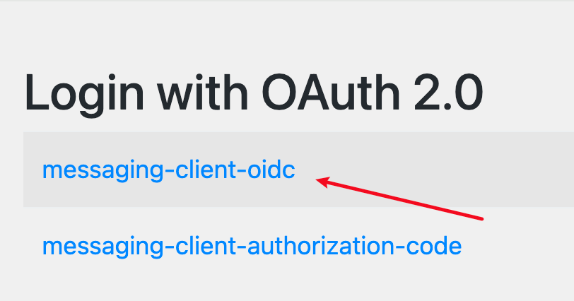
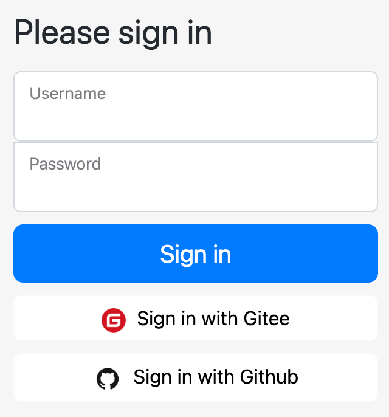
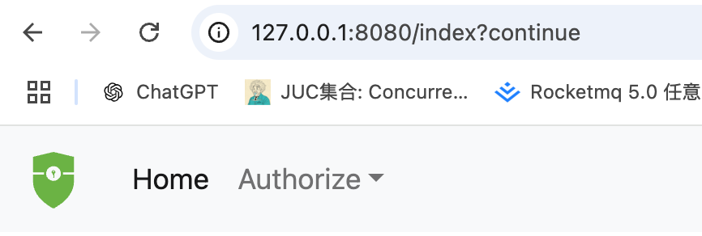
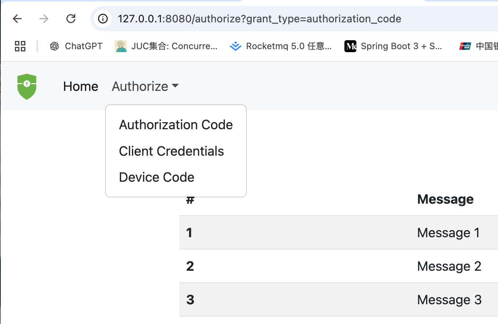
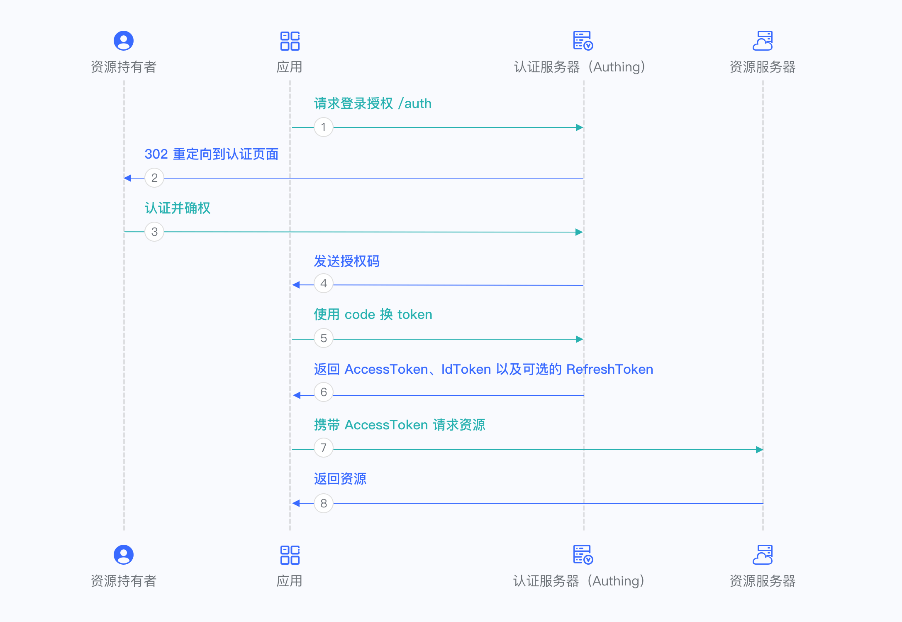
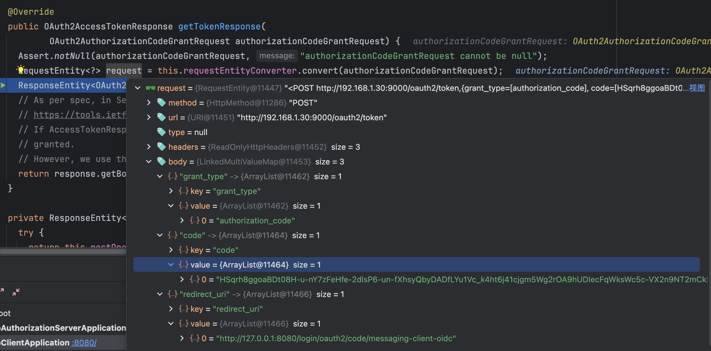
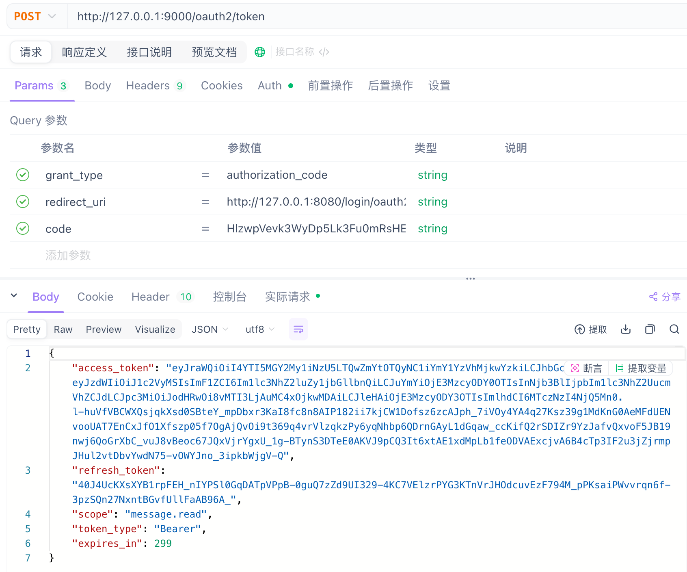
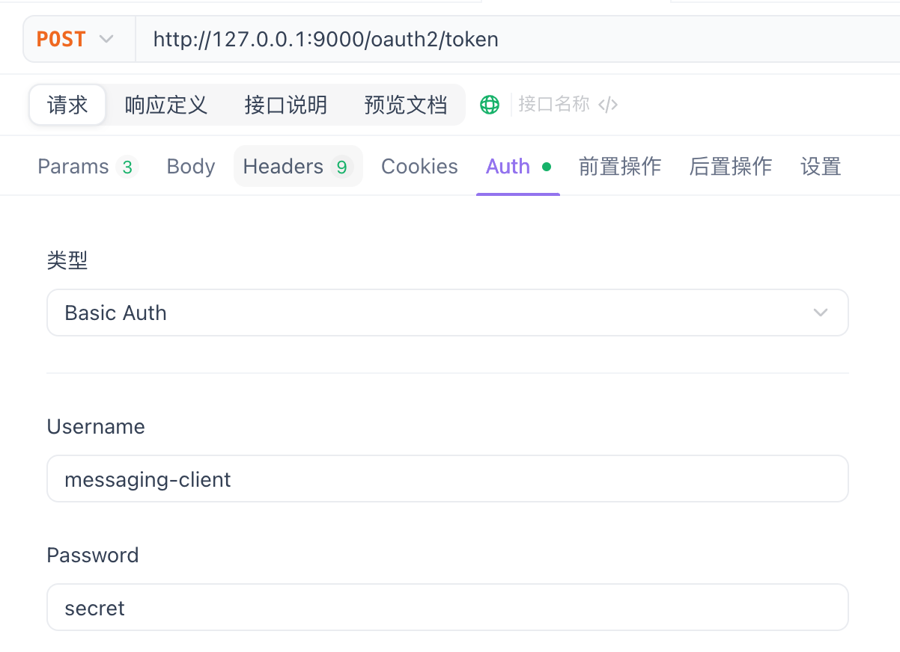
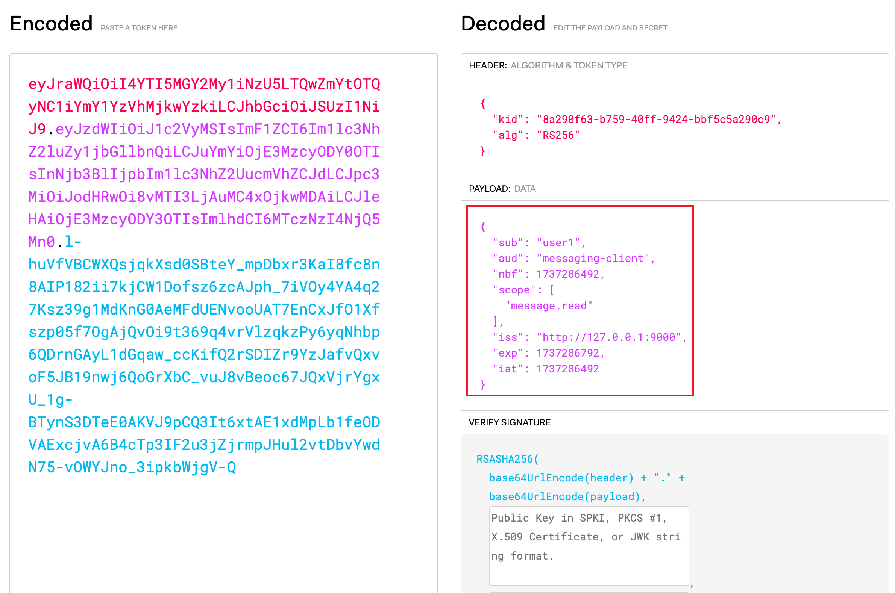

# OAuth2服务端认证流程

上一节课演示了OAuth2客户端的认证流程，在大部分场景下，我们接触到的OAuth2都是开发客户端，比较接入QQ登录，Github登录，微信登录等。

这节课我们就基于Spring Authorization Server来搭建一个授权服务器与资源服务器。

## 项目环境搭建

由于集成Spring Authorization Server这个项目太复杂了，所以这里就不一步一步新建项目，基于spring-authorization-server官网的Demo来，由于官网的demo是基于gradle的，所以这个就提供一个基于maven的[开源项目](https://github.com/WatermelonPlanet/spring-authorization-server-master), 当然这个项目提供的资料已经很全面了，这篇文章说明一下spring-authorization-server的工作流程。

里面包含了三个项目，具体如下所示：

- demo-authorizationserver: 认证服务器，使用9000端口
- demo-client: 客户端服务器. 就是上一节介绍的客户端，使用8080端口
- messages-resource: 资源服务客户端想要访问的资源, 使用8090端口

接下来我们改造一下这个项目，使它可以正常运行，主要修改三个项目的application.yml文件, 修改其中的192.168.56.1 IP地址为本机的IP地址。

```
shengduiliang@liangchengduideMac-mini ~ % ifconfig | grep 192
	inet 192.168.1.30 netmask 0xffffff00 broadcast 192.168.1.255
	inet 192.168.233.1 netmask 0xffffff00 broadcast 192.168.233.255
```

如上面代码所示，修改为192.168.1.30，然后先启动demo-authorizationserver，正常运行后，再启动demo-client跟messages-resource这两个项目。

::: warning
不能将IP地址修改为127.0.0.1, 会造成Session冲突，授权服务器认证成功后，客户端获取不到Session信息
:::

## 项目演示

项目启动成功后，我们访问 http://127.0.0.1:8080/index 接口，会跳转到 http://127.0.0.1:8080/login 页面，如下所示。



点击上面的 messaging-client-oidc 标签，跳转到 http://192.168.1.30:9000/login, 即授权服务器的认证页面。




项目中默认给我们创建了一个用户，用户名是user1, 密码是password，输入用户名密码之后，点击登录按钮。



然后点击Authorze的下拉选项，选中Authorization Code认证，可以发现认证成功，显示了Message信息。




## 系统架构图



- 资源持有者： 用户
- 应用: demo-client
- 认证服务器: demo-authorizationserver
- 资源服务器: messages-resource

接下来我们就跟着代码流程结合上面的系统架构图一步一步分析整个源码流程。


## 认证服务器初始化流程

这里先讲解一下认证服务器关于authorization-server的初始化流程，可以看到认证服务器跟Security相关的配置类有两个，AuthorizationServerConfig和DefaultSecurityConfig，DefaultSecurityConfig很好理解，就是我们之前Securtiy添加的登录表单这些的流程，我门主要看AuthorizationServerConfig这个配置。

### AuthorizationServerConfig

```AuthorizationServerConfig
@Configuration(proxyBeanMethods = false)
public class AuthorizationServerConfig {
  @Bean
  @Order(Ordered.HIGHEST_PRECEDENCE)
  public SecurityFilterChain authorizationServerSecurityFilterChain(
      HttpSecurity http, RegisteredClientRepository registeredClientRepository,
      AuthorizationServerSettings authorizationServerSettings) throws Exception {
    // 核心代码是这一行
    OAuth2AuthorizationServerConfiguration.applyDefaultSecurity(http);
    ....
    return http.build();
  }
}
```

注意authorizationServerSecurityFilterChain上面加上了@Order(Ordered.HIGHEST_PRECEDENCE)这个注解，之前提到过过滤器也是会排序的，所以会优先走这个过滤器链，如果不满足再走其他的过滤器链。

我们看一下applyDefaultSecurity这个方法的实现，代码如下所示

### OAuth2AuthorizationServerConfiguration

``` OAuth2AuthorizationServerConfiguration
@Configuration(proxyBeanMethods = false)
public class OAuth2AuthorizationServerConfiguration {
  public static void applyDefaultSecurity(HttpSecurity http) throws Exception {
    OAuth2AuthorizationServerConfigurer authorizationServerConfigurer =
        new OAuth2AuthorizationServerConfigurer();
    RequestMatcher endpointsMatcher = authorizationServerConfigurer
        .getEndpointsMatcher();

    http
      .securityMatcher(endpointsMatcher)
      .authorizeHttpRequests(authorize ->
        authorize.anyRequest().authenticated()
      )
      .csrf(csrf -> csrf.ignoringRequestMatchers(endpointsMatcher))
      .apply(authorizationServerConfigurer);
  }
}
```

securityMatcher这个方法晚点再看，可以看到就是往HttpSecurity注册了OAuth2AuthorizationServerConfigurer这个自动配置类。

### OAuth2AuthorizationServerConfigurer

我们看一下OAuth2AuthorizationServerConfigurer的init方法跟configure方法。

```
public final class OAuth2AuthorizationServerConfigurer
		extends AbstractHttpConfigurer<OAuth2AuthorizationServerConfigurer, HttpSecurity> {

  @Override
  public void init(HttpSecurity httpSecurity) {
    // 获取AuthorizationServer的配置，包括各种端点
    AuthorizationServerSettings authorizationServerSettings = OAuth2ConfigurerUtils.getAuthorizationServerSettings(httpSecurity);
    if (isOidcEnabled()) {
      配置OAuth2AuthorizationEndpointConfigurer的sessionRegistry
    } else {
      配置OAuth2AuthorizationEndpointConfigurer成的AuthorizationCodeRequestAuthenticationValidator
    }
    this.configurers.values().forEach(configurer -> {
      configurer.init(httpSecurity);
      requestMatchers.add(configurer.getRequestMatcher());
    });
  }

  @Override
  public void configure(HttpSecurity httpSecurity) {
    this.configurers.values().forEach(configurer -> configurer.configure(httpSecurity));

    AuthorizationServerSettings authorizationServerSettings = OAuth2ConfigurerUtils.getAuthorizationServerSettings(httpSecurity);

    // 添加authorizationServerContextFilter
    AuthorizationServerContextFilter authorizationServerContextFilter = new AuthorizationServerContextFilter(authorizationServerSettings);
    httpSecurity.addFilterAfter(postProcess(authorizationServerContextFilter), SecurityContextHolderFilter.class);

    // 获取JWKSource
    JWKSource<com.nimbusds.jose.proc.SecurityContext> jwkSource = OAuth2ConfigurerUtils.getJwkSource(httpSecurity);
    if (jwkSource != null) {
      NimbusJwkSetEndpointFilter jwkSetEndpointFilter = new NimbusJwkSetEndpointFilter(
          jwkSource, authorizationServerSettings.getJwkSetEndpoint());
      httpSecurity.addFilterBefore(postProcess(jwkSetEndpointFilter), AbstractPreAuthenticatedProcessingFilter.class);
    }
  }
}
```

可以看到核心的地方就是调用了OAuth2AuthorizationServerConfigurer的configurers的init和configure方法。我们看一下都有哪些

```
public final class OAuth2AuthorizationServerConfigurer
		extends AbstractHttpConfigurer<OAuth2AuthorizationServerConfigurer, HttpSecurity> {
  private final Map<Class<? extends AbstractOAuth2Configurer>, AbstractOAuth2Configurer> configurers = createConfigurers();

	private Map<Class<? extends AbstractOAuth2Configurer>, AbstractOAuth2Configurer> createConfigurers() {
		Map<Class<? extends AbstractOAuth2Configurer>, AbstractOAuth2Configurer> configurers = new LinkedHashMap<>();
		configurers.put(OAuth2ClientAuthenticationConfigurer.class, new OAuth2ClientAuthenticationConfigurer(this::postProcess));
		configurers.put(OAuth2AuthorizationServerMetadataEndpointConfigurer.class, new OAuth2AuthorizationServerMetadataEndpointConfigurer(this::postProcess));
		configurers.put(OAuth2AuthorizationEndpointConfigurer.class, new OAuth2AuthorizationEndpointConfigurer(this::postProcess));
		configurers.put(OAuth2TokenEndpointConfigurer.class, new OAuth2TokenEndpointConfigurer(this::postProcess));
		configurers.put(OAuth2TokenIntrospectionEndpointConfigurer.class, new OAuth2TokenIntrospectionEndpointConfigurer(this::postProcess));
		configurers.put(OAuth2TokenRevocationEndpointConfigurer.class, new OAuth2TokenRevocationEndpointConfigurer(this::postProcess));
		configurers.put(OAuth2DeviceAuthorizationEndpointConfigurer.class, new OAuth2DeviceAuthorizationEndpointConfigurer(this::postProcess));
		configurers.put(OAuth2DeviceVerificationEndpointConfigurer.class, new OAuth2DeviceVerificationEndpointConfigurer(this::postProcess));
		return configurers;
	}
}
```

可以看到有很多configurer，后面的那些所有功能我们都要看这些配置类，这里简单讲解一些这些Configurer的用处

- **OAuth2ClientAuthenticationConfigurer**: 配置OAuth2客户端身份验证端点，客户端通过这个端点进行身份验证，获取访问令牌（注意，是处理客户端的身份认证）
- OAuth2AuthorizationServerMetadataEndpointConfigurer: 配置OAuth2授权服务器的元数据端点，客户端可以通过这个端点获取元数据的信息，比如说支持的授权类型，端点路径，令牌格式等信息
- **OAuth2AuthorizationEndpointConfigurer**: 用于配置 OAuth2 授权端点。这个端点处理用户的授权请求，允许用户授权客户端访问其资源。（注意，是处理用户的身份认证）
- OAuth2TokenEndpointConfigurer: 用于配置 OAuth2 令牌端点。这个端点处理令牌请求，客户端可以通过它交换授权码或凭证来获得访问令牌或刷新令牌
- OAuth2TokenIntrospectionEndpointConfigurer: 用于配置 OAuth2 令牌检查端点。客户端或资源服务器可以通过该端点验证访问令牌的有效性并获取相关信息（例如，令牌是否过期、所拥有的权限等）
- OAuth2TokenRevocationEndpointConfigurer: 用于配置 OAuth2 令牌撤销端点。客户端或用户可以通过该端点撤销访问令牌或刷新令牌，从而使令牌失效。
- **OAuth2DeviceAuthorizationEndpointConfigurer**: 用于配置 OAuth2 设备授权端点。这个端点通常用于设备授权流程，适用于那些没有浏览器的设备（例如，智能电视），用户通过其他设备或浏览器来完成授权过程。
- OAuth2DeviceVerificationEndpointConfigurer: 用于配置 OAuth2 设备验证端点。它用于验证设备是否成功完成授权，并提供设备与授权码的验证过程。

### securityMatcher

看一下securityMatcher的构建过程，直接看刚才OAuth2AuthorizationServerConfigurer的init方法。

``` OAuth2AuthorizationServerConfigurer
public final class OAuth2AuthorizationServerConfigurer
		extends AbstractHttpConfigurer<OAuth2AuthorizationServerConfigurer, HttpSecurity> {
  this.configurers.values().forEach(configurer -> {
    configurer.init(httpSecurity);
    requestMatchers.add(configurer.getRequestMatcher());
  });
}
```

可以看到是遍历configurer的requestMatchers，然后添加进来的。具体是哪些接口，我们回看AuthorizationServerConfig这个配置，里面有一个bean。

``` AuthorizationServerConfig
@Configuration(proxyBeanMethods = false)
public class AuthorizationServerConfig {
  //授权服务器的配置 很多class 你看它命名就知道了 想研究的可以点进去看一看
  @Bean
  public AuthorizationServerSettings authorizationServerSettings() {
    return AuthorizationServerSettings.builder().build();
  }
}
```

点击这个builder进去看一下，可以看到下面的代码。

``` AuthorizationServerSettings
public final class AuthorizationServerSettings extends AbstractSettings {
  public static Builder builder() {
    return new Builder()
        .authorizationEndpoint("/oauth2/authorize")
        .deviceAuthorizationEndpoint("/oauth2/device_authorization")
        .deviceVerificationEndpoint("/oauth2/device_verification")
        .tokenEndpoint("/oauth2/token")
        .jwkSetEndpoint("/oauth2/jwks")
        .tokenRevocationEndpoint("/oauth2/revoke")
        .tokenIntrospectionEndpoint("/oauth2/introspect")
        .oidcClientRegistrationEndpoint("/connect/register")
        .oidcUserInfoEndpoint("/userinfo")
        .oidcLogoutEndpoint("/connect/logout");
  }

  @Override
  public AuthorizationServerSettings build() {
    return new AuthorizationServerSettings(getSettings());
  }
}
```

所以就是针对这些路径进行放行的, 下面解释一下这些端点的作用。

- /oauth2/authorize: 用于发起授权请求。客户端应用将用户重定向到此端点，用户在此端点进行身份验证并授权访问权限。用户输入凭证并授权后，授权服务器会将用户重定向回客户端应用，并附带一个授权码，客户端可以使用这个授权码换取访问令牌
- /oauth2/device_authorization: 设备向授权服务器请求设备码，并提供给用户，用户在另一个设备上输入设备码进行授权。授权成功后，设备可以获得访问令牌
- /oauth2/device_verification: 用于设备验证。设备在此端点验证是否已经获得授权,设备持续查询此端点，直到用户在其他设备上完成授权并确认设备身份
- /oauth2/token: 客户端将授权码（或凭证）发送到此端点，授权服务器验证后，返回访问令牌（JWT 或其他格式）和刷新令牌
- /oauth2/jwks: 此端点返回包含授权服务器公钥的 JSON 格式的数据，客户端可以使用这些公钥来验证令牌的有效性
- /oauth2/revoke: 当客户端或用户决定不再使用某个令牌时，发送请求到此端点，授权服务器将撤销该令牌，令牌将不再有效
- /oauth2/introspect: 资源服务器将令牌传递给此端点，授权服务器返回令牌的相关信息（如是否有效、过期时间、权限等），帮助资源服务器做出相应的权限判断
- /connect/register: OpenID Connect 客户端注册端点。客户端可以通过此端点向授权服务器注册，获取客户端ID和客户端密钥等信息
- /userinfo: OpenID Connect 用户信息端点。客户端可以使用访问令牌（Access Token）来请求用户的个人信息（如姓名、电子邮件等）
- /connect/logout: 当用户想要登出时，客户端引导用户访问此端点，授权服务器会处理登出请求并结束用户的会话

下面我们就来分析一下上面那个场景的具体流程。

## 跳转登录页

访问 http://127.0.0.1:8080/index 接口，会跳转到 http://127.0.0.1:8080/login 页面，有之前异常处理经验的就知道，访问index没有权限，客户端会把请求重定向到login页，而login页的生成是由DefaultLoginPageGeneratingFilter这个过滤器实现的，我们看看他的模板方法。

``` DefaultLoginPageGeneratingFilter
public class DefaultLoginPageGeneratingFilter extends GenericFilterBean {
  private String generateLoginPageHtml(HttpServletRequest request, boolean loginError, boolean logoutSuccess) {
    return HtmlTemplates.fromTemplate(LOGIN_PAGE_TEMPLATE)
      .withRawHtml("oauth2Login", renderOAuth2Login(loginError, logoutSuccess, errorMsg, contextPath))
      .render();
  }

  private String renderOAuth2Login(boolean loginError, boolean logoutSuccess, String errorMsg, String contextPath) {
    String oauth2Rows = this.oauth2AuthenticationUrlToClientName.entrySet()
      .stream()
      .map((urlToName) -> renderOAuth2Row(contextPath, urlToName.getKey(), urlToName.getValue()))
      .collect(Collectors.joining("\n"));
    return HtmlTemplates.fromTemplate(OAUTH2_LOGIN_TEMPLATE).render();
  }
}
```

可以看到，登录页面就是遍历oauth2AuthenticationUrlToClientName列表, 然后渲染对应的列表项。

至于oauth2AuthenticationUrlToClientName列表是怎么来的， 可以看OAuth2LoginConfigurer -> init -> getLoginLinks, 是取授权码登录的ClientRegistration名字，查看demo-client的application.yml， 可以看到对应的ClientRegistration的有两个。

```
spring:
  security:
    oauth2:
      client:
        registration:
          messaging-client-oidc:
            redirect-uri: "http://127.0.0.1:8080/login/oauth2/code/{registrationId}"
            authorization-grant-type: authorization_code
            client-name: messaging-client-oidc
          messaging-client-authorization-code:
            redirect-uri: "http://127.0.0.1:8080/authorized"
            client-name: messaging-client-authorization-code
            authorization-grant-type: authorization_code
```

## 请求登录授权

用户点击messaging-client-oidc标签的按钮，就会访问 http://localhost:8080/oauth2/authorization/messaging-client-oidc 接口，然后由上一节讲到的OAuth2AuthorizationRequestRedirectFilter将客户端重定向到http://192.168.1.30:9000/oauth2/authorize 接口，这个具体的过程可以看上一节课的内容，这里跳转的链接样式

```
http://192.168.1.30:9000/oauth2/authorize?response_type=code&client_id=messaging-client&scope=openid%20profile&state=9D0_3yCqlMCN26lc0QALd0QelQFffs2At9gJa3Frp_A%3D&redirect_uri=http://127.0.0.1:8080/login/oauth2/code/messaging-client-oidc&nonce=bjI8Gxk7zdkm9zstrr0D0-oAEnF879_0C5w5nxI6e-4
```

由于在demo-client在application.yml定义了provider，所以会获取认证服务器的/.well-known/openid-configuration来配置认证服务器的链接。

## 跳转认证服务器认证 

我们先来看认证服务器demo-authorizationserver的实现，因为认证服务器也是需要对用户进行认证的，所以也会集成Spring Securtiy，我们看一下配置文件。

``` DefaultSecurityConfig
@EnableWebSecurity
@Configuration(proxyBeanMethods = false)
public class DefaultSecurityConfig {
	// 过滤器链
	@Bean
	public SecurityFilterChain defaultSecurityFilterChain(HttpSecurity http) throws Exception {
		http
      .authorizeHttpRequests(authorize ->//① 配置鉴权的
          authorize
              .requestMatchers("/assets/**", "/webjars/**", "/login","/oauth2/**","/oauth2/token").permitAll() //② 忽略鉴权的url
              .anyRequest().authenticated()//③ 排除忽略的其他url就需要鉴权了
      )
      .csrf(AbstractHttpConfigurer::disable)
      .formLogin(formLogin ->
          formLogin
              .loginPage("/login")//④ 授权服务认证页面（可以配置相对和绝对地址，前后端分离的情况下填前端的url）
      )
      .oauth2Login(oauth2Login ->
          oauth2Login
              .loginPage("/login")//⑤ oauth2的认证页面（也可配置绝对地址）
              .successHandler(authenticationSuccessHandler())//⑥ 登录成功后的处理
      );
		return http.build();
	}
}
```

可以看到配置了一个表单登录跟一个Oauth2客户端，表单登录是给用户认证用的，而集成Oauth2客户端是因为这个项目自带了gitee登录和github登录。

很明显用户刚开始访问http://192.168.1.30:9000/oauth2/authorize 的时候是没有认证的，所以会跳转到demo-authorizationserver的登录页。

用户输入完帐号密码之后或者通过gitee等登录之后会重新访问访问该接口，这个时候用户就是认证过了，那么就会走认证服务器的相关流程了。

## 认证服务器发送授权码

认证服务器对/oauth2/authorize这个接口进行处理的过滤器是OAuth2AuthorizationEndpointFilter这个过滤器。我们先来看看这个过滤器是怎么加进来的，然后看一下这个过滤器的处理流程。

### OAuth2AuthorizationEndpointConfigurer

前面讲到OAuth2AuthorizationServerConfigurer会往HttpSecurity里面添加OAuth2AuthorizationEndpointConfigurer这个配置类，我们先简单看一下这个配置类。

```OAuth2AuthorizationEndpointConfigurer
public final class OAuth2AuthorizationEndpointConfigurer extends AbstractOAuth2Configurer {
  @Override
  void init(HttpSecurity httpSecurity) {
    AuthorizationServerSettings authorizationServerSettings = OAuth2ConfigurerUtils.getAuthorizationServerSettings(httpSecurity);
    // 放行/oauth2/authorize的GET方法和POST方法
    this.requestMatcher = new OrRequestMatcher(
      new AntPathRequestMatcher(authorizationServerSettings.getAuthorizationEndpoint(),HttpMethod.GET.name()),
      new AntPathRequestMatcher(authorizationServerSettings.getAuthorizationEndpoint(),HttpMethod.POST.name())
    );
  }

  @Override
  void configure(HttpSecurity httpSecurity) {
    // 注册authorizationEndpointFilter过滤器
    OAuth2AuthorizationEndpointFilter authorizationEndpointFilter = new OAuth2AuthorizationEndpointFilter(authenticationManager, authorizationServerSettings.getAuthorizationEndpoint());
    // 添加authorizationEndpointFilter过滤器
    httpSecurity.addFilterBefore(postProcess(authorizationEndpointFilter), AbstractPreAuthenticatedProcessingFilter.class);
  }
}
```

可以看到就是在OAuth2AuthorizationEndpointConfigurer这个配置类里面加入的。

### OAuth2AuthorizationEndpointFilter

我们进入这个过滤器的方法里面查看一下，具体代码如下:

``` OAuth2AuthorizationEndpointFilter
public final class OAuth2AuthorizationEndpointFilter extends OncePerRequestFilter {
  
  private static final String DEFAULT_AUTHORIZATION_ENDPOINT_URI = "/oauth2/authorize";
  private AuthenticationConverter authenticationConverter;

  @Override
  protected void doFilterInternal(HttpServletRequest request, HttpServletResponse response, FilterChain filterChain)
      throws ServletException, IOException {
    // 如果不是认证URL，直接放行
    if (!this.authorizationEndpointMatcher.matches(request)) {
      filterChain.doFilter(request, response);
      return;
    }
    // 调用authenticationConverter的convert进行权限校验
    Authentication authentication = this.authenticationConverter.convert(request);
    if (!authenticationResult.isAuthenticated()) {
      filterChain.doFilter(request, response);
      return;
    }
    // 认证请求
    Authentication authenticationResult = this.authenticationManager.authenticate(authentication);
    // 如果是OAuth2AuthorizationConsentAuthenticationToken，就跳转到授权界面
    if (authenticationResult instanceof OAuth2AuthorizationConsentAuthenticationToken) {
      sendAuthorizationConsent(request, response,
          (OAuth2AuthorizationCodeRequestAuthenticationToken) authentication,
          (OAuth2AuthorizationConsentAuthenticationToken) authenticationResult);
      return;
    }
    // 成功认证操作
    this.sessionAuthenticationStrategy.onAuthentication(authenticationResult, request, response);
    this.authenticationSuccessHandler.onAuthenticationSuccess(request, response, authenticationResult);
  }
}
```

### AuthenticationConverter

可以看到核心的地方就是authenticationConverter，我们看看这个接口的实现，可以看到就只有一个convert方法，返回Authentication

``` AuthenticationConverter
public interface AuthenticationConverter {
	Authentication convert(HttpServletRequest request);
}
```

具体的authenticationConverter是什么呢，回看OAuth2AuthorizationEndpointConfigurer加入Filter的地方。

``` OAuth2AuthorizationEndpointConfigurer
public final class OAuth2AuthorizationEndpointConfigurer extends AbstractOAuth2Configurer {
  private static List<AuthenticationConverter> createDefaultAuthenticationConverters() {
    List<AuthenticationConverter> authenticationConverters = new ArrayList<>();

    authenticationConverters.add(new OAuth2AuthorizationCodeRequestAuthenticationConverter());
    authenticationConverters.add(new OAuth2AuthorizationConsentAuthenticationConverter());

    return authenticationConverters;
  }

  @Override
  void configure(HttpSecurity httpSecurity) {
    List<AuthenticationConverter> authenticationConverters = createDefaultAuthenticationConverters();
    if (!this.authorizationRequestConverters.isEmpty()) {
      authenticationConverters.addAll(0, this.authorizationRequestConverters);
    }
    authorizationEndpointFilter.setAuthenticationConverter(
      new DelegatingAuthenticationConverter(authenticationConverters));
  }
}
```

可以看到加入两个AuthenticationConverter，这两个AuthenticationConverter看名字就知道干什么的

- OAuth2AuthorizationCodeRequestAuthenticationConverter: 处理授权码认证请求
- OAuth2AuthorizationConsentAuthenticationConverter: 处理授权请求

我们直接看OAuth2AuthorizationCodeRequestAuthenticationConverter的代码

``` OAuth2AuthorizationCodeRequestAuthenticationConverter
public final class OAuth2AuthorizationCodeRequestAuthenticationConverter implements AuthenticationConverter {
  @Override
  public Authentication convert(HttpServletRequest request) {
    // POST方法，有response_type参数并且code=openid
    if (!"GET".equals(request.getMethod()) && !OIDC_REQUEST_MATCHER.matches(request)) {
      return null;
    }
    MultiValueMap<String, String> parameters = OAuth2EndpointUtils.getParameters(request);
    ...
    // 如果没有认证，那么就是匿名用户
    Authentication principal = SecurityContextHolder.getContext().getAuthentication();
		if (principal == null) {
			principal = ANONYMOUS_AUTHENTICATION;
		}
    ...    // 参数校验
    // 返回一个构造的Token
    return new OAuth2AuthorizationCodeRequestAuthenticationToken(authorizationUri, clientId, principal,
      redirectUri, state, scopes, additionalParameters);
  }
}
```

可以看到其实AuthenticationConverter做的事情也不复杂，就是将请求转换对应的AuthenticationToken。

### OAuth2AuthorizationCodeRequestAuthenticationProvider

接下来我们看一下OAuth2AuthorizationEndpointFilter的认证方法，主要看OAuth2AuthorizationCodeRequestAuthenticationToken的验证方法，这个Token的验证类是OAuth2AuthorizationCodeRequestAuthenticationProvider。我们看一下认证方法。

``` OAuth2AuthorizationCodeRequestAuthenticationProvider
public final class OAuth2AuthorizationCodeRequestAuthenticationProvider implements AuthenticationProvider {
  @Override
  public Authentication authenticate(Authentication authentication) throws AuthenticationException {
    OAuth2AuthorizationCodeRequestAuthenticationToken authorizationCodeRequestAuthentication =
      (OAuth2AuthorizationCodeRequestAuthenticationToken) authentication;
    // 找到对应的registeredClient
    RegisteredClient registeredClient = this.registeredClientRepository.findByClientId(
      authorizationCodeRequestAuthentication.getClientId());
    // 检验authentication
    OAuth2AuthorizationCodeRequestAuthenticationContext authenticationContext =
      OAuth2AuthorizationCodeRequestAuthenticationContext.with(authorizationCodeRequestAuthentication)
        .registeredClient(registeredClient)
        .build();
    this.authenticationValidator.accept(authenticationContext);
    // 如果需要用户授权，就返回OAuth2AuthorizationConsentAuthenticationToken
    if (requireAuthorizationConsent(registeredClient, authorizationRequest, currentAuthorizationConsent)) {
      return new OAuth2AuthorizationConsentAuthenticationToken(authorizationRequest.getAuthorizationUri(),
        registeredClient.getClientId(), principal, state, currentAuthorizedScopes, null);
    }
    // 生成授权码
    OAuth2TokenContext tokenContext = createAuthorizationCodeTokenContext(
        authorizationCodeRequestAuthentication, registeredClient, null, authorizationRequest.getScopes());
    OAuth2AuthorizationCode authorizationCode = this.authorizationCodeGenerator.generate(tokenContext);
    // 保存授权码信息
    OAuth2Authorization authorization = authorizationBuilder(registeredClient, principal, authorizationRequest)
        .authorizedScopes(authorizationRequest.getScopes())
        .token(authorizationCode)
        .build();
    this.authorizationService.save(authorization);
    // 返回OAuth2AuthorizationCodeRequestAuthenticationToken
    return new OAuth2AuthorizationCodeRequestAuthenticationToken(authorizationRequest.getAuthorizationUri(),
        registeredClient.getClientId(), principal, authorizationCode, redirectUri,
        authorizationRequest.getState(), authorizationRequest.getScopes());
  }
}
```

可以看到这个Provider可以扩展的点主要有三个：
- registeredClientRepository: 这个就是存储客户端应用的信息，只有客户端可信，我们才会认证成功
- authorizationConsentService: 保存客户端权限的信息
- authorizationService: 保存授权码Token的方法

我们看看这三个对象在哪里赋值的，回到OAuth2AuthorizationEndpointConfigurer配置类，查看方法。

```OAuth2AuthorizationEndpointConfigurer
public final class OAuth2AuthorizationEndpointConfigurer extends AbstractOAuth2Configurer {
  @Override
  void init(HttpSecurity httpSecurity) {
    List<AuthenticationProvider> authenticationProviders = createDefaultAuthenticationProviders(httpSecurity);
    if (!this.authenticationProviders.isEmpty()) {
      authenticationProviders.addAll(0, this.authenticationProviders);
    }
    authenticationProviders.forEach(authenticationProvider ->
      httpSecurity.authenticationProvider(postProcess(authenticationProvider)));
  }

  private List<AuthenticationProvider> createDefaultAuthenticationProviders(HttpSecurity httpSecurity) {
    List<AuthenticationProvider> authenticationProviders = new ArrayList<>();

    OAuth2AuthorizationCodeRequestAuthenticationProvider authorizationCodeRequestAuthenticationProvider =
        new OAuth2AuthorizationCodeRequestAuthenticationProvider(
            OAuth2ConfigurerUtils.getRegisteredClientRepository(httpSecurity),
            OAuth2ConfigurerUtils.getAuthorizationService(httpSecurity),
            OAuth2ConfigurerUtils.getAuthorizationConsentService(httpSecurity));
    if (this.authorizationCodeRequestAuthenticationValidator != null) {
      authorizationCodeRequestAuthenticationProvider.setAuthenticationValidator(
          new OAuth2AuthorizationCodeRequestAuthenticationValidator()
              .andThen(this.authorizationCodeRequestAuthenticationValidator));
    }
    authenticationProviders.add(authorizationCodeRequestAuthenticationProvider);

    return authenticationProviders;
  }
}
```

具体怎么获取的那三个方法这里就不细讲了，主要是先通过httpSecurity.getSharedObject获取，如果没有，再通过ApplicationContext中直接获取对应bean，具体的可以跟一下代码。

在认证服务器的demo里面，在AuthorizationServerConfig给我们配置了这几个实现，看一下代码。

``` AuthorizationServerConfig
@Configuration(proxyBeanMethods = false)
public class AuthorizationServerConfig {

  //这个是oauth2的授权信息(包含了用户、token等其他信息) 这个也是可以扩展的 OAuth2AuthorizationService也是一个实现类
  @Bean
  public OAuth2AuthorizationService authorizationService(JdbcTemplate jdbcTemplate,
                                RegisteredClientRepository registeredClientRepository) {
    return new JdbcOAuth2AuthorizationService(jdbcTemplate, registeredClientRepository);
  }

  //这个是oauth2授权记录的持久化存储方式 看 JdbcOAuth2AuthorizationConsentService 就知道是基于数据库的了,当然也可以进行扩展 基于redis 后面再将 你可以看看 JdbcOAuth2AuthorizationConsentService的是一个实现
  @Bean
  public OAuth2AuthorizationConsentService authorizationConsentService(JdbcTemplate jdbcTemplate,
                                      RegisteredClientRepository registeredClientRepository) {
    // Will be used by the ConsentController
    return new JdbcOAuth2AuthorizationConsentService(jdbcTemplate, registeredClientRepository);
  }

  @Bean
  public RegisteredClientRepository registeredClientRepository(JdbcTemplate jdbcTemplate) {
    RegisteredClient registeredClient = RegisteredClient.withId(UUID.randomUUID().toString())
        .clientId("messaging-client")
        .clientSecret("{noop}secret")
        .clientAuthenticationMethod(ClientAuthenticationMethod.CLIENT_SECRET_BASIC)
        .authorizationGrantType(AuthorizationGrantType.AUTHORIZATION_CODE)
        .authorizationGrantType(AuthorizationGrantType.REFRESH_TOKEN)
        .authorizationGrantType(AuthorizationGrantType.CLIENT_CREDENTIALS)
        .redirectUri("http://127.0.0.1:8080/login/oauth2/code/messaging-client-oidc")
        .redirectUri("http://127.0.0.1:8080/authorized")
        .postLogoutRedirectUri("http://127.0.0.1:8080/logged-out")
        .scope(OidcScopes.OPENID)
        .scope(OidcScopes.PROFILE)
        .scope("message.read")
        .scope("message.write")
        .clientSettings(ClientSettings.builder().requireAuthorizationConsent(true).build())//requireAuthorizationConsent(true) 授权页是有的 如果是false是没有的
        .build();

    RegisteredClient deviceClient = RegisteredClient.withId(UUID.randomUUID().toString())
        .clientId("device-messaging-client")
        .clientAuthenticationMethod(ClientAuthenticationMethod.NONE)
        .authorizationGrantType(AuthorizationGrantType.DEVICE_CODE)
        .authorizationGrantType(AuthorizationGrantType.REFRESH_TOKEN)
        .scope("message.read")
        .scope("message.write")
        .build();

    // Save registered client's in db as if in-memory
    JdbcRegisteredClientRepository registeredClientRepository = new JdbcRegisteredClientRepository(jdbcTemplate);
    registeredClientRepository.save(registeredClient);
    registeredClientRepository.save(deviceClient);

    return registeredClientRepository;
  }

  //此时基于H2数据库(内存数据库) 需要使用mysql 就注释掉就可以了 demo这个地方我们用内存跑就行了 省事
  @Bean
  public EmbeddedDatabase embeddedDatabase() {
    // @formatter:off
    return new EmbeddedDatabaseBuilder()
        .generateUniqueName(true)
        .setType(EmbeddedDatabaseType.H2)
        .setScriptEncoding("UTF-8")
        .addScript("org/springframework/security/oauth2/server/authorization/oauth2-authorization-schema.sql")
        .addScript("org/springframework/security/oauth2/server/authorization/oauth2-authorization-consent-schema.sql")
        .addScript("org/springframework/security/oauth2/server/authorization/client/oauth2-registered-client-schema.sql")
        .build();
    // @formatter:on
  }
}
```

可以看到先声明了两个registeredClient，然后保存到H2数据库中，并且返回这个RegisteredClientRepository。

:::warning
RegisteredClient实际就是我们的客户端应用，举个之前的github登录的场景，我们先要在github上注册一个应用，然后获取AppId跟AppSecret，而我们注册到github的信息，就是一个RegisteredClient
:::

## 客户端使用授权码获取Token

认证服务器在验证用户的授权登录信息成功之后，就会把用户重定向到客户端的认证路径，具体路径如下所示：

```
http://127.0.0.1:8080/login/oauth2/code/messaging-client-oidc?code=C0gkjqDsrvzA2fbNJXbPuM1o-HHS81Q8PYeJCGyvI-96TXLqj5mrc6cKBoE0qpm8oiPZC2trByJQvNxoGUD8whFazQb5KzT8425p1jPpgXn2Pw43PwvUudesbMxE-s1_&state=i-2nKneuUffJixaWGncKnkehrvBoJ6SdbEKCJ9sgVCQ%3D
```

具体客户端怎么处理这个请求的，可以看Oauth2客户端认证流程，用于这个OIDC模式，所以用的Provider是OidcAuthorizationCodeAuthenticationProvider。
这里主要讲一下客户端向认证服务器获取Token的URL，如下所示:



## 认证服务器返回Token

认证服务器对/oauth2/token这个URL进行处理的是OAuth2TokenEndpointFilter这个Filter。按照惯例，我们先看一下这个Filter是在哪里加进来的，然后看一下这个Filter的处理逻辑。

前面讲到OAuth2AuthorizationServerConfigurer会往HttpSecurity里面添加OAuth2TokenEndpointConfigurer这个配置类，我们先简单看一下这个配置类。

### OAuth2TokenEndpointConfigurer

``` OAuth2TokenEndpointConfigurer
public final class OAuth2TokenEndpointConfigurer extends AbstractOAuth2Configurer {
	@Override
	void configure(HttpSecurity httpSecurity) {
    // 注册OAuth2TokenEndpointFilter过滤器
    OAuth2TokenEndpointFilter tokenEndpointFilter = new OAuth2TokenEndpointFilter(authenticationManager, authorizationServerSettings.getTokenEndpoint());
    // 添加OAuth2TokenEndpointFilter过滤器
    httpSecurity.addFilterAfter(postProcess(tokenEndpointFilter), AuthorizationFilter.class);
  }
}
```

### OAuth2TokenEndpointFilter

那我们来看一下OAuth2TokenEndpointFilter的处理过程，代码如下所示:

``` OAuth2TokenEndpointFilter
public final class OAuth2TokenEndpointFilter extends OncePerRequestFilter {
  @Override
  protected void doFilterInternal(HttpServletRequest request, HttpServletResponse response, FilterChain filterChain)
      throws ServletException, IOException {

    if (!this.tokenEndpointMatcher.matches(request)) {
      filterChain.doFilter(request, response);
      return;
    }
    Authentication authorizationGrantAuthentication = this.authenticationConverter.convert(request);
          OAuth2AccessTokenAuthenticationToken accessTokenAuthentication =
    (OAuth2AccessTokenAuthenticationToken) this.authenticationManager.authenticate(authorizationGrantAuthentication);
    this.authenticationSuccessHandler.onAuthenticationSuccess(request, response, accessTokenAuthentication);
  }
}
```

可以看到流程跟之前的OAuth2AuthorizationEndpointFilter是差不多的。主要是authenticationConverter，authenticationProvider，以及authenticationSuccessHandler不一样。

### AuthenticationConverter

那我们接下来就看看OAuth2TokenEndpointFilter有哪些AuthenticationConverter, 回到OAuth2TokenEndpointConfigurer的代码。

``` AbstractOAuth2Configurer
public final class OAuth2TokenEndpointConfigurer extends AbstractOAuth2Configurer {
  @Override
  void configure(HttpSecurity httpSecurity) {
    List<AuthenticationConverter> authenticationConverters = createDefaultAuthenticationConverters();
    if (!this.accessTokenRequestConverters.isEmpty()) {
      authenticationConverters.addAll(0, this.accessTokenRequestConverters);
    }
    this.accessTokenRequestConvertersConsumer.accept(authenticationConverters);
    tokenEndpointFilter.setAuthenticationConverter(
        new DelegatingAuthenticationConverter(authenticationConverters));
  }

  private static List<AuthenticationConverter> createDefaultAuthenticationConverters() {
    List<AuthenticationConverter> authenticationConverters = new ArrayList<>();

    authenticationConverters.add(new OAuth2AuthorizationCodeAuthenticationConverter());
    authenticationConverters.add(new OAuth2RefreshTokenAuthenticationConverter());
    authenticationConverters.add(new OAuth2ClientCredentialsAuthenticationConverter());
    authenticationConverters.add(new OAuth2DeviceCodeAuthenticationConverter());

    return authenticationConverters;
  }
}
```

可以看到声明了4个AuthenticationConverter，具体代码就不讲解了，这四个Converter分别处理四种授权模式：

- OAuth2AuthorizationCodeAuthenticationConverter: 处理授权码模式
- OAuth2RefreshTokenAuthenticationConverter: 处理令牌授权模式
- OAuth2ClientCredentialsAuthenticationConverter: 处理客户端凭证授权模式
- OAuth2DeviceCodeAuthenticationConverter: 处理设备码模式

### AuthenticationProvider

接下来看看OAuth2TokenEndpointFilter的AuthenticationProvider有哪些，回到OAuth2TokenEndpointConfigurer的代码

``` OAuth2TokenEndpointConfigurer
public final class OAuth2TokenEndpointConfigurer extends AbstractOAuth2Configurer {
  @Override
  void init(HttpSecurity httpSecurity) {
        List<AuthenticationProvider> authenticationProviders = createDefaultAuthenticationProviders(httpSecurity);
    if (!this.authenticationProviders.isEmpty()) {
      authenticationProviders.addAll(0, this.authenticationProviders);
    }
    this.authenticationProvidersConsumer.accept(authenticationProviders);
    authenticationProviders.forEach(authenticationProvider ->
        httpSecurity.authenticationProvider(postProcess(authenticationProvider)));
  }

  private static List<AuthenticationProvider> createDefaultAuthenticationProviders(HttpSecurity httpSecurity) {
    List<AuthenticationProvider> authenticationProviders = new ArrayList<>();

    OAuth2AuthorizationService authorizationService = OAuth2ConfigurerUtils.getAuthorizationService(httpSecurity);
    OAuth2TokenGenerator<? extends OAuth2Token> tokenGenerator = OAuth2ConfigurerUtils.getTokenGenerator(httpSecurity);

    OAuth2AuthorizationCodeAuthenticationProvider authorizationCodeAuthenticationProvider =
        new OAuth2AuthorizationCodeAuthenticationProvider(authorizationService, tokenGenerator);
    SessionRegistry sessionRegistry = httpSecurity.getSharedObject(SessionRegistry.class);
    if (sessionRegistry != null) {
      authorizationCodeAuthenticationProvider.setSessionRegistry(sessionRegistry);
    }
    authenticationProviders.add(authorizationCodeAuthenticationProvider);

    OAuth2RefreshTokenAuthenticationProvider refreshTokenAuthenticationProvider =
        new OAuth2RefreshTokenAuthenticationProvider(authorizationService, tokenGenerator);
    authenticationProviders.add(refreshTokenAuthenticationProvider);

    OAuth2ClientCredentialsAuthenticationProvider clientCredentialsAuthenticationProvider =
        new OAuth2ClientCredentialsAuthenticationProvider(authorizationService, tokenGenerator);
    authenticationProviders.add(clientCredentialsAuthenticationProvider);

    OAuth2DeviceCodeAuthenticationProvider deviceCodeAuthenticationProvider =
        new OAuth2DeviceCodeAuthenticationProvider(authorizationService, tokenGenerator);
    authenticationProviders.add(deviceCodeAuthenticationProvider);

    return authenticationProviders;
  }
}
```

可以看到就是加入4个AuthenticationProvider，分别对应前面的那四种授权模式，我们就抽出授权码认证模式的来看一下它的处理流程。

``` OAuth2AuthorizationCodeAuthenticationProvider
public final class OAuth2AuthorizationCodeAuthenticationProvider implements AuthenticationProvider {
	@Override
	public Authentication authenticate(Authentication authentication) throws AuthenticationException {
    // 通过Code获取前面授权码认证的信息
		OAuth2Authorization authorization = this.authorizationService.findByToken(
			authorizationCodeAuthentication.getCode(), AUTHORIZATION_CODE_TOKEN_TYPE);
    // 获取Token信息
    OAuth2Authorization.Token<OAuth2AuthorizationCode> authorizationCode =
      authorization.getToken(OAuth2AuthorizationCode.class);
    // 获取认证请求
    OAuth2AuthorizationRequest authorizationRequest = authorization.getAttribute(
      OAuth2AuthorizationRequest.class.getName());
    // 获取认证用户的信息
    Authentication principal = authorization.getAttribute(Principal.class.getName());
    // 生成AccessToken 
		OAuth2TokenContext tokenContext = tokenContextBuilder.tokenType(OAuth2TokenType.ACCESS_TOKEN).build();
		OAuth2Token generatedAccessToken = this.tokenGenerator.generate(tokenContext);
    OAuth2AccessToken accessToken = new OAuth2AccessToken(OAuth2AccessToken.TokenType.BEARER,
      generatedAccessToken.getTokenValue(), generatedAccessToken.getIssuedAt(),
      generatedAccessToken.getExpiresAt(), tokenContext.getAuthorizedScopes());
    if (generatedAccessToken instanceof ClaimAccessor) {
			authorizationBuilder.token(accessToken, (metadata) ->
					metadata.put(OAuth2Authorization.Token.CLAIMS_METADATA_NAME, ((ClaimAccessor) generatedAccessToken).getClaims()));
		} else {
			authorizationBuilder.accessToken(accessToken);
		}
    // 生成refreshToken
    tokenContext = tokenContextBuilder.tokenType(OAuth2TokenType.REFRESH_TOKEN).build();
    OAuth2Token generatedRefreshToken = this.tokenGenerator.generate(tokenContext);
    authorizationBuilder.refreshToken(refreshToken);
    // 生成idToken  
    tokenContext = tokenContextBuilder
      .tokenType(ID_TOKEN_TOKEN_TYPE)
      .authorization(authorizationBuilder.build())	// ID token customizer may need access to the access token and/or refresh token
      .build();
    // @formatter:on
    // 构建OAuth2Token
    OAuth2Token generatedIdToken = this.tokenGenerator.generate(tokenContext);
    idToken = new OidcIdToken(generatedIdToken.getTokenValue(), generatedIdToken.getIssuedAt(),
      generatedIdToken.getExpiresAt(), ((Jwt) generatedIdToken).getClaims());
		authorizationBuilder.token(idToken, (metadata) ->
       metadata.put(OAuth2Authorization.Token.CLAIMS_METADATA_NAME, idToken.getClaims()));
    // 构建authorization
    authorization = authorizationBuilder.build();
    // 保存authorization
    this.authorizationService.save(authorization);
    return new OAuth2AccessTokenAuthenticationToken(
			registeredClient, clientPrincipal, accessToken, refreshToken, additionalParameters);
  }
}
```

这里核心的点就是tokenGenerator这个Token生成器。我们看看这个tokenGenerator是什么。

``` OAuth2TokenEndpointConfigurer
public final class OAuth2TokenEndpointConfigurer extends AbstractOAuth2Configurer {

  private static List<AuthenticationProvider> createDefaultAuthenticationProviders(HttpSecurity httpSecurity) {
    List<AuthenticationProvider> authenticationProviders = new ArrayList<>();

    OAuth2AuthorizationService authorizationService = OAuth2ConfigurerUtils.getAuthorizationService(httpSecurity);
    OAuth2TokenGenerator<? extends OAuth2Token> tokenGenerator = OAuth2ConfigurerUtils.getTokenGenerator(httpSecurity);
  }
}
```

可以看到是通过OAuth2ConfigurerUtils#getTokenGenerator获取的，我们看看这个方法。

```OAuth2ConfigurerUtils
final class OAuth2ConfigurerUtils {
  @SuppressWarnings("unchecked")
  static OAuth2TokenGenerator<? extends OAuth2Token> getTokenGenerator(HttpSecurity httpSecurity) {
    // 首先从httpSecurity里面呢
    OAuth2TokenGenerator<? extends OAuth2Token> tokenGenerator = httpSecurity.getSharedObject(OAuth2TokenGenerator.class);
    if (tokenGenerator == null) {
      // 从ApplicationContext里面拿
      tokenGenerator = getOptionalBean(httpSecurity, OAuth2TokenGenerator.class);
      if (tokenGenerator == null) {
        // jwtGenerator
        JwtGenerator jwtGenerator = getJwtGenerator(httpSecurity);
        // accessTokenGenerator
        OAuth2AccessTokenGenerator accessTokenGenerator = new OAuth2AccessTokenGenerator();
        OAuth2TokenCustomizer<OAuth2TokenClaimsContext> accessTokenCustomizer = getAccessTokenCustomizer(httpSecurity);
        if (accessTokenCustomizer != null) {
          accessTokenGenerator.setAccessTokenCustomizer(accessTokenCustomizer);
        }
        // refreshTokenGenerator
        OAuth2RefreshTokenGenerator refreshTokenGenerator = new OAuth2RefreshTokenGenerator();
        if (jwtGenerator != null) {
          tokenGenerator = new DelegatingOAuth2TokenGenerator(
              jwtGenerator, accessTokenGenerator, refreshTokenGenerator);
        } else {
          tokenGenerator = new DelegatingOAuth2TokenGenerator(
              accessTokenGenerator, refreshTokenGenerator);
        }
      }
      httpSecurity.setSharedObject(OAuth2TokenGenerator.class, tokenGenerator);
    }
    return tokenGenerator;
  }
}
```

这里我门跟一下jwtGenerator的获取过程，跟进getJwtGenerator里面查看。

``` OAuth2ConfigurerUtils
private static JwtGenerator getJwtGenerator(HttpSecurity httpSecurity) {
  JwtGenerator jwtGenerator = httpSecurity.getSharedObject(JwtGenerator.class);
  if (jwtGenerator == null) {
    JwtEncoder jwtEncoder = getJwtEncoder(httpSecurity);
    if (jwtEncoder != null) {
      jwtGenerator = new JwtGenerator(jwtEncoder);
      OAuth2TokenCustomizer<JwtEncodingContext> jwtCustomizer = getJwtCustomizer(httpSecurity);
      if (jwtCustomizer != null) {
        jwtGenerator.setJwtCustomizer(jwtCustomizer);
      }
      httpSecurity.setSharedObject(JwtGenerator.class, jwtGenerator);
    }
  }
  return jwtGenerator;
}

private static JwtEncoder getJwtEncoder(HttpSecurity httpSecurity) {
  JwtEncoder jwtEncoder = httpSecurity.getSharedObject(JwtEncoder.class);
  if (jwtEncoder == null) {
    jwtEncoder = getOptionalBean(httpSecurity, JwtEncoder.class);
    if (jwtEncoder == null) {
      JWKSource<SecurityContext> jwkSource = getJwkSource(httpSecurity);
      if (jwkSource != null) {
        jwtEncoder = new NimbusJwtEncoder(jwkSource);
      }
    }
    if (jwtEncoder != null) {
      httpSecurity.setSharedObject(JwtEncoder.class, jwtEncoder);
    }
  }
  return jwtEncoder;
}
```

可以看到其实最终的就是返回了一个NimbusJwtEncoder，里面有好多配置是可以我们自定义的，这里我们回看AuthorizationServerConfig的配置

```AuthorizationServerConfig
@Configuration(proxyBeanMethods = false)
public class AuthorizationServerConfig {
  @Bean
  public OAuth2TokenCustomizer<JwtEncodingContext> idTokenCustomizer() {
    return new FederatedIdentityIdTokenCustomizer();
  }

  @Bean
  public JWKSource<SecurityContext> jwkSource() {
    RSAKey rsaKey = Jwks.generateRsa();
    JWKSet jwkSet = new JWKSet(rsaKey);
    return (jwkSelector, securityContext) -> jwkSelector.select(jwkSet);
  }

  @Bean
  public JwtDecoder jwtDecoder(JWKSource<SecurityContext> jwkSource) {
    return OAuth2AuthorizationServerConfiguration.jwtDecoder(jwkSource);
  }
}
```

可以看到自定了jwtCustomizer, JWKSource, JwtDecoder，这部分可以扩展出很多跟JWT相关的功能配置，后面再看看有没有必要讲一下。


## Token格式

好了，整一个认证流程这里就讲完了，我们看看最终返回的Token是怎么样的吧。这里我们使用ApiFox来给大家看一下，主要是从认证服务器获取Code码之后，再调一个认证接口获取token。

我们先关掉demo-client和messages-resource项目，只保留认证服务器项目。然后浏览器访问以下地址。

```
http://127.0.0.1:9000/oauth2/authorize?client_id=messaging-client&response_type=code&scope=message.read&redirect_uri=http://127.0.0.1:8080/login/oauth2/code/messaging-client-oidc
```

在认证服务器登录成功之后会跳转以下地址。

```
http://127.0.0.1:8080/login/oauth2/code/messaging-client-oidc?code=HlzwpVevk3WyDp5Lk3Fu0mRsHE3ffJgwPWs9KaQe3CJNj-aYmFkopUrqEZmwnIkxCKvPJu8rzfL5xE1fNmPex1lT_XOo48T8ENyoNH6us_m4ni85gSZG9l7Ts6ZBTAFS
```

我们主要要获取code后面的那串字符串，然后打开Apifox，新建一个接口。



- URL: http://127.0.0.1:9000/oauth2/token
- grant_type: authorization_code
- redirect_uri: http://127.0.0.1:8080/login/oauth2/code/messaging-client-oidc
- code: 前面的Code

注意，Auth那里要填写客户端的名字跟密码。



具体看AuthorizationServerConfig中的RegisteredClientRepository定义的clientId跟clientSecret

然后我们上JWT的官网看看access_token跟refresh_token都是什么信息，具体网站点击[此处](https://jwt.io/)



如果了解ID Token的就知道框框里面的就是一个ID Token的格式。

注意refreshToken不是一个JWT格式的数据（虽然也可以），只是用来刷新access_token的令牌。

## 获取Message信息

这里讲一下项目演示那里，点击Authorze的下拉选项，选中Authorization Code认证，可以发现认证成功，显示了Message信息，这个流程。

可以看到访问http://127.0.0.1:8080/authorize?grant_type=authorization_code 这个接口，这是Demo-Client的一个Controller，我们看一下代码。

``` AuthorizationController
@Controller
public class AuthorizationController {
	public AuthorizationController(WebClient webClient,
			@Value("${messages.base-uri}") String messagesBaseUri) {
		this.webClient = webClient;
		this.messagesBaseUri = messagesBaseUri;
	}

  @GetMapping(value = "/authorize", params = "grant_type=authorization_code")
  public String authorizationCodeGrant(Model model,
      @RegisteredOAuth2AuthorizedClient("messaging-client-authorization-code")
          OAuth2AuthorizedClient authorizedClient) {

    String[] messages = this.webClient
        .get()
        .uri(this.messagesBaseUri)
        .attributes(oauth2AuthorizedClient(authorizedClient))
        .retrieve()
        .bodyToMono(String[].class)
        .block();
    model.addAttribute("messages", messages);

    return "index";
  }
}
```

其中messagesBaseUri是从配置文件中注入进来的，就是messages.base-uri的值，我们看一下是什么, 这里就是资源服务器的信息

``` application.yml
messages:
  base-uri: http://127.0.0.1:8090/messages
```

注意oauth2AuthorizedClient已经带有accessToken的信息了，所以访问资源服务器会带上accessToken。

## 资源服务器

资源服务器要做的功能很简单，就是有用户访问资源服务器的时候，校验用户的accessToken是否有效，如果有效且有权限那么就返回对应的资源。

### OAuth2ResourceServerConfigurer

我们看一下资源服务器的配置文件，具体如下所示

``` ResourceServerConfig
@EnableWebSecurity
@Configuration(proxyBeanMethods = false)
public class ResourceServerConfig {
  @Bean
  SecurityFilterChain securityFilterChain(HttpSecurity http) throws Exception {
    http.authorizeHttpRequests(authorizeHttpRequests->authorizeHttpRequests.anyRequest().authenticated())
    http.oauth2ResourceServer(oauth2ResourceServer->oauth2ResourceServer.jwt(Customizer.withDefaults()));
    return http.build();
  }
}
```

可以看到调用了oauth2ResourceServer这个方法，我们看一下这个方法。

```HttpSecurity
public HttpSecurity oauth2ResourceServer(Customizer<OAuth2ResourceServerConfigurer<HttpSecurity>> oauth2ResourceServerCustomizer) throws Exception {
  OAuth2ResourceServerConfigurer<HttpSecurity> configurer = (OAuth2ResourceServerConfigurer)this.getOrApply(new OAuth2ResourceServerConfigurer(this.getContext()));
  this.postProcess(configurer);
  oauth2ResourceServerCustomizer.customize(configurer);
  return this;
}
```

可以看到引入了OAuth2ResourceServerConfigurer这个配置类，我们看看这个配置类做了什么事情。

```OAuth2ResourceServerConfigurer
public final class OAuth2ResourceServerConfigurer<H extends HttpSecurityBuilder<H>>
		extends AbstractHttpConfigurer<OAuth2ResourceServerConfigurer<H>, H> {
  @Override
  public void configure(H http) {
    BearerTokenResolver bearerTokenResolver = getBearerTokenResolver();
    this.requestMatcher.setBearerTokenResolver(bearerTokenResolver);
    BearerTokenAuthenticationFilter filter = new BearerTokenAuthenticationFilter(resolver);
    filter.setBearerTokenResolver(bearerTokenResolver);
    filter.setAuthenticationEntryPoint(this.authenticationEntryPoint);
    filter.setSecurityContextHolderStrategy(getSecurityContextHolderStrategy());
    http.addFilter(filter);
  }
}
```

可以看到是往过滤器中加入了BearerTokenAuthenticationFilter这个过滤器。

### BearerTokenAuthenticationFilter

接下来我们看一下BearerTokenAuthenticationFilter这个过滤器做的事情。

```
public class BearerTokenAuthenticationFilter extends OncePerRequestFilter {
  protected void doFilterInternal(HttpServletRequest request, HttpServletResponse response, FilterChain filterChain) throws ServletException, IOException {
    String token;
    // 解析Token
    token = this.bearerTokenResolver.resolve(request);

    // 如果Token为空，则放行
    if (token == null) {
      filterChain.doFilter(request, response);
      return;
    }
    
    // 构建BearerTokenAuthenticationToken
    BearerTokenAuthenticationToken authenticationRequest = new BearerTokenAuthenticationToken(token);
    authenticationRequest.setDetails(this.authenticationDetailsSource.buildDetails(request));

    AuthenticationManager authenticationManager = this.authenticationManagerResolver.resolve(request);
    // 认证请求
    Authentication authenticationResult = authenticationManager.authenticate(authenticationRequest);
    SecurityContext context = this.securityContextHolderStrategy.createEmptyContext();
    context.setAuthentication(authenticationResult);
    this.securityContextHolderStrategy.setContext(context);
    this.securityContextRepository.saveContext(context, request, response);
  }
}
```

可以看到其实校验流程跟之前提到的那些过滤差不多，我们看看BearerTokenAuthenticationToken对应的Provider

```OAuth2ResourceServerConfigurer
public final class OAuth2ResourceServerConfigurer<H extends HttpSecurityBuilder<H>>
		extends AbstractHttpConfigurer<OAuth2ResourceServerConfigurer<H>, H> {

  @Override
  public void init(H http) {
    .....
    AuthenticationProvider authenticationProvider = getAuthenticationProvider();
    if (authenticationProvider != null) {
      http.authenticationProvider(authenticationProvider);
    }
  }

  AuthenticationProvider getAuthenticationProvider() {
    if (this.jwtConfigurer != null) {
      return this.jwtConfigurer.getAuthenticationProvider();
    }
    if (this.opaqueTokenConfigurer != null) {
      return this.opaqueTokenConfigurer.getAuthenticationProvider();
    }
    return null;
  }

  AuthenticationProvider getAuthenticationProvider() {
    if (this.authenticationManager != null) {
      return null;
    }
    JwtDecoder decoder = getJwtDecoder();
    Converter<Jwt, ? extends AbstractAuthenticationToken> jwtAuthenticationConverter = getJwtAuthenticationConverter();
    JwtAuthenticationProvider provider = new JwtAuthenticationProvider(decoder);
    provider.setJwtAuthenticationConverter(jwtAuthenticationConverter);
    return postProcess(provider);
  }

  Converter<Jwt, ? extends AbstractAuthenticationToken> getJwtAuthenticationConverter() {
    if (this.jwtAuthenticationConverter == null) {
      if (this.context.getBeanNamesForType(JwtAuthenticationConverter.class).length > 0) {
        this.jwtAuthenticationConverter = this.context.getBean(JwtAuthenticationConverter.class);
      }
      else {
        this.jwtAuthenticationConverter = new JwtAuthenticationConverter();
      }
    }
    return this.jwtAuthenticationConverter;
  }
}
```

由于我们在ResourceServerConfig中配置jwt，所以用的是jwtConfigurer, 用的JwtAuthenticationProvider，我们大致看一下逻辑就好了。

``` JwtAuthenticationProvider
public final class JwtAuthenticationProvider implements AuthenticationProvider {
  @Override
  public Authentication authenticate(Authentication authentication) throws AuthenticationException {
    BearerTokenAuthenticationToken bearer = (BearerTokenAuthenticationToken) authentication;
    Jwt jwt = getJwt(bearer);
    AbstractAuthenticationToken token = this.jwtAuthenticationConverter.convert(jwt);
    if (token.getDetails() == null) {
      token.setDetails(bearer.getDetails());
    }
    this.logger.debug("Authenticated token");
    return token;
  }
}
```

可以看到其实就是用JwtAuthenticationConverter来对authentication进行认证。大家有兴趣的话就追一下JwtAuthenticationConverter的代码吧，上面有讲过Converter的原理了。


## JWT公钥的获取

了解JWT的都知道，认证服务器用私钥加密数据，资源服务器要用公钥来解密，资源服务器要怎么获取公钥，大家可能会说，很简单啊，我在生成JTW公私钥的时候，把公钥拷给资源服务器不就好啦，但是如果资源服务器很多的情况，手动复制很容易出错的啊。

之前提到认证服务器的端点信息时有一个URL，"/oauth2/jwks"，可以通过这个URL直接从认证服务器拉取公钥，是不是很简单。

我们看看资源服务器是在启动阶段拉取这个信息的。

查看spring boot的自动配置文件，可以看到引入了下面这个依赖

```
org.springframework.boot.autoconfigure.security.oauth2.resource.servlet.OAuth2ResourceServerAutoConfiguration
```

一步一步点进去看看。

```
@Import({ Oauth2ResourceServerConfiguration.JwtConfiguration.class,
		Oauth2ResourceServerConfiguration.OpaqueTokenConfiguration.class })
public class OAuth2ResourceServerAutoConfiguration {

}
```

由于我们是使用JWT的，所以看JwtConfiguration这个配置。

```
class Oauth2ResourceServerConfiguration {

	@Configuration(proxyBeanMethods = false)
	@ConditionalOnClass(JwtDecoder.class)
	@Import({ OAuth2ResourceServerJwtConfiguration.JwtDecoderConfiguration.class,
			OAuth2ResourceServerJwtConfiguration.OAuth2SecurityFilterChainConfiguration.class })
	static class JwtConfiguration {

	}
}
```

查看JwtDecoderConfiguration这个配置类

```
@Configuration(proxyBeanMethods = false)
@ConditionalOnMissingBean(JwtDecoder.class)
static class JwtDecoderConfiguration {
  @Bean
  @ConditionalOnProperty(name = "spring.security.oauth2.resourceserver.jwt.jwk-set-uri")
  JwtDecoder jwtDecoderByJwkKeySetUri(ObjectProvider<JwkSetUriJwtDecoderBuilderCustomizer> customizers) {
    // 创建nimbusJwtDecoder
    JwkSetUriJwtDecoderBuilder builder = NimbusJwtDecoder.withJwkSetUri(this.properties.getJwkSetUri())
      .jwsAlgorithms(this::jwsAlgorithms);
    customizers.orderedStream().forEach((customizer) -> customizer.customize(builder));
    NimbusJwtDecoder nimbusJwtDecoder = builder.build();
    String issuerUri = this.properties.getIssuerUri();
    Supplier<OAuth2TokenValidator<Jwt>> defaultValidator = (issuerUri != null)
        ? () -> JwtValidators.createDefaultWithIssuer(issuerUri) : JwtValidators::createDefault;
    nimbusJwtDecoder.setJwtValidator(getValidators(defaultValidator));
    return nimbusJwtDecoder;
  }
}
```

可以看到这里返回了nimbusJwtDecoder解码的Bean，并且引入了spring.security.oauth2.resourceserver.jwt.jwk-set-uri这个配置，很明显就是在这里拉取的，具体流程这里就不细讲了，跟前面拉取认证过滤器的流程差不多，我们看看配置文件jwt.jwk-set-uri的定义

```
spring:
  security:
    oauth2:
      resourceserver:
        jwt:
          issuer-uri: http://192.168.1.30:9000
```

这里的获取是在第一次Provider认证的时候获取的，有点懒加载的意思, 具体在哪里放到JwtAuthenticationProvider中的，可以看一下JwtAuthenticationProvider的初始化函数。

```OAuth2ResourceServerConfigurer{5}
AuthenticationProvider getAuthenticationProvider() {
  if (this.authenticationManager != null) {
    return null;
  }
  JwtDecoder decoder = getJwtDecoder();
  Converter<Jwt, ? extends AbstractAuthenticationToken> jwtAuthenticationConverter = getJwtAuthenticationConverter();
  JwtAuthenticationProvider provider = new JwtAuthenticationProvider(decoder);
  provider.setJwtAuthenticationConverter(jwtAuthenticationConverter);
  return postProcess(provider);
}
```
