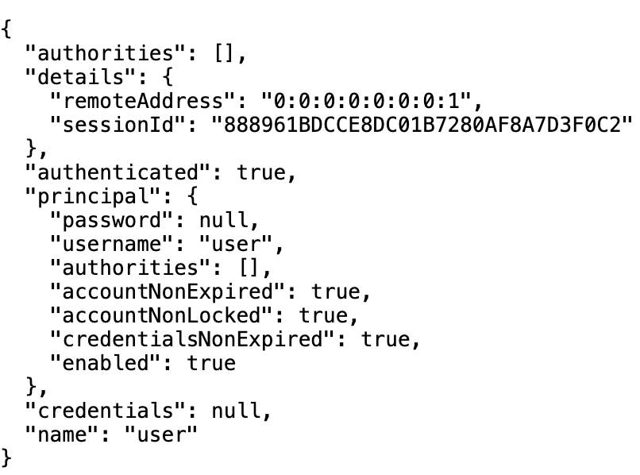
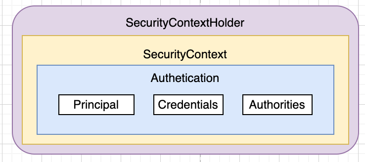
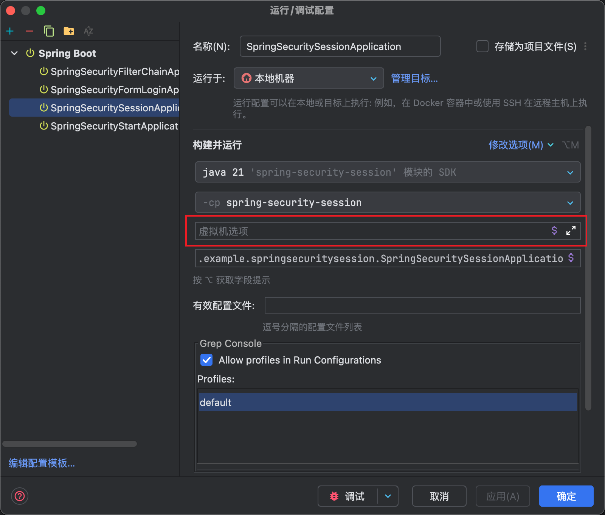
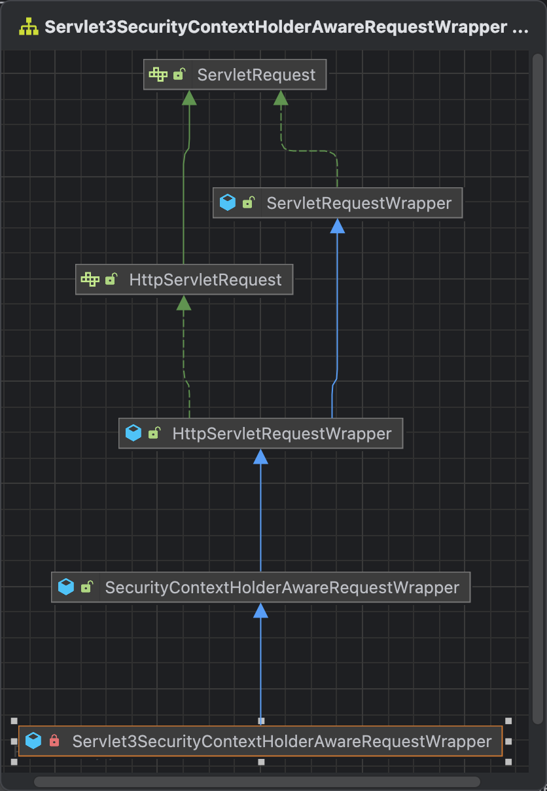
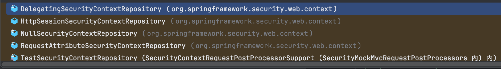
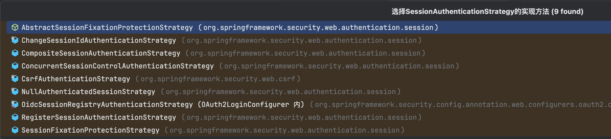
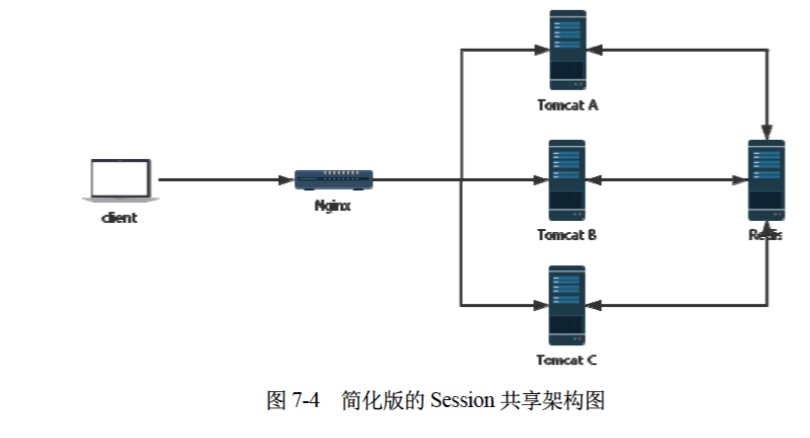

# 用户会话管理

用户登录成功后，是怎么保存用户的会话信息的呢？在代码中我们怎么样获取用户的认证信息呢？还有用户怎么样可以做到多设备登录等。这些是本章讲解的内容。

跟之前一样，我们还是基于Spring Security的配置文件开始讲起。

``` DefaultSecurityConfig
@Configuration
public class DefaultSecurityConfig  {

  @Bean
  SecurityFilterChain defaultSecurityFilterChain(HttpSecurity http) throws Exception {
    http.authorizeHttpRequests((requests) -> requests.anyRequest().authenticated());
    http.formLogin(withDefaults());
    return http.build();
  }
}
```

## 用户登录数据获取

登录成功之后，在后续的业务逻辑中，开发者有可能需要获取登录成功的用户对象，如果不使用任何框架，可以将用户数据保存到HttpSession中，然后从HttpSession获取。

在Spring Security中，用户信息还是保存在HttpSession中，但是为了方便使用，Spring Security对用户信息进行了封装。有两种方式可以对用户的登录数据进行获取。

- 从SecurityContextHolder中获取
- 从当前请求对象中获取

上一篇认证流程有提到，最终用户认证的信息是保存在Authentication中的, 用户登录成功后获取到用户登录数据也是这个，这里重新放一遍:

```
public interface Authentication extends Principal, Serializable {
  // 获取用户权限
  Collection<? extends GrantedAuthority> getAuthorities();
  // 获取用户凭证，一般是用户密码
  Object getCredentials();
  // 用户的详细信息
  Object getDetails();
  // 获取用户信息，可能是一个用户名，也可以是用户对象，可以认为是唯一标记用户的对象
  Object getPrincipal();
  // 是否已经认证
  boolean isAuthenticated();
  // 设置认证信息
  void setAuthenticated(boolean isAuthenticated) throws IllegalArgumentException;
}
```

而基于表单登录的Authentication实现类是UsernamePasswordAuthenticationToken

### SecurityContextHolder

先演示一下登录成功后怎么从SecurityContextHolder中获取用户的认证信息。新建一个Controller，名字叫做UserController，代码如下：

``` UserController
@RestController
public class UserController {

  @GetMapping("/user")
  public UsernamePasswordAuthenticationToken userInfo() {
    return (UsernamePasswordAuthenticationToken) SecurityContextHolder.getContext().getAuthentication();
  }
}
```

启动项目，登录成功后，访问/user接口, 就会给我们返回用户的认证信息，如下图所示:



可以看到SecurityContextHolder.getContext()是一个静态方法，返回SecurityContext, 由此我们可以推断出SecurityContextHolder，SecurityContext，Authentication三者的关系



我们还是从SecurityContextHolder这个类开始看起吧，先看getContext，具体代码如下:

``` SecurityContextHolder
public class SecurityContextHolder {
  private static SecurityContextHolderStrategy strategy;

	public static SecurityContext getContext() {
		return strategy.getContext();
	}
}
```

可以看到是调用了strategy.getContext返回的，那么strategy是在哪里赋值的呢？继续看代码

```SecurityContextHolder
public class SecurityContextHolder {
  public static final String SYSTEM_PROPERTY = "spring.security.strategy";
  private static String strategyName = System.getProperty(SYSTEM_PROPERTY);
  static {
    initialize();
  }

  private static void initialize() {
    initializeStrategy();
    initializeCount++;
  }

  private static void initializeStrategy() {
    if (MODE_PRE_INITIALIZED.equals(strategyName)) {
      Assert.state(strategy != null, "When using " + MODE_PRE_INITIALIZED
          + ", setContextHolderStrategy must be called with the fully constructed strategy");
      return;
    }
    if (!StringUtils.hasText(strategyName)) {
      // Set default
      strategyName = MODE_THREADLOCAL;
    }
    if (strategyName.equals(MODE_THREADLOCAL)) {
      strategy = new ThreadLocalSecurityContextHolderStrategy();
      return;
    }
    if (strategyName.equals(MODE_INHERITABLETHREADLOCAL)) {
      strategy = new InheritableThreadLocalSecurityContextHolderStrategy();
      return;
    }
    if (strategyName.equals(MODE_GLOBAL)) {
      strategy = new GlobalSecurityContextHolderStrategy();
      return;
    }
    // Try to load a custom strategy
    try {
      Class<?> clazz = Class.forName(strategyName);
      Constructor<?> customStrategy = clazz.getConstructor();
      strategy = (SecurityContextHolderStrategy) customStrategy.newInstance();
    }
    catch (Exception ex) {
      ReflectionUtils.handleReflectionException(ex);
    }
  }
}
```

可以看到主要的strategy有三种：

- MODE_THREADLOCAL: 将SecurityContext存放在ThreadLocal中，可以实现单线程共享，默认策略
- MODE_INHERITABLETHREADLOCAL: 将SecurityContext存放在Inheritable ThreadLocal中，可以实现子线程共享，看需要配置
- MODE_GLOBAL: 将SecurityContext存放到一个变量中，全局共享，基本用不到，在多用户环境下会有冲突

可以看到默认的strategy是通过System.getProperty加载的，我们可以通过配置系统变量来修改默认的存储策略。



打开IDEA的项目配置，然后在虚拟机选项里面修改strategy即可，比如设置为MODE_INHERITABLETHREADLOCAL

```
-Dspring.security.strategy=MODE_INHERITABLETHREADLOCAL
```

### SecurityContextHolderStrategy

可以看到strategy的类的SecurityContextHolderStrategy，我们看一下这个接口的定义:

``` SecurityContextHolderStrategy
public interface SecurityContextHolderStrategy {
  // 清除SecurityContext
  void clearContext();
  // 获取SecurityContext
  SecurityContext getContext();
  // 获取DeferredContext
  default Supplier<SecurityContext> getDeferredContext() {
    return this::getContext;
  }
  //设置SecurityContext
  void setContext(SecurityContext context);
  default void setDeferredContext(Supplier<SecurityContext> deferredContext) {
    setContext(deferredContext.get());
  }
  SecurityContext createEmptyContext();
}
```

这里说一下DeferredContext，看名字就知道SecurityContext存起来，暂时不返回，等用到的时候再返回。后面分析请求进来初始化SecurityContext的时候会用到。

我们先看看上面三种策略对应的SecurityContextHolderStrategy的实现类吧。

先看MODE_THREADLOCAL策略对应的ThreadLocalSecurityContextHolderStrategy，直接看关键的地方就可以了，其他的地方实现都是一样的。

``` ThreadLocalSecurityContextHolderStrategy
final class ThreadLocalSecurityContextHolderStrategy implements SecurityContextHolderStrategy {
	private static final ThreadLocal<Supplier<SecurityContext>> contextHolder = new ThreadLocal<>();
}
```

可以看到是存在ThreadLocal中的。所以是线程共享的。

再看MODE_INHERITABLETHREADLOCAL对应的InheritableThreadLocalSecurityContextHolderStrategy，代码如下

```InheritableThreadLocalSecurityContextHolderStrategy
final class InheritableThreadLocalSecurityContextHolderStrategy implements SecurityContextHolderStrategy {
	private static final ThreadLocal<Supplier<SecurityContext>> contextHolder = new InheritableThreadLocal<>();
}
```

可以看到是存在InheritableThreadLocal，学过InheritableThreadLocal的都知道，这里的值会跟着子线程的创建传递给子线程的InheritableThreadLocal。所以是子线程共享的。

最后我们看一下GlobalSecurityContextHolderStrategy，代码如下

``` GlobalSecurityContextHolderStrategy
final class GlobalSecurityContextHolderStrategy implements SecurityContextHolderStrategy {
	private static SecurityContext contextHolder;
}
```

可以看到就是保存在静态变量里面的，这个策略基本不用，相当于某一时刻，所有用户共享一个认证信息了。

好了，讨论完SecurityContextHolder，我们看一下SecurityContext是在哪个过滤器里面赋值的。

### SecurityContext

查看SecurityContext的接口声明，可以看到只有获取Authentication跟设置Authentication的方法

``` SecurityContext
public interface SecurityContext extends Serializable {
	Authentication getAuthentication();
	void setAuthentication(Authentication authentication);
}
```

这个接口默认使用的实现类是SecurityContextImpl。

### SecurityContextHolderFilter

接下来我们看看Authentication是怎么放入SecurityContextHolder中的。首先我们来看HttpSecurity Bean的声明函数

``` HttpSecurityConfiguration
@Configuration(proxyBeanMethods = false)
class HttpSecurityConfiguration {
  @Bean(HTTPSECURITY_BEAN_NAME)
  @Scope("prototype")
  HttpSecurity httpSecurity() throws Exception {
    http.securityContext(withDefaults());
    return http;
  }
}
```

上面只调重点的说，可以看到http引入了securityContext这了函数，这个函数往HttpSecurity中加入了SecurityContextConfigurer。

```
public final class HttpSecurity extends AbstractConfiguredSecurityBuilder<DefaultSecurityFilterChain, HttpSecurity>
		implements SecurityBuilder<DefaultSecurityFilterChain>, HttpSecurityBuilder<HttpSecurity> {
  public HttpSecurity securityContext(Customizer<SecurityContextConfigurer<HttpSecurity>> securityContextCustomizer)
      throws Exception {
    securityContextCustomizer.customize(getOrApply(new SecurityContextConfigurer<>()));
    return HttpSecurity.this;
  }
}
```

按照惯例，我们看看SecurityContextConfigurer的configure方法

```
public final class SecurityContextConfigurer<H extends HttpSecurityBuilder<H>>
		extends AbstractHttpConfigurer<SecurityContextConfigurer<H>, H> {
  private boolean requireExplicitSave = true;
  
	@Override
	@SuppressWarnings("unchecked")
	public void configure(H http) {
    SecurityContextRepository securityContextRepository = getSecurityContextRepository();
    if (this.requireExplicitSave) {
      SecurityContextHolderFilter securityContextHolderFilter = postProcess(
          new SecurityContextHolderFilter(securityContextRepository));
      securityContextHolderFilter.setSecurityContextHolderStrategy(getSecurityContextHolderStrategy());
      http.addFilter(securityContextHolderFilter);
    }
    else {
      SecurityContextPersistenceFilter securityContextFilter = new SecurityContextPersistenceFilter(
          securityContextRepository);
      securityContextFilter.setSecurityContextHolderStrategy(getSecurityContextHolderStrategy());
      SessionManagementConfigurer<?> sessionManagement = http.getConfigurer(SessionManagementConfigurer.class);
      SessionCreationPolicy sessionCreationPolicy = (sessionManagement != null)
          ? sessionManagement.getSessionCreationPolicy() : null;
      if (SessionCreationPolicy.ALWAYS == sessionCreationPolicy) {
        securityContextFilter.setForceEagerSessionCreation(true);
        http.addFilter(postProcess(new ForceEagerSessionCreationFilter()));
      }
      securityContextFilter = postProcess(securityContextFilter);
      http.addFilter(securityContextFilter);
    }
  }
}
```

SecurityContextRepository本节后面讲Session的时候会用到。可以看到this.requireExplicitSave默认是true，往过滤器中加入了SecurityContextHolderFilter这个过滤器。

::: warning
SecurityContextPersistenceFilter在Spring Security6中被标注为@Deprecated
:::

接下来我们看一下SecurityContextHolderFilter这个过滤器的实现,看doFilter方法。

``` SecurityContextHolderFilter
public class SecurityContextHolderFilter extends GenericFilterBean {
  private void doFilter(HttpServletRequest request, HttpServletResponse response, FilterChain chain)
      throws ServletException, IOException {
    if (request.getAttribute(FILTER_APPLIED) != null) {
      chain.doFilter(request, response);
      return;
    }
    request.setAttribute(FILTER_APPLIED, Boolean.TRUE);
    // 可以看到SecurityContext是从this.securityContextRepository中获取的,然后放入到securityContextHolderStrategy中
    Supplier<SecurityContext> deferredContext = this.securityContextRepository.loadDeferredContext(request);
    try {
      this.securityContextHolderStrategy.setDeferredContext(deferredContext);
      chain.doFilter(request, response);
    }
    finally {
      this.securityContextHolderStrategy.clearContext();
      request.removeAttribute(FILTER_APPLIED);
    }
  }
}
```
 
好了，到这，大家应该明白SecurityContextHolder.getContext().getAuthentication()是怎么获取的了。注意返回的是deferredContext，这个有懒加载的意思。我们就拿ThreadLocalSecurityContextHolderStrategy来看。

``` ThreadLocalSecurityContextHolderStrategy
final class ThreadLocalSecurityContextHolderStrategy implements SecurityContextHolderStrategy {
  @Override
  public SecurityContext getContext() {
    return getDeferredContext().get();
  }

  @Override
  public Supplier<SecurityContext> getDeferredContext() {
    Supplier<SecurityContext> result = contextHolder.get();
    if (result == null) {
      SecurityContext context = createEmptyContext();
      result = () -> context;
      contextHolder.set(result);
    }
    return result;
  }
}
```
可以看到在getContext的时候才会把SecurityContext放到contextHolder中。

### 从请求对象中获取

除了SecurityContextHolder，还有另一种方式可以获取用户的Authentication-从请求中获取。在UserController中新建一个接口

``` UserController
@RestController
public class UserController {
  @GetMapping("/authentication")
  public Authentication authentication(Authentication authentication) {
    return authentication;
  }
}
```

登录成功后，访问/authentication接口一样可以获取Authentication。

了解Servlet的都知道，Controller方法的参数都是当前请求HttpServletRequest带来的。而HttpServletRequest遵循Servlet规范，要我们看看这个接口跟用户相关的方法

```HttpServletRequest
public interface HttpServletRequest extends ServletRequest {
  String getRemoteUser();
  boolean isUserInRole(String role);
  java.security.Principal getUserPrincipal();
  boolean authenticate(HttpServletResponse response) throws IOException, ServletException;
  void login(String username, String password) throws ServletException;
  void logout() throws ServletException;
}
```

默认的实现RequestFacade。不过为了实现直接获取Authentication，Spring Security利用装饰器模式，重新封装了一个类Servlet3SecurityContextHolderAwareRequestWrapper



让我们看看Servlet3SecurityContextHolderAwareRequestWrapper跟用户登录信息相关的实现，代码如下

```SecurityContextHolderAwareRequestWrapper
public class SecurityContextHolderAwareRequestWrapper extends HttpServletRequestWrapper {
  private Authentication getAuthentication() {
    // 是不是很熟悉，不就是我们刚开始获取Authentication的吗？SecurityContextHolder.getContext().getAuthentication()
    Authentication auth = this.securityContextHolderStrategy.getContext().getAuthentication();
    return (this.trustResolver.isAuthenticated(auth)) ? auth : null;
  }
  
  @Override
  public String getRemoteUser() {
    Authentication auth = getAuthentication();
    if ((auth == null) || (auth.getPrincipal() == null)) {
      return null;
    }
    if (auth.getPrincipal() instanceof UserDetails) {
      return ((UserDetails) auth.getPrincipal()).getUsername();
    }
    if (auth instanceof AbstractAuthenticationToken) {
      return auth.getName();
    }
    return auth.getPrincipal().toString();
  }
  
  @Override
  public Principal getUserPrincipal() {
    Authentication auth = getAuthentication();
    if ((auth == null) || (auth.getPrincipal() == null)) {
      return null;
    }
    return auth;
  }
  
  private boolean isGranted(String role) {
    Authentication auth = getAuthentication();
    if (this.rolePrefix != null && role != null && !role.startsWith(this.rolePrefix)) {
      role = this.rolePrefix + role;
    }
    if ((auth == null) || (auth.getPrincipal() == null)) {
      return false;
    }
    Collection<? extends GrantedAuthority> authorities = auth.getAuthorities();
    if (authorities == null) {
      return false;
    }
    for (GrantedAuthority grantedAuthority : authorities) {
      if (role.equals(grantedAuthority.getAuthority())) {
        return true;
      }
    }
    return false;
  }
  
  @Override
  public boolean isUserInRole(String role) {
    return isGranted(role);
  }
}
```

可以看到，这些有关用户登录的数据都可以在Controller中直接获取。在Spring Security的过滤器中，有一个SecurityContextHolderAwareRequestFilter的过滤器，会对HttpServletRequest进行包装，查看代码。

``` SecurityContextHolderAwareRequestFilter
public class SecurityContextHolderAwareRequestFilter extends GenericFilterBean {
  @Override
	public void doFilter(ServletRequest req, ServletResponse res, FilterChain chain)
			throws IOException, ServletException {
		chain.doFilter(this.requestFactory.create((HttpServletRequest) req, (HttpServletResponse) res), res);
	}
  
  @Override
	public void afterPropertiesSet() throws ServletException {
		super.afterPropertiesSet();
		updateFactory();
	}

	private void updateFactory() {
		String rolePrefix = this.rolePrefix;
		this.requestFactory = createServlet3Factory(rolePrefix);
	}
}
```

可以看到在调用doFilter的时候，传下去了一个requestFactory创建的HttpServletRequest，而requestFactory是通过createServlet3Factory创建的，查看代码。

``` SecurityContextHolderAwareRequestFilter
public class SecurityContextHolderAwareRequestFilter extends GenericFilterBean {
  private HttpServletRequestFactory createServlet3Factory(String rolePrefix) {
    HttpServlet3RequestFactory factory = new HttpServlet3RequestFactory(rolePrefix, this.securityContextRepository);
    factory.setTrustResolver(this.trustResolver);
    factory.setAuthenticationEntryPoint(this.authenticationEntryPoint);
    factory.setAuthenticationManager(this.authenticationManager);
    factory.setLogoutHandlers(this.logoutHandlers);
    factory.setSecurityContextHolderStrategy(this.securityContextHolderStrategy);
    return factory;
  }
}
```

跟进HttpServlet3RequestFactory的create方法。代码如下:

``` HttpServlet3RequestFactory
final class HttpServlet3RequestFactory implements HttpServletRequestFactory {
  @Override
  public HttpServletRequest create(HttpServletRequest request, HttpServletResponse response) {
    Servlet3SecurityContextHolderAwareRequestWrapper wrapper = new Servlet3SecurityContextHolderAwareRequestWrapper(
        request, this.rolePrefix, response);
    wrapper.setSecurityContextHolderStrategy(this.securityContextHolderStrategy);
    return wrapper;
  }
}
```

好了，Servlet3SecurityContextHolderAwareRequestWrapper的创建到此为止。接下来我们看一下SecurityContextHolderAwareRequestFilter是怎么加入过滤器中的。

按照惯例我们查看HttpSecurity Bean的声明函数。

``` HttpSecurityConfiguration
@Configuration(proxyBeanMethods = false)
class HttpSecurityConfiguration {
  @Bean(HTTPSECURITY_BEAN_NAME)
  @Scope("prototype")
  HttpSecurity httpSecurity() throws Exception {
    ...
    HttpSecurity http = new HttpSecurity(this.objectPostProcessor, authenticationBuilder, createSharedObjects());
    http.servletApi(withDefaults());
    ...
  }
}
```

点击servletApi进去查看，往HttpSecurity注入了ServletApiConfigurer，很好，我们来看ServletApiConfigurer的configure函数。

```
public final class ServletApiConfigurer<H extends HttpSecurityBuilder<H>>
		extends AbstractHttpConfigurer<ServletApiConfigurer<H>, H> {
  private SecurityContextHolderAwareRequestFilter securityContextRequestFilter = new SecurityContextHolderAwareRequestFilter();

  public void configure(H http) {
    ...
    http.addFilter(this.securityContextRequestFilter);
    ...
  }
}
```

好了，分析到这里为止，至于Controller中怎么可以直接使用Authentication这个类的，这里是Spring的内容，后面会新出一个课程讲解。

### Authentication保存

那么Authentication是什么时候写入到SecurityContext中的呢，既然我们知道了是用户认证成功之后才会有Authentication的，那我们直接看认证成功的地方。前面提到过，用户的认证有一个抽象类Filter，在里面做认证以及认证成功处理。之前有个地方没有细讲，这里直接看代码。

```
public abstract class AbstractAuthenticationProcessingFilter extends GenericFilterBean
		implements ApplicationEventPublisherAware, MessageSourceAware {
	
  private void doFilter(HttpServletRequest request, HttpServletResponse response, FilterChain chain)
      throws IOException, ServletException {
    if (!requiresAuthentication(request, response)) {
      chain.doFilter(request, response);
      return;
    }
    try {
      ...
      // 认证成功，执行后续操作
      successfulAuthentication(request, response, chain, authenticationResult);
    }
    ...
  }

  protected void successfulAuthentication(HttpServletRequest request, HttpServletResponse response, FilterChain chain,
      Authentication authResult) throws IOException, ServletException {
    // 在这里写入
    SecurityContext context = this.securityContextHolderStrategy.createEmptyContext();
    context.setAuthentication(authResult);
    this.securityContextHolderStrategy.setContext(context);
    this.securityContextRepository.saveContext(context, request, response);
    ...
  }
}
```

SecurityContextHolderStrategy是在AbstractAuthenticationFilterConfigurer中配置的

``` AbstractAuthenticationFilterConfigurer
public abstract class AbstractAuthenticationFilterConfigurer<B extends HttpSecurityBuilder<B>, T extends AbstractAuthenticationFilterConfigurer<B, T, F>, F extends AbstractAuthenticationProcessingFilter>
		extends AbstractHttpConfigurer<T, B> {
  @Override
  public void configure(B http) throws Exception {
    this.authFilter.setSecurityContextHolderStrategy(getSecurityContextHolderStrategy());
  }

  protected SecurityContextHolderStrategy getSecurityContextHolderStrategy() {
    if (this.securityContextHolderStrategy != null) {
      return this.securityContextHolderStrategy;
    }
    ApplicationContext context = getBuilder().getSharedObject(ApplicationContext.class);
    String[] names = context.getBeanNamesForType(SecurityContextHolderStrategy.class);
    if (names.length == 1) {
      this.securityContextHolderStrategy = context.getBean(SecurityContextHolderStrategy.class);
    }
    else {
      this.securityContextHolderStrategy = SecurityContextHolder.getContextHolderStrategy();
    }
    return this.securityContextHolderStrategy;
  }
}
```

## 用户会话信息保存

在用户调用登录接口成功之后，服务端和浏览器之间会建立一个会话（session），浏览器每次发送请求时都会携带一个SessionId，服务端则根据这个SessionId来判断用户身份。当浏览器关闭后，服务端的Session并不会自动销毁，需要开发者手动在服务端调用Session销毁方法，或者等Session过期。

前面提到，用户数据保存到HttpSession中，然后从HttpSession获取的，那么Spring Security是怎么使用HttpSession的呢？

### AbstractAuthenticationProcessingFilter

既然是用户登录成功之后，才会把用户的信息写入到Session里面的，所以我们直接从用户认证成功的地方开始看起。

``` AbstractAuthenticationProcessingFilter
public abstract class AbstractAuthenticationProcessingFilter extends GenericFilterBean
		implements ApplicationEventPublisherAware, MessageSourceAware {
	private SessionAuthenticationStrategy sessionStrategy = new NullAuthenticatedSessionStrategy();

  private void doFilter(HttpServletRequest request, HttpServletResponse response, FilterChain chain)
      throws IOException, ServletException {
    if (!requiresAuthentication(request, response)) {
      chain.doFilter(request, response);
      return;
    }
    try {
      ...
      // 认证成功，执行后续操作
      successfulAuthentication(request, response, chain, authenticationResult);
    }
    ...
  }

  protected void successfulAuthentication(HttpServletRequest request, HttpServletResponse response, FilterChain chain,
      Authentication authResult) throws IOException, ServletException {
    SecurityContext context = this.securityContextHolderStrategy.createEmptyContext();
    context.setAuthentication(authResult);
    this.securityContextHolderStrategy.setContext(context);
    // 封装SecurityContext，保存用户认证信息到securityContextRepository中
    this.securityContextRepository.saveContext(context, request, response);
    ...
  }
}
```

Spring Security中使用securityContextRepository来保存SecurityContext, 然后前面在介绍SecurityContextHolderFilter的doFilter实现时，有从securityContextRepository获取用户信息的调用，如下所示:

```
public class SecurityContextHolderFilter extends GenericFilterBean {
  private void doFilter(HttpServletRequest request, HttpServletResponse response, FilterChain chain)
      throws ServletException, IOException {
    ...
    // 可以看到SecurityContext是从this.securityContextRepository中获取的,然后放入到securityContextHolderStrategy中
    Supplier<SecurityContext> deferredContext = this.securityContextRepository.loadDeferredContext(request);
    ...
  }
}
```

我们先来看一下securityContextRepository的声明，代码如下所示:

```SecurityContextRepository
public interface SecurityContextRepository {
  @Deprecated
  SecurityContext loadContext(HttpRequestResponseHolder requestResponseHolder);
  
  // 加载DeferredContext
  default DeferredSecurityContext loadDeferredContext(HttpServletRequest request) {
    Supplier<SecurityContext> supplier = () -> loadContext(new HttpRequestResponseHolder(request, null));
    return new SupplierDeferredSecurityContext(SingletonSupplier.of(supplier),
        SecurityContextHolder.getContextHolderStrategy());
  }

  // 保存SecurityContext
  void saveContext(SecurityContext context, HttpServletRequest request, HttpServletResponse response);

  boolean containsContext(HttpServletRequest request);
}
```



可以看到实现类有5个，下面介绍一下常用的几个实现类：

- HttpSessionSecurityContextRepository: 将SecurityContext保存在HttpSession中
- RequestAttributeSecurityContextRepository: 将SecurityContext保存在RequestAttribute，这个感觉在微服务架构中很有用
- DelegatingSecurityContextRepository: 复合Repository，可以嵌套SecurityContextRepository

而SecurityContextRepository的默认类就是DelegatingSecurityContextRepository。前面说到HttpSecurity会引入以下这个SecurityContextConfigurer，看里面的configure方法。

``` SecurityContextConfigurer
public final class SecurityContextConfigurer<H extends HttpSecurityBuilder<H>>
		extends AbstractHttpConfigurer<SecurityContextConfigurer<H>, H> {

  public void configure(H http) {
    SecurityContextRepository securityContextRepository = getSecurityContextRepository();
    if (this.requireExplicitSave) {
      SecurityContextHolderFilter securityContextHolderFilter = postProcess(
          new SecurityContextHolderFilter(securityContextRepository));
      securityContextHolderFilter.setSecurityContextHolderStrategy(getSecurityContextHolderStrategy());
      http.addFilter(securityContextHolderFilter);
    }
  }

  SecurityContextRepository getSecurityContextRepository() {
    SecurityContextRepository securityContextRepository = getBuilder()
      .getSharedObject(SecurityContextRepository.class);
    // 如果securityContextRepository为空，则初始化一个
    // 包括RequestAttributeSecurityContextRepository跟HttpSessionSecurityContextRepository
    if (securityContextRepository == null) {
      securityContextRepository = new DelegatingSecurityContextRepository(
          new RequestAttributeSecurityContextRepository(), new HttpSessionSecurityContextRepository());
    }
    return securityContextRepository;
  }
}
```

如果使用了SessionManagement，SecurityContextRepository是在SessionManagementConfigurer的init方法中声明的。SessionManagement在下一节用户会话并发管理会讲到。

``` SessionManagementConfigurer
public final class SessionManagementConfigurer<H extends HttpSecurityBuilder<H>>
		extends AbstractHttpConfigurer<SessionManagementConfigurer<H>, H> {

  @Override
  public void init(H http) {
    SecurityContextRepository securityContextRepository = http.getSharedObject(SecurityContextRepository.class);
    boolean stateless = isStateless();
    if (securityContextRepository == null) {
      if (stateless) {
        http.setSharedObject(SecurityContextRepository.class, new RequestAttributeSecurityContextRepository());
        this.sessionManagementSecurityContextRepository = new NullSecurityContextRepository();
      }
      else {
        HttpSessionSecurityContextRepository httpSecurityRepository = new HttpSessionSecurityContextRepository();
        httpSecurityRepository.setDisableUrlRewriting(!this.enableSessionUrlRewriting);
        httpSecurityRepository.setAllowSessionCreation(isAllowSessionCreation());
        AuthenticationTrustResolver trustResolver = http.getSharedObject(AuthenticationTrustResolver.class);
        if (trustResolver != null) {
          httpSecurityRepository.setTrustResolver(trustResolver);
        }
        this.sessionManagementSecurityContextRepository = httpSecurityRepository;
        // 可以看到一样是这个DelegatingSecurityContextRepository
        DelegatingSecurityContextRepository defaultRepository = new DelegatingSecurityContextRepository(
            httpSecurityRepository, new RequestAttributeSecurityContextRepository());
        http.setSharedObject(SecurityContextRepository.class, defaultRepository);
      }
    }
    else {
      this.sessionManagementSecurityContextRepository = securityContextRepository;
    }
    ...
  }
}
```

我们看一下DelegatingSecurityContextRepository的loadDeferredContext和saveContext方法。

``` DelegatingSecurityContextRepository
public final class DelegatingSecurityContextRepository implements SecurityContextRepository {
  
  @Override
  public void saveContext(SecurityContext context, HttpServletRequest request, HttpServletResponse response) {
    for (SecurityContextRepository delegate : this.delegates) {
      delegate.saveContext(context, request, response);
    }
  }

  @Override
  public DeferredSecurityContext loadDeferredContext(HttpServletRequest request) {
    DeferredSecurityContext deferredSecurityContext = null;
    for (SecurityContextRepository delegate : this.delegates) {
      if (deferredSecurityContext == null) {
        deferredSecurityContext = delegate.loadDeferredContext(request);
      }
      else {
        DeferredSecurityContext next = delegate.loadDeferredContext(request);
        deferredSecurityContext = new DelegatingDeferredSecurityContext(deferredSecurityContext, next);
      }
    }
    return deferredSecurityContext;
  }
}
```

可以看到saveContext是遍历RequestAttributeSecurityContextRepository和HttpSessionSecurityContextRepository的saveContext方法
loadDeferredContext是遍历调用RequestAttributeSecurityContextRepository和HttpSessionSecurityContextRepository的loadDeferredContext方法。

我们这里只看HttpSessionSecurityContextRepository的实现吧。代码如下所示:

``` HttpSessionSecurityContextRepository
public class HttpSessionSecurityContextRepository implements SecurityContextRepository {
  private SecurityContext readSecurityContextFromSession(HttpSession httpSession) {
    if (httpSession == null) {
      this.logger.trace("No HttpSession currently exists");
      return null;
    }
    // Session exists, so try to obtain a context from it.
    // 从httpSession获取SecurityContext
    Object contextFromSession = httpSession.getAttribute(this.springSecurityContextKey);
    ...
    return (SecurityContext) contextFromSession;
  }

  @Override
  public DeferredSecurityContext loadDeferredContext(HttpServletRequest request) {
    Supplier<SecurityContext> supplier = () -> readSecurityContextFromSession(request.getSession(false));
    return new SupplierDeferredSecurityContext(supplier, this.securityContextHolderStrategy);
  }

  @Override
  public void saveContext(SecurityContext context, HttpServletRequest request, HttpServletResponse response) {
    SaveContextOnUpdateOrErrorResponseWrapper responseWrapper = WebUtils.getNativeResponse(response,
        SaveContextOnUpdateOrErrorResponseWrapper.class);
    if (responseWrapper == null) {
      // 保存context到HttpSession中
      saveContextInHttpSession(context, request);
      return;
    }
    responseWrapper.saveContext(context);
  }

  private void saveContextInHttpSession(SecurityContext context, HttpServletRequest request) {
    if (isTransient(context) || isTransient(context.getAuthentication())) {
      return;
    }
    SecurityContext emptyContext = generateNewContext();
    if (emptyContext.equals(context)) {
      HttpSession session = request.getSession(false);
      removeContextFromSession(context, session);
    }
    else {
      boolean createSession = this.allowSessionCreation;
      HttpSession session = request.getSession(createSession);
      setContextInSession(context, session);
    }
  }
}
```

## 用户会话并发管理

前面提到用户的认证信息是保存在HttpSession中的，浏览器通过在每次发送请求的时候发送一个SessionId，服务器端根据这个SessionId来判断用户的身份。当浏览器关闭后，服务端的Session不会销毁，需要在调用服务端接口销毁，或者等待Session过期。这些是Servlet的规范，不细讲。

会话并发管理是在当前系统中，同一个用户可以创建多少个会话，如果一个设备对应一个会话，那么也可以理解为同一个用户可以在多少台设备上进行登录，默认情况下，用户可以登录的设备是没有限制。仔细想想也知道，认证信息是保存在HttpSession中的，而HttpSession是根据SessionId区分，每个请求的SessionId不一样，只要存储同一个用户的认证信息就好了。

不过如果开发者想要限制用户的登录设备数的话，也可以设置，并且很简单。我们直接基于本节开头的DefaultSecurityConfig配置改造。具体代码如下：

``` DefaultSecurityConfig
@Configuration
public class DefaultSecurityConfig {

  @Bean
  SecurityFilterChain defaultSecurityFilterChain(HttpSecurity http) throws Exception {
    http.authorizeHttpRequests((requests) -> requests.anyRequest().authenticated());
    http.formLogin(Customizer.withDefaults());
    // 将用户的会话并发数设置为最大次数为1
    http.sessionManagement(sessionManagement -> sessionManagement.maximumSessions(1));
    return http.build();
  }
}
```

启动项目，然后用chrome登录用户，访问/user接口，可以看到返回了一下信息

```
{"authorities":[],"details":{"remoteAddress":"0:0:0:0:0:0:0:1","sessionId":"AA19F62AD0B34F3220A680A48F599263"},"authenticated":true,"principal":{"password":null,"username":"user","authorities":[],"accountNonExpired":true,"accountNonLocked":true,"credentialsNonExpired":true,"enabled":true},"credentials":null,"name":"user"}
```

我们用另外一个浏览器，比如safari，登录用户，访问/user接口，也可以看到上面的信息。

好了，这个时候回到chrome，重新访问/user接口，可以发现会话过期了。

```
This session has been expired (possibly due to multiple concurrent logins being attempted as the same user).
```

这是一种后来者把之前的用户踢出去的做法，当然，也可以设置成后面的用户不可以登录，配置改成下面的就可以了。

``` DefaultSecurityConfig
@Configuration
public class DefaultSecurityConfig {

  @Bean
  SecurityFilterChain defaultSecurityFilterChain(HttpSecurity http) throws Exception {
    http.authorizeHttpRequests((requests) -> requests.anyRequest().authenticated());
    http.formLogin(Customizer.withDefaults());
    http.sessionManagement(sessionManagement -> sessionManagement.maximumSessions(1).maxSessionsPreventsLogin(true));
    return http.build();
  }
}
```

### SessionManagementConfigurer

从http.sessionManagement开始看起，我们可以看到引入了SessionManagementConfigurer这个类

```
public final class HttpSecurity extends AbstractConfiguredSecurityBuilder<DefaultSecurityFilterChain, HttpSecurity>
		implements SecurityBuilder<DefaultSecurityFilterChain>, HttpSecurityBuilder<HttpSecurity> {

  public HttpSecurity sessionManagement(
      Customizer<SessionManagementConfigurer<HttpSecurity>> sessionManagementCustomizer) throws Exception {
    sessionManagementCustomizer.customize(getOrApply(new SessionManagementConfigurer<>()));
    return HttpSecurity.this;
  }
}
```

查看SessionManagementConfigurer的init方法和configure方法，先看init方法

``` SessionManagementConfigurer
public final class SessionManagementConfigurer<H extends HttpSecurityBuilder<H>>
		extends AbstractHttpConfigurer<SessionManagementConfigurer<H>, H> {

  private boolean isStateless() {
    SessionCreationPolicy sessionPolicy = getSessionCreationPolicy();
    return SessionCreationPolicy.STATELESS == sessionPolicy;
  }

  private boolean isAllowSessionCreation() {
    SessionCreationPolicy sessionPolicy = getSessionCreationPolicy();
    return SessionCreationPolicy.ALWAYS == sessionPolicy || SessionCreationPolicy.IF_REQUIRED == sessionPolicy;
  }

  @Override
  public void init(H http) {
    // 获取SecurityContextRepository实例
    SecurityContextRepository securityContextRepository = http.getSharedObject(SecurityContextRepository.class);
    boolean stateless = isStateless();
    // 如果没有SecurityContextRepository实例，则创建
    if (securityContextRepository == null) {
      // 如果是stateless，就啥都不干
      if (stateless) {
        http.setSharedObject(SecurityContextRepository.class, new RequestAttributeSecurityContextRepository());
        this.sessionManagementSecurityContextRepository = new NullSecurityContextRepository();
      }
      else {
        HttpSessionSecurityContextRepository httpSecurityRepository = new HttpSessionSecurityContextRepository();
        httpSecurityRepository.setDisableUrlRewriting(!this.enableSessionUrlRewriting);
        httpSecurityRepository.setAllowSessionCreation(isAllowSessionCreation());
        AuthenticationTrustResolver trustResolver = http.getSharedObject(AuthenticationTrustResolver.class);
        if (trustResolver != null) {
          httpSecurityRepository.setTrustResolver(trustResolver);
        }
        this.sessionManagementSecurityContextRepository = httpSecurityRepository;
        DelegatingSecurityContextRepository defaultRepository = new DelegatingSecurityContextRepository(
            httpSecurityRepository, new RequestAttributeSecurityContextRepository());
        http.setSharedObject(SecurityContextRepository.class, defaultRepository);
      }
    }
    else {
      this.sessionManagementSecurityContextRepository = securityContextRepository;
    }
    RequestCache requestCache = http.getSharedObject(RequestCache.class);
    if (requestCache == null) {
      if (stateless) {
        http.setSharedObject(RequestCache.class, new NullRequestCache());
      }
    }
    // 获取sessionAuthenticationStrategy
    http.setSharedObject(SessionAuthenticationStrategy.class, getSessionAuthenticationStrategy(http));
    http.setSharedObject(InvalidSessionStrategy.class, getInvalidSessionStrategy());
  }
}
```

这里简单介绍一下HttpSession的创建时机吧，在Spring Security中，一共有四种

- ALWAYS: 如果HttpSession不存在，则创建
- NEVER: 从不创建HttpSession，但是如果HttpSession已经存在了，则会使用它
- IF_REQUIRED: 当有需要时，会创建HttpSession，默认是这个
- STATELESS: 从不创建HttpSession，也不使用HttpSession。这适合无状态认证方式

再看configure方法。代码如下所示:

```
public final class SessionManagementConfigurer<H extends HttpSecurityBuilder<H>>
		extends AbstractHttpConfigurer<SessionManagementConfigurer<H>, H> {

  @Override
  public void configure(H http) {
    // 构建SessionManagementFilter
    SessionManagementFilter sessionManagementFilter = createSessionManagementFilter(http);
    if (sessionManagementFilter != null) {
      http.addFilter(sessionManagementFilter);
    }
    // 如果配置了maximumSessions，则构建ConcurrentSessionFilter
    if (isConcurrentSessionControlEnabled()) {
      ConcurrentSessionFilter concurrentSessionFilter = createConcurrencyFilter(http);

      concurrentSessionFilter = postProcess(concurrentSessionFilter);
      http.addFilter(concurrentSessionFilter);
    }
    // 如果不允许enableSessionUrlRewriting，则构建DisableEncodeUrlFilter
    if (!this.enableSessionUrlRewriting) {
      http.addFilter(new DisableEncodeUrlFilter());
    }
    // 如果sessionPolicy是SessionCreationPolicy.ALWAYS，则构建ForceEagerSessionCreationFilter
    if (this.sessionPolicy == SessionCreationPolicy.ALWAYS) {
      http.addFilter(new ForceEagerSessionCreationFilter());
    }
  }
}
```

接下来一步一步将会话并发管理控制。

### SessionAuthenticationStrategy

首先要做会话管理，肯定是记录每个登录用户的会话信息的，在Spring Security中，这个会话信息的类是SessionInformation。具体如下所示:

```
public class SessionInformation implements Serializable {
  // 最近一次请求的时间
  private Date lastRequest;
  // 用户信息
  private final Object principal;
  // 会话ID
  private final String sessionId;
  // 是否过期
  private boolean expired = false;
  public void refreshLastRequest() {
    this.lastRequest = new Date();
  }
  ...
}
```

### SessionRegistry

SessionRegistry是一个接口，用来维护SessionInformation实例，该接口只有一个实现类SessionRegistryImpl，所以我们直接看SessionRegistryImpl。

```
public class SessionRegistryImpl implements SessionRegistry, ApplicationListener<AbstractSessionEvent> {
  // <principal:Object,SessionIdSet>
  private final ConcurrentMap<Object, Set<String>> principals;

  // <sessionId:Object,SessionInformation>
  private final Map<String, SessionInformation> sessionIds;

  @Override
  public void registerNewSession(String sessionId, Object principal) {
    if (getSessionInformation(sessionId) != null) {
      removeSessionInformation(sessionId);
    }
    this.sessionIds.put(sessionId, new SessionInformation(principal, sessionId, new Date()));
    this.principals.compute(principal, (key, sessionsUsedByPrincipal) -> {
      if (sessionsUsedByPrincipal == null) {
        sessionsUsedByPrincipal = new CopyOnWriteArraySet<>();
      }
      sessionsUsedByPrincipal.add(sessionId);
      this.logger.trace(LogMessage.format("Sessions used by '%s' : %s", principal, sessionsUsedByPrincipal));
      return sessionsUsedByPrincipal;
    });
  }

  @Override
  public void removeSessionInformation(String sessionId) {
    SessionInformation info = getSessionInformation(sessionId);
    if (info == null) {
      return;
    }
    this.sessionIds.remove(sessionId);
    this.principals.computeIfPresent(info.getPrincipal(), (key, sessionsUsedByPrincipal) -> {
      sessionsUsedByPrincipal.remove(sessionId);
      if (sessionsUsedByPrincipal.isEmpty()) {
        // No need to keep object in principals Map anymore
        this.logger.debug(LogMessage.format("Removing principal %s from registry", info.getPrincipal()));
        sessionsUsedByPrincipal = null;
      }
      return sessionsUsedByPrincipal;
    });
  }
}
```

这个类主要定义了两个属性，介绍一下用处

- principals: 保存当前用户与SessionId之间的关系，也就是当前用户的会话id
- sessionIds: 保存SessionId与SessionInformation之间的关系

当用户登录成功后，会执行会话保存操作，传入当前请求的SessionId和当前登录主体的principal对象，如果SessionId已经存在，则先移除后，在保存新的。

### SessionAuthenticationStrategy

SessionAuthenticationStrategy是一个接口，当用户登录成功后，会调用这个接口的onAuthentication方法。

```
public interface SessionAuthenticationStrategy {
	void onAuthentication(Authentication authentication, HttpServletRequest request, HttpServletResponse response)
			throws SessionAuthenticationException;
}
```


实现类有好多，介绍几个用的比较多的：

- CsrfAuthenticationStrategy： 与CSRF有关，负责在身份验证成功后删除旧的CsrfToken并生成一个新的CsrfToken
- ConcurrentSessionControlAuthenticationStrategy: 用来处理HttpSession并发问题
- RegisterSessionAuthenticationStrategy: 认证成功后将HttpSession信息保存在SessionRegistry中
- CompositeSessionAuthenticationStrategy: 复合策略，保存了很多其他的SessionAuthenticationStrategy，默认可以说就是这个。

我们直接看ConcurrentSessionControlAuthenticationStrategy的代码，具体代码如下所示

``` ConcurrentSessionControlAuthenticationStrategy
public class ConcurrentSessionControlAuthenticationStrategy
		implements MessageSourceAware, SessionAuthenticationStrategy {

  @Override
  public void onAuthentication(Authentication authentication, HttpServletRequest request,
      HttpServletResponse response) {
    // 获取当前项目允许的最大session数
    int allowedSessions = getMaximumSessionsForThisUser(authentication);
    // 如果是-1，说明没有限制
    if (allowedSessions == -1) {
      // We permit unlimited logins
      return;
    }
    // 获取当前所有的SessionInformation
    List<SessionInformation> sessions = this.sessionRegistry.getAllSessions(authentication.getPrincipal(), false);
    int sessionCount = sessions.size();
    // 如果没达到允许的session数上限，直接返回
    if (sessionCount < allowedSessions) {
      // They haven't got too many login sessions running at present
      return;
    }
    // 如果相等
    if (sessionCount == allowedSessions) {
      // 当前的session在已有的session会话中，直接返回
      HttpSession session = request.getSession(false);
      if (session != null) {
        // Only permit it though if this request is associated with one of the
        // already registered sessions
        for (SessionInformation si : sessions) {
          if (si.getSessionId().equals(session.getId())) {
            return;
          }
        }
      }
      // If the session is null, a new one will be created by the parent class,
      // exceeding the allowed number
    }
    // 是否运行后来者占用前面用户的花花
    allowableSessionsExceeded(sessions, allowedSessions, this.sessionRegistry);
  }

  protected void allowableSessionsExceeded(List<SessionInformation> sessions, int allowableSessions,
      SessionRegistry registry) throws SessionAuthenticationException {
    if (this.exceptionIfMaximumExceeded || (sessions == null)) {
      throw new SessionAuthenticationException(
          this.messages.getMessage("ConcurrentSessionControlAuthenticationStrategy.exceededAllowed",
              new Object[] { allowableSessions }, "Maximum sessions of {0} for this principal exceeded"));
    }
    // Determine least recently used sessions, and mark them for invalidation
    // 根据上次请求时间进行排序，计算出需要过期的session，调用其的过期方法
    sessions.sort(Comparator.comparing(SessionInformation::getLastRequest));
    int maximumSessionsExceededBy = sessions.size() - allowableSessions + 1;
    List<SessionInformation> sessionsToBeExpired = sessions.subList(0, maximumSessionsExceededBy);
    for (SessionInformation session : sessionsToBeExpired) {
      session.expireNow();
    }
  }
}
```

RegisterSessionAuthenticationStrategy的代码如下所示。

```RegisterSessionAuthenticationStrategy
public class RegisterSessionAuthenticationStrategy implements SessionAuthenticationStrategy {

  private final SessionRegistry sessionRegistry;

  @Override
  public void onAuthentication(Authentication authentication, HttpServletRequest request,
      HttpServletResponse response) {
    this.sessionRegistry.registerNewSession(request.getSession().getId(), authentication.getPrincipal());
  }
}
```

可以看到很简单，直接往sessionRegistry注册一个新的session。

CompositeSessionAuthenticationStrategy的代码如下所示。

``` CompositeSessionAuthenticationStrategy
public class CompositeSessionAuthenticationStrategy implements SessionAuthenticationStrategy {
  private final List<SessionAuthenticationStrategy> delegateStrategies;

  @Override
  public void onAuthentication(Authentication authentication, HttpServletRequest request,
      HttpServletResponse response) throws SessionAuthenticationException {
    ...
    for (SessionAuthenticationStrategy delegate : this.delegateStrategies) {
      ...
      delegate.onAuthentication(authentication, request, response);
    }
  }
}
```
可以看到，直接遍历它维护的SessionAuthenticationStrategy的onAuthentication方法。

我们回到AbstractAuthenticationProcessingFilter认证成功的地方，可以看到在认证成功后会调用所属的SessionAuthenticationStrategy的onAuthentication方法。

``` AbstractAuthenticationProcessingFilter
public abstract class AbstractAuthenticationProcessingFilter extends GenericFilterBean
		implements ApplicationEventPublisherAware, MessageSourceAware {
	
  private SessionAuthenticationStrategy sessionStrategy = new NullAuthenticatedSessionStrategy();

  private void doFilter(HttpServletRequest request, HttpServletResponse response, FilterChain chain)
			throws IOException, ServletException {
    Authentication authenticationResult = attemptAuthentication(request, response);
    if (authenticationResult == null) {
      // return immediately as subclass has indicated that it hasn't completed
      return;
    }
    this.sessionStrategy.onAuthentication(authenticationResult, request, response);
    // Authentication success
    if (this.continueChainBeforeSuccessfulAuthentication) {
      chain.doFilter(request, response);
    }
    successfulAuthentication(request, response, chain, authenticationResult);
  }
}
```

sessionStrategy默认是个NullAuthenticatedSessionStrategy什么都不干，我们看看是在哪里赋值的。如果看了表单认证那个章节，就大概可以猜出是在AbstractAuthenticationFilterConfigurer里面配置的。

```AbstractAuthenticationFilterConfigurer
public abstract class AbstractAuthenticationFilterConfigurer<B extends HttpSecurityBuilder<B>, T extends AbstractAuthenticationFilterConfigurer<B, T, F>, F extends AbstractAuthenticationProcessingFilter>
		extends AbstractHttpConfigurer<T, B> {
  @Override
  public void configure(B http) throws Exception {
    SessionAuthenticationStrategy sessionAuthenticationStrategy = http
      .getSharedObject(SessionAuthenticationStrategy.class);
    if (sessionAuthenticationStrategy != null) {
      this.authFilter.setSessionAuthenticationStrategy(sessionAuthenticationStrategy);
    }
  }
}
```

SessionAuthenticationStrategy.class是在哪里呢，由于本节是session会话管理，直接看SessionManagementConfigurer。

``` SessionManagementConfigurer
public final class SessionManagementConfigurer<H extends HttpSecurityBuilder<H>>
		extends AbstractHttpConfigurer<SessionManagementConfigurer<H>, H> {
  @Override
  public void init(H http) {
    http.setSharedObject(SessionAuthenticationStrategy.class, getSessionAuthenticationStrategy(http));
  }

  private SessionAuthenticationStrategy getSessionAuthenticationStrategy(H http) {
    if (this.sessionAuthenticationStrategy != null) {
      return this.sessionAuthenticationStrategy;
    }
    List<SessionAuthenticationStrategy> delegateStrategies = this.sessionAuthenticationStrategies;
    SessionAuthenticationStrategy defaultSessionAuthenticationStrategy;
    if (this.providedSessionAuthenticationStrategy == null) {
      // If the user did not provide a SessionAuthenticationStrategy
      // then default to sessionFixationAuthenticationStrategy
      defaultSessionAuthenticationStrategy = postProcess(this.sessionFixationAuthenticationStrategy);
    }
    else {
      defaultSessionAuthenticationStrategy = this.providedSessionAuthenticationStrategy;
    }
    // 如果开启会话并发控制
    if (isConcurrentSessionControlEnabled()) {
      SessionRegistry sessionRegistry = getSessionRegistry(http);
      // ConcurrentSessionControlAuthenticationStrategy
      ConcurrentSessionControlAuthenticationStrategy concurrentSessionControlStrategy = new ConcurrentSessionControlAuthenticationStrategy(
          sessionRegistry);
      concurrentSessionControlStrategy.setMaximumSessions(this.maximumSessions);
      concurrentSessionControlStrategy.setExceptionIfMaximumExceeded(this.maxSessionsPreventsLogin);
      concurrentSessionControlStrategy = postProcess(concurrentSessionControlStrategy);
      // RegisterSessionAuthenticationStrategy
      RegisterSessionAuthenticationStrategy registerSessionStrategy = new RegisterSessionAuthenticationStrategy(
          sessionRegistry);
      registerSessionStrategy = postProcess(registerSessionStrategy);

      delegateStrategies.addAll(Arrays.asList(concurrentSessionControlStrategy,
          defaultSessionAuthenticationStrategy, registerSessionStrategy));
    }
    else {
      delegateStrategies.add(defaultSessionAuthenticationStrategy);
    }
    // CompositeSessionAuthenticationStrategy
    this.sessionAuthenticationStrategy = postProcess(
        new CompositeSessionAuthenticationStrategy(delegateStrategies));
    return this.sessionAuthenticationStrategy;
  }
}
```

### SessionManagementFilter

和会话并发管理相关的过滤器有两个，sessionManagementFilter和ConcurrentSessionFilter。我们分别看一下吧。

```sessionManagementFilter
public class SessionManagementFilter extends GenericFilterBean {
  
  private void doFilter(HttpServletRequest request, HttpServletResponse response, FilterChain chain)
      throws IOException, ServletException {
    // 如果已经配置了FILTER_APPLIED，直接跳过，第二次进来过滤器
    if (request.getAttribute(FILTER_APPLIED) != null) {
      chain.doFilter(request, response);
      return;
    }
    request.setAttribute(FILTER_APPLIED, Boolean.TRUE);
    // 如果securityContextRepository获取不到这个request的会话，有可能不是通过正常认证流程认证的
    if (!this.securityContextRepository.containsContext(request)) {
      // 获取authentication
      Authentication authentication = this.securityContextHolderStrategy.getContext().getAuthentication();
      if (this.trustResolver.isAuthenticated(authentication)) {
        // The user has been authenticated during the current request, so call the
        // session strategy
        // 调用sessionAuthenticationStrategy的认证方法
        try {
          this.sessionAuthenticationStrategy.onAuthentication(authentication, request, response);
        }
        catch (SessionAuthenticationException ex) {
          // The session strategy can reject the authentication
          this.logger.debug("SessionAuthenticationStrategy rejected the authentication object", ex);
          this.securityContextHolderStrategy.clearContext();
          this.failureHandler.onAuthenticationFailure(request, response, ex);
          return;
        }
        // Eagerly save the security context to make it available for any possible
        // re-entrant requests which may occur before the current request
        // completes. SEC-1396.
        this.securityContextRepository.saveContext(this.securityContextHolderStrategy.getContext(), request,
            response);
      }
      // 如果是匿名访问，即未通过认证的，直接进行会话失效处理
      else {
        // No security context or authentication present. Check for a session
        // timeout
        if (request.getRequestedSessionId() != null && !request.isRequestedSessionIdValid()) {
          if (this.logger.isDebugEnabled()) {
            this.logger.debug(LogMessage.format("Request requested invalid session id %s",
                request.getRequestedSessionId()));
          }
          if (this.invalidSessionStrategy != null) {
            this.invalidSessionStrategy.onInvalidSessionDetected(request, response);
            return;
          }
        }
      }
    }
    chain.doFilter(request, response);
  }
}
```

我们再看看ConcurrentSessionFilter这个过滤器，代码如下所示：

```ConcurrentSessionFilter
public class ConcurrentSessionFilter extends GenericFilterBean {
  
  private void doFilter(HttpServletRequest request, HttpServletResponse response, FilterChain chain)
      throws IOException, ServletException {
    HttpSession session = request.getSession(false);
    if (session != null) {
      SessionInformation info = this.sessionRegistry.getSessionInformation(session.getId());
      if (info != null) {
        if (info.isExpired()) {
          // Expired - abort processing
          this.logger.debug(LogMessage
            .of(() -> "Requested session ID " + request.getRequestedSessionId() + " has expired."));
          doLogout(request, response);
          this.sessionInformationExpiredStrategy
            .onExpiredSessionDetected(new SessionInformationExpiredEvent(info, request, response, chain));
          return;
        }
        // Non-expired - update last request date/time
        this.sessionRegistry.refreshLastRequest(info.getSessionId());
      }
    }
    chain.doFilter(request, response);
  }
}
```

可以看到，会从sessionRegistry获取会话信息，然后查看当前会话是否已经过期，如果已经过期了，则调用doLogout登出，并且调用会话过期方法。否则刷新最后一次访问时间。

## 会话固定攻击

会话固定攻击指的是攻击者通过访问应用程序来创建会话，然后诱导用户以相同的会话ID登录（通常指的是将会话ID放在请求链接中，然后诱导用户去点击），进而获得用户的权限。

- 攻击者登录网站，服务端给攻击者分配了一个SessionId
- 攻击者利用自己的SessionId构造一个网站链接，并将该链接发给受害者
- 受害者用和攻击者相同的SessionId进行登录，这时攻击者的SessionId在服务端就存储受害者的信息了
- 攻击者利用SessionId获取受害者的信息，冒充受害者操作

在这个过程中，如果网站支持URL重写，那么攻击会更简单。用户如果在浏览器中禁用了cookie，那么sessionid也就用不了，有的服务器就支持把sessionid放到请求地址中，类似下面

```
http://www.javaboy.org;jsessionid=xxxx
```

攻击者构造一个这样的地址很简单

Spring Security从三方面防范会话固定攻击：

- Spring Security自带Http防火墙，如果sessionid放在地址栏中，这个请求会被拦截
- 在Http相应的Set-Cookie字段中设置httpOnly，避免通过XSS攻击获取Cookie中的会话信息
- 既然会话固定攻击是由于SessionId不变导致的，所以可以在用户登录成功后，改变SessionId就可以了。

关于第三种方案，Spring Security支持一种会话策略，名字叫做ChangeSessionIdAuthenticationStrategy, 配置起来也很简单。

```
@Configuration
public class DefaultSecurityConfig {

  @Bean
  SecurityFilterChain defaultSecurityFilterChain(HttpSecurity http) throws Exception {
    http.authorizeHttpRequests((requests) -> requests.anyRequest().authenticated());
    http.formLogin(Customizer.withDefaults());
    http.sessionManagement(sessionManagement -> sessionManagement.maximumSessions(1).maxSessionsPreventsLogin(true));
    // 下面这行
    http.sessionManagement(sessionManagement -> sessionManagement.sessionFixation().changeSessionId());
    return http.build();
  }
}
```

sessionFixation有几种策略，不同的策略对应不同的SessionAuthenticationStrategy

- changeSessionId： 默认策略，只改变SessionId
- none: 不做任何处理
- migrateSession: 登录成功后，创建一个新的HttpSession对象，并将旧的对象拷贝过来
- newSession: 登录成功后，创建一个新的HttpSession对象，拷贝一些属性

我们大致看一下ChangeSessionIdAuthenticationStrategy吧，源码实现很简单。

```ChangeSessionIdAuthenticationStrategy
public final class ChangeSessionIdAuthenticationStrategy extends AbstractSessionFixationProtectionStrategy {

	@Override
	HttpSession applySessionFixation(HttpServletRequest request) {
		request.changeSessionId();
		return request.getSession();
	}
}
```

由于ChangeSessionIdAuthenticationStrategy继承了AbstractSessionFixationProtectionStrategy，所以看AbstractSessionFixationProtectionStrategy的onAuthentication。

```
public abstract class AbstractSessionFixationProtectionStrategy
		implements SessionAuthenticationStrategy, ApplicationEventPublisherAware {

  @Override
  public void onAuthentication(Authentication authentication, HttpServletRequest request,
      HttpServletResponse response) {
    boolean hadSessionAlready = request.getSession(false) != null;
    if (!hadSessionAlready && !this.alwaysCreateSession) {
      // Session fixation isn't a problem if there's no session
      return;
    }
    // Create new session if necessary
    HttpSession session = request.getSession();
    if (hadSessionAlready && request.isRequestedSessionIdValid()) {
      String originalSessionId;
      String newSessionId;
      Object mutex = WebUtils.getSessionMutex(session);
      synchronized (mutex) {
        // We need to migrate to a new session
        originalSessionId = session.getId();
        // 此处调用ChangeSessionIdAuthenticationStrategy方法
        session = applySessionFixation(request);
        newSessionId = session.getId();
      }
      onSessionChange(originalSessionId, session, authentication);
    }
  }
}
```

具体代码点击[此处](https://github.com/shengduiliang/spring-security-demo/tree/main/spring-security-session)

## Session共享方案

目前的会话管理是单机上的会话管理，如果当前是集群环境，那么储存在单机上的管理方案就会失效，因为目前的会话信息都是保存在单个JVM进程里面的。

有三种解决方案：

- Session复制：多个服务之间互相复制session信息，这样每个服务都有一份了，tomcat的IP组播方案支持这种方式，但是很耗费资源
- Session粘滞：通过一致性hash算法，每次打到一台机子上，但是无法解决集群中的会话并发管理问题
- Session共享：直接把session信息存储到三方数据库里面，然后用到了从第三方数据库里面查。

推荐第三种，目前用的比较多的就是spring-session，下面做一个案例



新建一个Spring Boot项目，添加以下依赖，包括redis，spring session，web，spring security

```
<dependency>
  <groupId>org.springframework.boot</groupId>
  <artifactId>spring-boot-starter-data-redis</artifactId>
</dependency>
<dependency>
  <groupId>org.springframework.boot</groupId>
  <artifactId>spring-boot-starter-security</artifactId>
</dependency>
<dependency>
  <groupId>org.springframework.boot</groupId>
  <artifactId>spring-boot-starter-web</artifactId>
</dependency>
<dependency>
  <groupId>org.springframework.session</groupId>
  <artifactId>spring-session-data-redis</artifactId>
</dependency>
```

修改application.yml, 添加redis的配置：

```application.yml
spring:
  application:
    name: spring-security-redis-session
  security:
    user:
      name: user
      password: password
  data:
    redis:
      host: 127.0.0.1
      port: 6379
```

新增一个SecurityConfig，代码如下：

``` DefaultSecurityConfig
@Configuration
@EnableRedisIndexedHttpSession
public class DefaultSecurityConfig {

  @Resource
  private FindByIndexNameSessionRepository sessionRepository;

  @Bean
  SecurityFilterChain defaultSecurityFilterChain(HttpSecurity http) throws Exception {
    http.authorizeHttpRequests((requests) -> requests.anyRequest().authenticated());
    http.formLogin(Customizer.withDefaults());
    http.sessionManagement(
            sessionManagement -> sessionManagement.maximumSessions(1).sessionRegistry(sessionRegistry())
    );
    return http.build();
  }

  @Bean
  public SessionRegistry sessionRegistry() {
    return new SpringSessionBackedSessionRegistry<>(sessionRepository);
  }
}
```

然后复制一个UserController，代码如下:

```
@RestController
public class UserController {

  @GetMapping("/user")
  public UsernamePasswordAuthenticationToken userInfo() {
    return (UsernamePasswordAuthenticationToken) SecurityContextHolder.getContext().getAuthentication();
  }
}
```

启动项目，访问/user接口，跳转登录页面，登录成功后，访问/user正常。这时我们直接看redis数据库，会发现多了一些KEY，类似下面的，则运行成功。

```
spring:session:expirations:1735938180000
spring:session:index:org.springframework.session.FindByIndexNameSessionRepository.PRINCIPAL_NAME_INDEX_NAME:user
spring:session:sessions:08cd7505-a8de-4473-9623-0c2ef7fe7a3b
spring:session:sessions:expires:08cd7505-a8de-4473-9623-0c2ef7fe7a3b
```

具体代码，点击[此处](https://github.com/shengduiliang/spring-security-demo/tree/main/spring-security-redis-session)