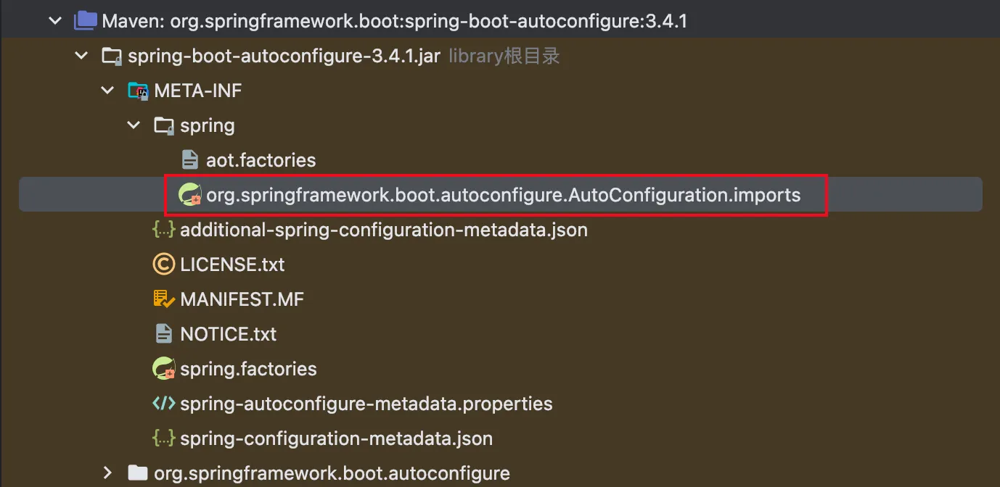
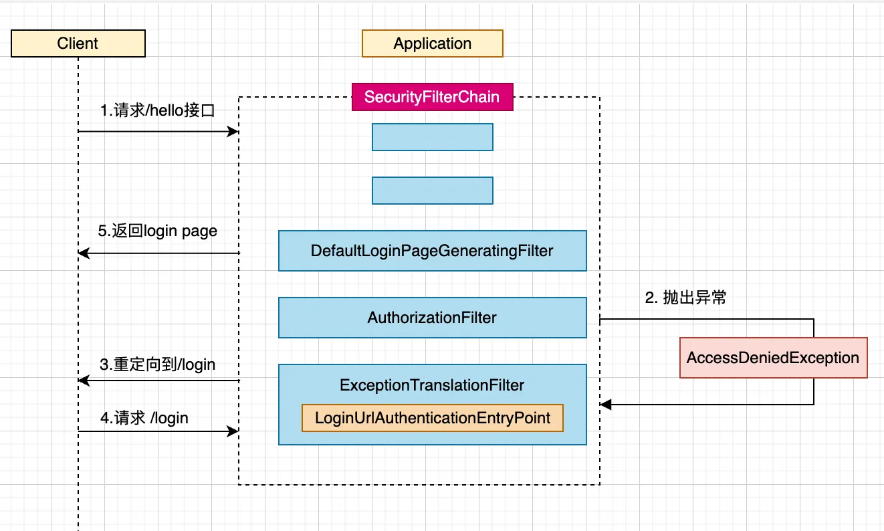

# Spring Security入门与使用

## 快速入门

在Spring Boot中使用Spring Security非常方便，创建一个新的Spring Boot 3项目，我门只需要引入Spring Web和Spring Security依赖即可，具体代码如下所示

``` pom.xml
<dependency>
  <groupId>org.springframework.boot</groupId>
  <artifactId>spring-boot-starter-security</artifactId>
</dependency>
<dependency>
  <groupId>org.springframework.boot</groupId>
  <artifactId>spring-boot-starter-web</artifactId>
</dependency>
```

然后在项目中提供一个用户测试的/hello测试接口，代码如下所示：

``` HelloController
@RestController
public class HelloController {

  @GetMapping("/hello")
  public String hello() {
    return "hello spring security";
  }
}
```

启动项目，然后访问 /hello 接口，会自动跳转到登陆页面，如下图所示。


默认的用户名是user，默认的登录密码是一个随机生成的UUID字符串，在项目启动日志中可以看到登录密码。

```
Using generated security password: 767e16d9-f511-472d-846c-a033d2b5ddf4
```

## 修改用户名密码

首先我们看一下为什么直接引入Spring Security的依赖就可以使用默认的用户来进行登录。首先我们看一下Spring Boot的自动配置文件。



::: warning
spring boot 2的自动配置文件spring.factories文件。
:::

在里面搜索security的类，可以看到自动配置了UserDetailsServiceAutoConfiguration这个类

```
org.springframework.boot.autoconfigure.security.servlet.UserDetailsServiceAutoConfiguration
```

点击这个类，如果我们没有自定义自己的UserDetailsService，框架会我们配置一个InMemoryUserDetailsManager。

``` UserDetailsServiceAutoConfiguration
@Bean
public InMemoryUserDetailsManager inMemoryUserDetailsManager(SecurityProperties properties,
    ObjectProvider<PasswordEncoder> passwordEncoder) {
  SecurityProperties.User user = properties.getUser();
  List<String> roles = user.getRoles();
  return new InMemoryUserDetailsManager(User.withUsername(user.getName())
    .password(getOrDeducePassword(user, passwordEncoder.getIfAvailable()))
    .roles(StringUtils.toStringArray(roles))
    .build());
}
```

可以看到User是从properties.getUser()里面获取的，properties是一个SecurityProperties类，这是一个配置类。

``` SecurityProperties
@ConfigurationProperties(prefix = "spring.security")
public class SecurityProperties {
  private final User user = new User();

  public User getUser() {
		return this.user;
	}
}
```

可以看到如果没有在application.yml定义user属性的话，自动new了一个User对象。

查看User对象定义。

``` SecurityProperties
public static class User {
  private String name = "user";
  private String password = UUID.randomUUID().toString();
  private List<String> roles = new ArrayList<>();
}
```
这个就是前面登录使用默认登录的用户密码。

可以看到SecurityProperties使用了ConfigurationProperties注解，如果要修改默认的用户密码，只需要在application.yml定义用户的账号密码就可以了。

``` application.yml
spring:
  security:
    user:
      name: user
      password: password
      roles: USER,ADMIN
```

roles代表用户的权限，此处不做详解，后面讲到权限管理时会细说。重启项目，重新访问hello接口，跳转登录页面，用户名输入user，密码输入password，登录成功。

相关源码查看点击[此处](https://github.com/shengduiliang/spring-security-demo/tree/main/spring-security-start)

## 登录流程分析

通过一个简单的流程图来看一下上面案例中的请求流程，如下图所示



1. 客户端发起请求访问hello接口，这个接口默认需要认证之后才能访问
2. 该请求会走一边security的过滤器链SecurityFilterChain，在AuthorizationFilter中被拦截，然后抛出AccessDeniedException异常

::: warning
spring security 5该拦截器为FilterSecurityInterceptor
:::

3. 抛出的AccessDeniedException异常被ExceptionTranslationFilter捕获，该过滤器会调用LoginUrlAuthenticationEntryPoint的commence方法，给客户端返回302，重定向到/login页面
4. 客户端发起/login请求
5. /login页面请求被DefaultLoginPageGeneratingFilter拦截，在该过滤器中返回登录页面

初学者现在看到上面的流程会有点蒙，不用慌，后面会对SecurityFilterChain跟security的异常处理进行讲解跟源码分析。