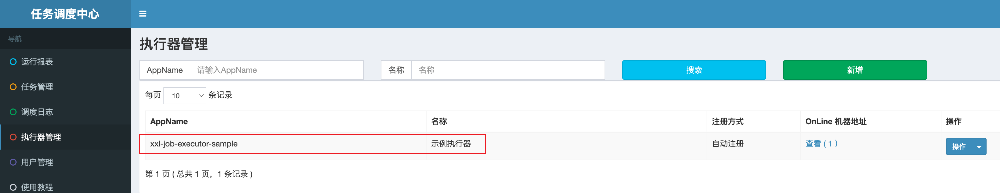

# 源码环境搭建

关于xxl-job的介绍这里就简单的介绍一下，需要详细资料的可以直接查看[官网](https://www.xuxueli.comignoreDeadLinks.html)。

XXL-JOB是一个分布式任务调度平台，其核心设计目标是开发迅速、学习简单、轻量级、易扩展。这里主要说一下quartz的不足吧。
- 调用API的的方式操作任务，不人性化；
- 需要持久化业务QuartzJobBean到底层数据表中，系统侵入性相当严重。
- 调度逻辑和QuartzJobBean耦合在同一个项目中，这将导致一个问题，在调度任务数量逐渐增多，同时调度任务逻辑逐渐加重的情况下，此时调度系统的性能将大大受限于业务；
- quartz底层以“抢占式”获取DB锁并由抢占成功节点负责运行任务，会导致节点负载悬殊非常大；而XXL-JOB通过执行器实现“协同分配式”运行任务，充分发挥集群优势，负载各节点均衡。

可以认为xxl-job就是一个加强版加分布式的quartz定时调度器。


## 克隆项目

启动IDEA，新建项目, 选择来自版本控制的项目。


在URL里面输入xxl-job的github地址，https://github.com/xuxueli/xxl-job ，如果访问不了github，也可以使用github代理镜像在前面加上 https://mirror.ghproxy.com


等待项目打开，Maven构建完成。然后打开文件->项目结构，将里面的模块的SDK配置位JAVA8。

这里介绍一下xxl-job的源码路径结构。可以看到主要核心目录是xxl-job-admin和xxl-job-core

```
shengduiliang@liangshengduideMac-mini xxl-job % tree -L 1
.
├── LICENSE
├── NOTICE
├── README.md
├── doc   // xxl-job的资源文件，如数据库初始化脚本，架构设计说明等。
├── pom.xml
├── xxl-job-admin  // 控制台项目，即xxl-job的网页端
├── xxl-job-core   // xxl-job的核心代码
└── xxl-job-executor-samples // xxl-job的示例代码文件
```

## 启动xxl-job-admin

要启动xxl-job，主要是启动xxl-job-admin项目，这里介绍启动步骤。

### 初始化数据库

先在本地搭建一个mysql数据库，这个不是本篇文章的重点，有了数据库之后，把xxl-job依赖的数据库以及相关的表创建出来。数据库脚本在/db/tables_xxl_job.sql，在mysql数据库里面执行这个脚本即可。这里介绍一个IDEA的Mysql插件。在IDEA右边的栏目，选择mysql数据源，直接运行脚本，选中sql脚本即可。


运行成功后，可以看到xxl-job数据库下多了8个表，后面会介绍这些表的用处


### 修改运行配置

主要有两个配置需要修改，一个是mysql数据库的配置，还有一个是日志打印的文件。

**mysql数据库**

打开xxl-job-admin项目，找到application.properties文件，将mysql修改为上面mysql的地址即可，我这里配置的地址是159.75.179.234, 具体代码如下所示。

``` application.properties
### xxl-job, datasource
spring.datasource.url=jdbc:mysql://159.75.179.234:3306/xxl_job?useUnicode=true&characterEncoding=UTF-8&autoReconnect=true&serverTimezone=Asia/Shanghai
spring.datasource.username=******
spring.datasource.password=******
spring.datasource.driver-class-name=com.mysql.cj.jdbc.Driver
```

注意username跟password要跟数据库的一样。

**日志配置文件**

打开xxl-job-admin项目，打开logback.xml文件，配置日志文件的打印文件路径。

``` logback.xml
<property name="log.path" value="/Users/shengduiliang/Desktop/projects/xxl-job/data/applogs/xxl-job/xxl-job-admin.log"/>
```

主要修改这个，这里将日志输出文件修改为xxl-job项目下的data/applogs/xxl-job/xxl-job-admin.log


### 启动项目

到这里为止，可以启动xxl-job-admin项目了，找到项目下的XxlJobAdminApplication，直接点击运行即可，当看到下面的日志打印，说明启动成功。

```
20:41:39.543 logback [main] INFO  o.s.b.w.e.tomcat.TomcatWebServer - Tomcat started on port(s): 8080 (http) with context path '/xxl-job-admin'
20:41:39.549 logback [main] INFO  c.x.job.admin.XxlJobAdminApplication - Started XxlJobAdminApplication in 0.942 seconds (JVM running for 1.149)
20:41:39.601 logback [xxl-job, admin JobFailMonitorHelper] INFO  com.zaxxer.hikari.HikariDataSource - HikariCP - Start completed.
```

在浏览器中访问http://localhost:8080/xxl-job-admin/ ，进入管理台网页。


## 启动xxl-job-executor-samples

xxl-job-executor-samples目录给我们提供了两个示例项目，由于spring-boot用的比较多，所以这里使用xxl-job-executor-sample-springboot。

当前项目只要修改两个关于日志文件打印的地方。

**application.properties**

修改executor的log打印目录，具体修改如下，可以按照自己的项目路径修改：

``` application.properties
xxl.job.executor.logpath=/Users/shengduiliang/Desktop/projects/xxl-job/data/applogs/xxl-job/jobhandler
```

**logback.xml**

修改log.path的路径，具体修改如下，可以按照自己的项目路径修改：

```logback.xml
<property name="log.path" value="/Users/shengduiliang/Desktop/projects/xxl-job/data/applogs/xxl-job/xxl-job-executor-sample-springboot.log"/>
```

找到xxl-job-executor-sample-springboot路径下的XxlJobExecutorApplication，点击运行即可，当看到下面的日志打印，说明启动成功。

```
20:47:46.020 logback [main] INFO  o.s.b.w.e.tomcat.TomcatWebServer - Tomcat started on port(s): 8081 (http) with context path ''
20:47:46.051 logback [main] INFO  c.x.j.e.XxlJobExecutorApplication - Started XxlJobExecutorApplication in 0.598 seconds (JVM running for 1.115)
20:47:46.073 logback [Thread-5] INFO  com.xxl.job.core.server.EmbedServer - >>>>>>>>>>> xxl-job remoting server start success, nettype = class com.xxl.job.core.server.EmbedServer, port = 9999
```

## 定时任务执行

这个时候我们上控制台查看，点击执行器管理，可以看到新增了xxl-job-executor-sample的执行器。



查看任务管理，可以看到xxl-job默认给我们生成了一个测试任务1。


点击操作右边的向下的按钮，然后点击执行一次，控制台弹出执行一次成功的提示。

点击调度日志，可以看到多出来了一个任务调度日志。


点击操作右边的向下按钮, 点击查看执行日志，跳转新页面，可以看到执行日志。

```
2025-01-07 21:57:44 [com.xxl.job.core.thread.JobThread#run]-[133]-[xxl-job, JobThread-1-1736258207167] <br>----------- xxl-job job execute start -----------<br>----------- Param:
2025-01-07 21:57:44 [com.xxl.job.executor.service.jobhandler.SampleXxlJob#demoJobHandler]-[39]-[xxl-job, JobThread-1-1736258207167] XXL-JOB, Hello World.
2025-01-07 21:57:44 [com.xxl.job.executor.service.jobhandler.SampleXxlJob#demoJobHandler]-[42]-[xxl-job, JobThread-1-1736258207167] beat at:0
2025-01-07 21:57:46 [com.xxl.job.executor.service.jobhandler.SampleXxlJob#demoJobHandler]-[42]-[xxl-job, JobThread-1-1736258207167] beat at:1
2025-01-07 21:57:48 [com.xxl.job.executor.service.jobhandler.SampleXxlJob#demoJobHandler]-[42]-[xxl-job, JobThread-1-1736258207167] beat at:2
2025-01-07 21:57:50 [com.xxl.job.executor.service.jobhandler.SampleXxlJob#demoJobHandler]-[42]-[xxl-job, JobThread-1-1736258207167] beat at:3
2025-01-07 21:57:52 [com.xxl.job.executor.service.jobhandler.SampleXxlJob#demoJobHandler]-[42]-[xxl-job, JobThread-1-1736258207167] beat at:4
2025-01-07 21:57:54 [com.xxl.job.core.thread.JobThread#run]-[179]-[xxl-job, JobThread-1-1736258207167] <br>----------- xxl-job job execute end(finish) -----------<br>----------- Result: handleCode=200, handleMsg = null
2025-01-07 21:57:54 [com.xxl.job.core.thread.TriggerCallbackThread#callbackLog]-[197]-[xxl-job, executor TriggerCallbackThread] <br>----------- xxl-job job callback finish.
```

## 源码分析

这里简单分析一下上节定时任务执行的流程。在控制台上，我们点击测试任务1的操作按钮右边向下的按钮，点击编辑，可以查看测试任务1的具体细节。


可以看到JobHandler指定了一个demoJobHandler，这个就是具体执行的方法。

我们直接回看xxl-job-executor-sample-springboot的SampleXxlJob, 里面有一个demoJobHandler的handler，具体如下。

```
@Component
public class SampleXxlJob {
  @XxlJob("demoJobHandler")
  public void demoJobHandler() throws Exception {
    XxlJobHelper.log("XXL-JOB, Hello World.");

    for (int i = 0; i < 5; i++) {
        XxlJobHelper.log("beat at:" + i);
        TimeUnit.SECONDS.sleep(2);
    }
    // default success
  }
}
```

在XxlJobHelper.log("XXL-JOB, Hello World.");加上断点，在执行测试任务1的时候，可以发现断点会卡在这里，运行没有问题。


