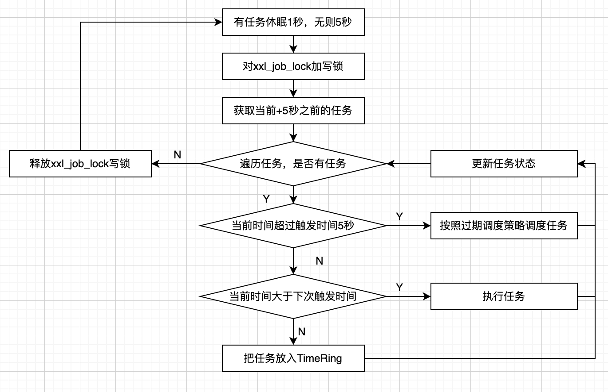
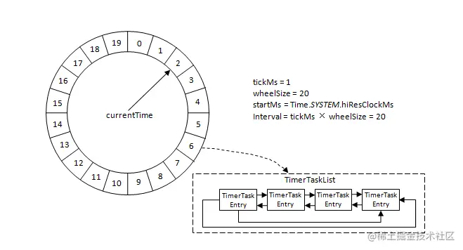

# 定时任务调度

上一篇分析了调度中心启动流程分析，调度中心启动过程中会启动调度任务。这一篇文章主要深入调度任务的启动源码。

我们从上节最后的那行代码JobScheduleHelper#getInstance#start方法讲起，查看该方法，可以看到定义了scheduleThread跟ringThread两个守护线程，代码如下:

```JobScheduleHelper
public class JobScheduleHelper {
  public void start() {
    // scheduleThread
    scheduleThread = new Thread();
    scheduleThread.setDaemon(true);
    scheduleThread.setName("xxl-job, admin JobScheduleHelper#scheduleThread");
    scheduleThread.start();
  
    // ringThread
    ringThread = new Thread();
    ringThread.setDaemon(true);
    ringThread.setName("xxl-job, admin JobScheduleHelper#ringThread");
    ringThread.start();
  }
}
```

## scheduleThread

我们先看一下scheduleThread#run方法的处理逻辑，代码如下：

``` JobScheduleHelper
scheduleThread = new Thread(new Runnable() {
  @Override
  public void run() {

    // 让当前线程休眠到下一个5s的时间，比如当前时间是12:00:00.345，则会休眠到12:00:05
    TimeUnit.MILLISECONDS.sleep(5000 - System.currentTimeMillis()%1000 );

    // pre-read count: treadpool-size * trigger-qps (each trigger cost 50ms, qps = 1000/50 = 20)
    // 下次执行时间在未来5秒以内的所有任务数，一次最多取（triggerPoolFastMax 200 +triggerPoolSlowMax 100）* 20条，最少6000条
    int preReadCount = (XxlJobAdminConfig.getAdminConfig().getTriggerPoolFastMax() + XxlJobAdminConfig.getAdminConfig().getTriggerPoolSlowMax()) * 20;

    while (!scheduleThreadToStop) {
      boolean preReadSuc = true;
      try {
        //设置手动提交
        conn = XxlJobAdminConfig.getAdminConfig().getDataSource().getConnection();
        connAutoCommit = conn.getAutoCommit();
        conn.setAutoCommit(false);

        //获取任务调度锁表内数据信息,加写锁
        preparedStatement = conn.prepareStatement(  "select * from xxl_job_lock where lock_name = 'schedule_lock' for update" );
        preparedStatement.execute();
        // 1、pre read
        long nowTime = System.currentTimeMillis();
        // 获取当前时间后5秒，同时最多负载的分页数
        List<XxlJobInfo> scheduleList = XxlJobAdminConfig.getAdminConfig().getXxlJobInfoDao().scheduleJobQuery(nowTime + PRE_READ_MS, preReadCount);
        if (scheduleList!=null && scheduleList.size()>0) {
            ...
        } else {
            preReadSuc = false;
        }
      } finally {
        if (null != preparedStatement) {
            preparedStatement.close();
        }
      }

      // tx stop
      ...
      long cost = System.currentTimeMillis()-start;

      // Wait seconds, align second
      if (cost < 1000) {  // scan-overtime, not wait
        try {
          // pre-read period: success > scan each second; fail > skip this period;
          TimeUnit.MILLISECONDS.sleep((preReadSuc?1000:PRE_READ_MS) - System.currentTimeMillis()%1000);
        }
      }
    }  
  }    
});
```

这段线程主要是不断循环，然后对xxl_job_lock加写锁，然后获取未来5秒之内的所有任务，如果有任务则对任务进行处理，具体处理逻辑看后面。这里有个地方要重点说明一下，xxl-job在集群部署时，如何避免多个服务器同时调度任务呢？做法就是先对xxl_job_lock加写锁，只有加写锁成功才可以获取定时任务来处理，从而避免多个服务器同时调度任务；

- 通过setAutoCommit(false)，关闭自动提交
- 通过select lock for update语句，其他事务无法获取到锁，显示排她锁。
- 进行定时调度任务的逻辑（这部分代码省略，在下面进行分析）
- 最后在finally块中commit()提交事务，并且setAutoCommit，释放for update的排他锁。

上面代码，我们忽略了处理定时任务的细节，这里我们补上，看看xxl-job是怎么处理任务的。

``` JobScheduleHelper
public class JobScheduleHelper {
  public void start() {
    ....
    if (scheduleList!=null && scheduleList.size()>0) {
    // 2、push time-ring
      for (XxlJobInfo jobInfo: scheduleList) {
        // time-ring jump
        // 当前时间超过触发时间5秒后
        if (nowTime > jobInfo.getTriggerNextTime() + PRE_READ_MS) {

          // 2.1、trigger-expire > 5s：pass && make next-trigger-time
          logger.warn(">>>>>>>>>>> xxl-job, schedule misfire, jobId = " + jobInfo.getId());
          // 1、misfire match
          // - 调度过期策略：
          // - 忽略：调度过期后，忽略过期的任务，从当前时间开始重新计算下次触发时间； DO_NOTHING
          // - 立即执行一次：调度过期后，立即执行一次，并从当前时间开始重新计算下次触发时间；FIRE_ONCE_NOW

          MisfireStrategyEnum misfireStrategyEnum = MisfireStrategyEnum.match(jobInfo.getMisfireStrategy(), MisfireStrategyEnum.DO_NOTHING);
          if (MisfireStrategyEnum.FIRE_ONCE_NOW == misfireStrategyEnum) {
            // FIRE_ONCE_NOW 》 trigger
            JobTriggerPoolHelper.trigger(jobInfo.getId(), TriggerTypeEnum.MISFIRE, -1, null, null, null);
            logger.debug(">>>>>>>>>>> xxl-job, schedule push trigger : jobId = " + jobInfo.getId() );
          }

          // 2、fresh next
          // 更新下次执行时间
          refreshNextValidTime(jobInfo, new Date());

        } else if (nowTime > jobInfo.getTriggerNextTime()) {
          // 当前时间大于了下次执行时间，并且小于下次执行时间+5s，说明肯定要执行这个业务逻辑了
          // 2.2、trigger-expire < 5s：direct-trigger && make next-trigger-time

          // 1、开始发执行路由规则定位到具体的节点执行
          JobTriggerPoolHelper.trigger(jobInfo.getId(), TriggerTypeEnum.CRON, -1, null, null, null);
          logger.debug(">>>>>>>>>>> xxl-job, schedule push trigger : jobId = " + jobInfo.getId() );
          // 2、执行完之后刷新下次执行的时间
          refreshNextValidTime(jobInfo, new Date());
          // next-trigger-time in 5s, pre-read again
          if (jobInfo.getTriggerStatus()==1 && nowTime + PRE_READ_MS > jobInfo.getTriggerNextTime()) {
            // 1、make ring second
            int ringSecond = (int)((jobInfo.getTriggerNextTime()/1000)%60);
            // 2、push time ring
            pushTimeRing(ringSecond, jobInfo.getId());
            // 3、fresh next
            refreshNextValidTime(jobInfo, new Date(jobInfo.getTriggerNextTime()));
          }
        } else {
          // 2.3、trigger-pre-read：time-ring trigger && make next-trigger-time
          // 未来五秒以内执行的所有任务添加到ringData
          int ringSecond = (int)((jobInfo.getTriggerNextTime()/1000)%60);
          // 2、push time ring
          pushTimeRing(ringSecond, jobInfo.getId());
          // 3、fresh next
          refreshNextValidTime(jobInfo, new Date(jobInfo.getTriggerNextTime()));
        }
      }

      // 3、update trigger info
      for (XxlJobInfo jobInfo: scheduleList) {
        XxlJobAdminConfig.getAdminConfig().getXxlJobInfoDao().scheduleUpdate(jobInfo);
      }
    }
  }
}
```
xxl_job_info表是记录定时任务的表，里面有个trigger_next_time（Long）字段，表示下一次任务被触发的时间，任务每被触发一次都要更新trigger_next_time字段，这样就知道任务何时被触发。定时任务的实现分成下面几步：

- 从数据库中读取5秒内需要执行的任务，并遍历任务。
- 如果当前时间超过下一次触发时间5秒，获取此时调度任务已经过期的调度策略的配置，默认是什么也做策略。如果配置是立即执行一次策略，那么就立即触发定时任务，否则什么也不做。最后更新下一次触发时间。
- 如果当前时间超过下一次触发时间，但并没有超过5秒，立即触发一次任务，然后更新下一次触发时间。如果任务正在运行并且更新以后的触发时间在当前时间5秒内，将任务放进时间轮，然后再次更新下一次触发时间。因为触发时间太短了所以就放进时间轮中，供下一次触发。
- 如果不是上面的两种情况，则计算时间轮，将任务放进时间轮中，最后更新下一次触发时间。
- 更新调度任务信息保存到数据库中，更新trigger_next_time字段。

最后我们总结一下scheduleThread的代码流程。



## ringThread

在了解ringThread之前，大家有必要了解一下时间轮算法，如果想对时间轮算法不熟悉的话，可以点击[此处](https://www.bilibili.com/video/BV1ry4y1k7E6/?spm_id_from=333.337.search-card.all.click&vd_source=a9e3a92001a310c0b5dad25cc5899f99)查看。



这里简单地讲一下xxl-job的时间轮算法，xxl-job使用了一个Map维护了一个分钟级别的时间轮，共有60个桶，然后每隔1秒钟前进一个刻度，并且取出该刻度的任务来处理。

``` JobScheduleHelper
public class JobScheduleHelper {
  private volatile static Map<Integer, List<Integer>> ringData = new ConcurrentHashMap<>();

  public void start() {
    scheduleThread = new Thread(new Runnable() {
      public void run() {
        ...
        // 1、make ring second
        int ringSecond = (int)((jobInfo.getTriggerNextTime()/1000)%60);
        // 2、push time ring
        pushTimeRing(ringSecond, jobInfo.getId());
      }
    })
  }
}
```

可以看到scheduleThread在处理当前时间大于下次触发时间的时候，是直接放入ringData当中的，而放入ringData的key就是获取任务下次触发的时间对60取余。

我们看看ringThread的处理逻辑，代码如下:

```  JobScheduleHelper
ringThread = new Thread(new Runnable() {
  @Override
  public void run() {
    while (!ringThreadToStop) {
      // align second, 在每个整秒执行
      TimeUnit.MILLISECONDS.sleep(1000 - System.currentTimeMillis() % 1000);

      try {
        // second data
        List<Integer> ringItemData = new ArrayList<>();
        // 避免处理耗时太长，跨过刻度，向前校验一个刻度；
        // 获取当前的秒数
        int nowSecond = Calendar.getInstance().get(Calendar.SECOND);   
        // 取两个刻度
        for (int i = 0; i < 2; i++) {
          List<Integer> tmpData = ringData.remove( (nowSecond+60-i)%60 );
          if (tmpData != null) {
            ringItemData.addAll(tmpData);
          }
        }
        // ring trigger
        logger.debug(">>>>>>>>>>> xxl-job, time-ring beat : " + nowSecond + " = " + Arrays.asList(ringItemData) );
        if (ringItemData.size() > 0) {
          // do trigger
          for (int jobId: ringItemData) {
            // do trigger，执行定时任务
            JobTriggerPoolHelper.trigger(jobId, TriggerTypeEnum.CRON, -1, null, null, null);
          }
          // clear
          ringItemData.clear();
        }
      }
    }
  }
});
```

这块代码很好理解，ringThread线程的run方法首先获取当前的时间（秒数），然后从时间轮内移出当前秒数前2个秒数的任务列表，遍历任务列表触发任务的执行，最后清空已经执行的任务列表。这里获取当前秒数前2个秒数的任务列表是因为避免处理时间太长导致错失了调度。

::: warning
如果ringThread线程被阻塞了很长时间，导致每次执行的时间超过了2秒，那么有可能会丢任务，还好的就是这是一个循环的时间轮，1min后可以再次被扫描到执行。
:::

在上面的代码中，有一个很重要的方法，就是触发执行器处理定时任务，代码如下，下个章节我们分析这个方法的执行逻辑。

```
JobTriggerPoolHelper.trigger();
```