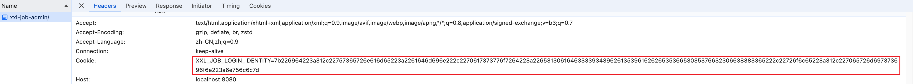

# 用户管理与权限校验

这节课我们来讲解XXL-JOB的用户管理与权限校验。启动xxl-job-admin项目，在浏览器中访问 http://localhost:8080/xxl-job-admin ,如果用户没有登录，默认会跳转登录页面, 页面如下所示：


默认的帐号密码是admin/123456, 输入帐号密码后，登录成功，进入首页。

我们点开F12控制台查看接口，在登录接口上, 会返回一个cookie，后面的请求都带上了cookie。



## 权限校验

打开xxl-job-admin的WebMvcConfig.java代码，可以看到往WebMvc上添加了两个拦截器

```WebMvcConfig
@Configuration
public class WebMvcConfig implements WebMvcConfigurer {

  /**
    * 权限拦截器
    */
  @Resource
  private PermissionInterceptor permissionInterceptor;

  /**
    * cookie拦截
    */
  @Resource
  private CookieInterceptor cookieInterceptor;

  /**
    * 添加拦截器，用于权限校验和cookie添加
    * @param registry
    */
  @Override
  public void addInterceptors(InterceptorRegistry registry) {
      registry.addInterceptor(permissionInterceptor).addPathPatterns("/**");
      registry.addInterceptor(cookieInterceptor).addPathPatterns("/**");
  }
}
```

### PermissionInterceptor

首先我们来看PermissionInterceptor的代码，主要是用户的权限做校验。

``` PermissionInterceptor
public class PermissionInterceptor implements AsyncHandlerInterceptor {
  @Resource
  private LoginService loginService;

  @Override
  public boolean preHandle(HttpServletRequest request, HttpServletResponse response, Object handler) throws Exception {
    // 如果不属于HandlerMethod, 即Controller方法，则直接跳过
    if (!(handler instanceof HandlerMethod)) {
      return true;	// proceed with the next interceptor
    }

    // if need login
    // 默认需要登录，不需要管理员权限
    boolean needLogin = true;
    boolean needAdminuser = false;
    HandlerMethod method = (HandlerMethod)handler;
    // 查看是否有PermissionLimit注解
    PermissionLimit permission = method.getMethodAnnotation(PermissionLimit.class);
    // 存在permission注解，则拿permission注解中的内容
    if (permission!=null) {
      needLogin = permission.limit();
      needAdminuser = permission.adminuser();
    }
    // 需要登录，则查看用户是否已经登录
    if (needLogin) {
      XxlJobUser loginUser = loginService.ifLogin(request, response);
      if (loginUser == null) {
        response.setStatus(302);
        response.setHeader("location", request.getContextPath()+"/toLogin");
        return false;
      }
      // 需要管理员，判断是否是管理员
      if (needAdminuser && loginUser.getRole()!=1) {
        throw new RuntimeException(I18nUtil.getString("system_permission_limit"));
      }
      // 设置loginUser到request中
      request.setAttribute(LoginService.LOGIN_IDENTITY_KEY, loginUser);	// set loginUser, with request
    }

    return true;	// proceed with the next interceptor
  }
}
```

接下来看一下loginService.ifLogin的逻辑，具体代码如下：

```LoginService
@Service
public class LoginService {
  public XxlJobUser ifLogin(HttpServletRequest request, HttpServletResponse response){
    // 获取cookie
    String cookieToken = CookieUtil.getValue(request, LOGIN_IDENTITY_KEY);
    if (cookieToken != null) {
      XxlJobUser cookieUser = null;
      try {
        // 解析出来cookieToken中携带的用户信息
        cookieUser = parseToken(cookieToken);
      } catch (Exception e) {
        logout(request, response);
      }
      if (cookieUser != null) {
        // 检查是否存在当前用户
        XxlJobUser dbUser = xxlJobUserDao.loadByUserName(cookieUser.getUsername());
        if (dbUser != null) {
          if (cookieUser.getPassword().equals(dbUser.getPassword())) {
            return dbUser;
          }
        }
      }
    }
    return null;
  }
}
```

Cookie是怎么返回给前端的呢，我们看一下login接口，代码如下：

``` IndexController
@Controller
public class IndexController {
  @RequestMapping(value="login", method=RequestMethod.POST)
  @ResponseBody
  @PermissionLimit(limit=false)
  public ReturnT<String> loginDo(HttpServletRequest request, HttpServletResponse response, String userName, String password, String ifRemember){
    // 如果ifRemember是"on", 则把cookie的过期时间设置为无限大
    boolean ifRem = (ifRemember!=null && ifRemember.trim().length()>0 && "on".equals(ifRemember))?true:false;
    return loginService.login(request, response, userName, password, ifRem);
  }
}
```

可以看到是调用了loginService.login的方法，具体代码如下：

``` LoginService
@Service
public class LoginService {
  public ReturnT<String> login(HttpServletRequest request, HttpServletResponse response, String username, String password, boolean ifRemember){
    // param
    if (username==null || username.trim().length()==0 || password==null || password.trim().length()==0){
        return new ReturnT<String>(500, I18nUtil.getString("login_param_empty"));
    }

    // valid passowrd
    XxlJobUser xxlJobUser = xxlJobUserDao.loadByUserName(username);
    if (xxlJobUser == null) {
        return new ReturnT<String>(500, I18nUtil.getString("login_param_unvalid"));
    }
    String passwordMd5 = DigestUtils.md5DigestAsHex(password.getBytes());
    if (!passwordMd5.equals(xxlJobUser.getPassword())) {
        return new ReturnT<String>(500, I18nUtil.getString("login_param_unvalid"));
    }

    // 生成cookie
    String loginToken = makeToken(xxlJobUser);

    // do login
    CookieUtil.set(response, LOGIN_IDENTITY_KEY, loginToken, ifRemember);
    return ReturnT.SUCCESS;
  }
}
```

查看CookieUtil#set方法，具体代码如下:

``` CookieUtil
public class CookieUtil {
  // 默认缓存时间,单位/秒, 2H
  private static final int COOKIE_MAX_AGE = Integer.MAX_VALUE;

  private static void set(HttpServletResponse response, String key, String value, String domain, String path, int maxAge, boolean isHttpOnly) {
    Cookie cookie = new Cookie(key, value);
    if (domain != null) {
      cookie.setDomain(domain);
    }
    cookie.setPath(path);
    cookie.setMaxAge(maxAge);
    cookie.setHttpOnly(isHttpOnly);
    response.addCookie(cookie);
  }

  public static void set(HttpServletResponse response, String key, String value, boolean ifRemember) {
    // 主要看ifRemember
    int age = ifRemember?COOKIE_MAX_AGE:-1;
    set(response, key, value, null, COOKIE_PATH, age, true);
  }
}
```

### CookieInterceptor

CookieInterceptor的代码很简单，查看modelAndView是否为空，如果不为空，设置一些cookie参数和I18n的参数，modelAndView就是返回的页面视图。

``` CookieInterceptor
@Component
public class CookieInterceptor implements AsyncHandlerInterceptor {

  @Override
  public void postHandle(HttpServletRequest request, HttpServletResponse response, Object handler,
      ModelAndView modelAndView) throws Exception {

    // cookie
    if (modelAndView!=null && request.getCookies()!=null && request.getCookies().length>0) {
      HashMap<String, Cookie> cookieMap = new HashMap<String, Cookie>();
      for (Cookie ck : request.getCookies()) {
        cookieMap.put(ck.getName(), ck);
      }
      modelAndView.addObject("cookieMap", cookieMap);
    }

    // static method
    if (modelAndView != null) {
      modelAndView.addObject("I18nUtil", FtlUtil.generateStaticModel(I18nUtil.class.getName()));
    }
  }	
}
```

### PermissionLimit

``` PermissionLimit
@Target(ElementType.METHOD)
@Retention(RetentionPolicy.RUNTIME)
public @interface PermissionLimit {
	
  /**
    * 登录拦截 (默认拦截)
    */
  boolean limit() default true;

  /**
    * 要求管理员权限
    *
    * @return
    */
  boolean adminuser() default false;
}
```

这里补充一下PermissionLimit这个注解吧，前面PermissionInterceptor会提取这个注解的属性，判断是否需要登录和鉴权。


全局搜一下，可以看到有4个接口是不需要登录的，具体如下：

- /toLogin: 登录页
- /login: 登录接口
- /logout: 注销接口
- /api/{uri}: 调度中心的接口，包括任务回调/执行器注册/执行器注册摘除接口，注意需要XXL_JOB_ACCESS_TOKEN

## 用户管理

主要讲解一下用户新增接口跟删除接口吧，这块很简单，直接过就可以了。

```
@Controller
@RequestMapping("/user")
public class JobUserController {
  @RequestMapping("/add")
  @ResponseBody
  @PermissionLimit(adminuser = true)
  public ReturnT<String> add(XxlJobUser xxlJobUser) {

    // valid username
    if (!StringUtils.hasText(xxlJobUser.getUsername())) {
        return new ReturnT<String>(ReturnT.FAIL_CODE, I18nUtil.getString("system_please_input")+I18nUtil.getString("user_username") );
    }
    xxlJobUser.setUsername(xxlJobUser.getUsername().trim());
    if (!(xxlJobUser.getUsername().length()>=4 && xxlJobUser.getUsername().length()<=20)) {
        return new ReturnT<String>(ReturnT.FAIL_CODE, I18nUtil.getString("system_lengh_limit")+"[4-20]" );
    }
    // valid password
    if (!StringUtils.hasText(xxlJobUser.getPassword())) {
        return new ReturnT<String>(ReturnT.FAIL_CODE, I18nUtil.getString("system_please_input")+I18nUtil.getString("user_password") );
    }
    xxlJobUser.setPassword(xxlJobUser.getPassword().trim());
    if (!(xxlJobUser.getPassword().length()>=4 && xxlJobUser.getPassword().length()<=20)) {
        return new ReturnT<String>(ReturnT.FAIL_CODE, I18nUtil.getString("system_lengh_limit")+"[4-20]" );
    }
    // md5 password, md5加密
    xxlJobUser.setPassword(DigestUtils.md5DigestAsHex(xxlJobUser.getPassword().getBytes()));

    // check repeat
    XxlJobUser existUser = xxlJobUserDao.loadByUserName(xxlJobUser.getUsername());
    if (existUser != null) {
        return new ReturnT<String>(ReturnT.FAIL_CODE, I18nUtil.getString("user_username_repeat") );
    }

    // write
    xxlJobUserDao.save(xxlJobUser);
    return ReturnT.SUCCESS;
  }

  @RequestMapping("/remove")
  @ResponseBody
  @PermissionLimit(adminuser = true)
  public ReturnT<String> remove(HttpServletRequest request, int id) {

    // avoid opt login seft
    XxlJobUser loginUser = PermissionInterceptor.getLoginUser(request);
    if (loginUser.getId() == id) {
        return new ReturnT<String>(ReturnT.FAIL.getCode(), I18nUtil.getString("user_update_loginuser_limit"));
    }

    xxlJobUserDao.delete(id);
    return ReturnT.SUCCESS;
  }
}
```

可以看到这两个接口都需要管理员权限。