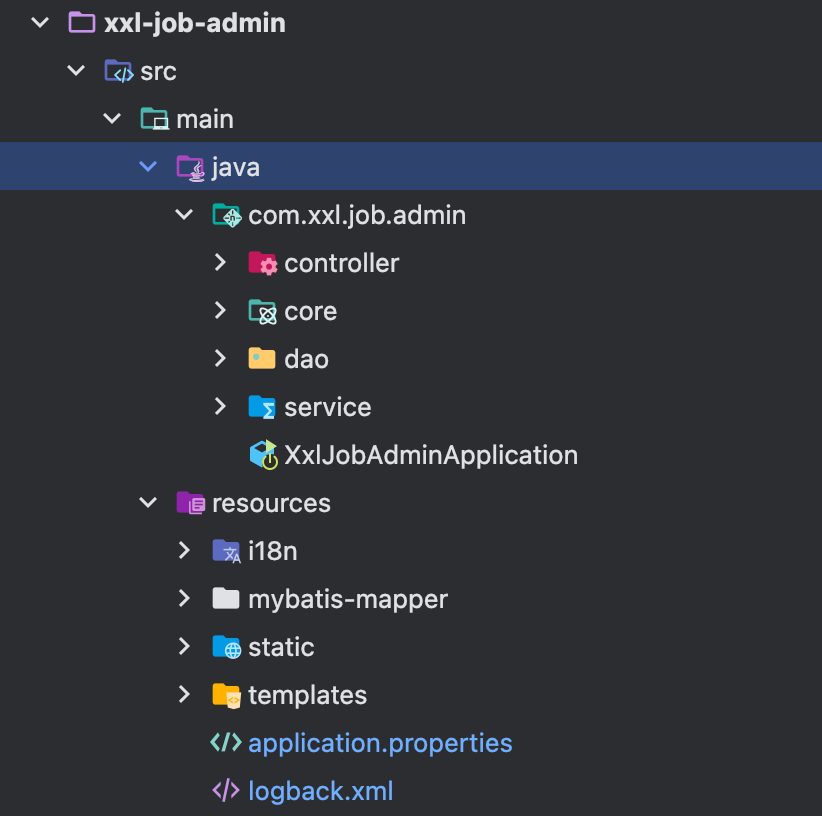

# xxl-job-admin目录结构与配置

XXL-JOB 是一个分布式任务调度平台，xxl-job-admin 是其核心管理模块，提供了任务的管理、调度、监控等功能，这个章节梳理一下xxl-job-admin目录结构与配置。

## 目录结构



可以看到xxl-job-admin的目录结构如上图所示，下面做一下解释：

- controller: 控制器目录，用来处理前端发过来的请求
- core: 核心包，后面对其解释
- dao: mybatis的对象实体目录
- service: 服务目录
- i18n: 国际化相关的配置，记录每个地址的文本
- mybatis-mapper: mybatis的mapper文件目录
- static: 静态资源目录，即控制台的网页代码
- application.properties: 项目配置文件
- lobback.xml: 日志配置文件

主要介绍一下core核心包目录代码，具体如下所示:

```
shengduiliang@liangchengduideMac-mini core % tree -L 2
.
├── alarm  // 报警相关的代码实现
│   ├── JobAlarm.java
│   ├── JobAlarmer.java
│   └── impl
├── complete // 任务完成的相关实现
│   └── XxlJobCompleter.java
├── conf // XxlJobAdminConfig的配置文件
│   └── XxlJobAdminConfig.java
├── cron // CRON相关文件
│   └── CronExpression.java
├── exception // 异常定义
│   └── XxlJobException.java
├── model // 定义XxlJob的实体
│   ├── XxlJobGroup.java
│   ├── XxlJobInfo.java
│   ├── XxlJobLog.java
│   ├── XxlJobLogGlue.java
│   ├── XxlJobLogReport.java
│   ├── XxlJobRegistry.java
│   └── XxlJobUser.java
├── old
│   ├── RemoteHttpJobBean.java
│   ├── XxlJobDynamicScheduler.java
│   └── XxlJobThreadPool.java
├── route // 路由，包括路由选择策略（核心）
│   ├── ExecutorRouteStrategyEnum.java
│   ├── ExecutorRouter.java
│   └── strategy
├── scheduler // 任务调度器（核心）
│   ├── MisfireStrategyEnum.java
│   ├── ScheduleTypeEnum.java
│   └── XxlJobScheduler.java
├── thread // 线程池配置（核心）
│   ├── JobCompleteHelper.java
│   ├── JobFailMonitorHelper.java
│   ├── JobLogReportHelper.java
│   ├── JobRegistryHelper.java
│   ├── JobScheduleHelper.java
│   └── JobTriggerPoolHelper.java
├── trigger // 触发器，包括手动触发等，看TriggerTypeEnum（核心）
│   ├── TriggerTypeEnum.java
│   └── XxlJobTrigger.java
└── util // 工具类文件
    ├── CookieUtil.java
    ├── FtlUtil.java
    ├── I18nUtil.java
    ├── JacksonUtil.java
    └── LocalCacheUtil.java

```

## 项目配置

接下来介绍一下xxl-job-admin的配置文件，查看application.properties文件，由于这个文件内容比较多，这里分块介绍。

### Web相关

``` application.properties
### web
server.port=8080  // 指定监听端口
server.servlet.context-path=/xxl-job-admin // 指定context-path，就是控制台的路径
```

### actuator相关

``` application.properties
management.server.servlet.context-path=/actuator // 性能监控路径，/xxl-job-admin/actuator
management.health.mail.enabled=false // 启用或禁用通过邮件发送健康检查状态的通知。
```

### freemarker相关

模板解析相关，忽略即可

``` application.properties
spring.freemarker.templateLoaderPath=classpath:/templates/
spring.freemarker.suffix=.ftl
spring.freemarker.charset=UTF-8
spring.freemarker.request-context-attribute=request
spring.freemarker.settings.number_format=0.##########
spring.freemarker.settings.new_builtin_class_resolver=safer
```

### mybatis相关

``` application.properties
mybatis.mapper-locations=classpath:/mybatis-mapper/*Mapper.xml // mybatis Mapper文件
```

### datasource相关

``` application.properties
### xxl-job, datasource
spring.datasource.url=jdbc:mysql://159.75.179.234:3306/xxl_job?useUnicode=true&characterEncoding=UTF-8&autoReconnect=true&serverTimezone=Asia/Shanghai
spring.datasource.username=********
spring.datasource.password=******
spring.datasource.driver-class-name=com.mysql.cj.jdbc.Driver

### datasource-pool 默认使用hikari
spring.datasource.type=com.zaxxer.hikari.HikariDataSource
spring.datasource.hikari.minimum-idle=10
spring.datasource.hikari.maximum-pool-size=30
spring.datasource.hikari.auto-commit=true
spring.datasource.hikari.idle-timeout=30000
spring.datasource.hikari.pool-name=HikariCP
spring.datasource.hikari.max-lifetime=900000
spring.datasource.hikari.connection-timeout=10000
spring.datasource.hikari.connection-test-query=SELECT 1
spring.datasource.hikari.validation-timeout=1000
```

### Email告警相关

``` application.properties
spring.mail.host=smtp.qq.com
spring.mail.port=25
spring.mail.username=xxx@qq.com
spring.mail.from=xxx@qq.com
spring.mail.password=xxx
spring.mail.properties.mail.smtp.auth=true
spring.mail.properties.mail.smtp.starttls.enable=true
spring.mail.properties.mail.smtp.starttls.required=true
spring.mail.properties.mail.smtp.socketFactory.class=javax.net.ssl.SSLSocketFactory
```

### ACCESS_TOKEN相关

```application.properties
xxl.job.accessToken=default_token // 指定token
```

### i18n相关

``` application.properties
xxl.job.i18n=zh_CN // 指定中文
```

### trigger相关

``` application.properties
xxl.job.triggerpool.fast.max=200  // 快任务线程池大小
xxl.job.triggerpool.slow.max=100  // 慢任务线程池大小
```

### 日志相关

``` application.properties
### xxl-job, log retention days
xxl.job.logretentiondays=30 // 日志默认保留30天
```