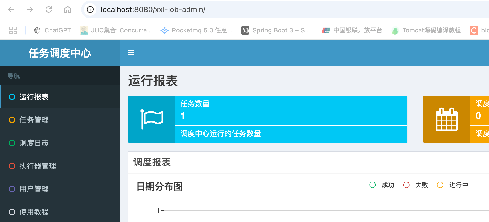
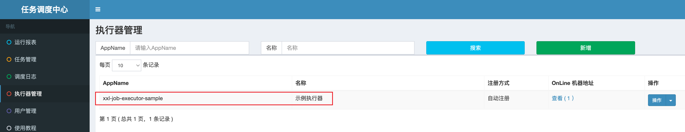
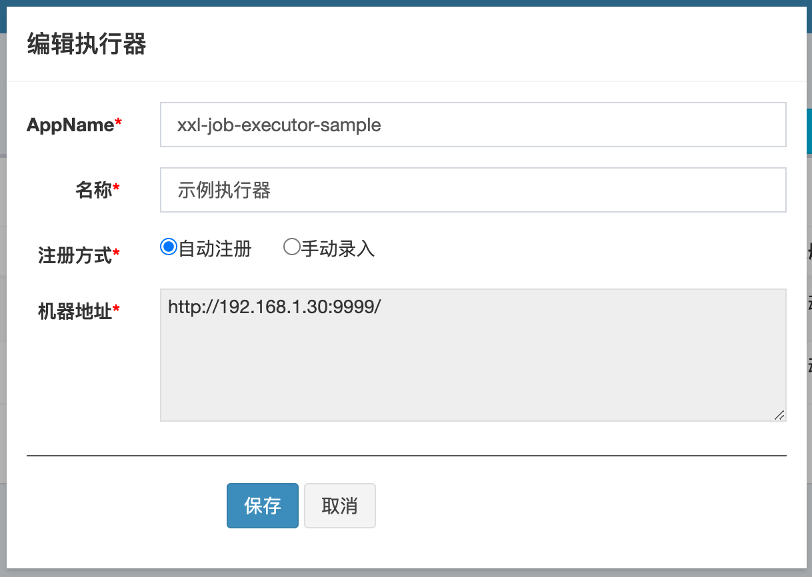
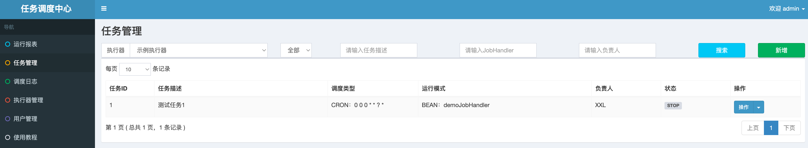
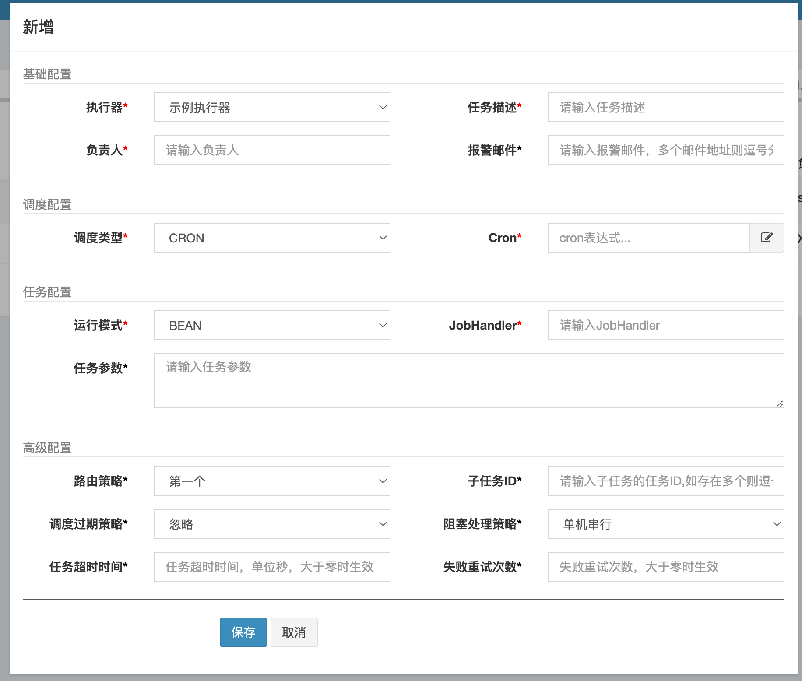
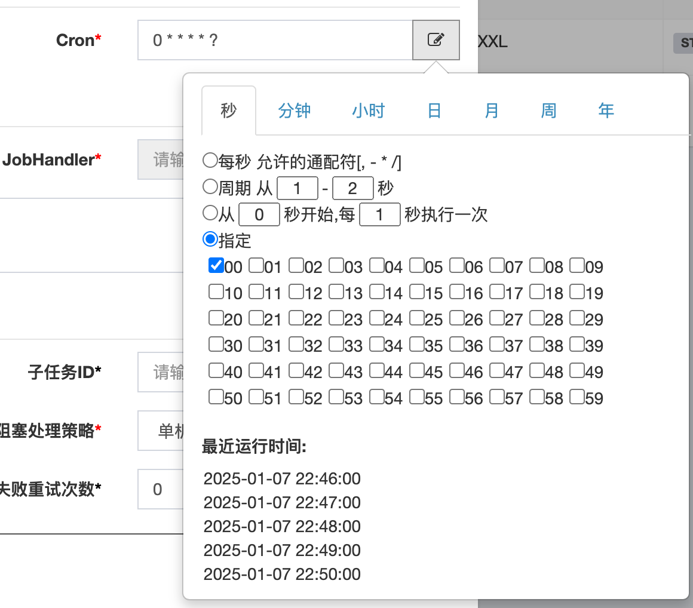
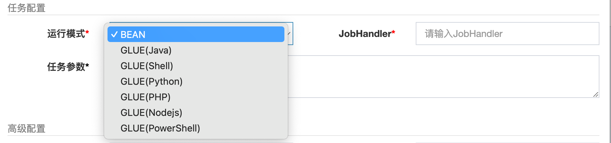
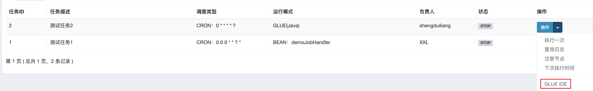

# xxl-job概念详解

本章节让我们解释一下xxl-job相关的概念以及简单使用说明，在浏览器中访问http://localhost:8080/xxl-job-admin/ ，进入管理台网页



可以看到左边的栏目中有6个选项，分别是：

- 运行报表：记录xxl-job的运行情况，包括任务数量，调度次数，执行器数量等
- 任务管理：记录xxl-job当前已经注册的任务，可以对任务做筛选和编辑等操作
- 调度日志：当xxl-job的任务定时时间到了，就会调度执行器进行处理，每次调度就会产生一个调度日志
- 执行器管理：记录当前已经添加了的执行器，可以对执行器做筛选，编辑和新增等操作
- 用户管理：管理当前已有的用户信息，可以新增用户，编辑用户权限等
- 使用教程：记录xxl-job的使用文档，包括github链接跟官方文档等。

本章主要介绍任务管理跟执行器管理等跟具体任务相关的内容，其他几种可以说是补充，后面视情况讲解。

## 执行器管理



执行器管理我们上章已经看到相应的内容，这里介绍一下执行器都是什么。点击示例执行器右边操作旁边的向下按钮，点击编辑。



可以看到具体有四个选项可以提供配置(新增执行器类似)。

1. 名称: 执行器的名称，随便填，具有唯一性即可
2. 注册方式: 有两种，分别是自动注册和手动注册
- 自动注册：当客户端连接上来的时候，根据AppName绑定执行器，无需指定IP
- 手动录入：手动指定执行器绑定的机器，适用于固定IP，不建议使用这种方式
3. AppName: 执行该执行器绑定的AppName，只有机器的AppName跟这里的一样，那么就说明机器是属于这个执行器的。

我们打开上一章xxl-job-executor-sample-springboot的XxlJobConfig代码，可以看到注册了一个Executor：

```
@Configuration
public class XxlJobConfig {
  @Bean
  public XxlJobSpringExecutor xxlJobExecutor() {
    logger.info(">>>>>>>>>>> xxl-job config init.");
    XxlJobSpringExecutor xxlJobSpringExecutor = new XxlJobSpringExecutor();
    xxlJobSpringExecutor.setAdminAddresses(adminAddresses);
    // xxl-job-executor-sample
    xxlJobSpringExecutor.setAppname(appname);
    xxlJobSpringExecutor.setAddress(address);
    xxlJobSpringExecutor.setIp(ip);
    xxlJobSpringExecutor.setPort(port);
    xxlJobSpringExecutor.setAccessToken(accessToken);
    xxlJobSpringExecutor.setLogPath(logPath);
    xxlJobSpringExecutor.setLogRetentionDays(logRetentionDays);

    return xxlJobSpringExecutor;
  }
}
```

由于appname是xxl-job-executor-sample，跟示例执行器对上了，所以属于示例执行器了。

## 任务管理

作为一个定时任务执行的框架，任务的定义是核心的概念，所以本章节讲解一下xxl-job的任务机制，看看都有哪些可以配置的地方。



打开任务调度中心，点击任务管理，来到任务管理界面。点击右上脚的新增按钮，新增一个定时任务。



本章节主要解释一下上面这个框里面的每个配置项的内容和配置。

### 基础配置

1. 执行器（必填）：执行执行定时任务的执行器，就上面说到的执行器
2. 任务描述（必填）：定时任务描述
3. 负责人（必填）：定时任务的负责人
4. 报警邮件（非必填）：当定时任务出错的时候，会发送报警邮件

### 调度配置


调度类型有三种选择，具体如下：

1. 无，没有调度类型，说明不需调度，不会定时执行
2. CRON: 基于CRON表达式，当指定为CRON类型的时候，右边CRON可以输入表达式，也可以选择，当时间满足CRON表达式的时候调度任务

3. 固定速度：按照固定速度调度定时任务，右边固定速度输入定时任务执行的周期（按秒算）

### 任务配置



可以看到运行模式有以下几种，因为我们是搞JAVA的，所以重点只看BEAN模式，跟GLUE(Java)即可。

- BEAN模式：任务以JobHandler方式维护在执行器端；需要结合 "JobHandler" 属性匹配执行器中任务；
- GLUE模式(Java)：任务以源码方式维护在调度中心；该模式的任务实际上是一段继承自IJobHandler的Java类代码并 "groovy" 源码方式维护，它在执行器项目中运行，可使用@Resource/@Autowire注入执行器里中的其他服务；
- GLUE模式(Shell)：任务以源码方式维护在调度中心；任务实际上是一段"shell"脚本；
- GLUE模式(Python)：任务以源码方式维护在调度中心；任务实际上是一段"python"脚本；
- GLUE模式(PHP)：任务以源码方式维护在调度中心；任务实际上是一段"php"脚本；
- GLUE模式(NodeJS)：任务以源码方式维护在调度中心；任务实际上是一段"nodejs"脚本；
- GLUE模式(PowerShell)：任务以源码方式维护在调度中心；任务实际上是一段"PowerShell"脚本；

我们上一节的测试案例用的就是BEAN模式，简单来说就是客户端声明一个JobHandler的处理方法，xxl-job负责定时调用。



如果是GLUE模式的话，可以点击任务编辑的按钮们，然后点击GLUE-IDE查看JAVA的执行代码，默认会生成一段代码，可以做修改后保存。

```
package com.xxl.job.service.handler;
import com.xxl.job.core.context.XxlJobHelper;
import com.xxl.job.core.handler.IJobHandler;
public class DemoGlueJobHandler extends IJobHandler {
	@Override
	public void execute() throws Exception {
		XxlJobHelper.log("XXL-JOB, Hello World.");
	}
}
```

### 高级配置


**路由策略**

当执行器是使用集群部署的时候，调度哪个执行器来执行任务，这些策略就是路由策略，当前有以下策略：
- FIRST（第一个）：固定选择第一个机器；
- LAST（最后一个）：固定选择最后一个机器；
- ROUND（轮询）：；
- RANDOM（随机）：随机选择在线的机器；
- CONSISTENT_HASH（一致性HASH）：每个任务按照Hash算法固定选择某一台机器，且所有任务均匀散列在不同机器上。
- LEAST_FREQUENTLY_USED（最不经常使用）：使用频率最低的机器优先被选举；
- LEAST_RECENTLY_USED（最近最久未使用）：最久未使用的机器优先被选举；
- FAILOVER（故障转移）：按照顺序依次进行心跳检测，第一个心跳检测成功的机器选定为目标执行器并发起调度；
- BUSYOVER（忙碌转移）：按照顺序依次进行空闲检测，第一个空闲检测成功的机器选定为目标执行器并发起调度；
- SHARDING_BROADCAST(分片广播)：广播触发对应集群中所有机器执行一次任务，同时系统自动传递分片参数；可根据分片参数开发分片任务；

**子任务ID**

每个任务都拥有一个唯一的任务ID(任务ID可以从任务列表获取)，当本任务执行结束并且执行成功时，将会触发子任务ID所对应的任务的一次主动调度。

**调度过期策略**

如果调度任务过期了，怎么处理该任务，有两种：
- 忽略：调度过期后，忽略过期的任务，从当前时间开始重新计算下次触发时间；
- 立即执行一次：调度过期后，立即执行一次，并从当前时间开始重新计算下次触发时间；

**阻塞处理策略**

调度过于密集执行器来不及处理时的处理策略；
- 单机串行（默认）：调度请求进入单机执行器后，调度请求进入FIFO队列并以串行方式运行；
- 丢弃后续调度：调度请求进入单机执行器后，发现执行器存在运行的调度任务，本次请求将会被丢弃并标记为失败；
- 覆盖之前调度：调度请求进入单机执行器后，发现执行器存在运行的调度任务，将会终止运行中的调度任务并清空队列，然后运行本地调度任务；

**任务超时时间**

支持自定义任务超时时间，任务运行超时将会主动中断任务；

**失败重试次数**

支持自定义任务失败重试次数，当任务失败时将会按照预设的失败重试次数主动进行重试；


## xxl-job架构


这里引用官网的架构图，然后对xxl-job的框架设计做一下解释。

- 执行器启动后通过注册服务往xxl-job注册执行器，保存入库
- 用户添加定时任务，执行任务执行时间和执行器等，保存入库
- 调度器模块定时查看定时任务是否需要执行，如果需要执行，则调度执行器进行执行
- 执行器执行完毕后通过回调服务向xxl-job汇报执行结果
- XXL-JOB运行过程中产生的日志由日志服务进行实时记录